

# 【动画讨论&amp;追踪】超时空辉夜姬

- 贴吧: 名作之壁吧　楼主: inting1　发帖: 2026-02-21 19:38:46
- 原帖: https://tieba.baidu.com/p/10504053776　抓取时间: 2026-09-29 06:13:45　楼层数: 642　（时间均为北京时间）

[⬇ 本页底部](#bottom)　·　[⏬ 最新的楼层](thread_8.md#bottom)

页码：**1–100 楼** · [101–200 楼](thread_2.md) · [201–300 楼](thread_3.md) · [301–400 楼](thread_4.md) · [401–500 楼](thread_5.md) · [501–600 楼](thread_6.md) · [601–700 楼](thread_7.md) · [701–800 楼](thread_8.md)

---
### 1楼 · inting1（楼主）
Lv.15 · 2026-02-21 19:38 · 赞 115

---
### 2楼 · inting1（楼主）
Lv.15 · 2026-02-21 19:40 · 赞 13

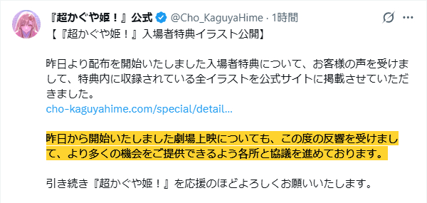

看样子要加馆延期了（虽然未必是大规模），还是单独开楼吧\[阴险\] 
热度是早就达标了，但应该能看出资方的运作逐渐跟上来了 各种断货抢票就当是饥饿营销和宣传了\[阴险\]

---
### 3楼 · inting1（楼主）
Lv.15 · 2026-02-21 19:40 · 赞 5

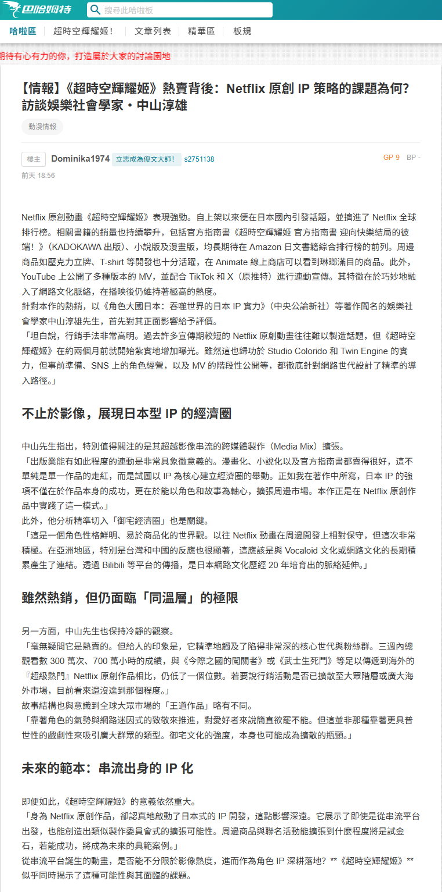

这篇分析很符合我的看法，巴哈也有人翻译 
整体是典型的核心向动画，热度大致介于鸡狗哭、蒜水滚之间

---
### 4楼 · inting1（楼主）
Lv.15 · 2026-02-21 19:43 · 赞 6

[【热度豚】超辉夜姬日推单周热度为22年...](https://tieba.baidu.com/p/10437508706) 
[【梦回蒜友冲锋时】超辉夜小说爆上日亚书....](https://tieba.baidu.com/p/10456826028) 
[【热度豚】超辉夜姬20馆1周票房将达3...](https://tieba.baidu.com/p/10496277539) 
我在隔壁发的三贴分别聚焦于社交热度、商品销售和小规模票房，应该是符合这部的商业走向的，可以参看\[乖\]

---
### 5楼 · 滅 one
Lv.10 · 2026-02-21 19:49 · 赞 2

前排

---
### 6楼 · MiaMira
Lv.2 · 2026-02-21 19:52 · 赞 1

前排前排，竟然开单楼了

---
### 8楼 · 茶话部🔥
Lv.14 · 2026-02-21 20:02 · 赞 3

刚想来看看票房没想到就刷到了单开楼👀

---
### 9楼 · 莫谈戚焉
Lv.8 · 2026-02-21 20:21

\[吐舌\]终于来了

---
### 10楼 · 纽卡希勒
Lv.13 · 2026-02-21 20:30 · 赞 3

但感觉后续可能要等好久了，现在开始企划，等到30年能再看到彩叶吗\[阴险\]

---
### 11楼 · 纽卡希勒
Lv.13 · 2026-02-21 20:34 · 赞 3

宣布延长上映吗？

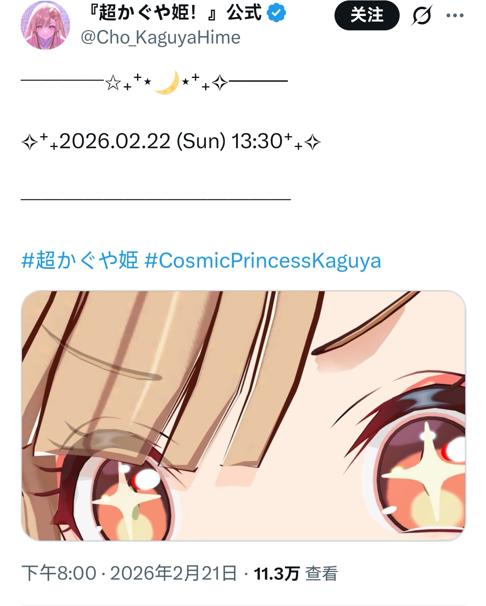

> **莫谈戚焉** 2026-02-21 20:38:11：\[阴险\]怎么都不follow一下
>
> **纽卡希勒** 2026-02-21 20:46:35：现在fo了
>
> **5A1yGxu** 2026-02-22 05:40:49：难道说
>

---
### 12楼 · 莫谈戚焉
Lv.8 · 2026-02-21 20:37 · 赞 1

25w关注了\[太开心\]

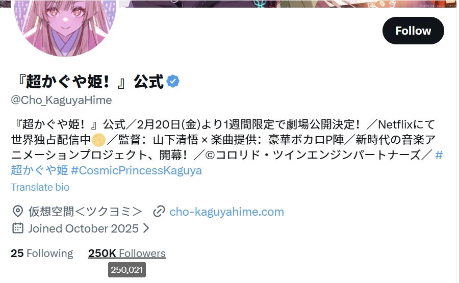

---
### 14楼 · 莫谈戚焉
Lv.8 · 2026-02-21 20:41 · 赞 3

营销这方面完全被官方拿捏了（褒义

---
### 15楼 · 沧海巫山º
Lv.3 · 2026-02-21 20:41

居然有单楼了

---
### 17楼 · 纽卡希勒
Lv.13 · 2026-02-21 20:50 · 赞 1

如果加馆了能稍微测一下纯实力，我感觉纯实力（上来就大规模上映）还是没有30亿的。主要是感觉i7这类冲特典能力还是更强些\[阴险\]

> **纽卡希勒** 2026-02-21 23:43:54：先等扩大上映，希望打我脸\[阴险\]
>

---
### 18楼 · 莫谈戚焉
Lv.8 · 2026-02-21 21:19 · 赞 7

大河豚还挺喜欢超时空辉夜姬的

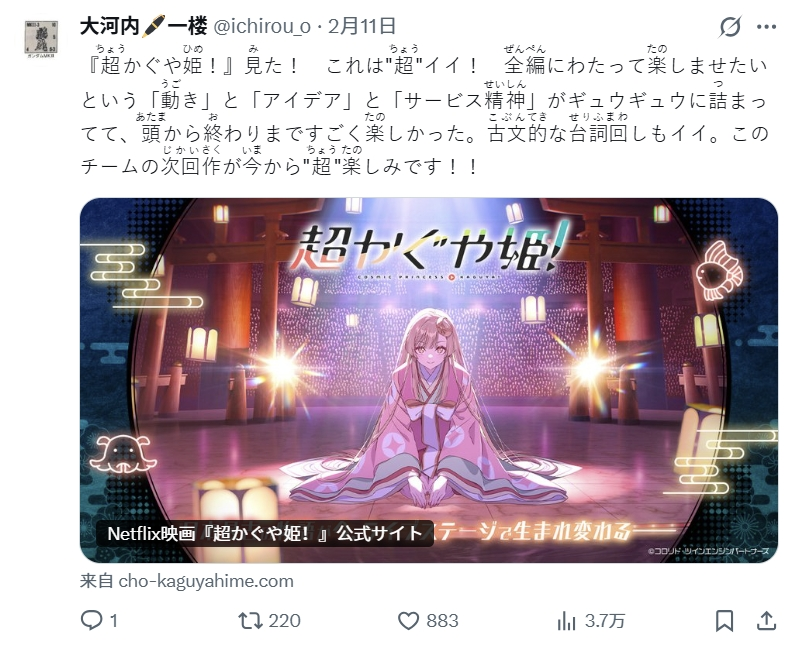

---
### 19楼 · 羊狼总动员0301
Lv.15 · 2026-02-21 21:23 · 赞 2

\*14366(+\*188)　\*14734(1.00)　\*\*\*\*\*\*　58.2%　\*\*\*\*\*\*　超かぐや姫！ 
今天没有漏记现象了，消化率100的时候和昨天差不多，之后又涨了两三千，说明昨天确实统计有漏 
我就说单日动员3w是该有的\[阴险\]

> **莫谈戚焉** 2026-02-21 21:26:37：消化率是什么啊
>
> **纽卡希勒** 2026-02-21 21:37:17：每天10000坐席，消耗了8000坐席就是80消化率
>

---
### 20楼 · 莫谈戚焉
Lv.8 · 2026-02-21 21:26 · 赞 6

第二天97%上座率

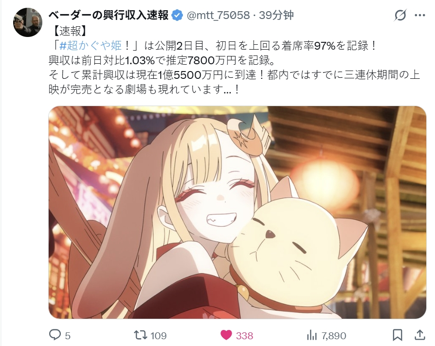

> **京电小助手** 2026-02-21 21:26:36：边边角角不好的位置也坐满了人啊
>
> **沧海巫山º** 2026-02-21 21:27:08：感觉挺红的，不知道最终能有多少
>

---
### 21楼 · 龍HCL
Lv.14 · 2026-02-21 21:52

本来我看推特粉丝都快涨不动了，今天这波神操作，又有新的增长了！

---
### 22楼 · Wang\_dora
Lv.5 · 2026-02-21 22:03

歌卖的怎么样

---
### 23楼 · 恭喜爱音成为B萌萌王
Lv.15 · 2026-02-21 22:32

好好好，辉夜姬居然开楼了

---
### 25楼 · 羊狼总动员0301
Lv.15 · 2026-02-21 22:49 · 赞 3

数了下周六的座位一共有3w8，周日有3w6，周一估计是3w5。 
周日目前的预约大概有3w4，明天动员估计有3w5，周六的动员按3w7算吧 
周五的坐席应该是3w3左右。动员估计3w2 
周一动员按3w3算。 
四天的动员推移是3w2 3w7 3w5 3w3 
票价按1800算就是5700 6600 6300 6000 四天合计2.5亿

> **羊狼总动员0301** 2026-02-21 23:02:53：上面的数字都是往低的说的，价格更是估的很低。4天初动3亿也是有可能的。
>
> **羊狼总动员0301** 2026-02-21 23:18:19：哦不对，有个馆的特殊屏看漏了……每天还要多1000
>

---
### 26楼 · carsitΩ
Lv.11 · 2026-02-21 22:56 · 赞 1

居然开楼了\[真棒\]

---
### 27楼 · 羊狼总动员0301
Lv.15 · 2026-02-21 23:12 · 赞 3

另外周二工作日的票现在也在哄抢中，所有院线的官网都挤爆了 
看了几家能进去的也一样订满了。工作日上座或许都能有90%以上

---
### 28楼 · 羊狼总动员0301
Lv.15 · 2026-02-21 23:24 · 赞 4

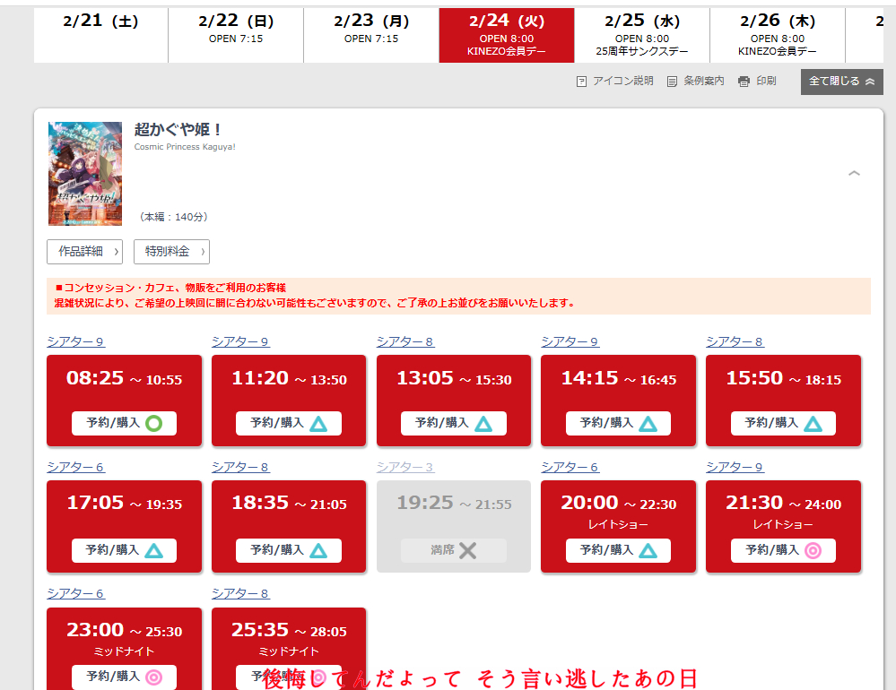

---
### 29楼 · 羊狼总动员0301
Lv.15 · 2026-02-21 23:27 · 赞 4

看来真能一周5亿了

---
### 30楼 · 纽卡希勒
Lv.13 · 2026-02-21 23:44 · 赞 6

满座就是好，直接按座位算票房\[滑稽\]

---
### 31楼 · 本质数字º
Lv.13 · 2026-02-22 01:10 · 赞 2

太红了

---
### 32楼 · 憶研
Lv.12 · 2026-02-22 02:35 · 赞 1

繼續爆\[吐舌\]

---
### 34楼 · 5A1yGxu
Lv.9 · 2026-02-22 05:41

这片是真的提现不出来流媒体优势，大规模上院线才是对的。

---
### 35楼 · 5A1yGxu
Lv.9 · 2026-02-22 05:41 · 赞 1

流媒体对这类题材非常不友好，太小众了

> **莫谈戚焉** 2026-02-22 07:02:57：确实动画党应该很少网飞会员\[哈哈\]（不过动画党就很爱去电影院吗
>
> **兔宝宝990327** 2026-02-22 09:00:01：如果题材小众大规模上院线就肯定能产生更好效果吗…作品整体制作逻辑像是考虑到发布完整片源内容有利于先线上传播并找到目标受众的
>
> **5A1yGxu** 2026-02-22 09:05:13：动画是商法重灾区，催眠麦克风纯靠商法拿了25亿
>
> **5A1yGxu** 2026-02-22 17:34:09：但就播放量来看，是忽略不记得水平，3周300万人次，而坂本第一集首周就870万人次
>
> **5A1yGxu** 2026-02-22 18:07:54：不是，网飞有人次统计的，人次统计实际上更利于电影，最高记录是猎魔的5亿人次，电视剧最高的是鱿鱼2亿多人次。
>
> **AdamXL07** 2026-02-22 22:47:18：因为这部偏核心向而且受众有很多人实际上是看vtb直播比动画多的，其实流媒体反而更利于快速传播，赚得更快但是院线上限很难有参照对象
>

---
### 36楼 · 回忆の梦
Lv.7 · 2026-02-22 11:47

哇哦，居然单独开楼了

---
### 37楼 · 纽卡希勒
Lv.13 · 2026-02-22 12:45 · 赞 3

感谢祭啊原来是\[阴险\]

---
### 38楼 · inting1（楼主）
Lv.15 · 2026-02-22 13:33 · 赞 5

本质卖谷 众筹都被他学会了 
看了下这网站有公开数据的项目，体量大的目标金额基本是上千万円、人均1万多円，那1小时内就至少1000万円到手了\[阴险\]

---
### 39楼 · 莫谈戚焉
Lv.8 · 2026-02-22 13:46 · 赞 1

看了下那些商品好贵呀（是不是有点割韭菜了\[小乖\] 
不过最后可以免费参加VRChat活动真好！！

> **莫谈戚焉** 2026-02-22 13:48:34：如果出个TV动画化或者续作众筹就好了（做梦中
>
> **5A1yGxu** 2026-02-22 17:35:32：多割点弥补一下赚不到的院线钱挺好的，而且真割韭菜，那堆乙女向作品爆米更多
>

---
### 40楼 · 莫谈戚焉
Lv.8 · 2026-02-22 14:16 · 赞 8

一个半小时140%众筹完毕

---
### 41楼 · 八点起床🌞
Lv.5 · 2026-02-22 22:06 · 赞 6

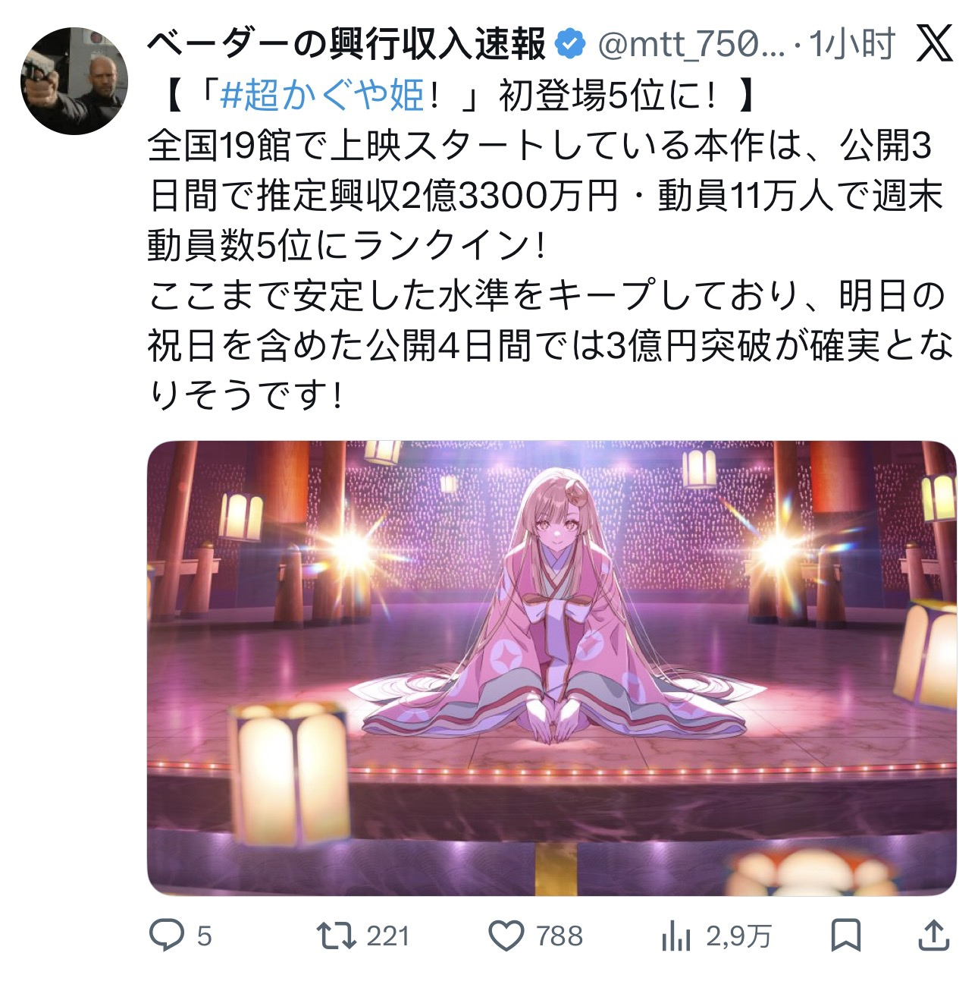

---
### 42楼 · 莫谈戚焉
Lv.8 · 2026-02-23 00:32 · 赞 3

26w了\[吐舌\]21号才刚过25w 
如之前楼友所说，剧场上映之后推特粉丝又开始快速增长了\[太开心\]

---
### 43楼 · 莫谈戚焉
Lv.8 · 2026-02-23 00:38 · 赞 2

---
### 44楼 · 莫谈戚焉
Lv.8 · 2026-02-23 00:44 · 赞 6

【悲报】圣地超市松饼粉已切

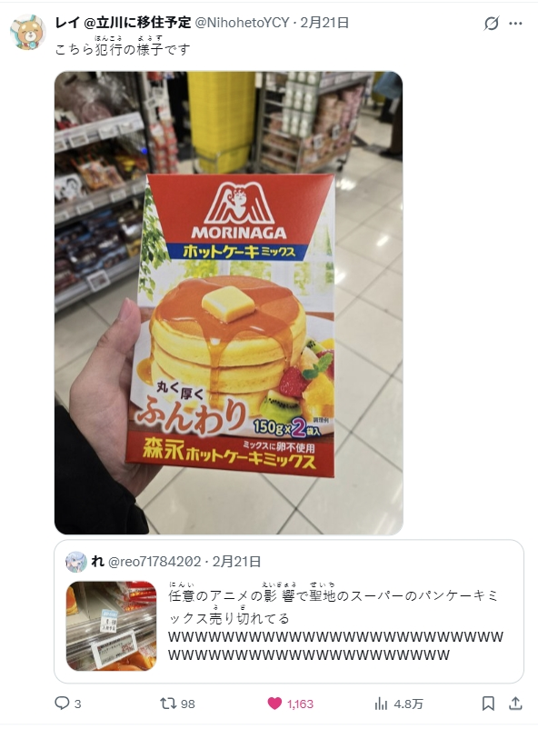

---
### 45楼 · 羊狼总动员0301
Lv.15 · 2026-02-23 11:06 · 赞 3

> **inting1** 2026-02-23 11:20:12：没说截止日，还有机会 后面看两个风向：能否继续加馆，能否发新特典\[阴险\]
>
> **莫谈戚焉** 2026-02-23 14:23:59：加的不多啊\[阴险\]
>
> **莫谈戚焉** 2026-02-23 14:31:52：我看下面评论说因为周五《哆啦A梦》和《转生史莱姆》的电影要上映了，所以也排不上
>
> **用户007🌀** 2026-02-23 15:21:04：接下来就是学校春休档期，每年的兵家必争之地。各家电影院日程早就排的满满当当的了，辉夜反而才是来者，能拿到春休档期还加馆，一方面是前期全满座的底气，另一方面肯定有哪部作品的时间段被献祭了。首周可能是小圆回天延期空出来的，2.27后有人猜测是高达票房翻测车了空出来的。\[阴险\]
>
> **雪之下雪乃** 2026-02-25 15:19:21：只加8馆有点蚊子腿了\[阴险\]，虽然相对原本的19馆增加了42%，但后续可能没有加馆了，除非能逆跌
>

---
### 46楼 · 龍HCL
Lv.14 · 2026-02-23 14:25 · 赞 5

莫名看着很爽.

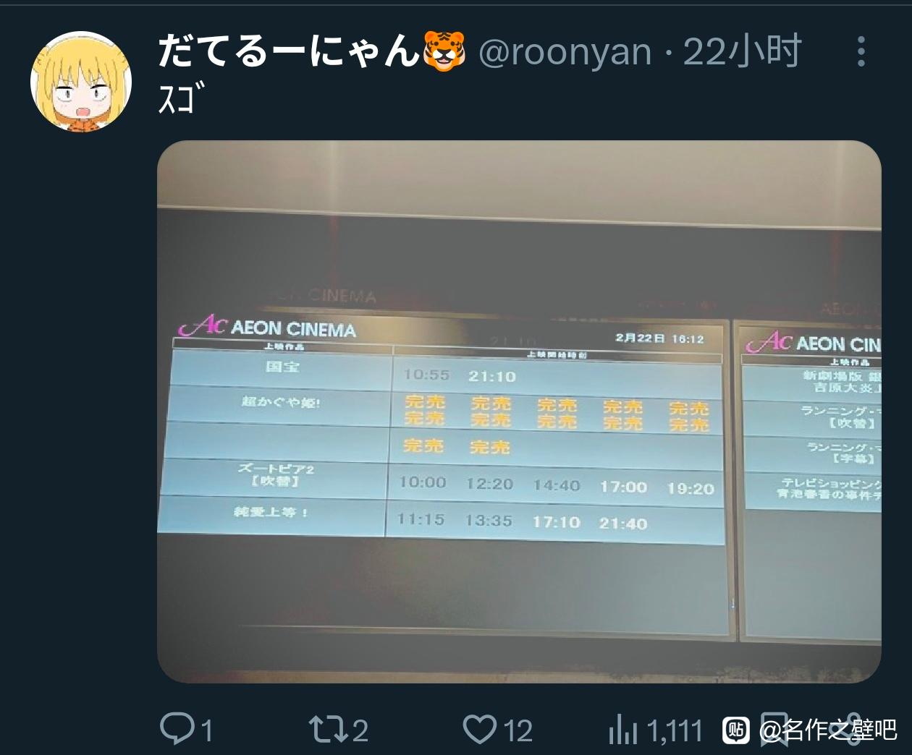

---
### 47楼 · 夜星划空
Lv.13 · 2026-02-23 15:18 · 赞 2

---
### 48楼 · 莫谈戚焉
Lv.8 · 2026-02-23 20:39 · 赞 3

一天涨1w粉\[what\]\[欢呼\]

> **沧海巫山º** 2026-02-23 20:46:14：还是上电影院观感更好更吸粉
>

---
### 49楼 · 茶话部🔥
Lv.14 · 2026-02-23 22:49 · 赞 4

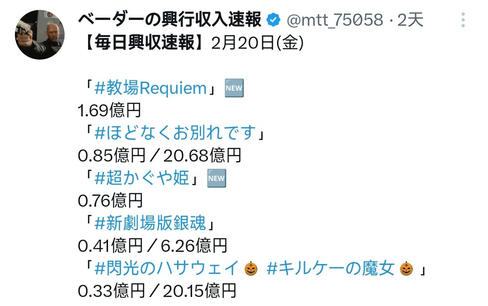

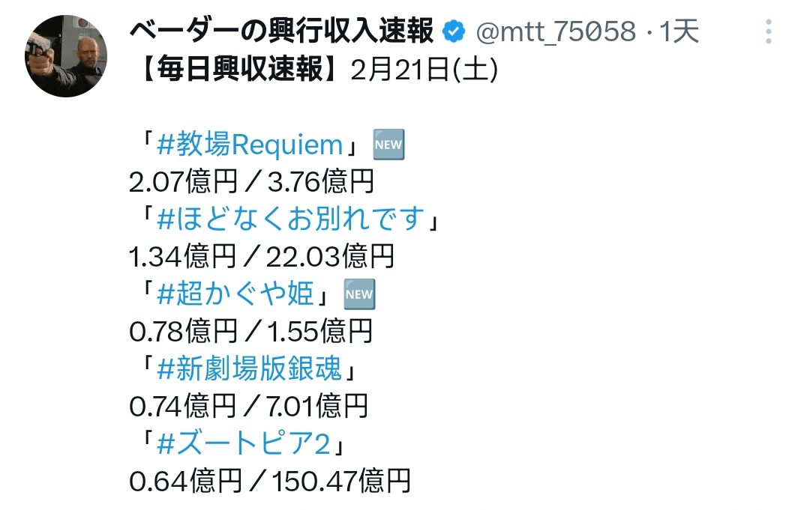

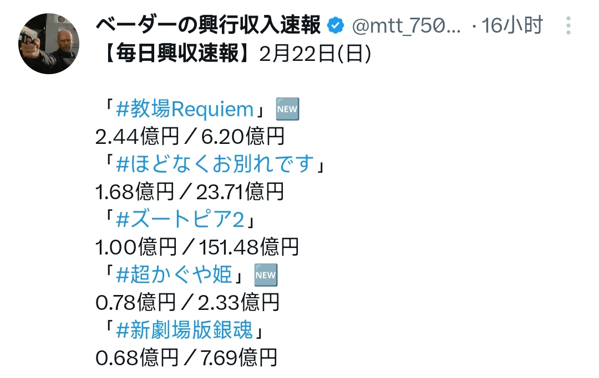

> **莫谈戚焉** 2026-02-23 23:45:25：稳定的收入\[真棒\]
>
> **沧海巫山º** 2026-02-24 08:20:18：也太稳定了吧
>
> **莫谈戚焉** 2026-02-24 10:39:55：满席是这样的\[太开心\]
>

---
### 50楼 · 茶话部🔥
Lv.14 · 2026-02-23 22:49 · 赞 9

---
### 52楼 · 5A1yGxu
Lv.9 · 2026-02-24 06:28

又看了下op red，对比一下感觉辉夜姬可惜就是歌卖的不够多，而且不够好听。

> **5A1yGxu** 2026-02-24 06:28:48：就歌来说雀斑公主没得黑
>

---
### 53楼 · 龍HCL
Lv.14 · 2026-02-24 08:52

不知道真假！

> **高浮雕580** 2026-02-24 09:51:43：不是内部人员，哪里来的经费来源
>
> **ftghyw** 2026-02-24 12:10:06：这是和高畑的电影搞混了吧\[阴险\]
>
> **纽卡希勒** 2026-02-24 12:35:35：咋可能这么贵，闹呢
>
> **DFB\_Trumpet** 2026-02-24 13:08:41：信QQ群的这辈子有了
>
> **山水花苑** 2026-02-24 14:17:16：成本目前就是没有公示，看到一律作假\[阴险\]
>

---
### 54楼 · 羊狼总动员0301
Lv.15 · 2026-02-24 11:19 · 赞 5

4477(+\*\*\*4)　\*\*5086(.239)　\*\*\*\*\*\*　20.3%　\*\*4585　超かぐや姫 
工作日上座接近9成

---
### 55楼 · 某不科学的FF君
Lv.1 · 2026-02-24 12:05

今天座席是不是比昨天多？

---
### 56楼 · 龍HCL
Lv.14 · 2026-02-24 12:50 · 赞 2

19馆打上百馆？

> **用户007🌀** 2026-02-24 13:15:25：这是Cinema City这一家的票房排行。这家影院只有两馆，都在东京立川，也就是本作故事发生地，之所以能超过木村拓哉出演的教场也是因为这里方便圣地巡礼吧。但整体上和这些春休大物还是没法比，教场都8.4亿票房了。
>
> **龍HCL** 2026-02-24 13:36:07：这样啊！我就说不可能第一啊\[汗\]
>

---
### 57楼 · 羊狼总动员0301
Lv.15 · 2026-02-24 13:43 · 赞 2

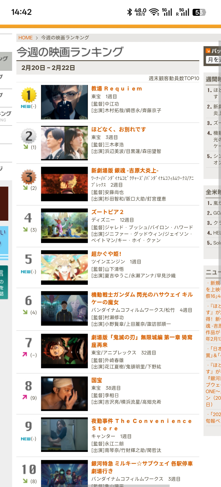

---
### 58楼 · 啥玩意啊7
Lv.1 · 2026-02-24 15:43

感觉百馆上映的话，能保30亿冲50亿呀，莉可莉丝以后最大热度原创ip可能真不是吹的。

---
### 59楼 · 茶话部🔥
Lv.14 · 2026-02-24 20:08 · 赞 4

---
### 60楼 · 茶话部🔥
Lv.14 · 2026-02-24 20:08 · 赞 1

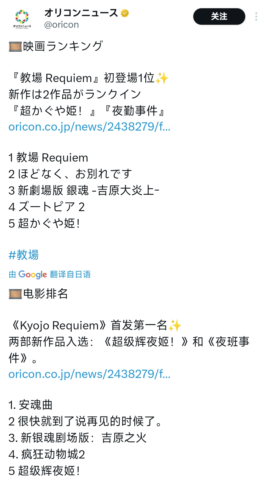

---
### 61楼 · 羊狼总动员0301
Lv.15 · 2026-02-24 20:30 · 赞 2

4日間で興行収入が約2億9122万円、観客動員数が約14万8000人を記録したことが分かった。

---
### 63楼 · 茶话部🔥
Lv.14 · 2026-02-24 21:01 · 赞 3

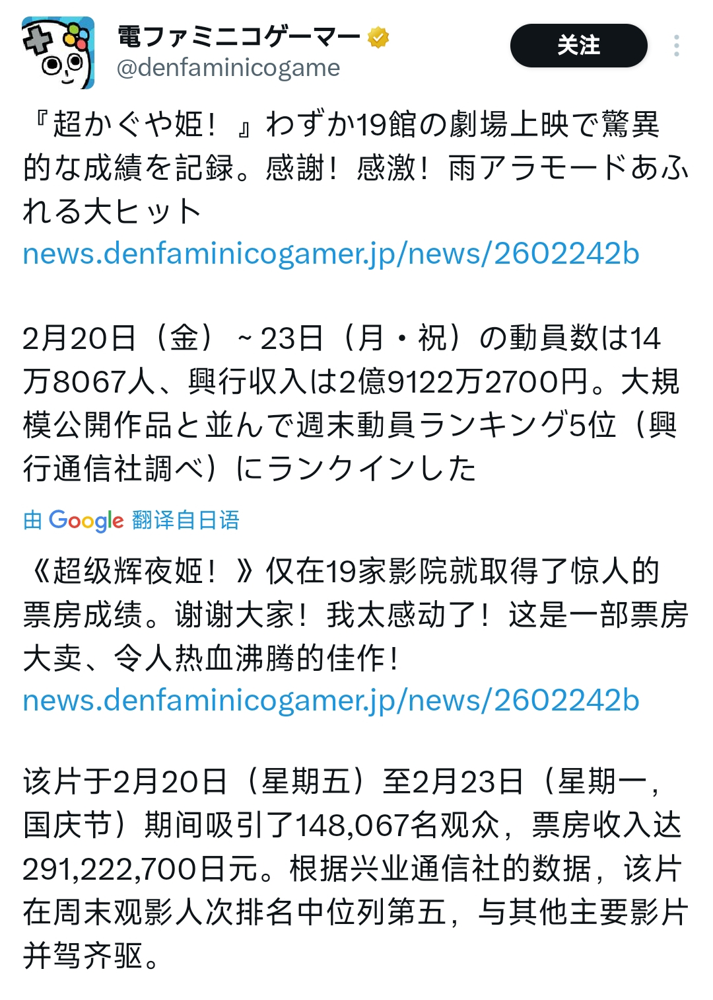

> **八点起床🌞** 2026-02-24 22:41:17：卡九（x
>

---
### 64楼 · 龍HCL
Lv.14 · 2026-02-24 21:09

没有到3亿，可惜了！

---
### 65楼 · 莫谈戚焉
Lv.8 · 2026-02-25 01:38 · 赞 7

体感电影院上映之后更多人去看了，刷推看到各种各样的人发观后感 
超时空辉夜姬你真的火了\[太开心\]\[欢呼\] 
所以说1000日元的netflix真的不如2000日元的电影票划算吧2333

> **沧海巫山º** 2026-02-25 08:14:09：刷推看到好多是第一次在电影院看完超时空辉夜姬觉得很不错的
>

---
### 66楼 · overvell
Lv.13 · 2026-02-25 09:40 · 赞 2

ツインエンジン『超かぐや姫!』画期的成功収める 
　わずか全国19館での公開ながら、金〜日３日間の成績は 
動員11万３３７１人、興収２億２３４８万５４００円。 
３００館規模の作品が上位を占めるなか、 
２月20〜22日の週末動員ランキング（興行通信社調べ）では５位にランクイン。 
23日（月・祝）を含む４日間では 
動員14万８０６７人、興収２億９１２２万２７００円 
という驚異的な数字を叩き出した。

---
### 67楼 · 龍HCL
Lv.14 · 2026-02-25 11:16 · 赞 3

推特粉丝感觉又涨不动了！官方再来几个好消息吧！把馆数增加到五十馆就好了！

> **莫谈戚焉** 2026-02-25 22:59:14：对啊，快点推特营业一下啊（）
>

---
### 69楼 · 某不科学的FF君
Lv.1 · 2026-02-25 16:34 · 赞 1

感觉平日也蛮稳定的

---
### 70楼 · 龍HCL
Lv.14 · 2026-02-25 20:08 · 赞 1

这水平如何啊？本来以为能七天五亿呢！

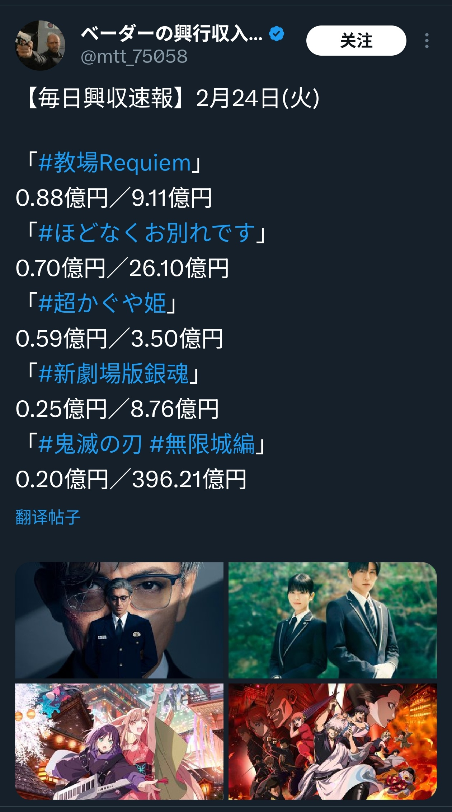

---
### 71楼 · 某不科学的FF君
Lv.1 · 2026-02-25 20:54 · 赞 4

周五能破5亿吧

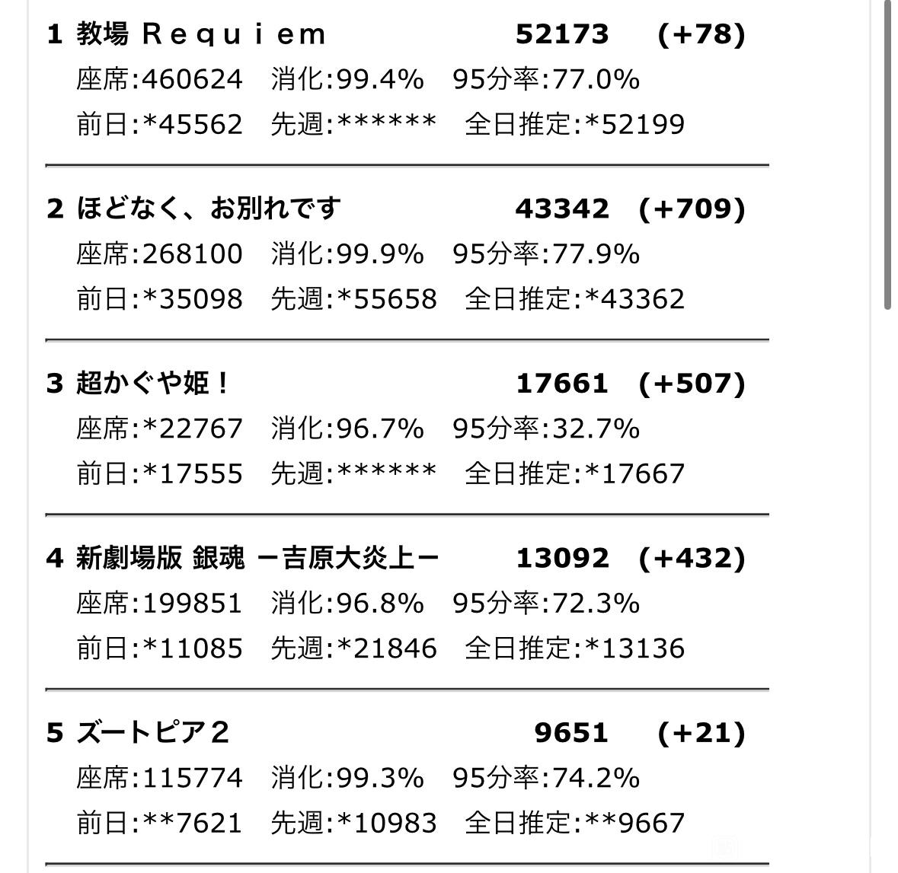

---
### 72楼 · 莫谈戚焉
Lv.8 · 2026-02-25 22:57 · 赞 1

两天又涨1w粉

---
### 73楼 · 龍HCL
Lv.14 · 2026-02-26 09:16 · 赞 1

该继续加馆了……

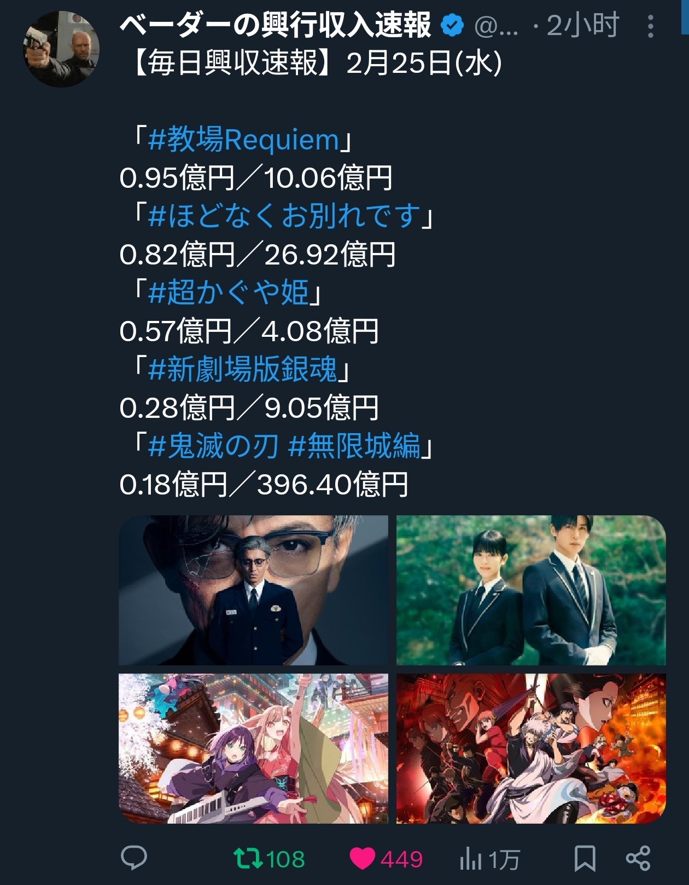

---
### 74楼 · inting1（楼主）
Lv.15 · 2026-02-26 10:52 · 赞 6

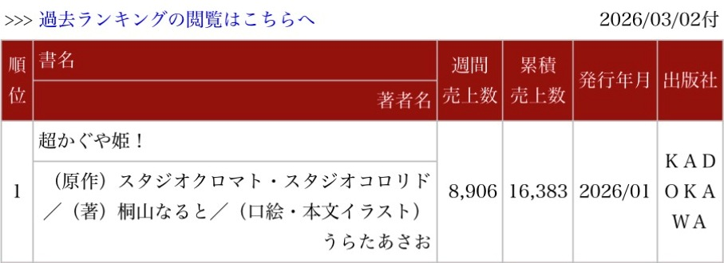

小说终于补货了 
目前日亚还在前5，后劲没问题

> **aptx星璇** 2026-02-26 12:15:32：上周飞榜我还以为是卖不动了合着原来是一直没补货吗，还是剧场公开效应
>

---
### 76楼 · inting1（楼主）
Lv.15 · 2026-02-26 11:28 · 赞 3

开局热度就基本集中在东亚，中日后劲起航后热度就基本只在中日了\[阴险\]

> **厉害笑吧** 2026-02-26 16:25:43：\[阴险\]感觉后劲还是有点略显不足，能不能再爆点大的炒作一下
>
> **5A1yGxu** 2026-02-26 18:29:24：流媒体炒作不了，题材先天瘸腿
>

---
### 77楼 · 仙翳
Lv.12 · 2026-02-26 11:54 · 赞 1

现在众筹到百分之几百了

---
### 78楼 · 龍HCL
Lv.14 · 2026-02-26 12:21 · 赞 3

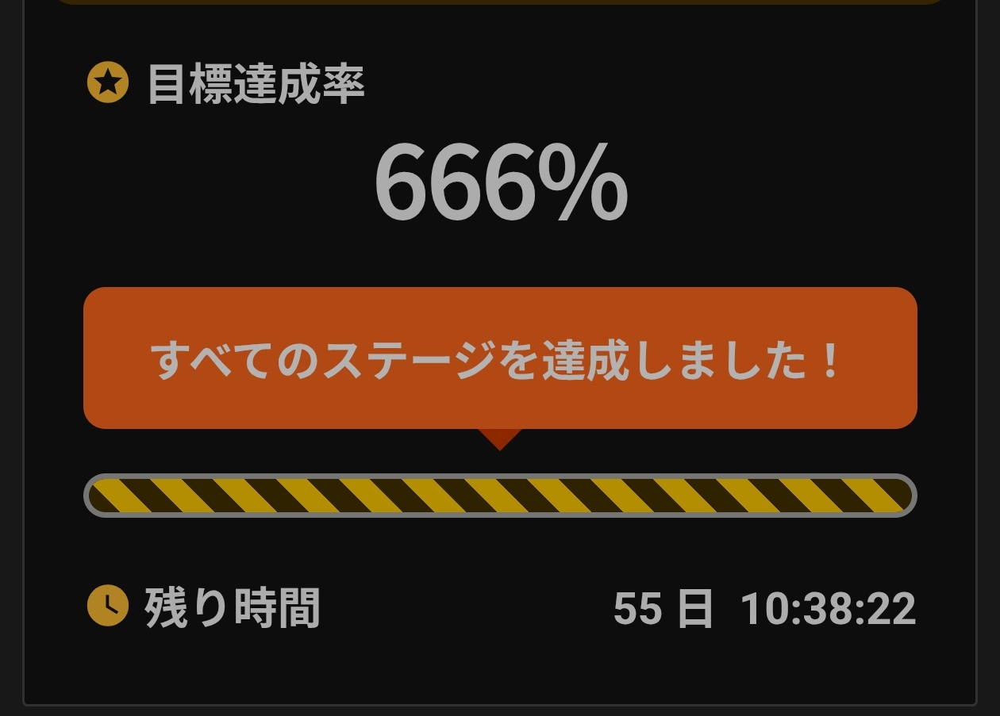

> **仙翳** 2026-02-26 13:05:41：还真是好数字啊
>

---
### 79楼 · 某不科学的FF君
Lv.1 · 2026-02-26 20:43 · 赞 2

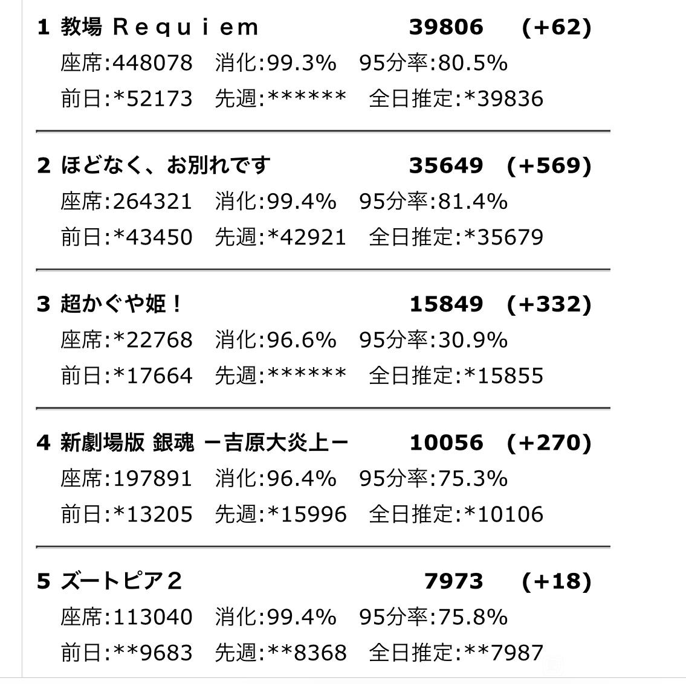

---
### 80楼 · 龍HCL
Lv.14 · 2026-02-26 21:52

一直减少是上座率降低很多了？

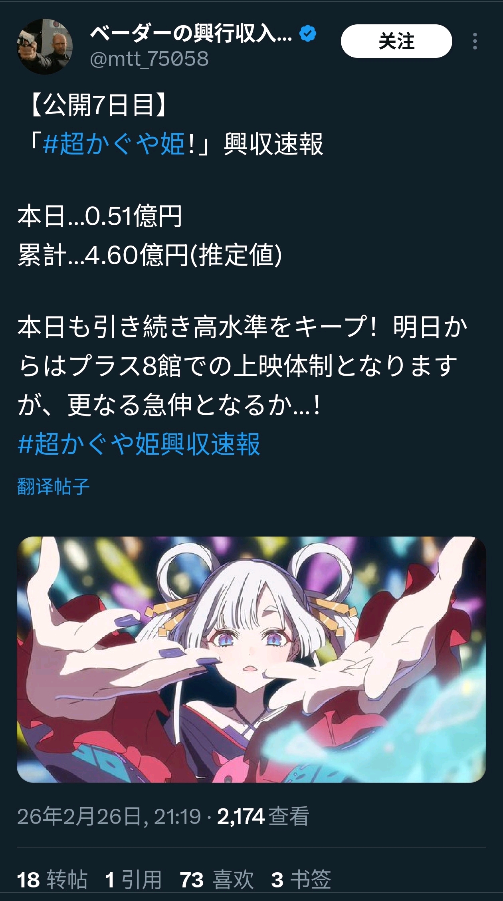

> **莫谈戚焉** 2026-02-27 00:39:59：放映时间延长+平日也正常吧
>

---
### 81楼 · 莫谈戚焉
Lv.8 · 2026-02-27 00:40

油管40w粉

---
### 82楼 · 5A1yGxu
Lv.9 · 2026-02-27 06:50

另一部原创之光银河特急再扩75馆了，辉夜姬不搞个百馆以上真没啥诚意

---
### 83楼 · overvell
Lv.13 · 2026-02-27 11:05 · 赞 3

周末扩馆后上座率就下来了，这样看就算正常上映也到不了30亿吧\[阴险\]

---
### 84楼 · 酸涩的橙子
Lv.9 · 2026-02-27 11:34 · 赞 1

这个三十多馆坐席已经相当于以前一些一百多馆新片的坐席了，虽然不能这么比，不过不少300馆新片坐席还不到辉夜姬的3倍

> **酸涩的橙子** 2026-02-27 11:48:39：看了下不到30馆，是馆均场次多。
>

---
### 85楼 · 某不科学的FF君
Lv.1 · 2026-02-27 11:38 · 赞 3

感觉这受众冲特典效果应该还可以

---
### 86楼 · 茶话部🔥
Lv.14 · 2026-02-27 15:04 · 赞 4

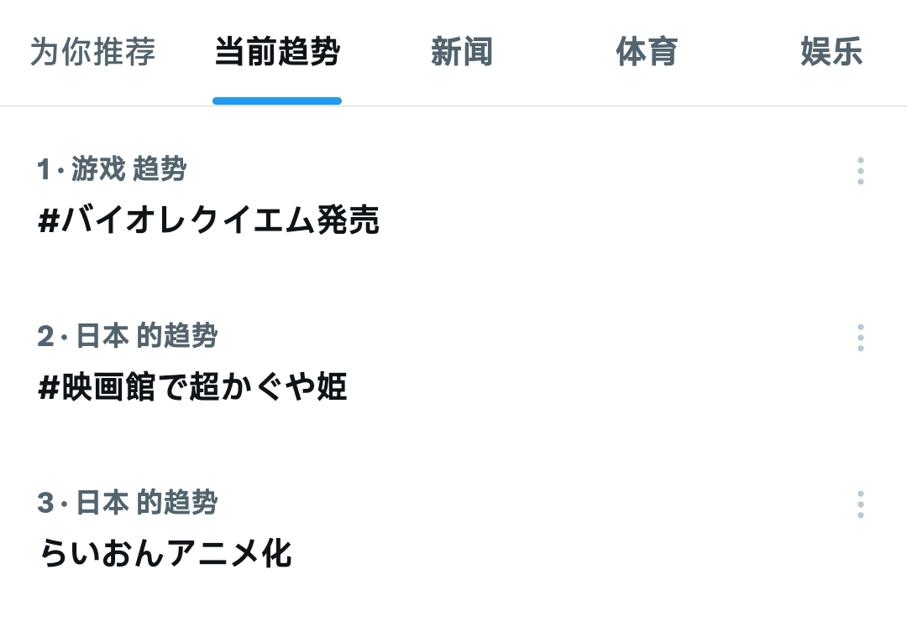

---
### 87楼 · 茶话部🔥
Lv.14 · 2026-02-27 15:06

话说为什么X粉丝数跟油管差距大到十几万？

> **inting1** 2026-02-27 19:17:45：推子管子官号比官推多了20万粉 官推工商太多，吸引力比较低
>

---
### 88楼 · 龍HCL
Lv.14 · 2026-02-27 18:59 · 赞 4

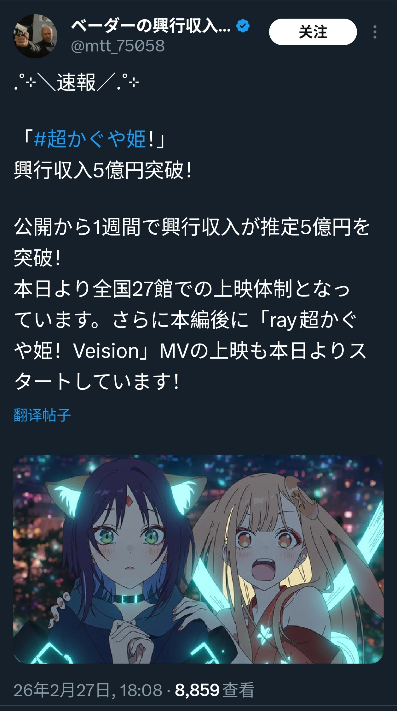

---
### 89楼 · 某不科学的FF君
Lv.1 · 2026-02-27 21:28 · 赞 2

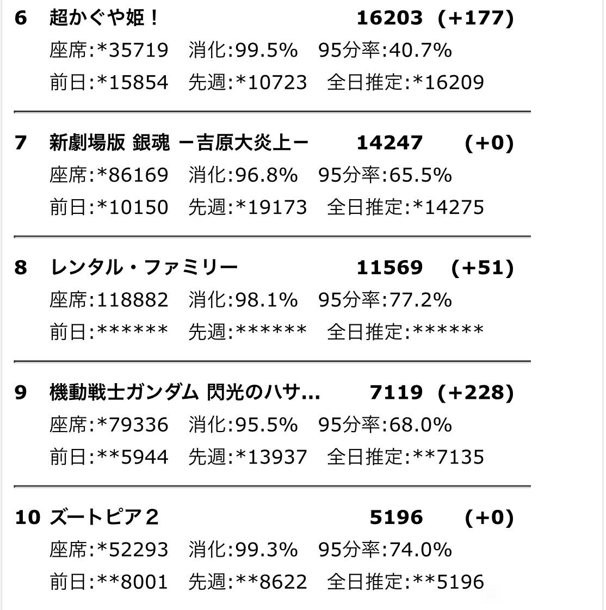

---
### 90楼 · 龍HCL
Lv.14 · 2026-02-27 23:08 · 赞 2

这馆白加了？甚至比昨天低emmm...

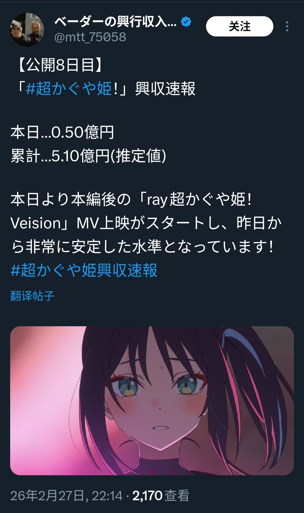

> **用户007🌀** 2026-02-27 23:25:56：次周+春休大物冲击+无特典，今天哆啦A梦和史莱姆刚上哦
>
> **5A1yGxu** 2026-02-28 21:54:12：想快速收米那就上imax和4dx这种高净值荧幕
>

---
### 91楼 · 某不科学的FF君
Lv.1 · 2026-02-27 23:36 · 赞 1

小说现在严重缺货什么时候能补上

---
### 92楼 · 龍HCL
Lv.14 · 2026-02-28 13:01 · 赞 3

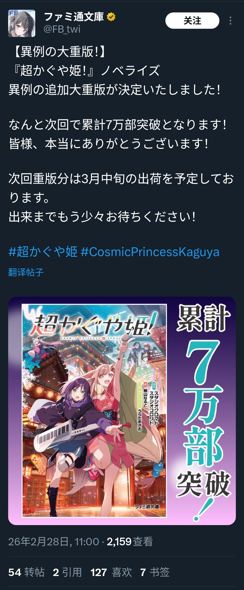

---
### 93楼 · 莫谈戚焉
Lv.8 · 2026-02-28 14:54 · 赞 1

29w粉 再磨磨上30\[太开心\]

---
### 94楼 · 杜滋琪
Lv.11 · 2026-02-28 15:38 · 赞 2

上座率拉到70%，还是很恐怖的

---
### 95楼 · 瓦上片霜
Lv.7 · 2026-02-28 18:06

主要是没特典吧

---
### 96楼 · 某不科学的FF君
Lv.1 · 2026-02-28 20:55 · 赞 3

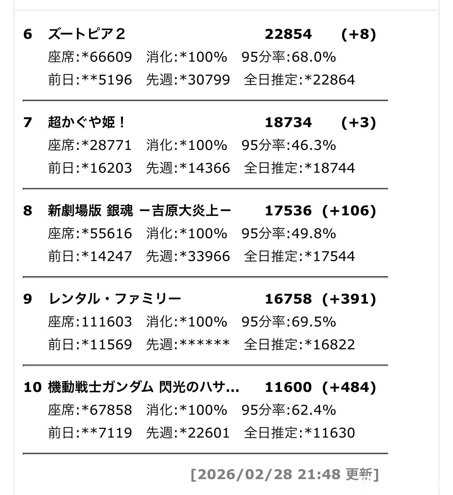

---
### 97楼 · 龍HCL
Lv.14 · 2026-02-28 23:07 · 赞 3

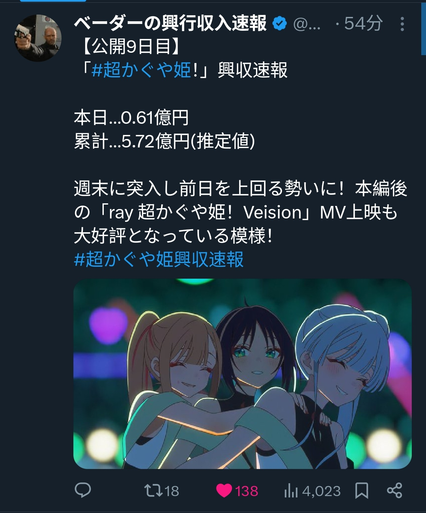

---
### 98楼 · 先导后积🥵
Lv.10 · 2026-03-01 22:38 · 赞 7

官推294300粉丝达成

---
### 99楼 · 龍HCL
Lv.14 · 2026-03-02 08:08 · 赞 1

不知道官方看不看重剧场上映？ 
赶紧宣布扩馆和特典重刷还能挽救下票房颓势！

---
### 100楼 · with🧳
Lv.12 · 2026-03-02 13:58 · 赞 4

30w

页码：**1–100 楼** · [101–200 楼](thread_2.md) · [201–300 楼](thread_3.md) · [301–400 楼](thread_4.md) · [401–500 楼](thread_5.md) · [501–600 楼](thread_6.md) · [601–700 楼](thread_7.md) · [701–800 楼](thread_8.md)

---

[⬆ 本页顶部](#top)　·　[⏬ 最新的楼层](thread_8.md#bottom)
