

# 【动画讨论&amp;追踪】超时空辉夜姬

- 贴吧: 名作之壁吧　楼主: inting1　发帖: 2026-02-21 19:38:46
- 原帖: https://tieba.baidu.com/p/10504053776　抓取时间: 2026-09-28 06:12:51　楼层数: 642　（时间均为北京时间）

[⬇ 本页底部](#bottom)　·　[⏬ 最新的楼层](thread_8.md#bottom)

页码：[1–100 楼](thread.md) · **101–200 楼** · [201–300 楼](thread_3.md) · [301–400 楼](thread_4.md) · [401–500 楼](thread_5.md) · [501–600 楼](thread_6.md) · [601–700 楼](thread_7.md) · [701–800 楼](thread_8.md)

---
### 101楼 · 龍HCL
Lv.14 · 2026-03-02 16:35 · 赞 2

---
### 102楼 · 莫谈戚焉
Lv.8 · 2026-03-02 22:30

推特粉丝增速又猛了起来\[酷\]不过为啥。。

---
### 103楼 · 回忆の梦
Lv.7 · 2026-03-02 23:18 · 赞 1

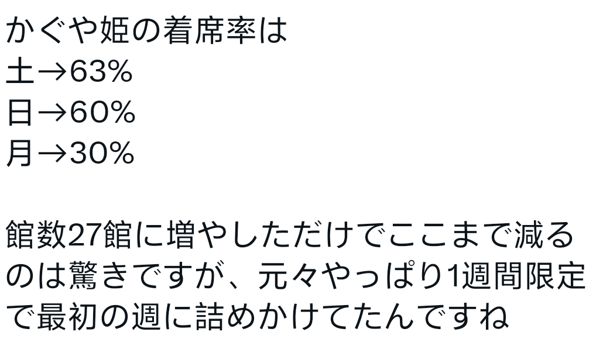

> **贴吧用户\_GN8XJ8N** 2026-03-02 23:42:37：看来还是后劲不足，没有特典看来是这样的\[小乖\]
>

---
### 104楼 · 龍HCL
Lv.14 · 2026-03-03 00:05 · 赞 1

赶紧把特典弄出来吧！

---
### 105楼 · 羊狼总动员0301
Lv.15 · 2026-03-03 08:07 · 赞 4

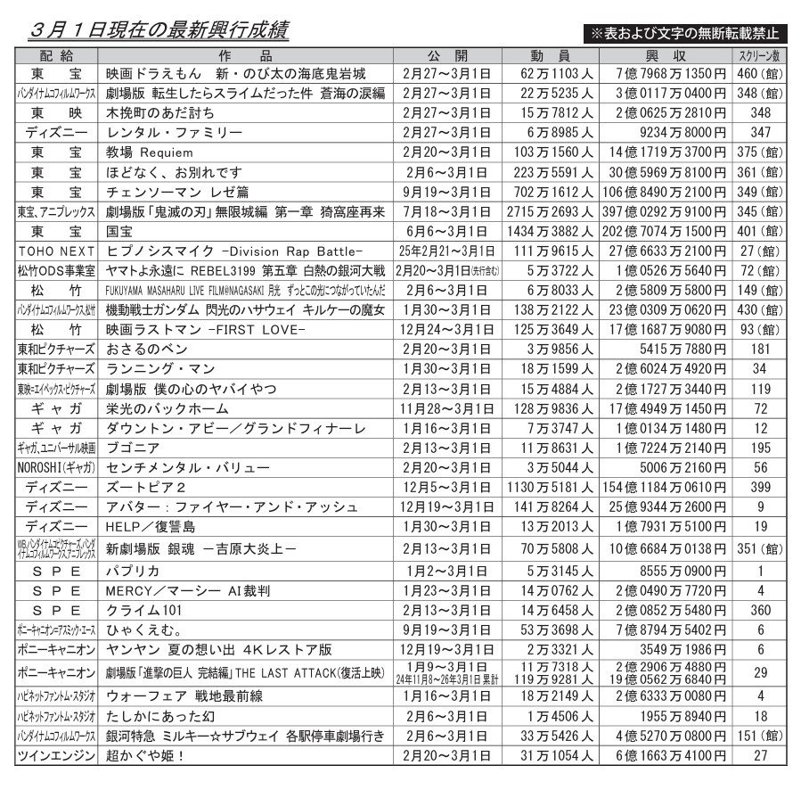

---
### 106楼 · 龍HCL
Lv.14 · 2026-03-03 08:25 · 赞 2

这么看的话，感觉辉夜姬还挺强的！ 
我们需要特典之力啊\[泪\]

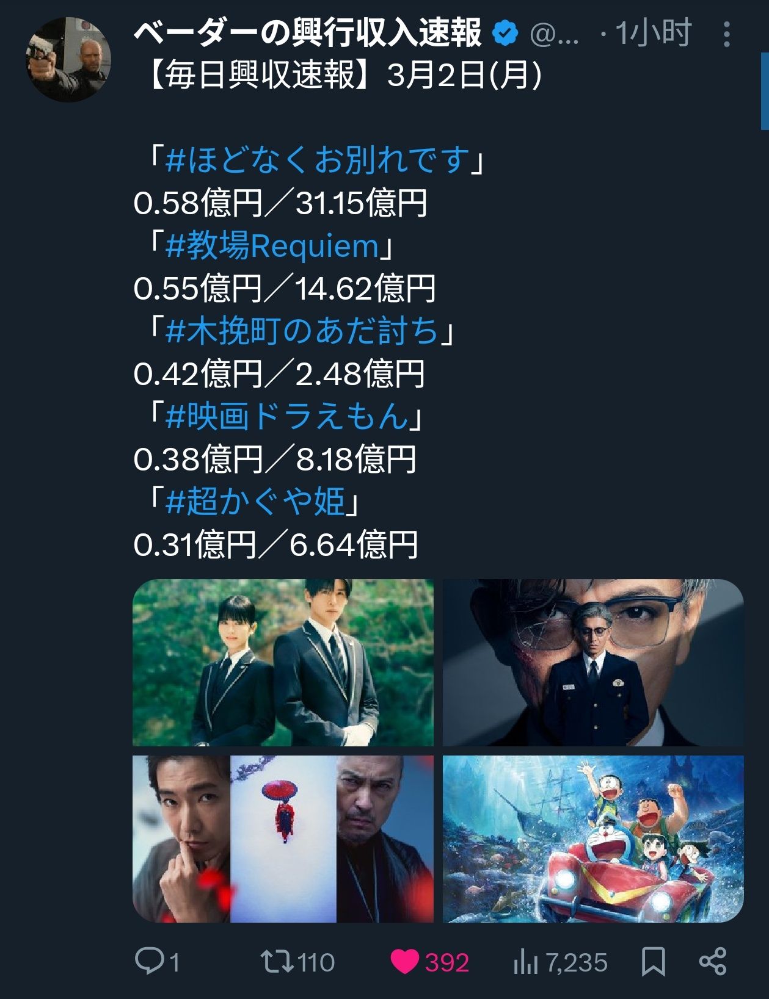

---
### 107楼 · 隐杏珠隐大
Lv.5 · 2026-03-04 01:02 · 赞 1

\[呵呵\]

---
### 108楼 · 龍HCL
Lv.14 · 2026-03-04 16:38 · 赞 1

平日都很一般啊！

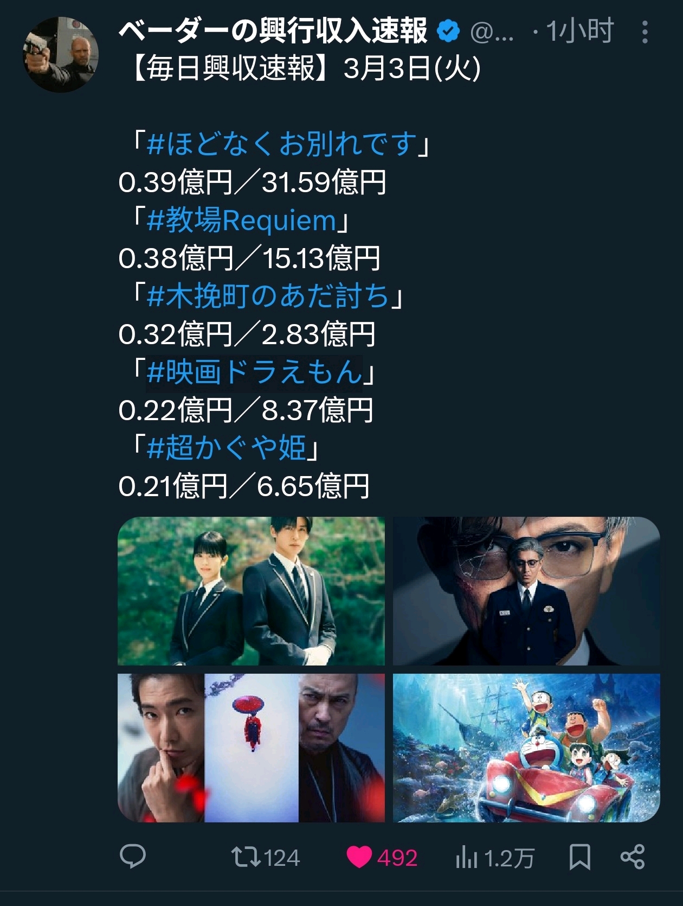

---
### 109楼 · 莫谈戚焉
Lv.8 · 2026-03-04 23:08 · 赞 1

31w粉了\[太开心\]

---
### 110楼 · 羊狼总动员0301
Lv.15 · 2026-03-04 23:22 · 赞 2

电影效应还可以

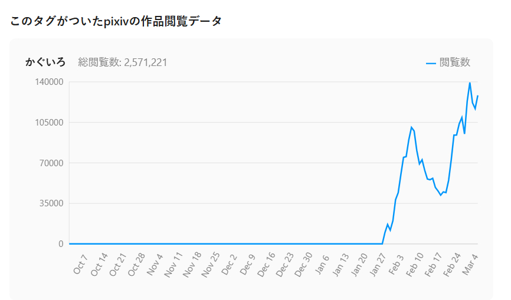

---
### 111楼 · 龍HCL
Lv.14 · 2026-03-05 07:33 · 赞 2

今天要是能公布全国上映加特典追加就死而无憾了！

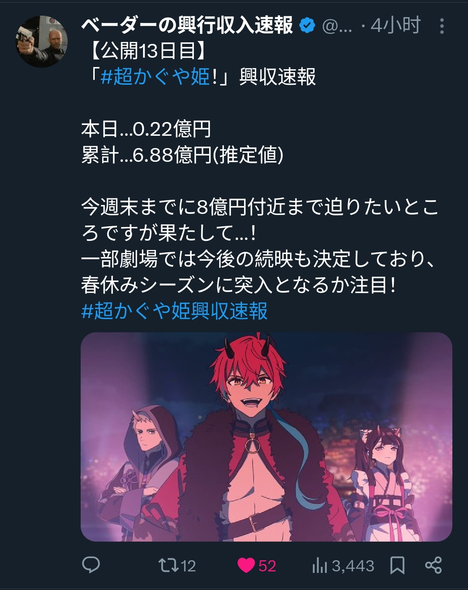

---
### 113楼 · inting1（楼主）
Lv.15 · 2026-03-05 09:19 · 赞 4

小说又一发补货炮 
日亚实时也登顶，加印多少后劲就有多少

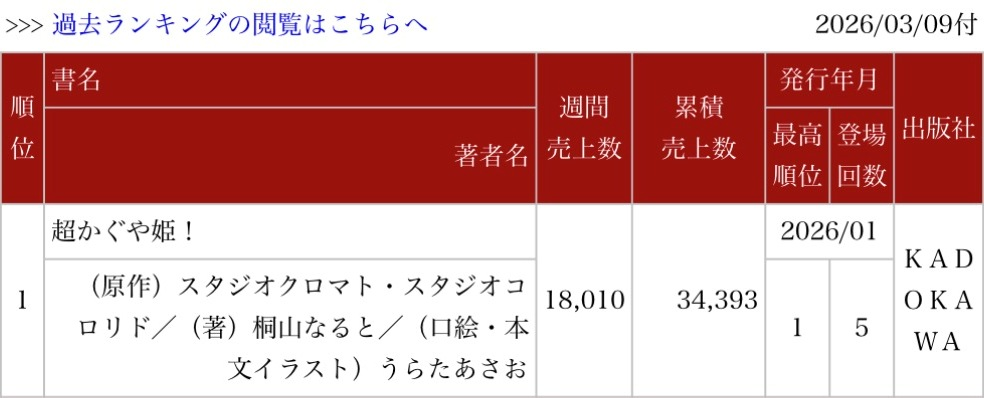

---
### 114楼 · 回忆の梦
Lv.7 · 2026-03-05 11:36 · 赞 2

\[心碎\]可惜了国内热度真的不错

---
### 115楼 · 羊狼总动员0301
Lv.15 · 2026-03-05 19:28 · 赞 4

从2月份的二创规模来说，单月有这个水平的似乎只有蒜水滚了。当然指的百合cp方面

---
### 116楼 · 回忆の梦
Lv.7 · 2026-03-05 20:02 · 赞 3

来了来了

---
### 117楼 · 龍HCL
Lv.14 · 2026-03-05 20:08 · 赞 1

这下真的死而无憾了！！！

---
### 118楼 · inting1（楼主）
Lv.15 · 2026-03-05 20:12 · 赞 8

追加120多馆，新特典也有了，开冲！

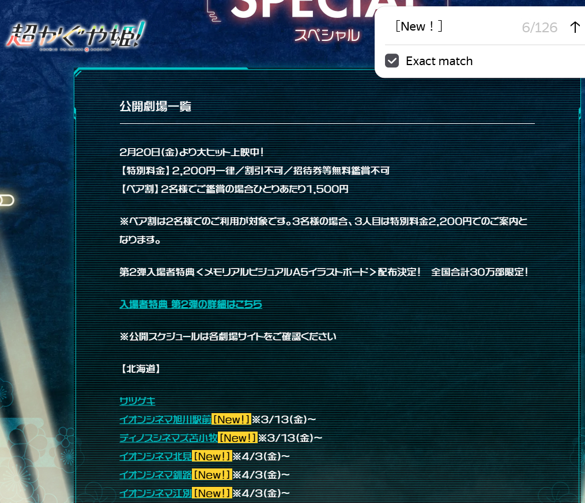

> **厉害笑吧** 2026-03-05 20:23:36：加油冲啊\[阴险\]
>

---
### 121楼 · 羊狼总动员0301
Lv.15 · 2026-03-05 20:39

虽然截止上周动员才30万，不过加馆后如果完全平均摊下来的话每馆也就2000不到，热门馆周五就没了。希望不要均摊\[阴险\]

> **inting1** 2026-03-05 20:44:39：其实更重要的是有没有周替特典，这种片是刚需这个的\[阴险\]
>
> **羊狼总动员0301** 2026-03-05 20:47:19：其实现在还是吸粉阶段，还好吧\[阴险\]晚点加都行
>
> **5A1yGxu** 2026-03-05 20:59:15：从这周上座率来看出圈感觉没啥戏了，能收割粉丝的钱已经不错了
>
> **aptx星璇** 2026-03-05 21:00:17：应该不会均摊，首映的时候就是新宿池袋的特典是分得最多的撑到了晚上，其他馆的虽然开的场次还没新宿的多但是大多数上午就没特典了
>

---
### 122楼 · 奈雪のの
Lv.9 · 2026-03-05 20:42

又加馆了，一群大主播开始直播同时观看，不知道能带上多少人进电影院

---
### 123楼 · 5A1yGxu
Lv.9 · 2026-03-05 21:02

不上个imax或者4dx吗，高净值荧幕才能最快收粉丝的米

---
### 124楼 · 龍HCL
Lv.14 · 2026-03-05 21:33 · 赞 2

4月3日才上这种，感觉肯定得有新特典吧！

> **aptx星璇** 2026-03-05 23:17:04：其实有特地说4月3号才上映的剧场也会有这个第二弹特典，说明起码到4.3应该是不会换特典了(不然会变成不同剧场发的特典还不一样)
>
> **龍HCL** 2026-03-05 23:18:23：那会加印，还是分出去？
>
> **aptx星璇** 2026-03-05 23:51:31：应该每个剧场分到的特典数量是确定的提前分好的，前面先上映的剧场发完了不影响后上映剧场的量，所以如果有粉丝前面没抢到特典甚至可以去后上映的剧场再抢一次(大概)
>

---
### 125楼 · GZ丶冬
Lv.2 · 2026-03-05 23:06

辉夜姬版权在谁手里，网飞吗，网飞不是只抓流媒体不喜欢电影院吗，北美大爆的灭魔女团也只限定上映一周

> **5A1yGxu** 2026-03-05 23:09:10：辉夜姬是双引擎出资，不是网飞，ip的收入归双引擎，只有播放权卖给了网飞。
>
> **奈雪のの** 2026-03-05 23:40:07：网飞出钱，由双引擎及旗下动画工作室全权制作动画
>
> **奈雪のの** 2026-03-05 23:41:32：有钱肯定赚啊，该开的会员都开了。
>
> **GZ丶冬** 2026-03-05 23:59:57：Ip是在网飞手里吗
>
> **5A1yGxu** 2026-03-06 00:07:16：像网飞真正出资的ip，製作或者企划里会写着netflix（比如同时netflix动画电影的漂流家园）但辉夜姬只写着双引擎。
>
> **奈雪のの** 2026-03-06 00:13:40：网飞出钱让动画公司做，相当于买断流媒体还预付款。但动画这种东西，结果全看有没有摸鱼，为了让动画公司拼命，只会签一堆附加条款但版权还是动画公司的。
>
> **奈雪のの** 2026-03-06 00:14:57：特殊在于没有网飞就没钱做，所以谁也不知道网飞话语权多大。
>

---
### 126楼 · 5A1yGxu
Lv.9 · 2026-03-06 00:27 · 赞 4

双引擎很早就把以后的原创播放权全打包卖给了网飞，而双引擎的最近几部里漂流家园是唯一一个netflix投资+参与制作的（下图），制作里会写，而我的鬼女孩和辉夜姬都是双引擎最早打包卖给网飞播放权的其中两部，网飞没有参与投资和制作。有网飞的播放费保底还是很重要的。

---
### 127楼 · 永远De正版丶
Lv.15 · 2026-03-06 01:22

可以测测令和的河豚跟腐女哪个能打了\[阴险\]

> **5A1yGxu** 2026-03-06 01:50:20：这几年从票房来看腐女碾压，催麦+忍者乱太郎+鬼太郎这几部接近或者超过30+的都是腐女在c。
>
> **永远De正版丶** 2026-03-06 09:38:01：近年来百合向的还没真正出过大热电影/ip剧场版吧？上面说的滚水蒜只有滚出了总集篇剧场版
>
> **5A1yGxu** 2026-03-06 13:15:55：没有，能挑战30的目前来看只有魔圆
>
> **纽卡希勒** 2026-03-08 22:42:26：只能等小圆证明了
>

---
### 128楼 · 憶研
Lv.12 · 2026-03-06 02:43

好想看到DVD/Blu-ray發售決定\[阴险\]

---
### 129楼 · 龍HCL
Lv.14 · 2026-03-06 12:28 · 赞 2

全国上映前大概能磨到9亿？先看看今天有没有啥提升吧\[太开心\]

> **用户007🌀** 2026-03-06 13:02:12：这周至下周五跌幅应该会比较大，特典消息放出大部分人会选择等特典
>
> **龍HCL** 2026-03-06 15:26:58：好像还有不少新片上映，确实会跌的很惨了\[泪\]
>

---
### 130楼 · 龍HCL
Lv.14 · 2026-03-07 10:19 · 赞 1

看看周六周日能有多少吧！

---
### 131楼 · Inclis
Lv.1 · 2026-03-07 15:58 · 赞 8

虽然只是刻板印象，但本片瞄准的动画宅群体应该并不算是很爱主动往电影院跑的类型吧，会不会其实电影院还挺喜欢辉夜姬这种片，可以招来一部分没有特殊原因就不会主动踏进电影院的客源 
目前其余上映中且有一定热度的宅向动画电影只有史莱姆，银魂和哈萨维，目标客户群体与主打音乐、偶像、管人、百合要素的辉夜姬都有一定差异，而且哈萨维还已经不太行了，而原本会比较接近的回天延期到了八月，或许这也是辉夜姬能拿下这么多剧场的原因之一？

---
### 132楼 · 龍HCL
Lv.14 · 2026-03-07 22:21 · 赞 6

看来周五前能磨到8.1左右吧！

---
### 133楼 · 龍HCL
Lv.14 · 2026-03-08 13:04 · 赞 4

没有金额吹不动啊！

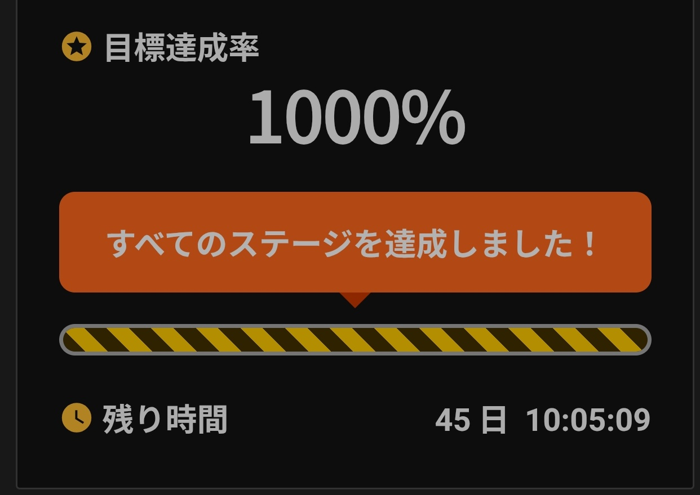

> **厉害笑吧** 2026-03-08 13:19:58：\[喷\]居然已经1000%了吗
>
> **一如既往的路过** 2026-03-08 14:08:00：不公布金额确实
>

---
### 134楼 · aptx星璇
Lv.8 · 2026-03-09 12:44 · 赞 7

虽然一些地方上的剧场后劲不足了但是圣地立川还是很坚挺，不愧是有圣地和监督特调音响加成，无论怎么上新片都是动员第一

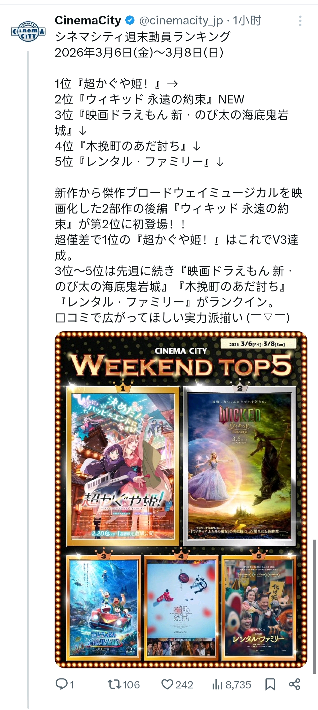

---
### 135楼 · 龍HCL
Lv.14 · 2026-03-09 14:44 · 赞 2

周一到周四看来要票房扑街了！

---
### 136楼 · 羊狼总动员0301
Lv.15 · 2026-03-10 22:14 · 赞 3

周五的坐席大概有10万+，是第一周的4倍左右。

---
### 137楼 · 龍HCL
Lv.14 · 2026-03-10 22:19 · 赞 1

八亿突破！

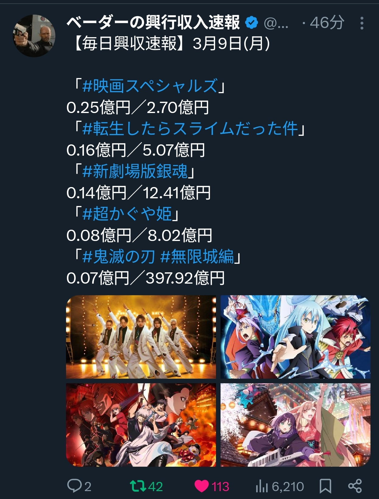

---
### 138楼 · 羊狼总动员0301
Lv.15 · 2026-03-10 23:25 · 赞 3

『超かぐや姫！』は17日間で動員40万183人＆興収7億9371万5500円

---
### 139楼 · 龍HCL
Lv.14 · 2026-03-11 06:52

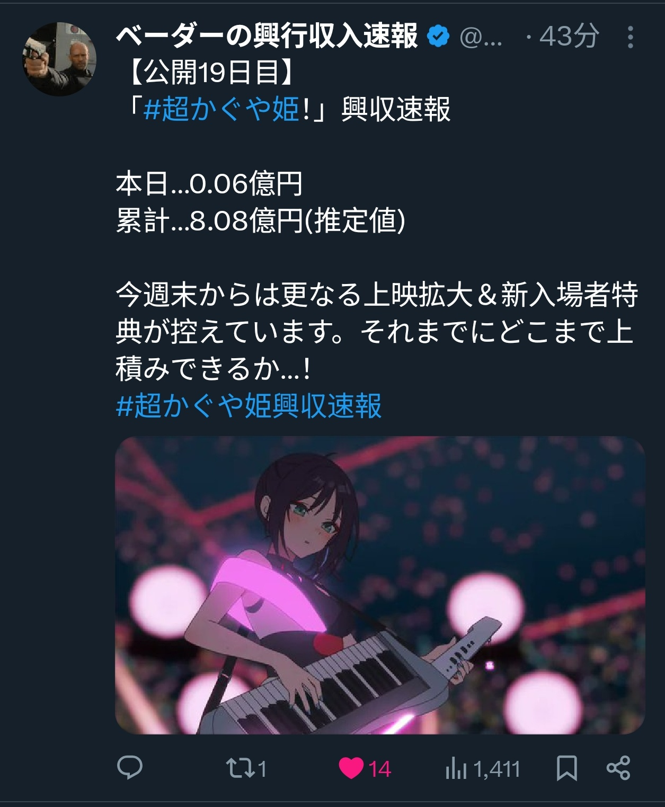

---
### 140楼 · inting1（楼主）
Lv.15 · 2026-03-11 09:36 · 赞 6

两本同人拿了蜜瓜综销周榜前二 only展也开始有人搞了 
另外这推特热度挺持久的 虽然线下观影的扩圈效果一般，但固粉效果真是显著\[阴险\]

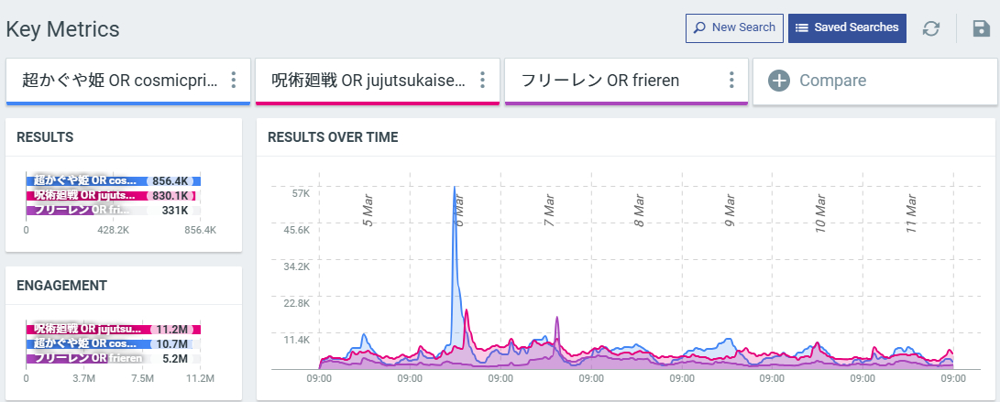

> **羊狼总动员0301** 2026-03-11 11:09:51：这讨论度大概有半蒜滚水的水平了\[阴险\]
>
> **5A1yGxu** 2026-03-11 19:38:22：现在only展和线下生态搞起来后，最大的comicket至少不能完全代表二次元热度的风向标了，comicket可以靠大量买摊强撑手游ip的所谓脸面。
>

---
### 142楼 · inting1（楼主）
Lv.15 · 2026-03-11 09:44 · 赞 10

越来越验证我去年的判断了 
线下活动（包括观影）对路人能跟风打卡，对死忠能提纯固粉，肯定是以后IP开发必须重视的环节\[阴险\]&nbsp;从大体量的鬼灭到小体量的恋人不行，上院线都可以显著提高死忠活跃度和公众曝光度

> **5A1yGxu** 2026-03-11 19:41:07：反正收割粉丝，高净值荧幕要多发力（imax、4dx），配置要拉满，影院就该有影院的效果，不能再拿tv质量上院线糊弄观众。
>
> **如幽女怨怼之物7n** 2026-03-12 09:22:10：合理的\[三哈\]，所以我现在完全不懂网飞要干死院线的动机，明明可以双赢的。我还挺想看网飞发行的大制作电影上院线的\[三哈\]。
>
> **一如既往的路过** 2026-03-12 12:13:22：之前不是说网飞收购华纳的事已经告吹了吗，也有人说网飞本来就是打算把业务扩展到院线(？)。现在网飞估计会改变策略了
>
> **5A1yGxu** 2026-03-12 22:12:02：网飞现在和imax就是双赢状态啊，纳尼亚也上了imax。
>
> **如幽女怨怼之物7n** 2026-03-12 22:23:01：&nbsp;纳尼亚还没出吧？只上IMAX吗？还是包括IMAX的所有院线？
>

---
### 143楼 · 羊狼总动员0301
Lv.15 · 2026-03-11 10:52 · 赞 2

特典看来周五就保不住了，周五上座明显高于上周

> **用户007🌀** 2026-03-11 11:03:35：不至于，30万份特典总量在这里，现在放了三周的总动员人次才40万。
>
> **羊狼总动员0301** 2026-03-11 11:06:38：我指的我这边的\[阴险\]只能盼能多分点特典份额了
>

---
### 144楼 · 龍HCL
Lv.14 · 2026-03-11 13:11

感觉至少到众筹结束下映吧？搞不懂电影周期！

---
### 145楼 · 厉害笑吧
Lv.1 · 2026-03-11 16:33

不知道这个ip现在赚回本了没有？ 
看现在增速放缓了，扩大上映后，能不能磨到票房20亿？

---
### 146楼 · 龍HCL
Lv.14 · 2026-03-12 06:53 · 赞 2

还挺稳定的！

---
### 147楼 · AdamXL07
Lv.10 · 2026-03-12 23:11

这个统计有没有漏的\[阴险\]

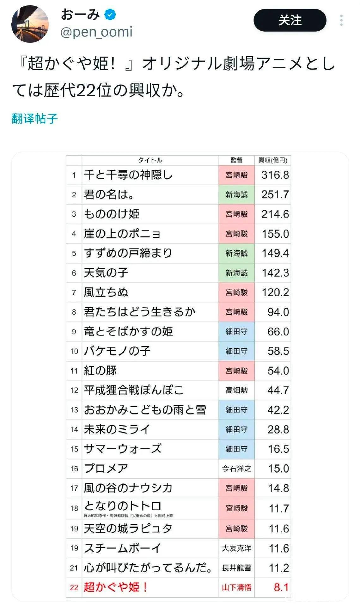

> **5A1yGxu** 2026-03-12 23:25:06：基本没了吧，原创非ip动画电影基本全是爆死货，特别是这几年那堆唐氏人设的。这个蛋糕一直没人吃得到。
>
> **5A1yGxu** 2026-03-12 23:31:41：不过按照这图的评判标准，其实很多宫崎骏的都属于改编作。红猪和风之谷都是改编。
>
> **AdamXL07** 2026-03-12 23:48:50：\[滑稽\]含金量怎么还在提高……
>
> **5A1yGxu** 2026-03-13 00:18:09：原创动画电影爆款太少一直是业界通病，甚至比原创tv还要稀缺的多。
>
> **燐冉** 2026-03-13 08:50:39：绝对不止这点，哆啦A梦系列时不时出新原创电影，票房稳定在20亿以上，这个表里没有
>
> **仙翳** 2026-03-13 09:20:26：哆啦A梦是ip作
>
> **燐冉** 2026-03-13 09:26:21：表上写的是原创电影，况且这表里按照你的意思，好几部作品都不应该上
>
> **benyingfang** 2026-03-13 19:03:52：红猪也就罢了，风之谷基本按漫画搞的，肯定不能算原创了
>

---
### 148楼 · 龍HCL
Lv.14 · 2026-03-13 06:43

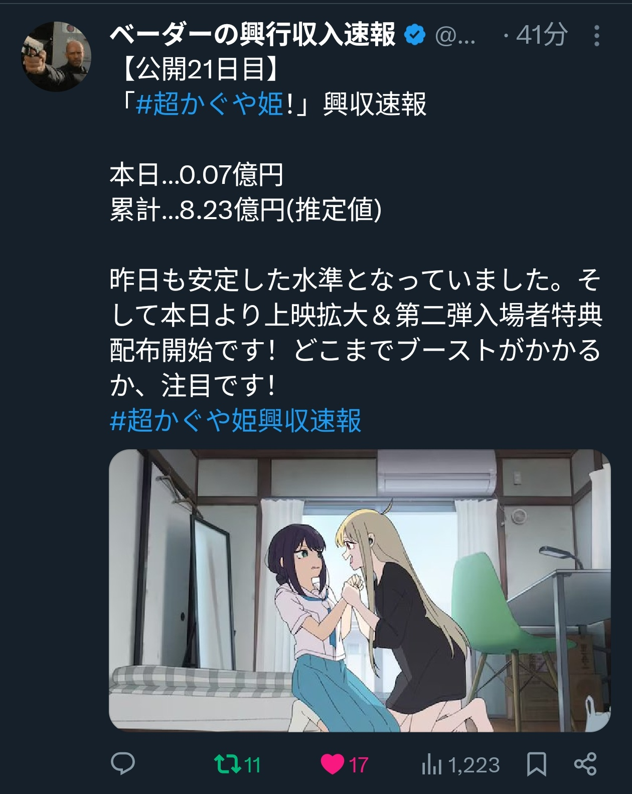

---
### 151楼 · inting1（楼主）
Lv.15 · 2026-03-13 09:09 · 赞 5

受众果然很吃特典 这周末有2亿多了

---
### 152楼 · 羊狼总动员0301
Lv.15 · 2026-03-13 09:53 · 赞 1

不过周五的坐席和上座都比周六高不少的样子

---
### 153楼 · 羊狼总动员0301
Lv.15 · 2026-03-13 11:54

今天有1.3-1.5亿的样子

> **龍HCL** 2026-03-13 21:39:59：好像没有了，排第一的才1.2……
>
> **用户007🌀** 2026-03-13 21:46:29：辉夜的票价是偏高的。
>
> **一如既往的路过** 2026-03-13 23:28:39：1\.31，应该是第一了
>

---
### 154楼 · Inclis
Lv.1 · 2026-03-13 14:26 · 赞 8

从网飞日本的推文可以推测，这段时间应该出现了不少为了看辉夜姬才注册网飞的新会员 
那么网飞大概也是很乐意看到辉夜姬能继续在线下扩大上映规模的，宣传效果看来确实很好

---
### 155楼 · 茶话部🔥
Lv.14 · 2026-03-13 22:44 · 赞 10

千万播放达成✔

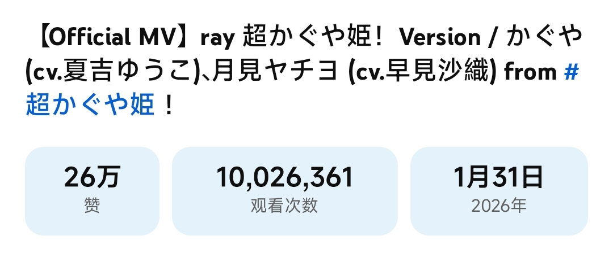

---
### 157楼 · 用户007🌀
Lv.9 · 2026-03-13 23:22 · 赞 7

今日预估票房 1.31 亿日元，靠票价超过了黄金神威首日。后者今天开了 277 馆约 45 万张坐席，辉夜仅有 9.4 万坐席。

> **雪之下雪乃** 2026-03-14 00:17:45：虽然开了100多馆，但坐席确实不太多，今天还是最多的一天的了后面只会更少
>
> **用户007🌀** 2026-03-14 00:20:37：排片本来就是夹缝中捡剩饭捡出来的，能捡到近10亿票房真的惊到我了，只能说感谢这段时间褒姒的大片吧\[滑稽\]
>
> **羊狼总动员0301** 2026-03-14 01:49:29：辉夜姬的博客取得率比黄金神威低，实际应该是14万坐席左右
>

---
### 158楼 · 羊狼总动员0301
Lv.15 · 2026-03-14 01:50 · 赞 1

但是周六的坐席和上座都会掉不少，可能不到周五一半

---
### 159楼 · 龍HCL
Lv.14 · 2026-03-14 07:04 · 赞 1

又变了emmm...

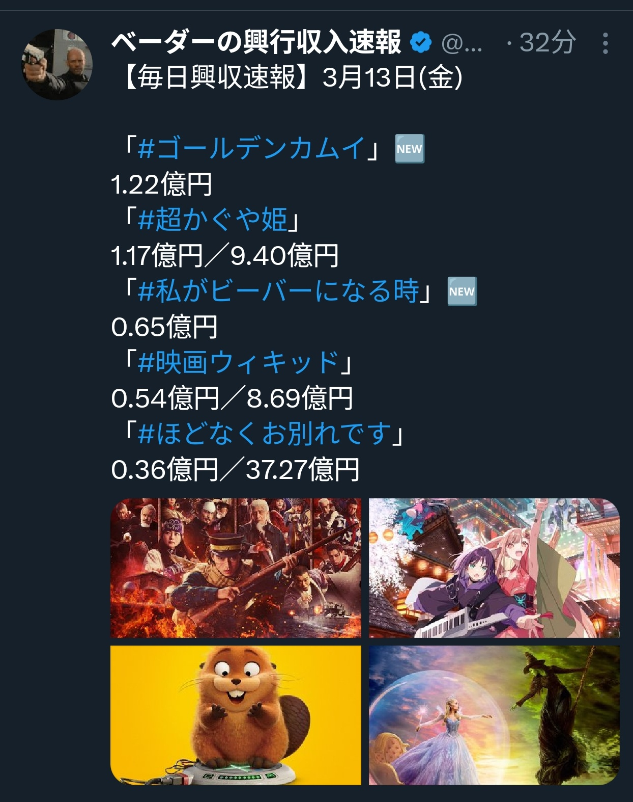

> **一如既往的路过** 2026-03-14 07:22:48：也就是说之前的1.31是推测值，实际缩水了11%吗
>
> **龍HCL** 2026-03-14 07:29:35：不知道啊！之前好像没看到变过……
>

---
### 160楼 · 用户007🌀
Lv.9 · 2026-03-14 08:06

只能说这个博主也不懂怎么算辉夜的系数，情侣票比例太迷了

---
### 161楼 · 某不科学的FF君
Lv.1 · 2026-03-14 09:09

感觉15万问题不大，20万的话要看官方后续怎么操作了

---
### 162楼 · Inclis
Lv.1 · 2026-03-14 10:21

这个发行收入博主用的网站统计辉夜姬坐席似乎没有那么准，还有情侣票，估计不太好算 
现在公开的剧场里有一部分要等到四月才开始上映，即便打算再发新特典大概也得等到四月中旬往后，摸到15亿的可能性应该是不低的，再往上就要看还有没有进一步的商法了

---
### 163楼 · 井Chisha
Lv.1 · 2026-03-14 10:44

没在设备最好的东宝连锁影院上映，感觉还是有点可惜

---
### 164楼 · 龍HCL
Lv.14 · 2026-03-14 11:42 · 赞 1

十亿会出通稿吧？明天能不能看到？

---
### 165楼 · 杜滋琪
Lv.11 · 2026-03-14 14:53 · 赞 1

现在只开了86馆，

---
### 166楼 · 龍HCL
Lv.14 · 2026-03-14 16:26 · 赞 5

---
### 167楼 · 羊狼总动员0301
Lv.15 · 2026-03-14 17:21 · 赞 10

\[太开心\]\[太开心\]\[太开心\]

> **龍HCL** 2026-03-14 17:36:20：羡慕嫉妒恨！顺便问一下人多吗？
>
> **羊狼总动员0301** 2026-03-14 17:42:04：7 8成上座率吧，前排有些空位
>
> **岛村卯月** 2026-03-15 17:54:15：羡慕，不知道之后能不能上香港
>

---
### 168楼 · 龍HCL
Lv.14 · 2026-03-14 22:58

所以说通稿啥时候？

> **用户007🌀** 2026-03-14 23:36:32：应该要等兴行通信社公布权威数据
>

---
### 169楼 · 羊狼总动员0301
Lv.15 · 2026-03-14 23:59

把这周末的2.5-3亿当做初动，4倍推移就10-12亿，算上之前的部分就差不多20亿了

> **用户007🌀** 2026-03-15 01:01:53：不好说，这片现在看来还是特典驱动型的，如果没有新的特典可能熄火的速度比想象的快。不过这波上映反倒是吸引了一批被拉去凑双人票的路人入坑，转头去入网飞会员了\[阴险\]
>
> **羊狼总动员0301** 2026-03-15 01:23:40：后面应该会有新特典的吧……
>

---
### 170楼 · 羊狼总动员0301
Lv.15 · 2026-03-15 11:12 · 赞 2

8723(+\*631)　\*23850(.313)　315.0%　66.4%　\*16475　超かぐや姫！

---
### 171楼 · 羊狼总动员0301
Lv.15 · 2026-03-15 11:13 · 赞 1

这周推移是周五＞＞周六＞＞周日 emmm

> **某不科学的FF君** 2026-03-15 11:43:15：辉夜就是偏粉丝向了，扩圈不咋样，要靠特典。难绷的是感觉她4月3号前不会发……？虽然我希望他要是能3月底发个第三弹就好了……星期五我看有很多男大群体？昨天我去渋谷humax看，那里男女55开，之前去新宿看男女比9比1
>
> **龍HCL** 2026-03-15 12:06:41：确实吧！看这两天的推特粉丝增量也一般般！还是希望看到奇迹啊\[泪\]
>

---
### 172楼 · Inclis
Lv.1 · 2026-03-15 12:44 · 赞 5

在宅向动画的基础上，流媒体发行进一步放大了缺点的感觉吧 
网飞的数据说明面向路人的拉新效果其实还不错，但在线上可以随便看的前提下，如果没有特别的意愿，影院去个一次拿拿特典其实就够了，想多看直接回家开电脑就行 
周五的上座率也是早场出奇的高，基本说明大部分人都是奔着特典来的，想刺激票房只能靠新特典了

---
### 173楼 · Ee
Lv.1 · 2026-03-15 14:29 · 赞 1

\[呵呵\]忘记在哪里看到说辉夜姬电影票价偏高了，感觉现在隔壁大环境不太好的样子，物价都上升，只能靠粉丝爆米了，要是经济上行的时代票房就更繁荣了。

---
### 174楼 · 羊狼总动员0301
Lv.15 · 2026-03-15 15:53 · 赞 2

声破天的收听数大概50万水平，马马虎虎吧\[阴险\]

---
### 175楼 · Inclis
Lv.1 · 2026-03-15 18:40 · 赞 5

日本打输WBC把取消网飞订阅推上了娱乐趋势，然而多半是推流算法抽风，点进趋势会冒出辉夜姬的推 
过于有节目效果了

> **一如既往的路过** 2026-03-15 19:28:48：有点搞
>

---
### 176楼 · 龍HCL
Lv.14 · 2026-03-15 23:05 · 赞 1

太难了！周五的一半都没有！

---
### 177楼 · 厉害笑吧
Lv.1 · 2026-03-16 10:43 · 赞 1

比较官方的数据大概什么时候会出来？这个双人票价真不太好算\[阴险\]

---
### 178楼 · 用户007🌀
Lv.9 · 2026-03-16 15:13 · 赞 1

香槟可能开早了，按通信社说法可能没过10e

> **厉害笑吧** 2026-03-16 15:33:01：磨一磨总能磨上10e的……吧\[阴险\]
>
> **一如既往的路过** 2026-03-16 16:10:21：看了看还真没提，那些搞预测的看来集体扑街了，我记得最保守的的应该也过10亿了
>
> **龍HCL** 2026-03-16 16:41:25：这也太惨了，16.8亿现在也遥不可及了QAQ
>
> **一如既往的路过** 2026-03-16 17:54:15：不过emmm，感觉还是先看看吧
>
> **回忆の梦** 2026-03-16 18:02:20：\[惊哭\]
>

---
### 179楼 · 羊狼总动员0301
Lv.15 · 2026-03-16 19:24 · 赞 7

扩馆效应

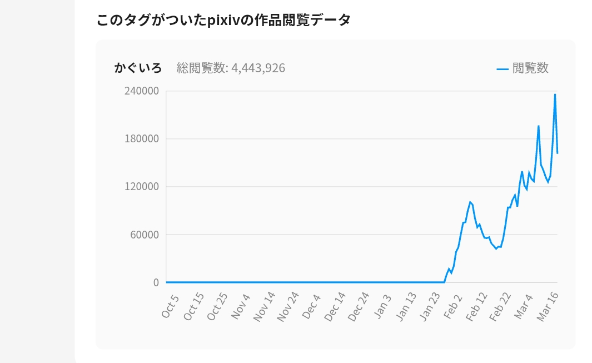

---
### 180楼 · 某不科学的FF君
Lv.1 · 2026-03-16 21:40

话说按照以往惯例今天官推应该发周末动员庆祝推文的，不会是興収差点到10亿，等着这几天一起发个贺文吧

> **龍HCL** 2026-03-16 21:42:45：总感觉应该到了十亿啊！唉，难受了\[泪\]
>

---
### 181楼 · 龍HCL
Lv.14 · 2026-03-16 23:23

还有参考意义吗？\[泪\]

> **一如既往的路过** 2026-03-17 00:12:14：几个测数据的都没受到影响，该发还是发。我感觉可以先让子弹飞一会，毕竟要是他们感觉不对的话，早就会向下修正系数了
>

---
### 182楼 · 瓦上片霜
Lv.7 · 2026-03-17 00:15 · 赞 2

上周末实际就是差一点十亿的话有必要纠结吗？推上那几个号都是自己估的票价，实际均价没人知道，等周二白天出来不就知道了，差一点的那再多一天不就达到了。

---
### 183楼 · 一如既往的路过
Lv.6 · 2026-03-17 00:19 · 赞 8

顺带一提，之前“Netflix解約”的趋势神秘算法还没修，辉夜的嘟嘟脸依旧首位

---
### 184楼 · Inclis
Lv.1 · 2026-03-17 07:22 · 赞 7

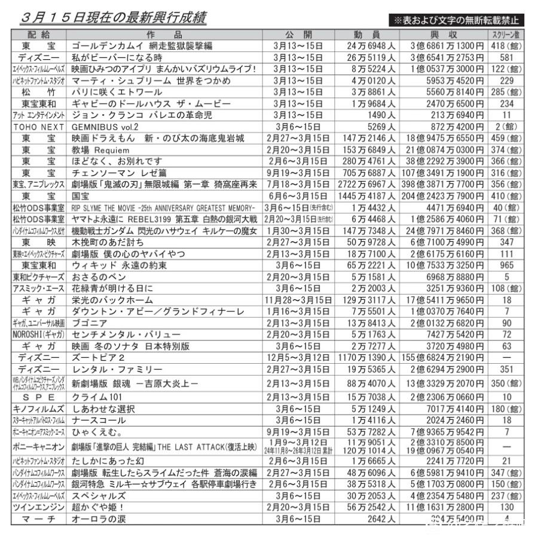

> **龍HCL** 2026-03-17 08:03:15：没有通稿emmm...
>
> **某不科学的FF君** 2026-03-17 08:06:37：草，那为什么通信社不说一下破10了。有没有10亿贺图啊！\[乖\]
>
> **茶话部🔥** 2026-03-17 19:42:21：你好，能求一下这个表格的来源吗
>
> **Inclis** 2026-03-17 20:43:08：oricon吧票房贴嫖的，源头是日本的付费杂志
>

---
### 185楼 · 龍HCL
Lv.14 · 2026-03-17 08:29

那个推测的博主，今天的给的周一数据都比周日的准确数据少0.12！他会根据准确数据调整吗？按理说他今天可以等准确数据出来再发吧！

---
### 186楼 · 用户007🌀
Lv.9 · 2026-03-17 08:38

\[阴险\]误会解除，无事发生

---
### 187楼 · 回忆の梦
Lv.7 · 2026-03-17 11:50 · 赞 1

\[阴险\]难道真要等16.8亿

---
### 188楼 · 仙翳
Lv.12 · 2026-03-17 12:08 · 赞 1

官方逗你玩\[滑稽\]

---
### 189楼 · 憶研
Lv.12 · 2026-03-17 17:02 · 赞 6

公布突破10e了

---
### 190楼 · 羊狼总动员0301
Lv.15 · 2026-03-17 17:28 · 赞 1

3月13日（金）～15日（日）の動員数144,281人、興行収入287,064,500円

---
### 191楼 · 羊狼总动员0301
Lv.15 · 2026-03-17 17:28

均价2000

> **小王者二韦** 2026-03-17 17:41:05：不便宜啊
>

---
### 192楼 · 龍HCL
Lv.14 · 2026-03-17 17:57 · 赞 1

官方发起的三连休活动如何啊？没有新特典吸引力大吗？

---
### 193楼 · 5A1yGxu
Lv.9 · 2026-03-17 21:26

东宝今年也差不多该涨涨票价了，3年没涨了。

---
### 194楼 · 龍HCL
Lv.14 · 2026-03-18 07:07 · 赞 1

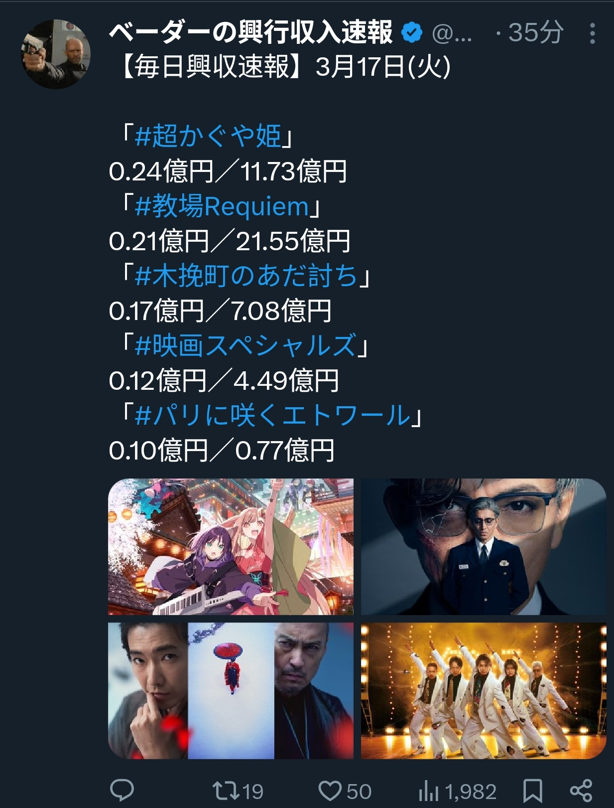

---
### 195楼 · 羊狼总动员0301
Lv.15 · 2026-03-18 10:46 · 赞 1

春休这周开始，虽然从受众面来看不知道有多大效果

---
### 196楼 · 羊狼总动员0301
Lv.15 · 2026-03-18 11:25 · 赞 4

かぐいろ这个月的小说投稿看来有机会超过单月历史第一的千泷

> **墨西哥墨汁▫** 2026-03-21 11:32:21：能加上ヤチいろ合并算吗\[阴险\]
>

---
### 197楼 · 龍HCL
Lv.14 · 2026-03-18 11:53 · 赞 1

看了看周五的坐席预定，感觉官方这个活动好像没啥特别大的效果？

---
### 198楼 · 龍HCL
Lv.14 · 2026-03-19 10:14 · 赞 3

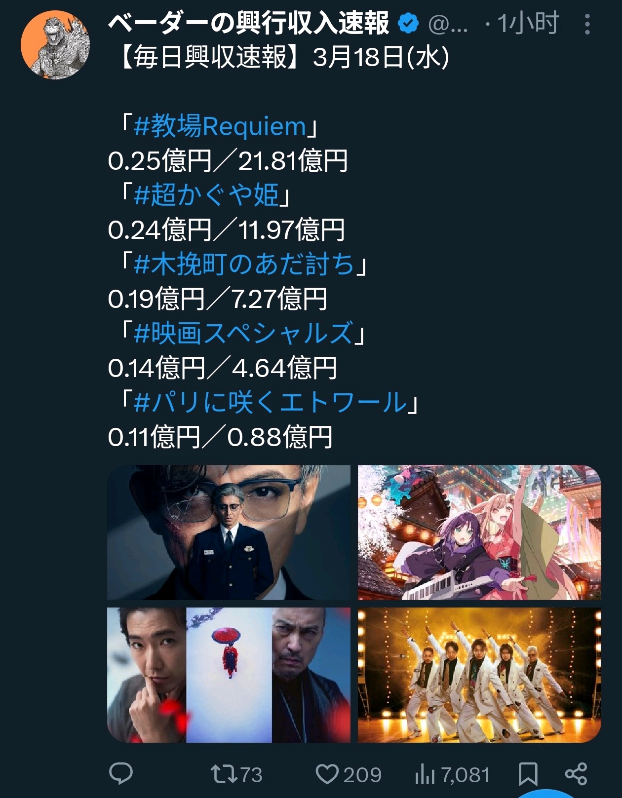

---
### 199楼 · Inclis
Lv.1 · 2026-03-19 13:08 · 赞 4

小说似乎又断货了，记得之前还是显示三月下旬派送，现在连加购都不行

---
### 200楼 · 莫谈戚焉
Lv.8 · 2026-03-19 16:17 · 赞 4

稳定的netflix排名

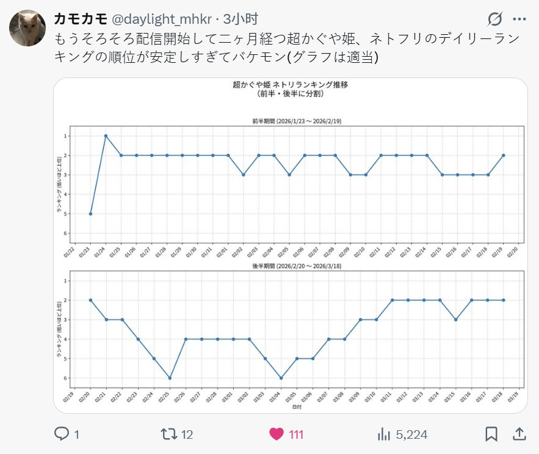

页码：[1–100 楼](thread.md) · **101–200 楼** · [201–300 楼](thread_3.md) · [301–400 楼](thread_4.md) · [401–500 楼](thread_5.md) · [501–600 楼](thread_6.md) · [601–700 楼](thread_7.md) · [701–800 楼](thread_8.md)

---

[⬆ 本页顶部](#top)　·　[⏬ 最新的楼层](thread_8.md#bottom)
