

# 【动画讨论&amp;追踪】超时空辉夜姬

- 贴吧: 名作之壁吧　楼主: inting1　发帖: 2026-02-21 19:38:46
- 原帖: https://tieba.baidu.com/p/10504053776　抓取时间: 2026-09-27 06:12:37　楼层数: 641　（时间均为北京时间）
- 其中 1 层已被删除或隐藏（保留的是之前存下的内容）

[⬇ 本页底部](#bottom)　·　[⏬ 最新的楼层](thread_8.md#bottom)

页码：[1–100 楼](thread.md) · [101–200 楼](thread_2.md) · **201–300 楼** · [301–400 楼](thread_4.md) · [401–500 楼](thread_5.md) · [501–600 楼](thread_6.md) · [601–700 楼](thread_7.md) · [701–800 楼](thread_8.md)

---
### 201楼 · 龍HCL
Lv.14 · 2026-03-20 06:45 · 赞 2

目标16.8亿，这个三连休会有多少将决定最终票房！

---
### 202楼 · 龍HCL
Lv.14 · 2026-03-20 15:03 · 赞 1

春休新片一多，连数据都没得看了\[泪\]

---
### 203楼 · 龍HCL
Lv.14 · 2026-03-21 06:43 · 赞 4

《超辉夜姬！》的「可发推上映」活动，从社交媒体营销的角度来看也极具看点。 
白天时段，今天首日上映的《拯救玛莉计划》（Project Hail Mary，瑞恩·高斯林主演的科幻大片）相关发帖量平均约300条，《超辉夜姬！》约100条；但随着《超辉夜姬！》的上映开始，其发帖量飙升至约1000条，峰值更是突破了6000条。 
直接抢走了三连休黄金时段的全部话题热度。

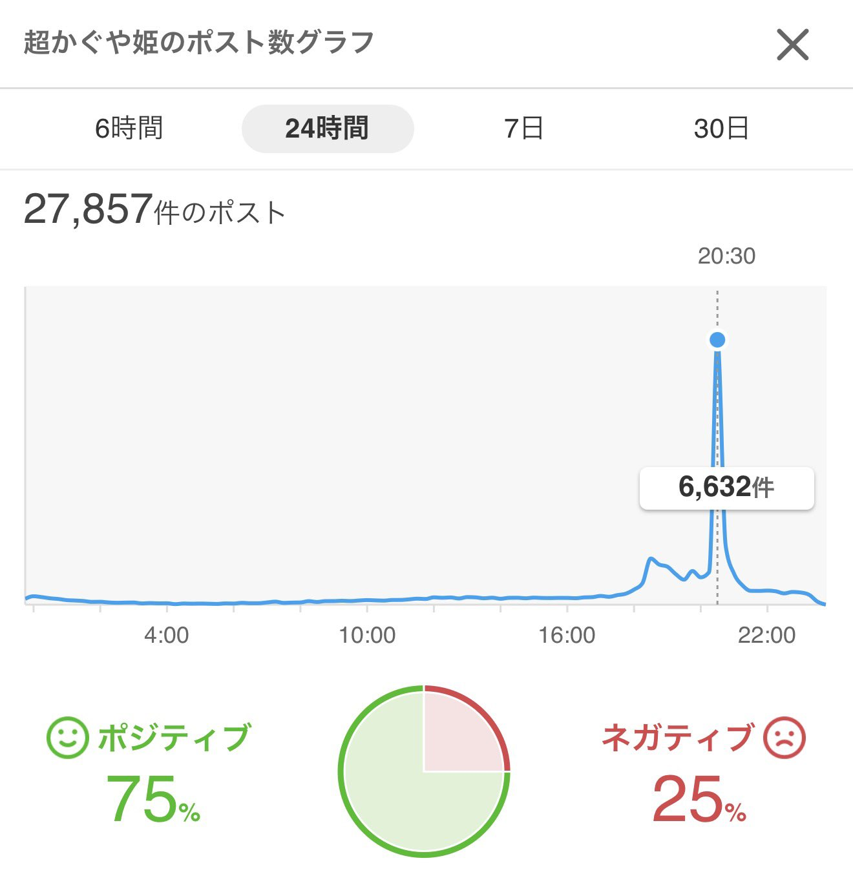

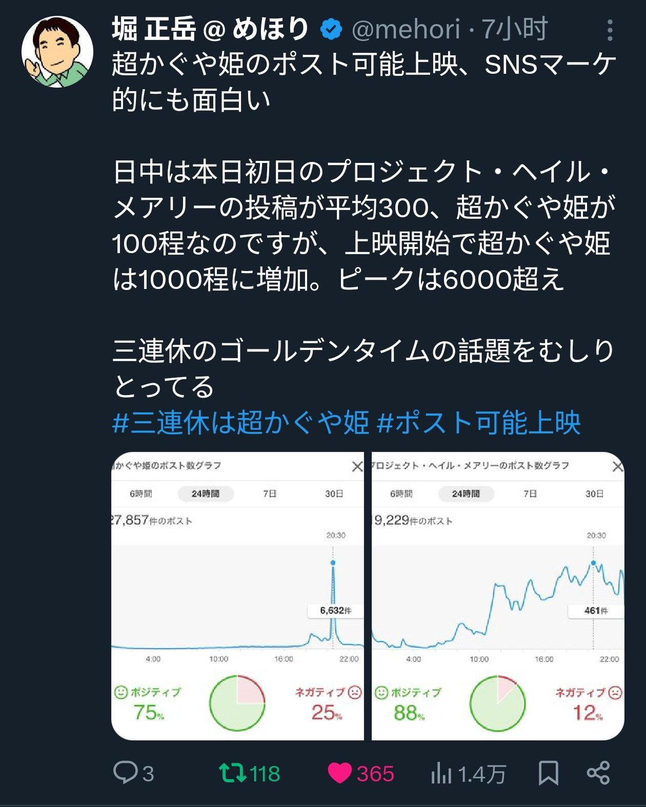

---
### 204楼 · 龍HCL
Lv.14 · 2026-03-21 06:49 · 赞 5

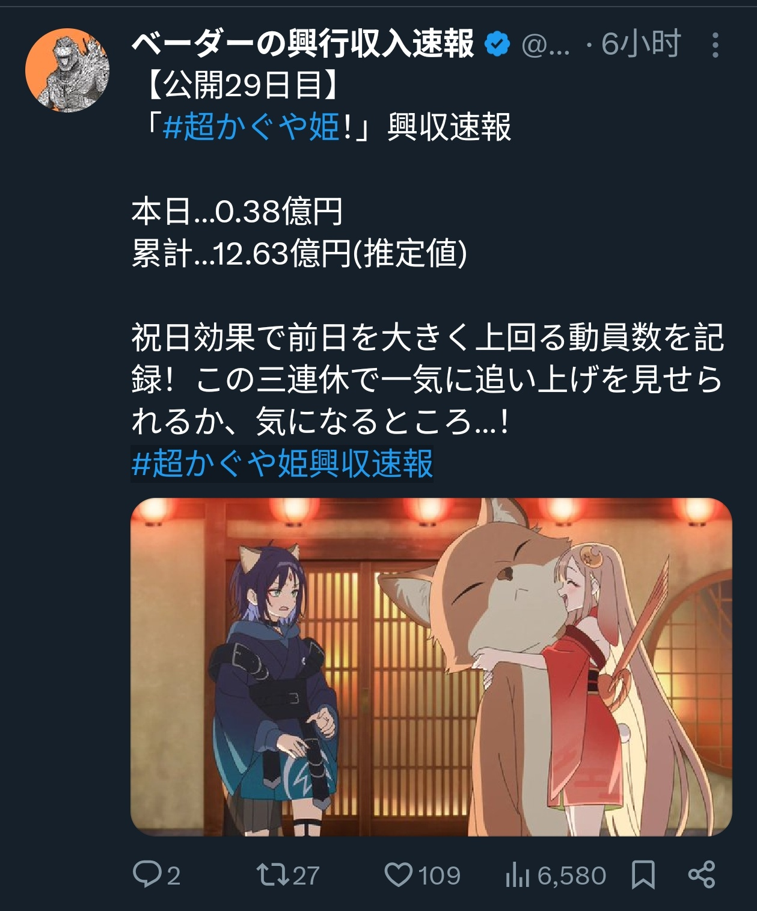

---
### 205楼 · 龍HCL
Lv.14 · 2026-03-21 12:38 · 赞 7

突然感觉四十万关注不是梦了！

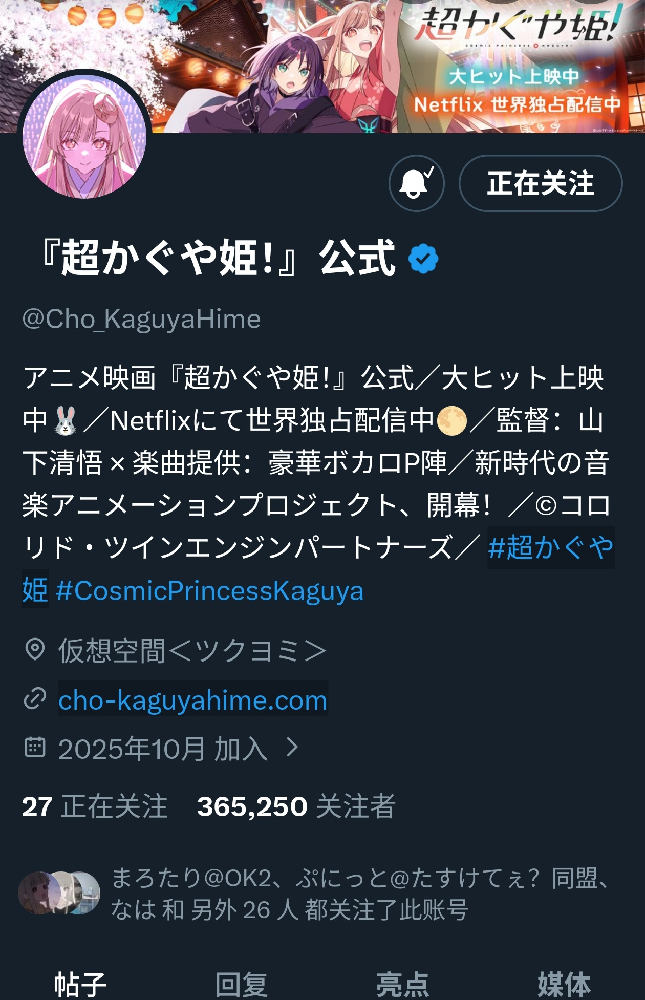

---
### 206楼 · 龍HCL
Lv.14 · 2026-03-21 22:44 · 赞 5

稍微研究了下日本影院，发现上映的影院档次都是偏低的啊！ 
东宝的影院一个都没有\[汗\] 
估计都被预约好了……

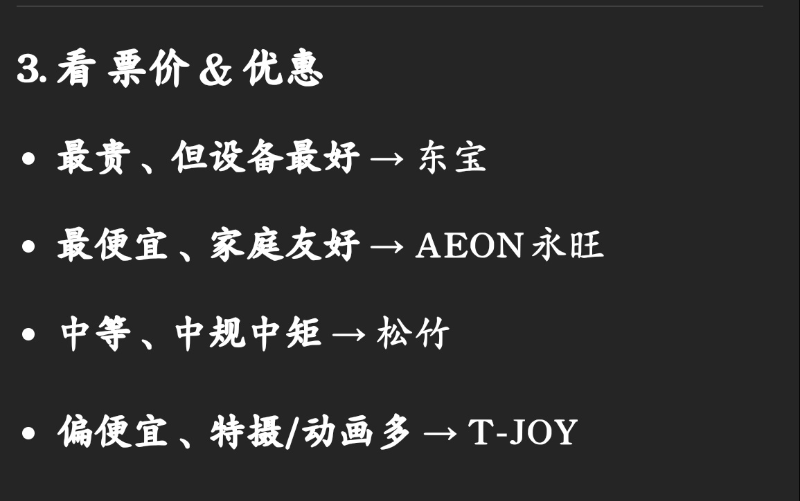

> **用户007🌀** 2026-03-21 23:59:09：东宝自己就是发行商，肯定优先安排自己发行的片子还有自己的引进片
>
> **一如既往的路过** 2026-03-22 07:48:17：x上也有人吐槽东宝影院不上的事
>

---
### 207楼 · 龍HCL
Lv.14 · 2026-03-22 05:50 · 赞 4

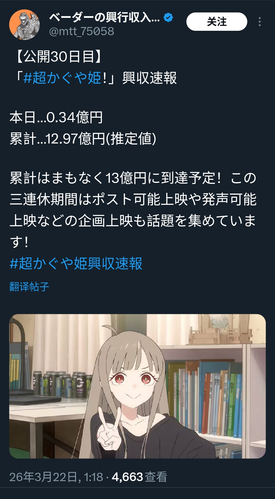

---
### 208楼 · 用户007🌀
Lv.9 · 2026-03-22 20:01 · 赞 5

三连休挺稳定的，一些前两天出现观影小高峰的片子今天回落后，排名又回到了前十

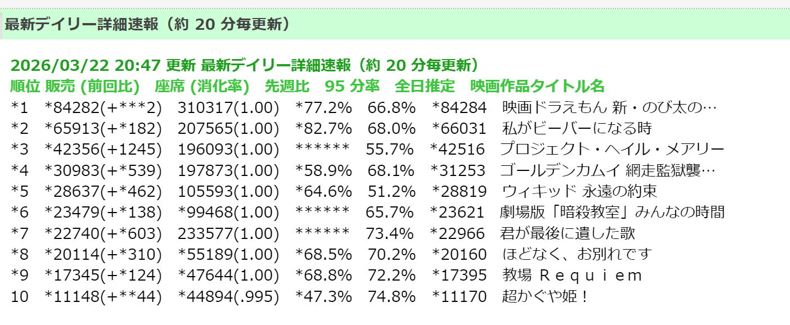

---
### 209楼 · 龍HCL
Lv.14 · 2026-03-23 07:20 · 赞 5

需要新特典！

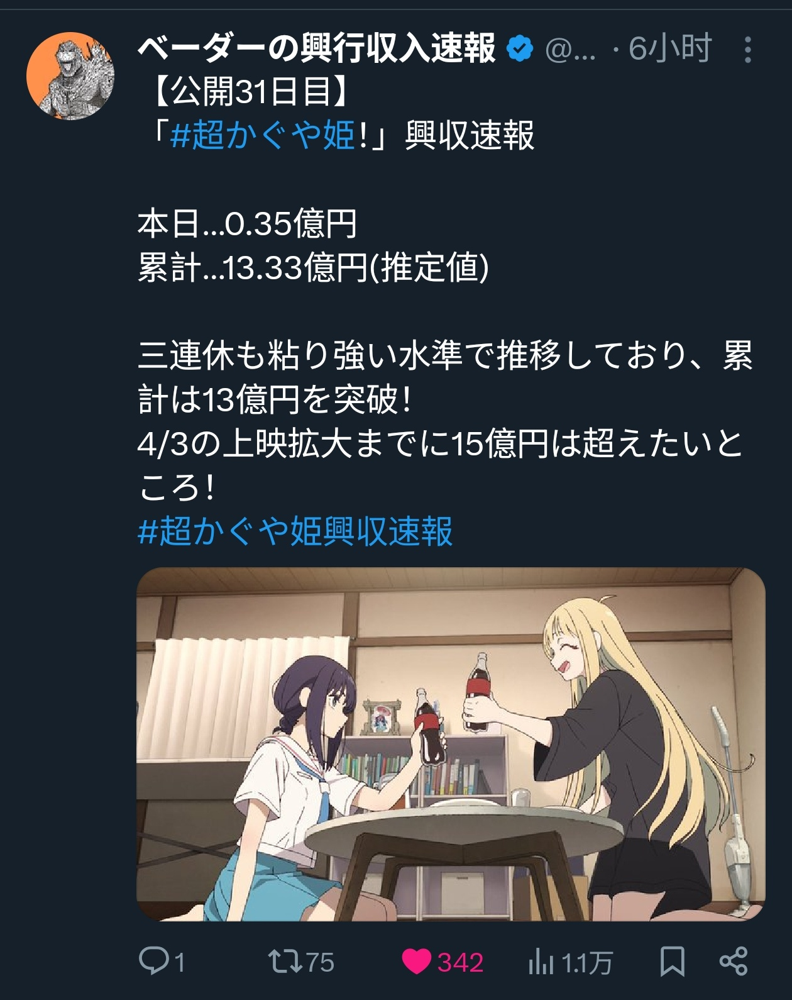

---
### 210楼 · 用户007🌀
Lv.9 · 2026-03-23 07:50 · 赞 1

现在加特典有点麻烦，那批 4.3 上的剧场还没开始发第二弹特典，除非直接宣布第二第三弹可以自选。按之前提前一周宣的话也会导致当周萎靡，柯南就要上映的当口可不兴再搞自砍坐席的事情了

> **龍HCL** 2026-03-23 10:44:09：感觉30w特典量太多了，好多人都好几份了！能不能把第一弹特典复刻下！现在在上映的影院从周五开始，没发完的的话可以一二弹自选！估计第三弹要到4月17日了吧emmm...
>

---
### 211楼 · 龍HCL
Lv.14 · 2026-03-23 11:03 · 赞 3

还能在第十位！！！

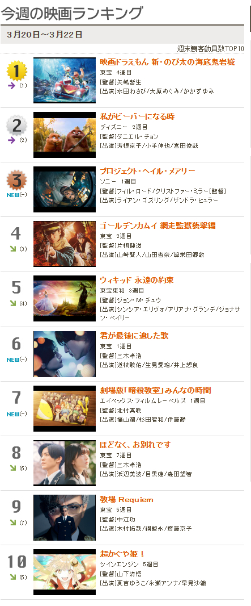

---
### 212楼 · 龍HCL
Lv.14 · 2026-03-24 06:21 · 赞 2

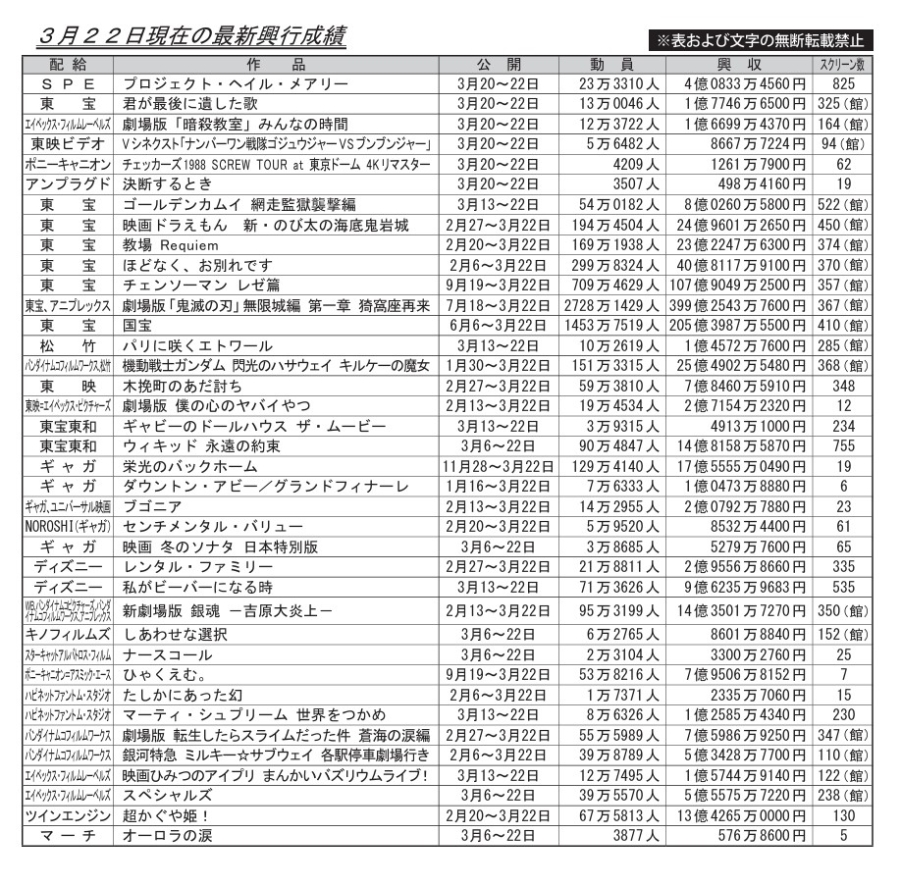

---
### 213楼 · 龍HCL
Lv.14 · 2026-03-24 06:47

估计正确数13.63吧！

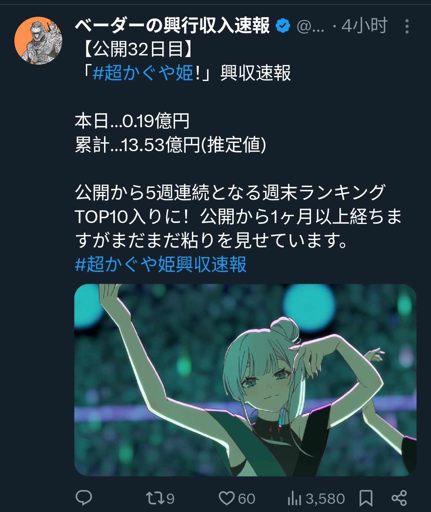

---
### 214楼 · 龍HCL
Lv.14 · 2026-03-24 08:24 · 赞 1

算了下这一周的票价！

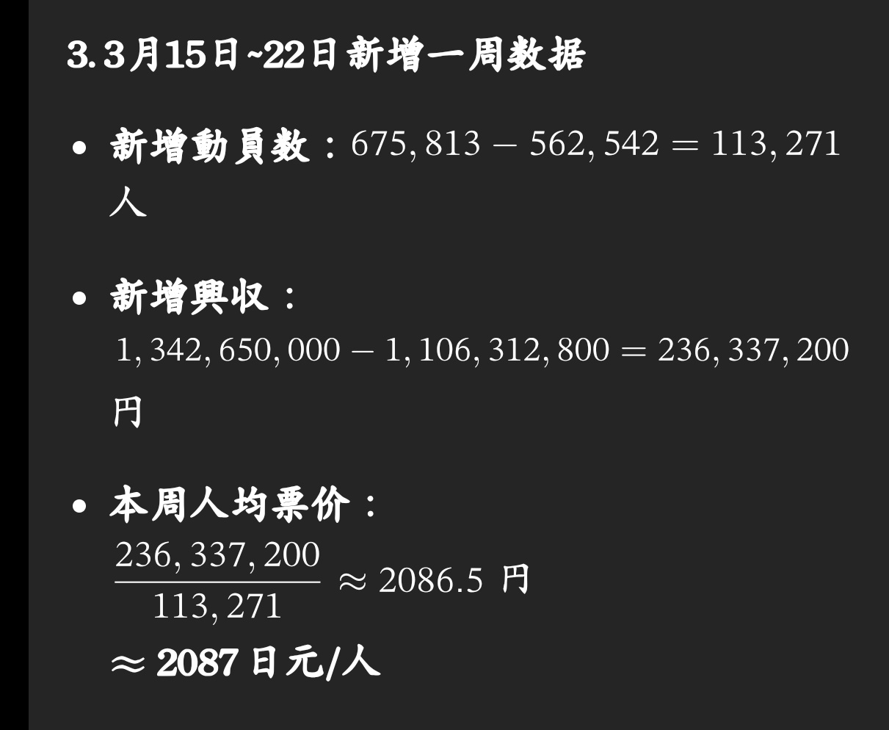

---
### 215楼 · 用户007🌀
Lv.9 · 2026-03-24 08:55 · 赞 4

本周动员数=675813-562542=11.3万人次 
第二弹特典发放至今动员数=11.3+14.4=25.7万人次 
特典发放进度=25.7/30=85.6% 
除了4.3才上映的，其他影院的第二弹特典这周就能派完，刚好生命周期结束。 
双引擎的估算挺精准的，资源利用最大化了。 
但随着上周开始大热新片上映，很快柯南也要上映，排片会逐渐降低，部分影院会迭代下映，16.8亿的目标是很难实现了。

> **龍HCL** 2026-03-24 10:03:47：是不是太悲观？感觉得至少上映到四月底吧？最后再来一波特典应该还是有希望的吧？
>
> **用户007🌀** 2026-03-24 10:42:45：这批新增的永旺院线已经明说放到这个月底就差不多了，后续有新片上映。辉夜在绝对主场立川Cinema City连续数周的第一位上周也保不住了。3.2亿不是那么好苟的，基本等于一部普通保本动画电影全周期的票房了（参考谷口的巴黎星光，初上映两个周末下来才1.4亿）。发第三波特典可能有一搏的机会，但目前看来官方兴致一般，官推宣发上也淡下来了，进入固粉周期。
>
> **龍HCL** 2026-03-24 11:00:40：还以为四月三日要火力全开了，原来反而是末期吗\[泪\]
>
> **DFB\_Trumpet** 2026-03-24 18:34:34：特典是13号开始的吧
>
> **用户007🌀** 2026-03-24 20:56:37：是的，13-15日动员数是144281人次，16-22日一周的动员数可以用当周累计数减去上周累计数，675813-562542=113271人次，加起来就是25.7万人次，默认全部都发了特典，那就是发了25.7万张。
>

---
### 216楼 · 龍HCL
Lv.14 · 2026-03-24 17:33 · 赞 10

16\.8稳了！

> **用户007🌀** 2026-03-24 17:39:21：彻底疯狂\[吐舌\]直接把第二弹停了统一发第三弹是没想到的
>
> **某不科学的FF君** 2026-03-24 18:00:27：神了，后面要周替特典了\[吐舌\]这下每周都要去一次电影院了\[哈哈\]
>

---
### 217楼 · 仙翳
Lv.12 · 2026-03-24 18:21

商法玩的6啊，不过新图跟不上了么

---
### 218楼 · Inclis
Lv.1 · 2026-03-24 18:34 · 赞 2

看样子是要上周替特典，效果应该不至于太差，但有点怀疑后面上映影院的数量是不是会减少 
而且第二弹特典停发，估计有些在地方的观众要不乐意

> **Inclis** 2026-03-24 18:40:08：不过这特典到2号就终止，3号后才有排片的影院要怎么发，怕是要出运营事故
>
> **DFB\_Trumpet** 2026-03-24 19:47:50：早都说了照样发啊
>

---
### 219楼 · 一如既往的路过
Lv.6 · 2026-03-25 20:56 · 赞 2

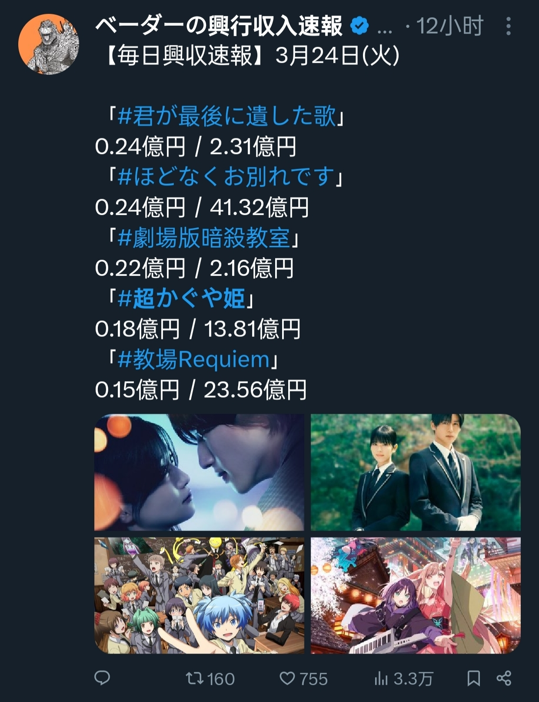

---
### 220楼 · 龍HCL
Lv.14 · 2026-03-25 21:21 · 赞 1

官方终于不谜语人了！

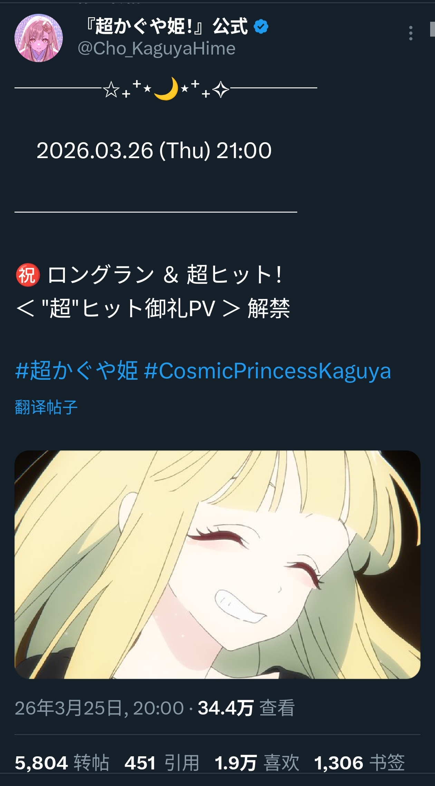

---
### 221楼 · 龍HCL
Lv.14 · 2026-03-26 06:23 · 赞 2

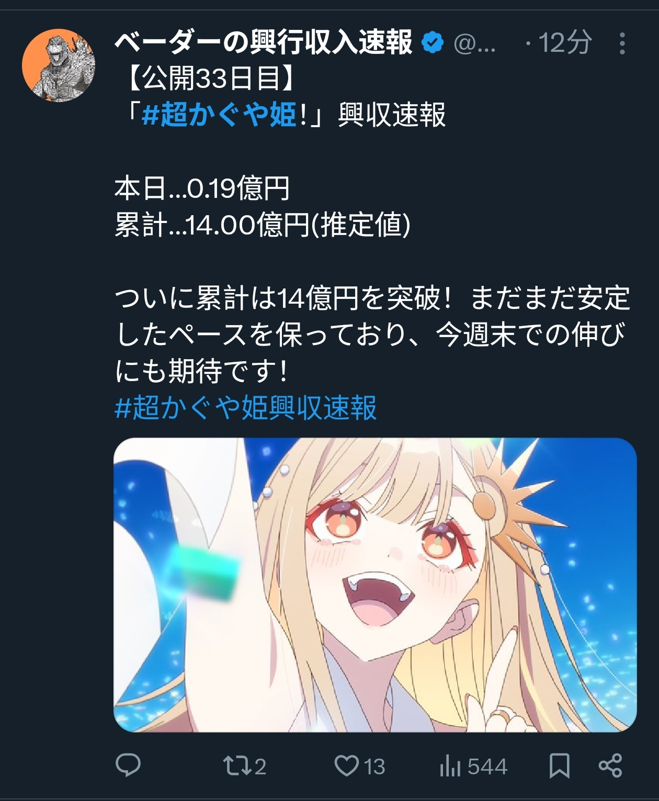

---
### 222楼 · 龍HCL
Lv.14 · 2026-03-27 06:37 · 赞 2

看官方的动作，正如我之前的预测要在四月火力全开了！能火到啥程度，就看这一个月了！不过感觉对路人的吸引力可能真不行，一方面票价太高，想试看的不如去网飞划算，另一方面题材上可能真有上限，指望真百合火出宅圈可能真的是梦想！

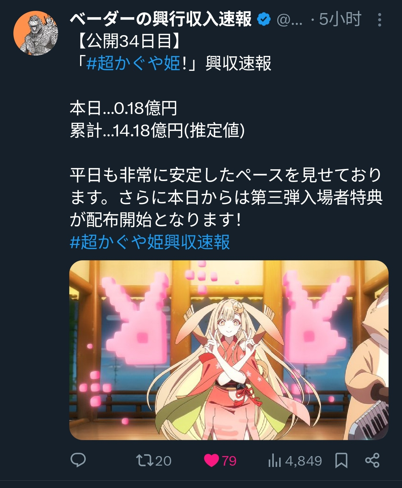

> **北柠莫寒** 2026-03-27 08:58:18：票价确实高啊，一个人去看的话2200日元，我看其它电影也就1500，网飞那更是几百
>
> **星祈月** 2026-03-27 08:58:26：百合这个标签真的这么重要吗，我一个不看百合的人都爱看这个
>

---
### 223楼 · 用户007🌀
Lv.9 · 2026-03-27 13:00 · 赞 4

新特典的带动效应还是明显的，同时段比昨天+2000，但受限于坐席数逐渐走低，还是低于三连休的上周五（第二弹特典发放次周），这三天如果能到1亿多一点，16.8亿就比较简单了。

> **龍HCL** 2026-03-27 13:08:36：这次可能周六比周五强吧！好多人都还在上班的吧！
>
> **用户007🌀** 2026-03-27 15:00:10：开始发第二弹的那个周五是最猛的
>

---
### 224楼 · 龍HCL
Lv.14 · 2026-03-27 18:11

能放映到六月？

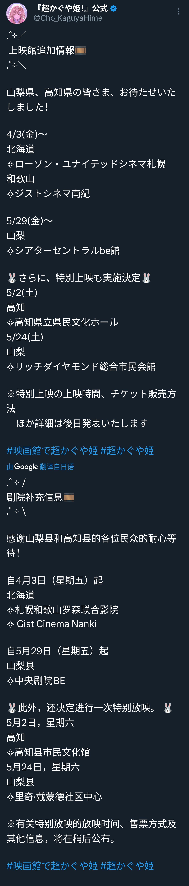

> **用户007🌀** 2026-03-27 19:07:23：有可能想苟到20亿
>
> **某不科学的FF君** 2026-03-27 19:54:12：正好第五弹结束就进入黄金周，我估计黄金周官方会想冲一波
>
> **流光\_p** 2026-03-27 22:17:30：我端午去日本，希望立川那个电影院能放映到6月
>

---
### 225楼 · 用户007🌀
Lv.9 · 2026-03-27 20:39 · 赞 1

票房追踪网站的数据，比上周五（三连休）低1500左右，比第二弹特典发放当周五（3.13）低36000左右。

> **用户007🌀** 2026-03-27 20:48:14：坐席数也比3.13砍半还多一点，在特典发放常态化的当下很难复刻当时压抑一周集中爆发的盛况了，不过辉夜现在的平日成绩比无特典那段时间好多了，甚至每天推上都能看见初见的观众，基本都是先去电影院看完后开通网飞会员二刷三刷，这对票房也有一定影响，后续如果真搞周替特典可能需要更有吸引力的东西来吸引这部分人再掏钱进电影院看一部已经上线2个多月、上映1个多月的电影。
>
> **龍HCL** 2026-03-28 00:02:18：慢慢苟吧！新片太多了，严重挤压坐席数……
>

---
### 226楼 · AdamXL07
Lv.10 · 2026-03-27 22:04 · 赞 2

这次辉夜姬的成功不知会不会让未来业界出现更多小型电影企划尝试流媒体先行限定上映，攒足口碑再去院线大规模发行博一把，辉夜姬还是没做太绝…其实网飞线上流媒体发行早该暂时下线一下了\[滑稽\]

> **酸涩的橙子** 2026-03-27 22:19:31：这有什么尝试不尝试，你一部动画都能搬总集篇上院线，何况原创电影，有能力的话还可以多要排片。
>
> **AdamXL07** 2026-03-27 22:22:49：不过这种模式有个问题就是海外院线上映会被流媒体影响很多，辉夜姬按理来说已经很爆火了港台韩却迟迟没有上映计划，感觉完全是引进方不敢去赌一把\[喷\]
>
> **AdamXL07** 2026-03-28 14:14:58：它现在这种模式太怪了…以后应该改下\[阴险\]
>
> **用户007🌀** 2026-03-28 17:57:53：辉夜也是合作协议商定的三部作品的最后一部了，如果不续签协议的话，双引擎可以考虑上别的限制少一些的平台，当然估计大概率还是会继续合作，好不容易出金了岂有不继续氪的道理。
>
> **AdamXL07** 2026-03-30 01:55:06：希望未来有类似企划可以是线上 线下不要同时上了，对票房肯定有大影响的
>

---
### 227楼 · 龍HCL
Lv.14 · 2026-03-28 05:51

希望今天能多点！

---
### 228楼 · 用户007🌀
Lv.9 · 2026-03-28 12:51 · 赞 4

三连休结束后首周末，有竞争力的新片比较少（只有一部鬼新娘），票房大盘总体疲软，上周六被新片空降挤出前十的辉夜又获得了呼吸权，总体和上周六基本持平。如果周替特典能够落实，票房走势会拖出一个比较漂亮的长尾，最后的落点会远一些。

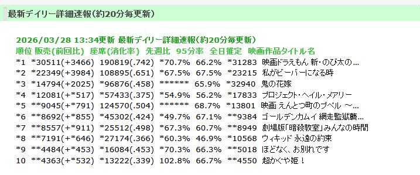

> **井Chisha** 2026-03-28 13:03:50：今天鬼灭发最终特典的样子?下午可能跌出前十，不过已经很不错了。
>
> **用户007🌀** 2026-03-28 13:14:41：是的，鬼灭冲400亿的关键期了，不过辉夜的走势一向比较独立，排名就是露个脸看看实时，意义不算太大
>
> **龍HCL** 2026-03-28 15:57:26：只希望这三天能有个1亿票房就满足了！虽然卖座的不多，但是席位也算是被挤了！不过这个上座率的话，也许更多的座位也没有很好的成绩？看看4月3号再次扩馆后能不能有个提升吧！不知道三号的特典怎么安排，要是再发新的，四月三日的馆就有三种特典了？难道说是三种任选？
>
> **用户007🌀** 2026-03-28 16:12:24：今天的走势挺不错，比昨天和上周六都要好，大家对特典哄抢心态缓下来后，没有再出现像3.13那周末动员一天比一天低的情况了，更有利于院线调整票房走势模型
>
> **用户007🌀** 2026-03-28 18:41:45：结果是一直领先到了现在\[阴险\]辉夜太猛了
>

---
### 229楼 · 龍HCL
Lv.14 · 2026-03-28 16:00

昨天本来还在第七最后又跑到第十，看看今天能排多少吧！

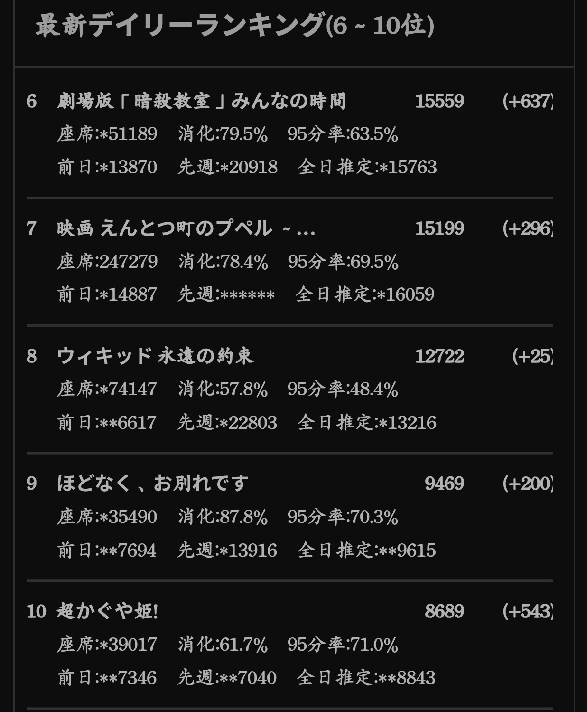

---
### 231楼 · 某不科学的FF君
Lv.1 · 2026-03-28 18:48

这周能15亿吧，就是明天会走低

---
### 233楼 · 龍HCL
Lv.14 · 2026-03-28 23:25 · 赞 2

明天破15！下周日到16.8有希望吗？

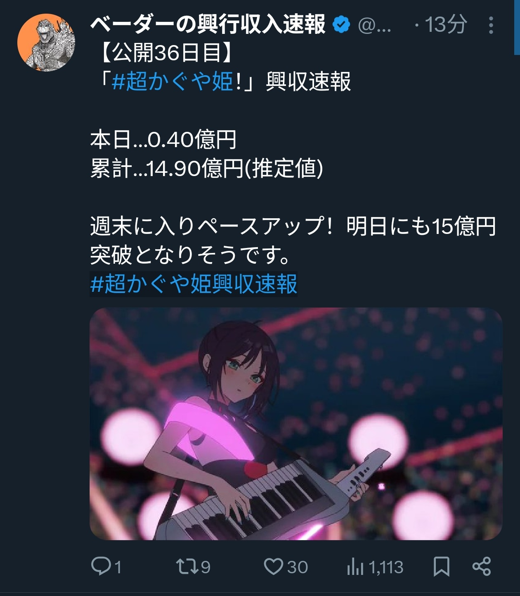

---
### 235楼 · 清风自蓝天起
Lv.11 · 2026-03-29 16:40

16\.8冲冲冲\[泪\]

---
### 236楼 · 龍HCL
Lv.14 · 2026-03-29 17:44

四月三日那一周后柯南就该上映了！希望坐席不要砍的太多\[泪\]

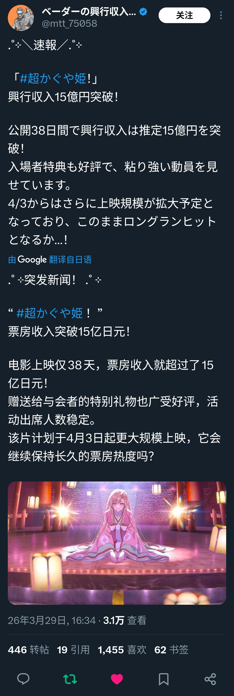

---
### 237楼 · 某不科学的FF君
Lv.1 · 2026-03-29 18:19

这周末两天都比周五高，挺稳定

---
### 238楼 · 用户007🌀
Lv.9 · 2026-03-29 18:35 · 赞 3

又摸到前十了…真顽强啊

---
### 239楼 · 龍HCL
Lv.14 · 2026-03-29 18:40 · 赞 1

我都不准备看到了，没想到这么给力？不过消化率100了，感觉最后还是得掉！

---
### 240楼 · 龍HCL
Lv.14 · 2026-03-30 06:53

今天坐席数比周末多？还是取得比率问题？

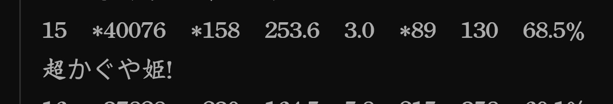

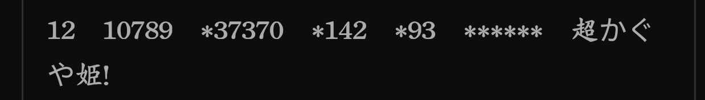

---
### 241楼 · 龍HCL
Lv.14 · 2026-03-30 09:29

感觉这周末16.8应该问题不大吧！周五前磨到15.8，4🈷️3日还有新影院！磨个1亿应该没问题吧？大概！

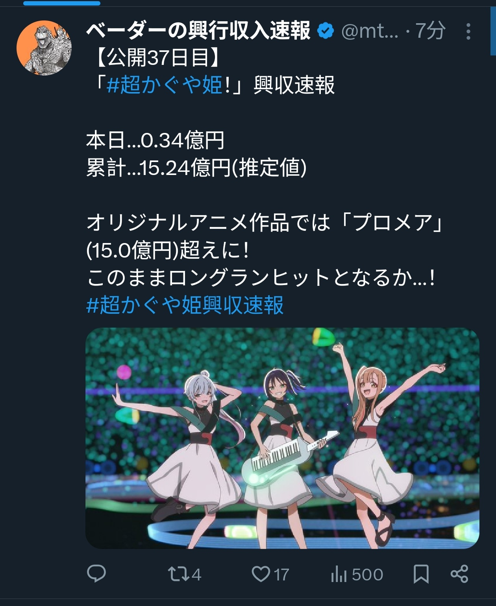

---
### 242楼 · 龍HCL
Lv.14 · 2026-03-30 12:38 · 赞 1

不容易啊！

---
### 243楼 · 用户007🌀
Lv.9 · 2026-03-30 13:08 · 赞 3

上周应该是最后一次前十了，今天跌幅比较大。上周增长大概1.8亿，离16.8亿还差1.6亿，按现在的走势大概下下周能达到

> **龍HCL** 2026-03-30 14:01:26：希望扩馆能救一下！
>
> **用户007🌀** 2026-03-30 18:12:49：下午救回来了，19时比上周同期略好，势能还是OK的
>
> **龍HCL** 2026-03-30 18:26:37：嗯，我刚也去看了，感觉可能进入平稳期了！不过感觉受众还是扩大不了啊，推特粉丝数也蜗牛般爬了！年轻人可能看的不太多啊，都是二三十岁的在看吧！
>
> **莫谈戚焉** 2026-03-30 22:00:24：二三十岁不年轻了\[what\]
>
> **龍HCL** 2026-03-30 22:34:36：都被孩子叫大叔了2333
>

---
### 244楼 · 龍HCL
Lv.14 · 2026-03-30 13:23 · 赞 3

圣地还是稳的！

---
### 247楼 · 龍HCL
Lv.14 · 2026-03-30 23:08 · 赞 2

搞错了算的不是这一周！算了水一下！

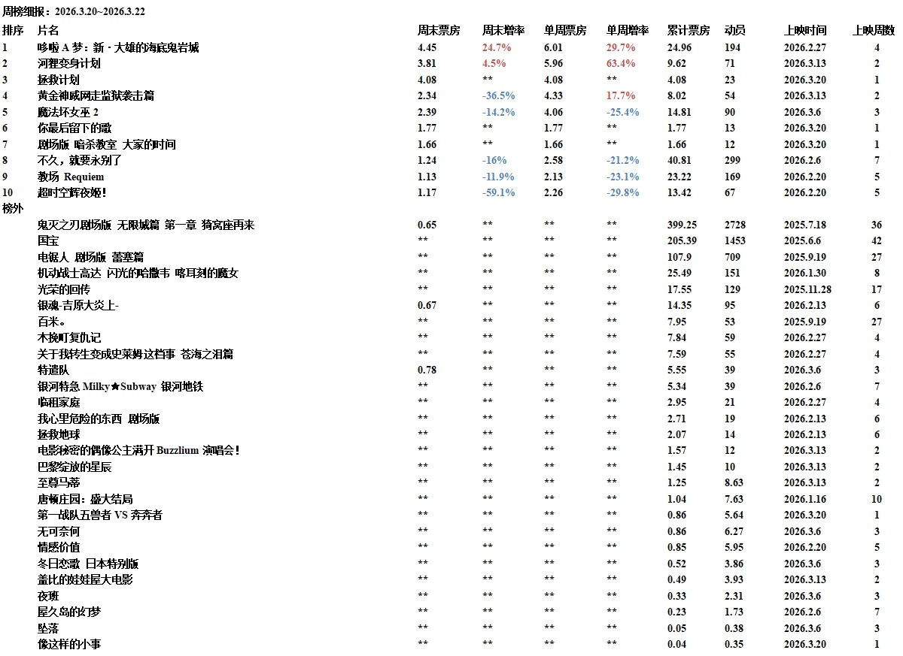

---
### 248楼 · 龍HCL
Lv.14 · 2026-03-31 08:02 · 赞 1

比统计还少了点！

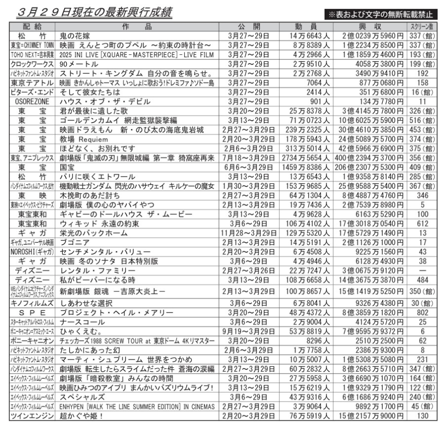

---
### 249楼 · 龍HCL
Lv.14 · 2026-03-31 08:19 · 赞 2

单周票房又跌幅了20%！ 
希望今天新特典能逆转下颓势\[泪\]

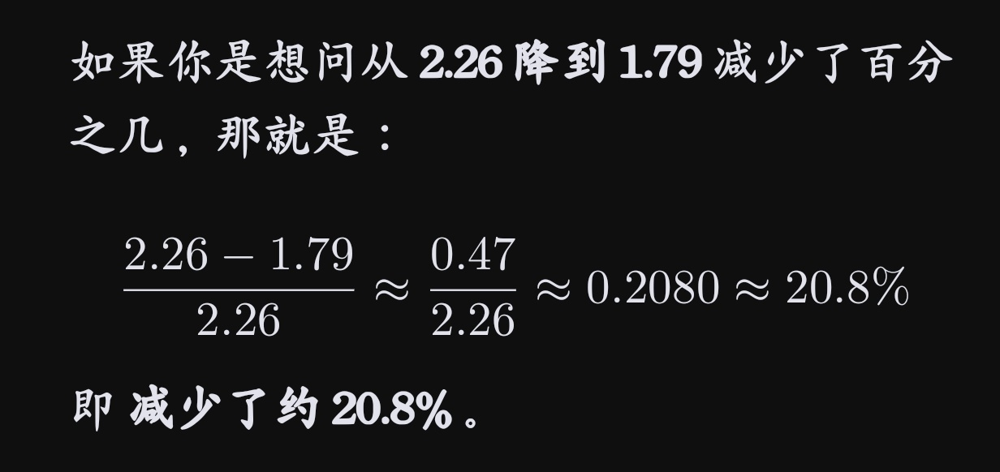

---
### 250楼 · 用户007🌀
Lv.9 · 2026-03-31 08:54 · 赞 1

符合预期，下下周到16.8e。

> **龍HCL** 2026-03-31 09:06:54：这周少跌点还能勉强到！\[泪\]
>

---
### 251楼 · 龍HCL
Lv.14 · 2026-03-31 09:08

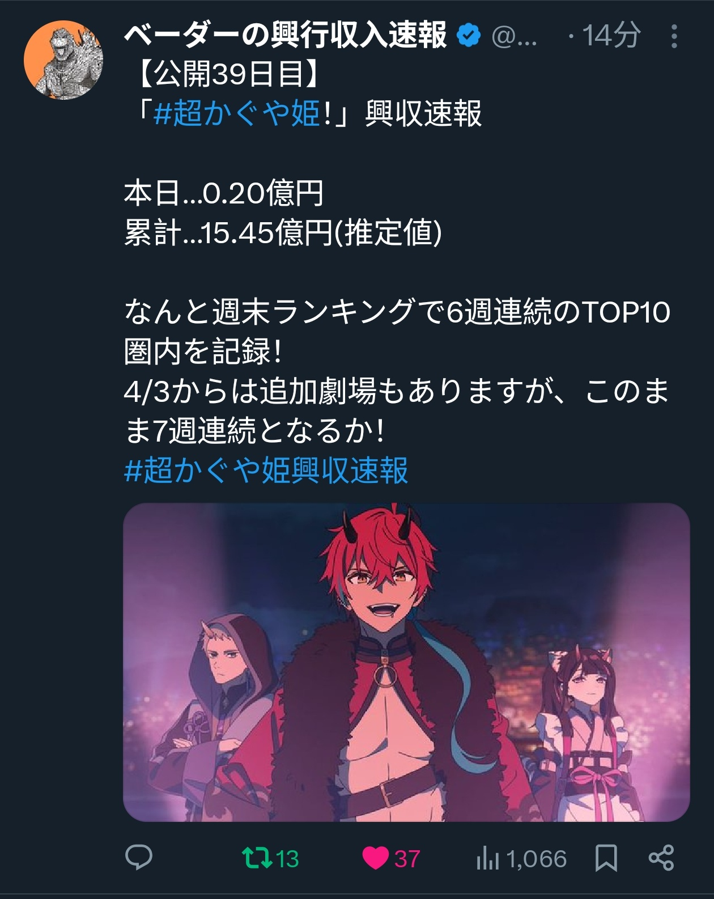

---
### 254楼 · 龍HCL
Lv.14 · 2026-03-31 17:07 · 赞 4

---
### 256楼 · Inclis
Lv.1 · 2026-03-31 17:28

唱见曲绘还剩三张，估计是下周送，但后面总得出点新图吧，逮着旧图反复用多少有点缺乏诚意了 
还有这周开始加的mc语音，不知道会不会在次周之后公开

---
### 257楼 · 墨西哥墨汁▫
Lv.8 · 2026-03-31 17:36 · 赞 3

大概会讲点小相声吧\[阴险\]

> **用户007🌀** 2026-03-31 18:05:14：后续的还没出吧，只出到4.3的
>
> **某不科学的FF君** 2026-03-31 18:10:25：把网址后缀改了就全部看到了
>
> **龍HCL** 2026-03-31 18:19:12：这是什么草台班子\[汗\]
>
> **用户007🌀** 2026-03-31 20:42:33：\[喷\]还真是，顶级草台
>

---
### 258楼 · 某不科学的FF君
Lv.1 · 2026-03-31 23:06

4月3上映的馆，特典是2.3.4弹特典一起发\[突然兴奋\]

> **龍HCL** 2026-03-31 23:09:25：我也看到了！就是不知道是能一次性拿几个？
>
> **用户007🌀** 2026-03-31 23:48:40：按永旺富士宫的措辞，应该是一次性全发\[阴险\]
>

---
### 259楼 · 用户007🌀
Lv.9 · 2026-03-31 23:55 · 赞 3

图转群，永旺富士宫是4.3后新追加的电影院，官方的用词是一次性发放（参考图二）。

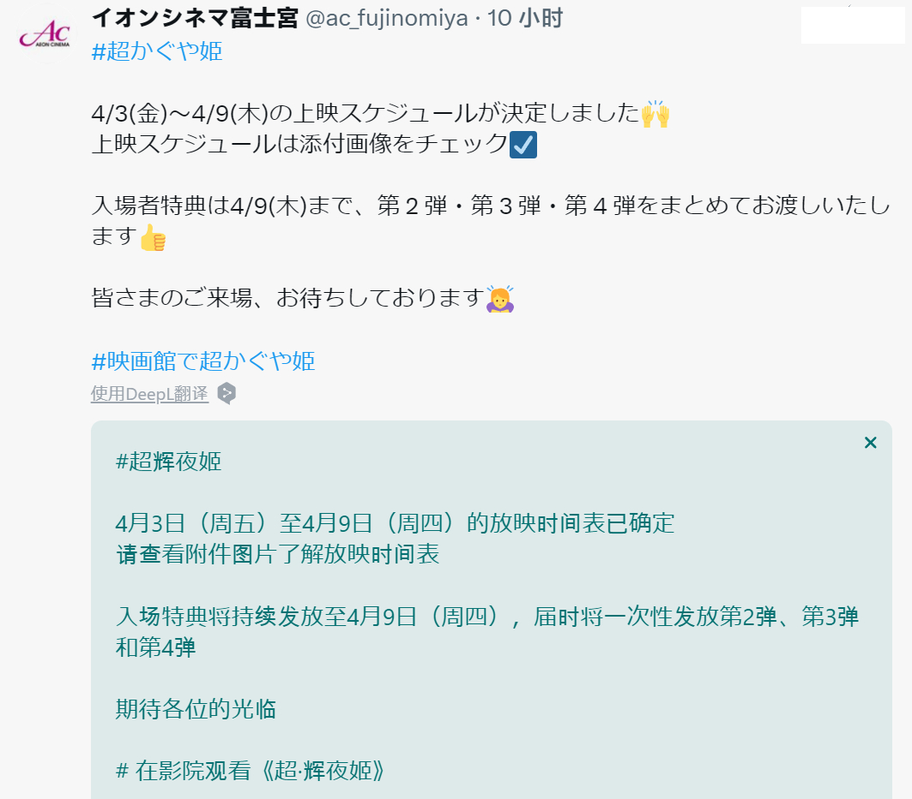

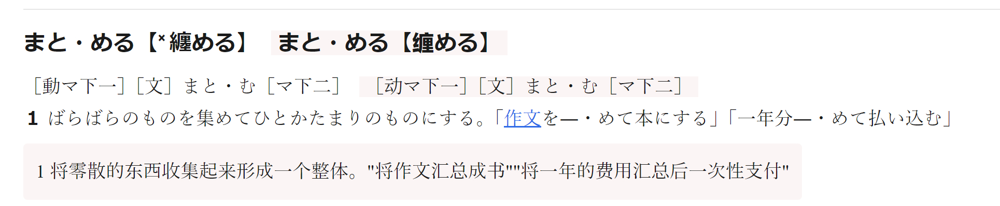

---
### 260楼 · 龍HCL
Lv.14 · 2026-04-01 00:32

话说买双人票，去一个人能直接拿两份特典吗？

---
### 262楼 · 回忆の梦
Lv.7 · 2026-04-01 10:54 · 赞 2

月人不过愚人节啊

---
### 263楼 · 龍HCL
Lv.14 · 2026-04-01 16:39 · 赞 5

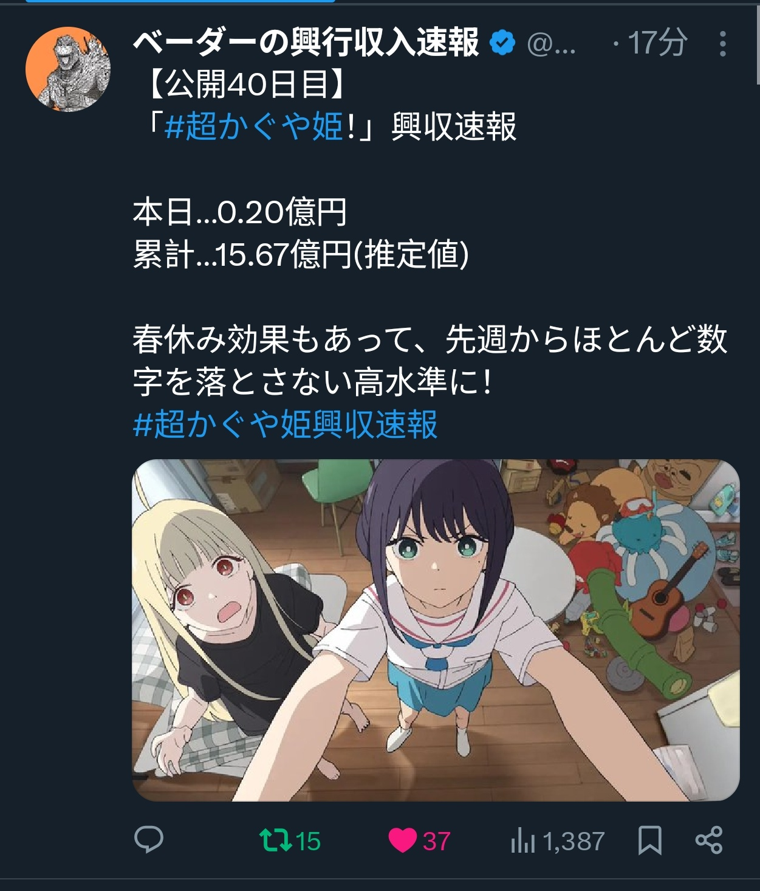

---
### 264楼 · 用户007🌀
Lv.9 · 2026-04-01 19:47 · 赞 6

众筹破1500%了，最近涨幅尤其大，昨晚11点还是1480%，现在24小时不到涨了快30%了，照这个速度下去1680%很快就能达成（最低限度是每天+8%就能在死线前达成）

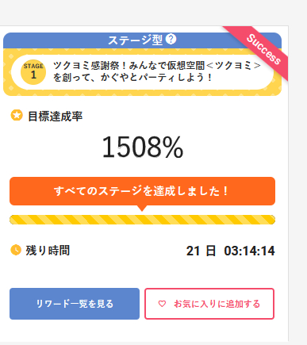

> **用户007🌀** 2026-04-01 19:49:36：另外我在那段涨幅很慢的时间留意到一个买了168000套餐的老哥购买前后的百分比对比，猜测100%大概在1000w左右
>
> **一如既往的路过** 2026-04-01 20:59:34：果然还是搞不懂为什么要隐藏金额
>

---
### 265楼 · 用户007🌀
Lv.9 · 2026-04-01 20:44 · 赞 2

离1680%还差168%了\[阴险\]

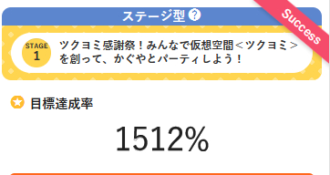

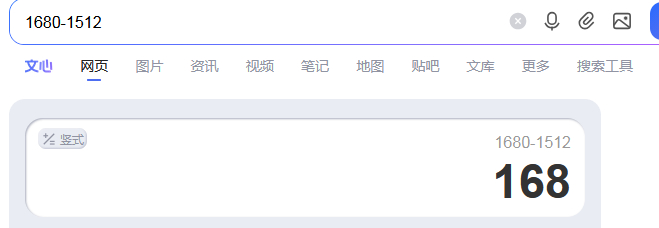

> **龍HCL** 2026-04-01 20:48:35：会赢的！！！
>
> **用户007🌀** 2026-04-01 22:48:04：今天官方周边号发了庆祝1500%的消息，应该是有一群氪佬在冲1680%，现在又增长了10%，快的话估计这周就达成了。
>
> **龍HCL** 2026-04-01 22:54:30：那个周边号是官方的？
>
> **用户007🌀** 2026-04-01 23:25:57：看错了，不好意思，那个是粉丝号\[狂汗\]
>

---
### 266楼 · Inclis
Lv.1 · 2026-04-01 23:54 · 赞 10

由Bushiroad分析部门Anime Date Insight Lab发布的26年冬季动画数据分析报告，辉夜姬不仅在一般知名度（谷歌搜索量）上名列前茅，在粉丝热量（推特投稿量）上更是小胜咒术回战，成为26年冬季动画中的第一，且不同于热度通常集中于首播时期的一般动画电影，辉夜姬的热度显然更加持久 
该报告将辉夜姬评价为本季度唯一的黑马

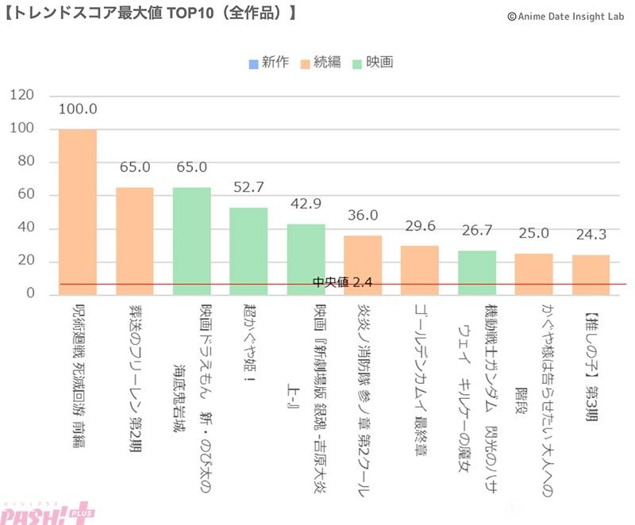

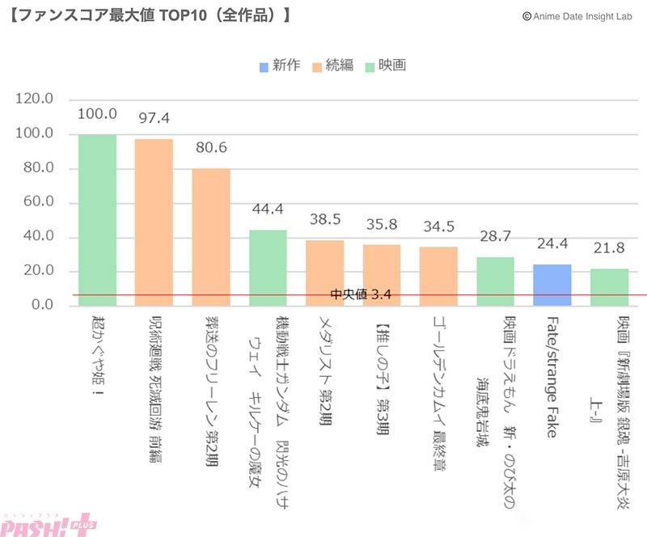

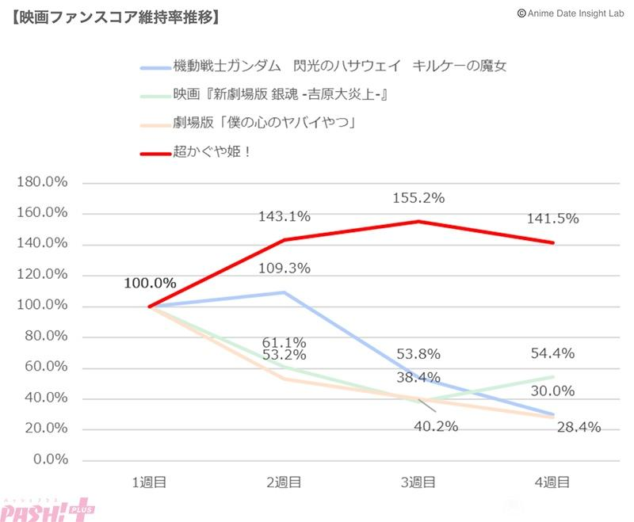

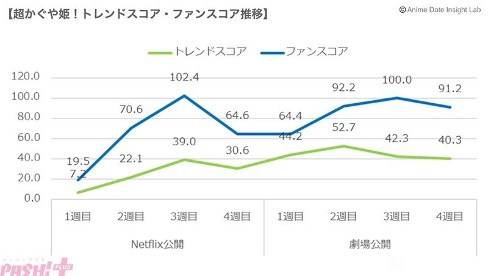

> **龍HCL** 2026-04-02 00:14:16：我也看了这个，就是不知道这个报道影响力如何？
>
> **用户007🌀** 2026-04-02 20:12:49：路边一条的程度\[阴险\]毕竟mggm是能对着主播女孩番剧喊出四月霸权的人。这数据可视化一眼用Excel做的，连折线图的默认色卡都不改。
>

---
### 267楼 · 龍HCL
Lv.14 · 2026-04-02 07:38 · 赞 1

稳定！今天特典最后一天能不能涨一点？（做梦中）

---
### 268楼 · inting1（楼主）
Lv.15 · 2026-04-02 11:05 · 赞 5

泛百书籍3月月榜 懒得顶百楼，就发在这楼吧\[阴险\] 
漫展季开始后同人本蜜瓜刷榜 但随后官方禁了纯网售本，影响待观察\[阴险\] 
小说仍在日亚实时第一，势不可挡

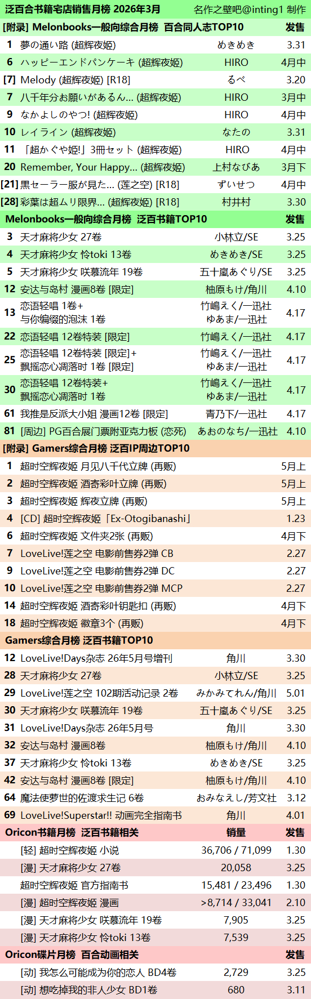

> **Lostleast** 2026-04-02 11:45:24：村井村这本，似乎不能算百合同人……
>
> **宝多茜** 2026-04-02 13:52:00：村井村这本是酒寄兄妹本
>

---
### 269楼 · inting1（楼主）
Lv.15 · 2026-04-02 11:37 · 赞 8

另外如羊狼菊苣所料，彩辉彩3月成为蓝p小说月投最多的女女cp\[阴险\] 
（当然图投只有千泷峰值月的1/3，可能跟人设不够肉体、以及蓝p小说占比提高有关）

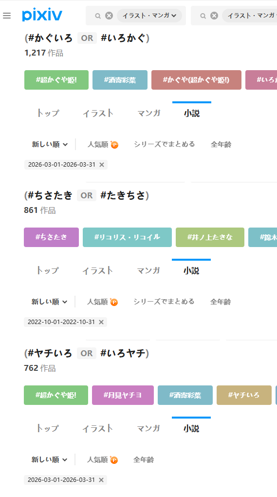

> **月◎剑苏** 2026-04-02 11:39:05：因为大部分都投推上了吧
>
> **酸涩的橙子** 2026-04-02 11:57:08：一样，其它ip也是投推上多，p站早不是主流
>
> **168bpm** 2026-04-02 11:58:13：现在还有多少人画图会去投蓝p这种满是AI图的地方？
>
> **一如既往的路过** 2026-04-02 12:05:22：辉夜那套相当露了，但一方面是体型不够，另一方面是制作组比较收敛。两人互换一下衣服估计能起飞
>
> **仙翳** 2026-04-02 12:44:09：因为已经和那年情况不同了，p站的大量用户都离开了
>
> **aptx星璇** 2026-04-02 14:57:59：现在发图的都到推上去发了（虽然当年也是不过当年在推上发完之后还是会去蓝p发个まとめ），但要发小说的话基本蓝p还是第一去处（而且据我观察很多cp小说只打了作品tag和角色tag没打cp tag所以不少没统计上的）
>
> **5A1yGxu** 2026-04-02 21:20:39：现在最大的漫展comicket和pixiv都不能代表太多风向了，二游可以在comicket和pixiv上买摊位和买稿注上去，现在是only展生态发展的更好，各玩各的。
>
> **清风自蓝天起** 2026-04-03 11:48:04：超辉的r18率挺低的，也挺好的。
>

---
### 271楼 · 龍HCL
Lv.14 · 2026-04-02 18:35 · 赞 1

话说刷推没看到说特典发完的，看来真的备足货了？

---
### 272楼 · 龍HCL
Lv.14 · 2026-04-02 22:29 · 赞 3

这坐席数，明天是不是可以期待下？

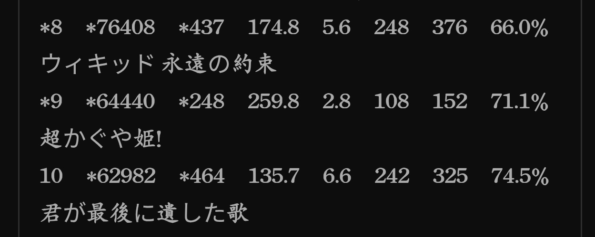

---
### 273楼 · 龍HCL
Lv.14 · 2026-04-02 22:42 · 赞 1

新宿9的场次给力啊！然后那个教场的时间段是什么鬼？跟在这个电影院下架了没区别了吧？还是说没人看故意挪的？

---
### 274楼 · 龍HCL
Lv.14 · 2026-04-02 23:31 · 赞 3

还能看到满席的盛况，不容易啊！

> **白衣毛哥** 2026-04-02 23:50:53：蒸
>

---
### 275楼 · 龍HCL
Lv.14 · 2026-04-03 06:49 · 赞 1

快了！！！

> **清风自蓝天起** 2026-04-03 11:45:47：等待16.8
>

---
### 276楼 · 龍HCL
Lv.14 · 2026-04-03 08:11 · 赞 1

开个好头！今天不会那么无聊了！

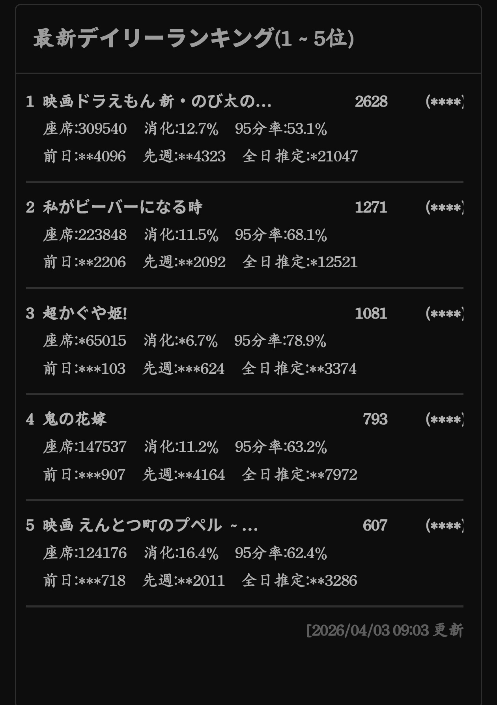

---
### 277楼 · 龍HCL
Lv.14 · 2026-04-03 09:10 · 赞 5

可能这周就是最后的辉煌了，多搬点好了！

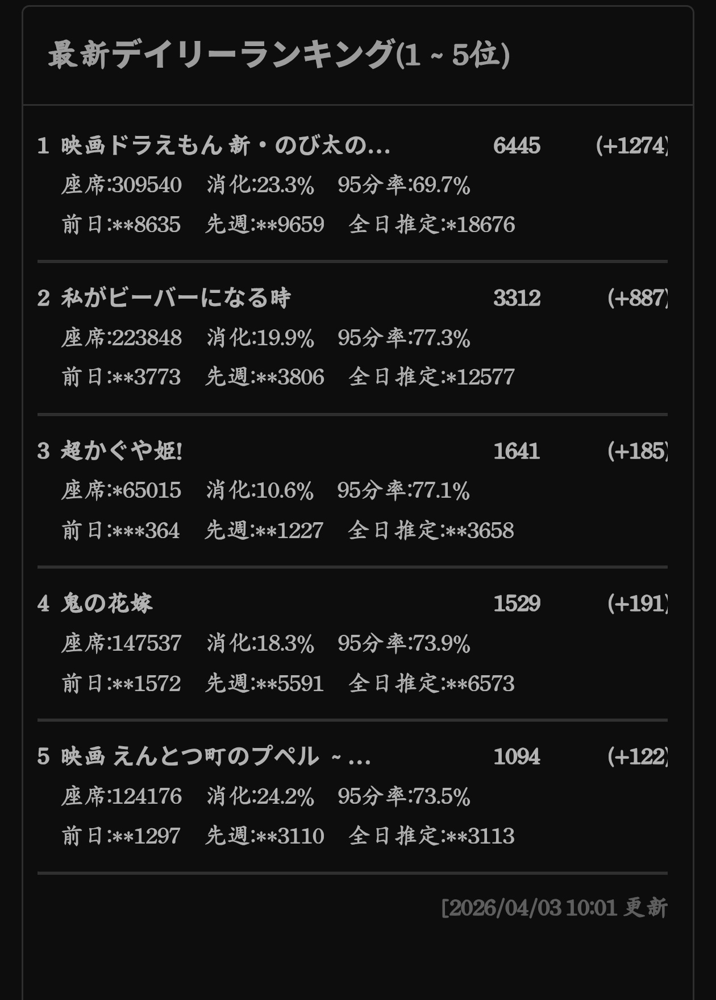

---
### 278楼 · 我昵称被删了😷
Lv.11 · 2026-04-03 09:46 · 赞 1

20亿可以吗？

> **龍HCL** 2026-04-03 10:03:25：应该问题不大吧！上映到六月份肯定能苟到！
>
> **shdhvisjsb** 2026-04-03 21:29:04：16\.8肯定又会有新活
>

---
### 279楼 · 龍HCL
Lv.14 · 2026-04-03 10:04 · 赞 1

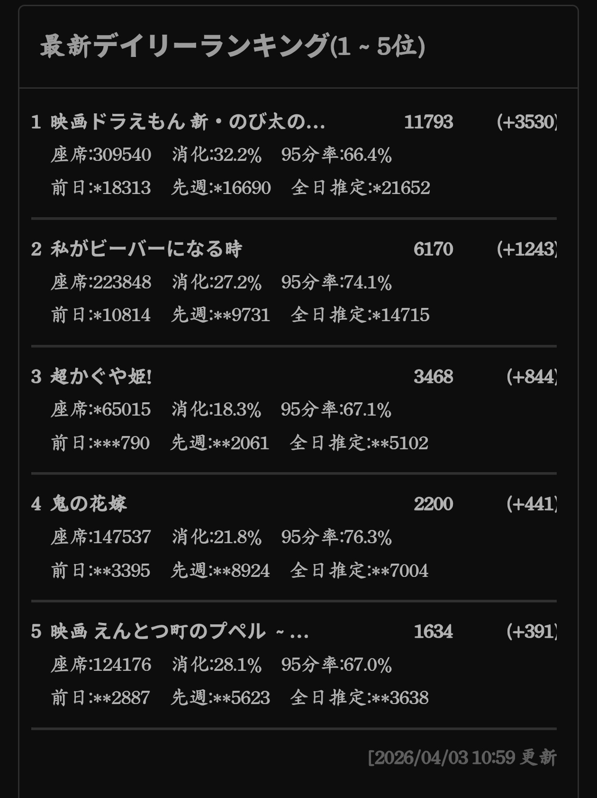

---
### 281楼 · 龍HCL
Lv.14 · 2026-04-03 12:20 · 赞 1

记录！

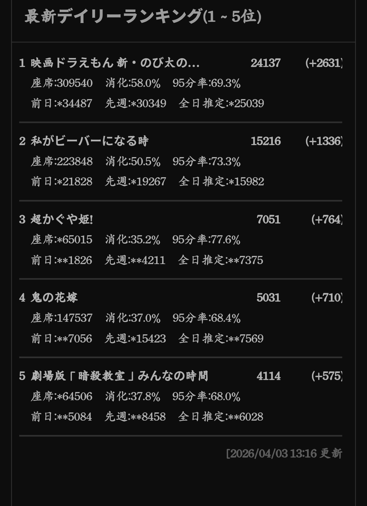

---
### 282楼 · 王者之韦
Lv.12 · 2026-04-03 13:22 · 赞 1

没想到这波特典效应这么强

---
### 283楼 · 龍HCL
Lv.14 · 2026-04-03 17:51 · 赞 2

貌似先确定能播到6月4日！

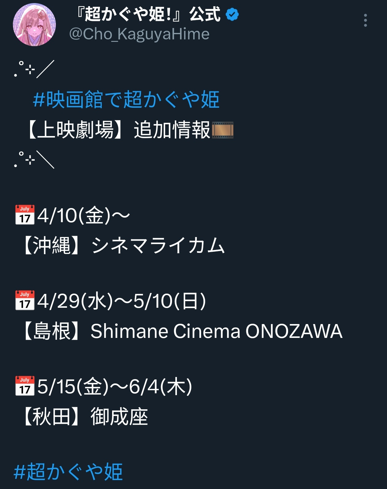

---
### 287楼 · 龍HCL
Lv.14 · 2026-04-03 23:02 · 赞 4

斯巴拉西！

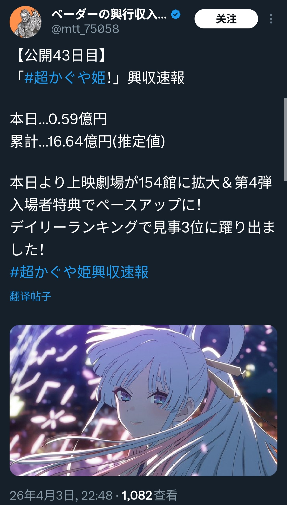

> **Kizumi-** 2026-04-03 23:57:43：666
>
> **仙翳** 2026-04-04 00:52:16：太好了，马上就16.8亿了
>

---
### 288楼 · 龍HCL
Lv.14 · 2026-04-03 23:37 · 赞 2

明天的坐席好像不如今天？周六又被挤掉了吗？\[泪\]

> **井Chisha** 2026-04-03 23:53:22：我记得周末座席是不准的，仔细观察就发现每部片都减少，结果就是到了晚上过了100%才加回来。
>

---
### 289楼 · 龍HCL
Lv.14 · 2026-04-04 08:31 · 赞 1

这周好像又要变成周五最强了？

---
### 290楼 · 龍HCL
Lv.14 · 2026-04-04 09:46 · 赞 3

这一波进了前五！虽然还是逊于昨天！中午再看看！

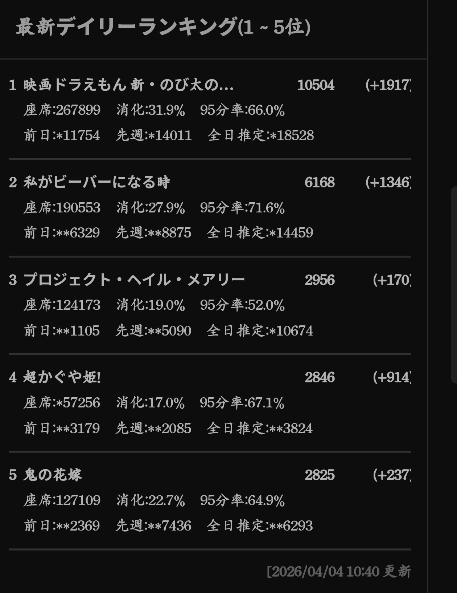

---
### 295楼 · 龍HCL
Lv.14 · 2026-04-05 08:28 · 赞 3

今天开局第十名，先观望下！

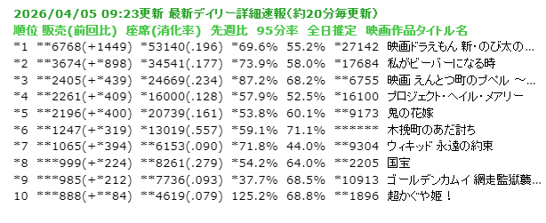

---
### 296楼 · 龍HCL
Lv.14 · 2026-04-05 17:54

大佬也不发票房了！今天比昨天低了一千多，太难了！

---
### 297楼 · 龍HCL
Lv.14 · 2026-04-05 19:27 · 赞 1

好像新馆特典都不多啊！好几家都没了，今天的票房指数比昨天低了2000了\[泪\]！感觉是最后的绝唱了！

---
### 298楼 · DFB\_Trumpet
Lv.9 · 2026-04-05 19:40 · 赞 3

这周肯定是最后的高光了，下周柯南直接泥头车冲爆，cinemacity已经挤到只剩两场了

---
### 299楼 · inting1（楼主）
Lv.15 · 2026-04-06 11:52 · 赞 3

山下gg的县乡级烂炒 
学到wsd和a一串的几分功力了\[酸爽\]

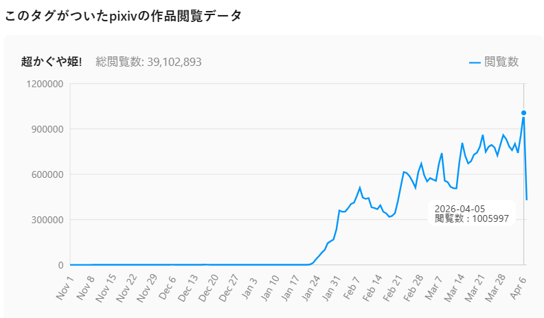

> **龍HCL** 2026-04-06 12:11:03：好像是宣布上影院的推特以外，最火的一条了！粉丝都加了3000了吧！太有才了！
>

---
### 300楼 · 龍HCL
Lv.14 · 2026-04-06 12:12 · 赞 5

水水！大佬不发票房了……

页码：[1–100 楼](thread.md) · [101–200 楼](thread_2.md) · **201–300 楼** · [301–400 楼](thread_4.md) · [401–500 楼](thread_5.md) · [501–600 楼](thread_6.md) · [601–700 楼](thread_7.md) · [701–800 楼](thread_8.md)

---

[⬆ 本页顶部](#top)　·　[⏬ 最新的楼层](thread_8.md#bottom)
