

# 【动画讨论&amp;追踪】超时空辉夜姬

- 贴吧: 名作之壁吧　楼主: inting1　发帖: 2026-02-21 19:38:46
- 原帖: https://tieba.baidu.com/p/10504053776　抓取时间: 2026-09-26 14:14:30　楼层数: 641　（时间均为北京时间）

[⬇ 本页底部](#bottom)　·　[⏬ 最新的楼层](thread_8.md#bottom)

页码：[1–100 楼](thread.md) · [101–200 楼](thread_2.md) · [201–300 楼](thread_3.md) · **301–400 楼** · [401–500 楼](thread_5.md) · [501–600 楼](thread_6.md) · [601–700 楼](thread_7.md) · [701–800 楼](thread_8.md)

---
### 301楼 · 龍HCL
Lv.14 · 2026-04-06 14:46 · 赞 2

剩两场还好吧？

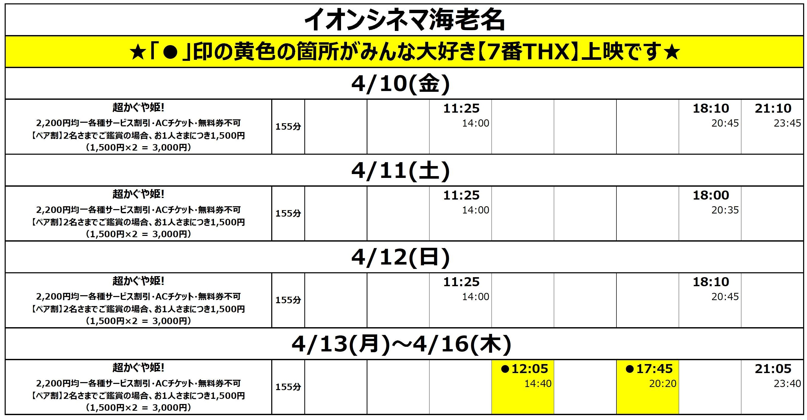

---
### 302楼 · 龍HCL
Lv.14 · 2026-04-06 18:06 · 赞 5

完成了！

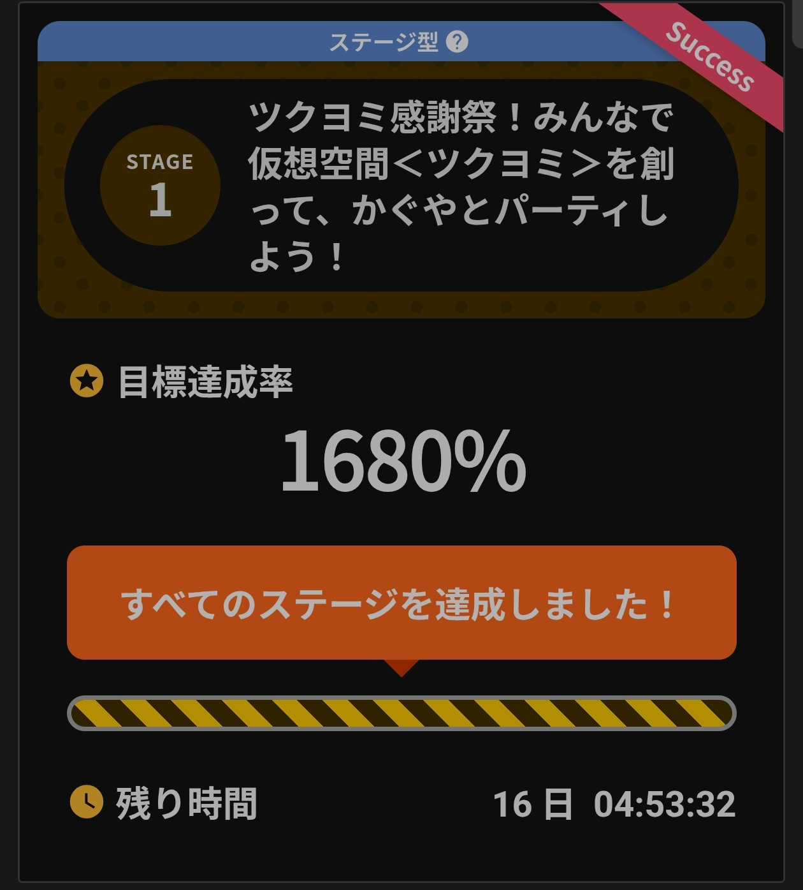

---
### 303楼 · 龍HCL
Lv.14 · 2026-04-06 19:54 · 赞 3

感谢新增馆，先周比独树一帜！

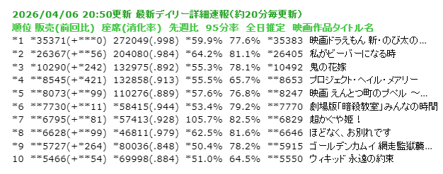

---
### 304楼 · 用户007🌀
Lv.9 · 2026-04-06 22:13 · 赞 9

对第二周欢迎音声场面的再现（作者：すとーんりゔぁー @Stoonrivaa） 
“彩叶也吃一口爆米花吧〜♪”

---
### 305楼 · 用户007🌀
Lv.9 · 2026-04-06 22:23 · 赞 7

对第二周欢迎音声场面的再现2（作者：ねこくん @B3vWbf） 
“彩…！彩噼！！！！”

---
### 306楼 · 龍HCL
Lv.14 · 2026-04-06 23:47 · 赞 1

希望官方明天宣布再加几馆！柯南太吓人了，这坐席周五还能剩多少？

---
### 308楼 · 龍HCL
Lv.14 · 2026-04-07 07:24

还以为能有17.5呢！周六到16.8的话，周日一天不到0.5啊！

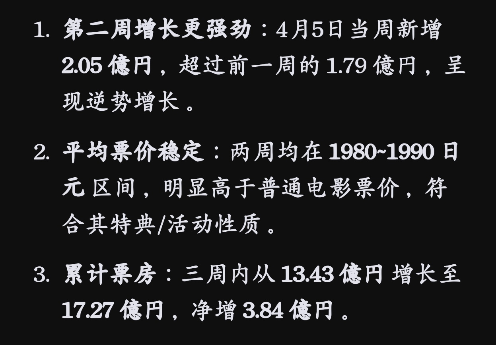

---
### 309楼 · 龍HCL
Lv.14 · 2026-04-07 09:34 · 赞 2

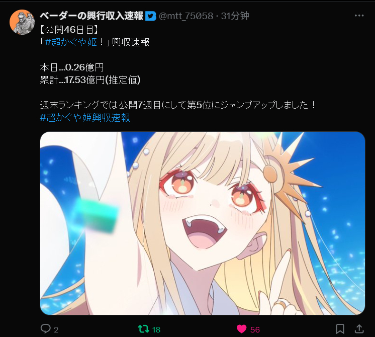

---
### 311楼 · 用户007🌀
Lv.9 · 2026-04-07 19:12 · 赞 5

【个人渣翻】超时空辉夜姬电影院广播（八千代&amp;彩叶）-哔哩哔哩】 BV18ZDeBuEYZ 
下周欢迎音声的开头部分，让我们恭喜彩叶完成向连自己名字都讲不出来的胚胎的伟大进化，彻底沦为八千代大人的玩具\[欢呼\]🍾🍾🍾

---
### 312楼 · 某不科学的FF君
Lv.1 · 2026-04-07 20:30 · 赞 2

被柯南排片吓哭，周末还能有多少座席

---
### 313楼 · 忱頭▫
Lv.15 · 2026-04-07 20:46 · 赞 3

下午抽时间看完，真不戳，有续篇就好了

---
### 314楼 · 忱頭▫
Lv.15 · 2026-04-07 20:48 · 赞 4

『超かぐや姫』 
公開7週目 
スクリーン数:154Scr 
(4/3(金)〜5(日))の3日間 
3日間動員数: 6万9000人 
3日間興行収入: 1億4000万円 
(2/20(金)〜4/5(日))までの公開45日間 
累計動員数:86万8768人 
累計興行収入:17億2651万5500円

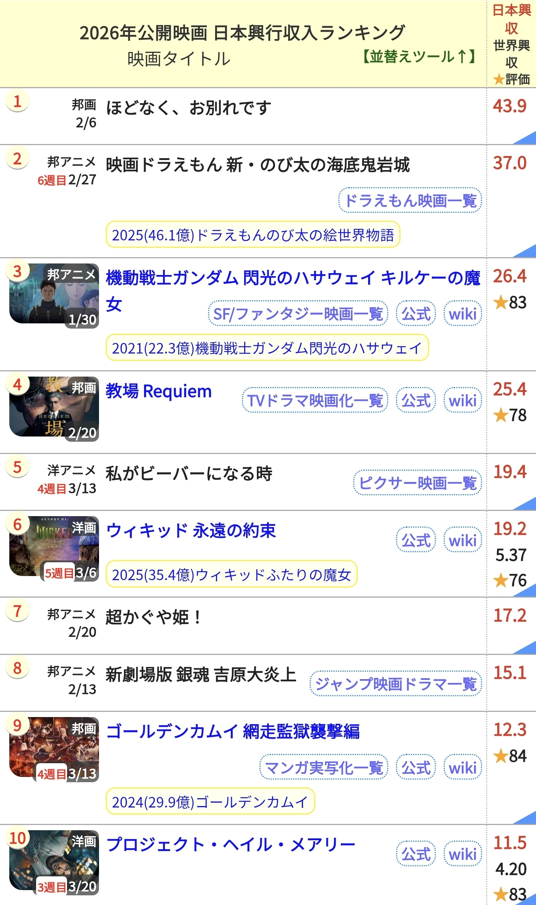

---
### 315楼 · 龍HCL
Lv.14 · 2026-04-07 23:35 · 赞 1

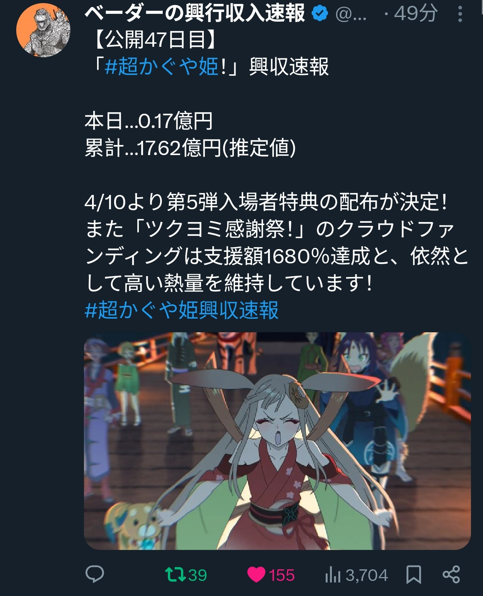

---
### 316楼 · 用户007🌀
Lv.9 · 2026-04-08 00:17 · 赞 6

关于那部和辉夜姬同人设同声优的电影作品，因为个人bmg和gmg都爱看，就去了解了下（想着壁吧都是数据厨没有洁癖人士吧 就发这了\[阴险\]），只能说蹭热度的意图不要太明显（单指动画改编，小说没有问题），一看制委名单是松竹映画——富士电视台联盟就释然了，果不其然松竹基操叒发力了。如果你不知道，松竹刚刚靠一波神鬼莫测的营销操作把一部开了280多馆当地好评如潮的作品干到票房只有3e不到。 
至于剧情本身，能说道的其实挺少，整体架构和迪迦穿越时空的微笑一集很像，但结局又类似只有我不在的街道。总体来看不像是能卖座的样子，所以出品方才会选择碰瓷营销吧。

> **用户007🌀** 2026-04-08 00:20:20：另一家出资方富士台（Pony Canyon名义）也是极品，感兴趣的可以查查这两年的新闻\[阴险\]
>
> **仙翳** 2026-04-08 17:32:37：本来从来没听说过，好奇去查了一下，发现原作人设根本没有泪痣，然后电影人设直接无中生有，简直是一点碧莲都不要了
>
> **用户007🌀** 2026-04-08 19:29:10：人设我相信是巧合，或者是hechima想搞类似堀口脸的个人品牌，毕竟PV1是2月11日发布的，那时候辉夜才刚上线20天，连院线都没上，热度还没彻底爆发，而且整套人设和预告是不可能在这么短时间内做出来的。但cv这块我合理怀疑有鬼\[阴险\]，PV1没有人声，隔了差不多两个月才上PV2，离正式上映还有6个月。
>

---
### 318楼 · 龍HCL
Lv.14 · 2026-04-08 13:04

周五的坐席很绝望啊！赶紧拓展海外市场吧……

---
### 319楼 · 龍HCL
Lv.14 · 2026-04-08 19:21

为啥感觉新特典也没用了！看了几个馆周五的购票情况，形式险峻啊！要凉了\[泪\]

---
### 320楼 · 龍HCL
Lv.14 · 2026-04-08 22:04 · 赞 1

还有没上周高！加馆效果只能维持五天啊\[泪\]

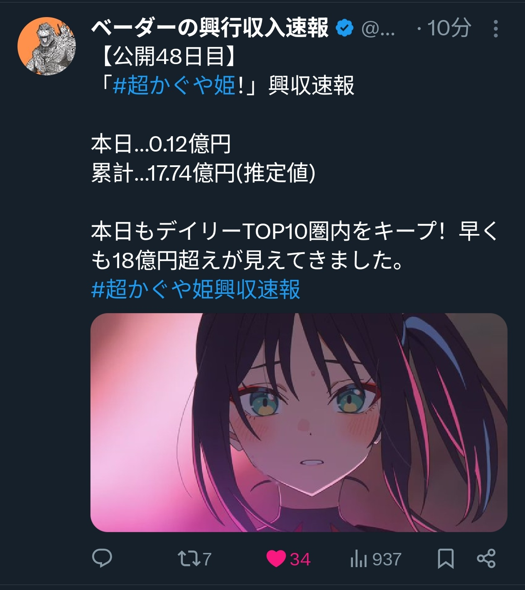

> **某不科学的FF君** 2026-04-09 08:39:19：这周开学了
>
> **aptx星璇** 2026-04-09 12:41:15：能每天都保持前十已经很不错了，春休结束了看看大盘基本的先周比都降到50%以下了
>

---
### 321楼 · 用户007🌀
Lv.9 · 2026-04-09 13:15 · 赞 3

春休结束了，工作日大盘肯定低迷的。为什么说柯南剧场版在商业上对院线那么重要，就是因为它在春休后能给所有影院一个收入稳定的饭票，解决掉员工吃饭问题，所以虽然它的上映挤掉了不少排片，但没有它，很多小众电影也会因为不赚钱而被院线拒绝。

> **5A1yGxu** 2026-04-10 04:40:41：ip电影永远是最重要的，好莱坞生命力这么强也是靠ip系列保住了全球下限。
>

---
### 322楼 · 龍HCL
Lv.14 · 2026-04-10 10:35

今天也挺凉凉的！

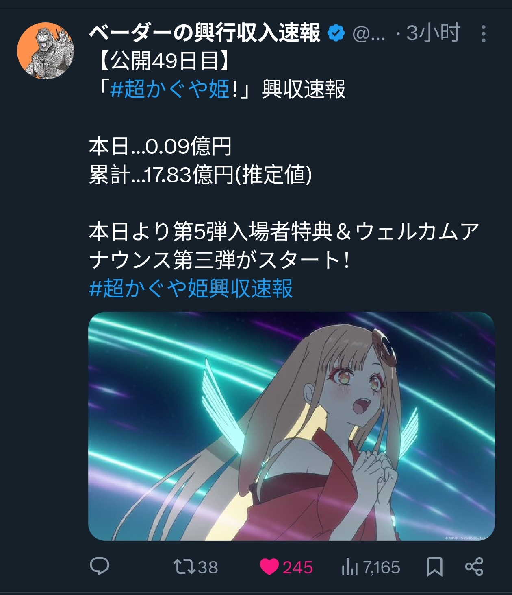

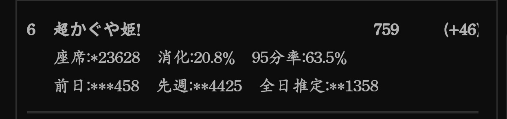

---
### 323楼 · 龍HCL
Lv.14 · 2026-04-10 18:36 · 赞 1

水一下，这周还能拿个周末TOP10？

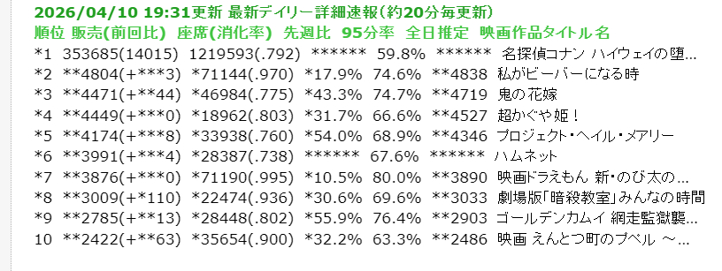

---
### 324楼 · 用户007🌀
Lv.9 · 2026-04-10 19:51 · 赞 7

我和柯南合砍百亿票房.jpg\[阴险\]

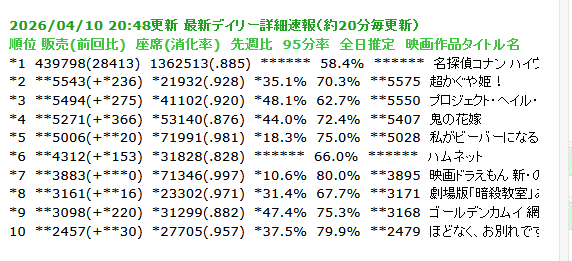

> **龍HCL** 2026-04-10 20:08:21：刚想再水下！看到你发了！说是合砍，我们今天贡献的不到百分之一！！！
>

---
### 325楼 · 用户007🌀
Lv.9 · 2026-04-10 23:33

话说今天其实还有个商品上市，就是松竹系影院（MOVIX、Piccadily等）开卖了带官绘贴纸的爆米花盒子； 
合理怀疑这玩意预定是上周开卖的，毕竟上周欢迎音声刚好在吃爆米花，这周又撞上柯南，实在不是什么好日子\[阴险\]。 
但今天的销量还是超出了松竹院线的预期，以至宣布了4.24起追加贩售的决定，并表示现在正在追加生产中。

> **龍HCL** 2026-04-11 08:45:40：爆米花好像还是得另买的样子2333
>
> **用户007🌀** 2026-04-11 09:03:14：里面有爆米花，可选咸口和焦糖味
>
> **龍HCL** 2026-04-11 09:04:51：看推看错了吗？好像说可以单买盒子的？
>
> **用户007🌀** 2026-04-11 09:09:16：我看官方宣传的“中身のポップコーンは、塩味 or キャラメル味 からお選びいただけます。 ポップコーンは耐油袋に入っており、外箱は記念にお持ち帰りいただけます。”
>

---
### 326楼 · 龍HCL
Lv.14 · 2026-04-11 08:46

今天能保持在五位吗？

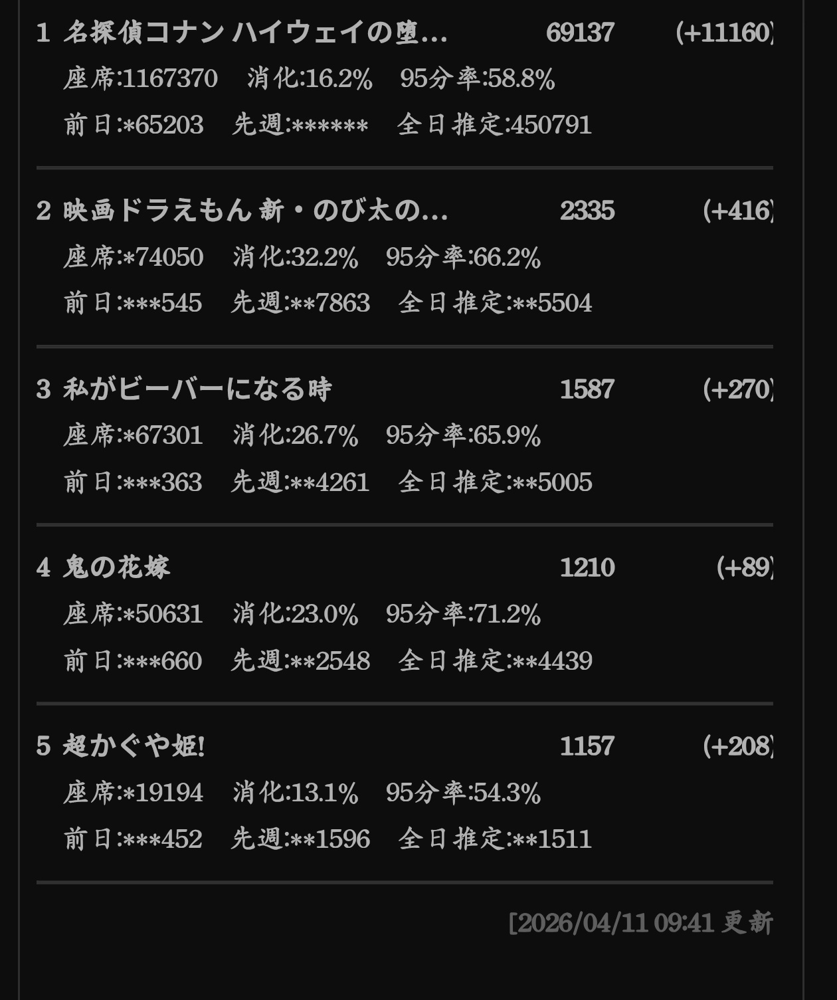

---
### 327楼 · 龍HCL
Lv.14 · 2026-04-11 09:03

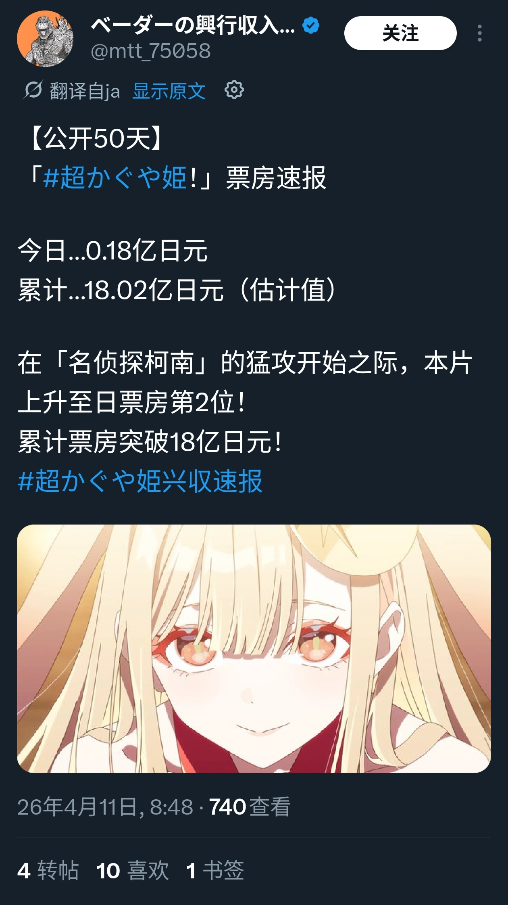

---
### 328楼 · 用户007🌀
Lv.9 · 2026-04-11 09:12 · 赞 1

\[阴险\]运营已经在轻哼了，万一到时候真给它蹭到前三了，怕是直接卡古鸭吼了

> **龍HCL** 2026-04-11 10:30:57：前三有点难，前五感觉还是有点希望！
>

---
### 329楼 · 用户007🌀
Lv.9 · 2026-04-11 18:27 · 赞 1

太恐怖了，用上上周（3月28日）同期46%的排片打出了91.6%的动员人数比，上座率高达61.9%\[喷\]在京都的战地记者说虽然排片减少了很多，但部分场次直接满员了……

> **龍HCL** 2026-04-11 18:30:00：说明特典还是很有吸引力的！官方这波精准拿捏了！
>
> **用户007🌀** 2026-04-11 18:31:20：给各家院线释放的信号很明显了：大头给柯南固然爆赚，但剩下的小头分多一点给辉夜，也一定不亏，起码比那些排片水平相当但票房没眼看的片子好
>

---
### 330楼 · 龍HCL
Lv.14 · 2026-04-11 18:32

第五被不速之客抢了！好像是个演唱会观影直播？

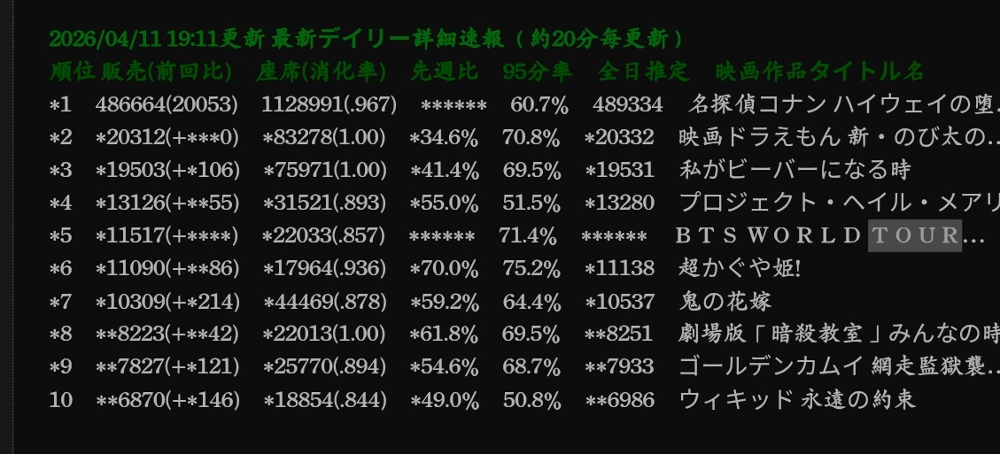

> **用户007🌀** 2026-04-11 18:43:34：防弹少年团
>

---
### 331楼 · 龍HCL
Lv.14 · 2026-04-11 18:33 · 赞 3

大的终于要来了？

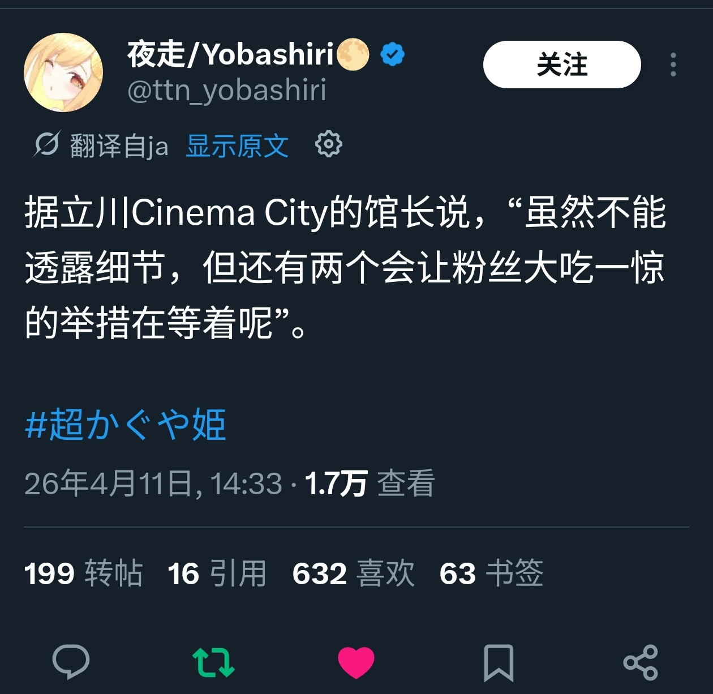

> **煞觉** 2026-04-11 18:47:23：电影院能知道什么消息呢？
>
> **用户007🌀** 2026-04-11 18:51:37：应该是和这家电影院的联动活动，和海外关系不大
>

---
### 332楼 · 京电小助手
Lv.11 · 2026-04-11 20:14

海外会上吗？ 
日本本土有没有出Dolby Cinema杜比影院格式？

> **一如既往的路过** 2026-04-11 21:14:20：忘了谁说的，欧美(也许是英国？忘了)搞过小规模上映，不过没人说后续如何，应该是反响一般
>
> **aptx星璇** 2026-04-11 22:47:05：没有杜比，只有几个影院有强化音效厅(立川的极音和チネチッタ的live zound那种)
>
> **兄弟干的不错** 2026-04-12 16:31:21：没有吧，海外上映肯定优先选东亚
>

---
### 333楼 · DFB\_Trumpet
Lv.9 · 2026-04-11 21:04

不清楚是cinema city自己的特别企划还是别的 
不过考虑到即使是这个周末还能把看板摆中间还是值得期待一下的

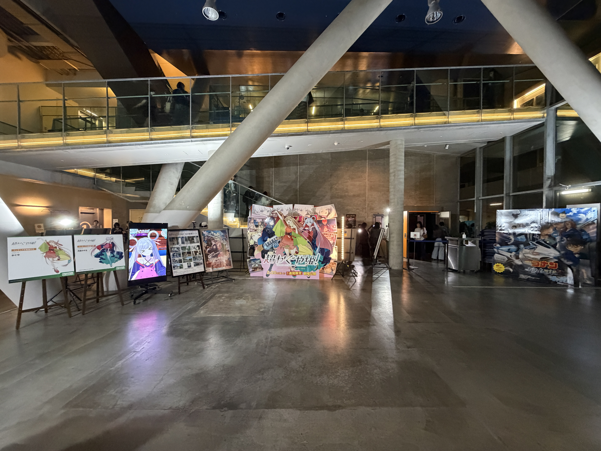

---
### 334楼 · 煞觉
Lv.6 · 2026-04-11 21:41

话说这周的欢迎广播推上都说很不错，但就是没说有什么内容

---
### 335楼 · 龍HCL
Lv.14 · 2026-04-11 22:38 · 赞 5

今天最终第五名！上座率夸张了！

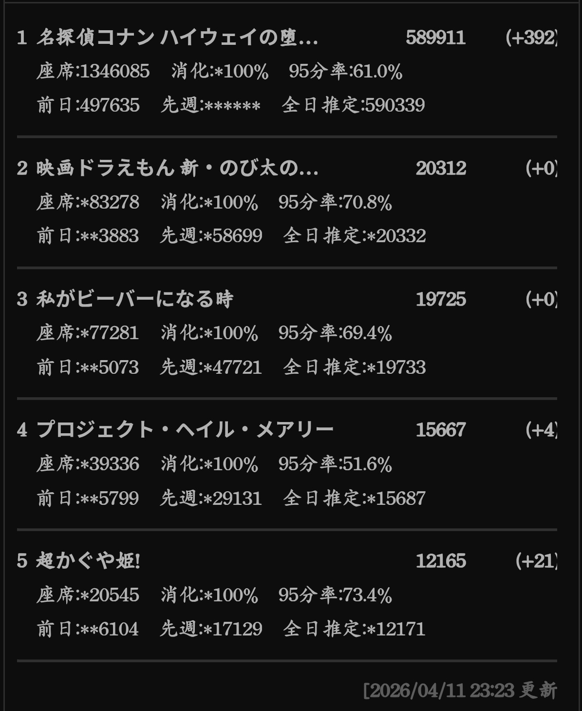

> **白衣毛哥** 2026-04-11 23:34:42：蒸
>
> **沙漠天使** 2026-04-12 00:30:04：没怎么受柯南影响，今天票房甚至逆增长了，现在18.4亿了，牛
>
> **龍HCL** 2026-04-12 06:51:49：和上周比的话，还是降了的！
>

---
### 337楼 · 夜星划空
Lv.13 · 2026-04-12 05:48 · 赞 4

昨天下午在观影会看了辉夜姬

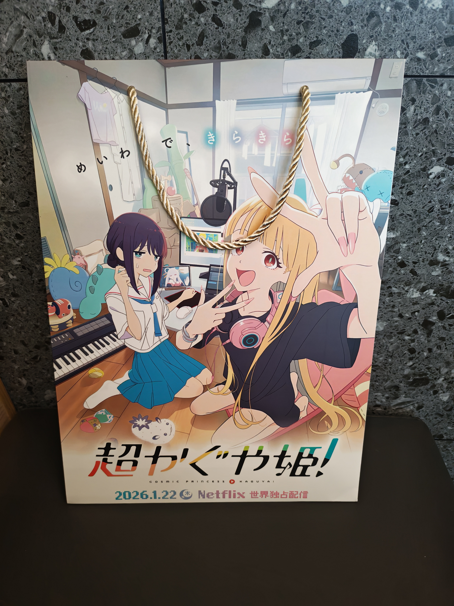

---
### 338楼 · 龍HCL
Lv.14 · 2026-04-12 06:51 · 赞 1

> **用户007🌀** 2026-04-12 14:46:42：昨晚发的被吞了\[喷\]这博主认为辉夜没上东宝院线是塞翁失马，但我觉得这有点倒因为果了如果一早就上了东宝系影院，光靠东宝的覆盖面、选址和知名度都能让票房再高一个等级
>
> **ftghyw** 2026-04-12 15:22:03：上东宝院线，东宝大概要在商品化上掺一脚的\[阴险\]
>

---
### 340楼 · 龍HCL
Lv.14 · 2026-04-12 09:06

周围全是大佬！

---
### 341楼 · 用户007🌀
Lv.9 · 2026-04-12 15:02 · 赞 3

周日目前依然保持着70%以上的先周比，与昨天基本持平，上座率进一步上升到66%。 
我就直说了，一些赔钱片就应该下映了，周末上座率9%都不到的东西还加什么排片\[汗\]

> **龍HCL** 2026-04-12 17:26:22：看到好几个影院特典都发完了……官方这波备货量一般般啊！
>

---
### 342楼 · 龍HCL
Lv.14 · 2026-04-12 18:23 · 赞 1

95分率高，说明柯南还是帮忙吸引了些粉丝？

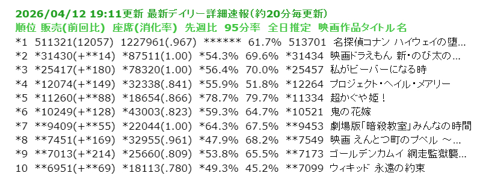

---
### 343楼 · 龍HCL
Lv.14 · 2026-04-12 21:13

希望下周多点席位！

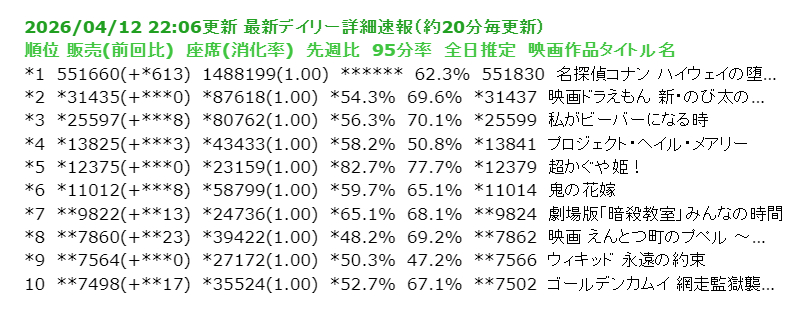

---
### 344楼 · 石球
Lv.15 · 2026-04-12 22:44 · 赞 5

票房超过promare了，目前在原创动画电影里应该是仅次于宫、诚、守的作品了\[真棒\]

---
### 345楼 · 龍HCL
Lv.14 · 2026-04-12 23:59 · 赞 1

下周日应该能到20亿吧！希望如此！

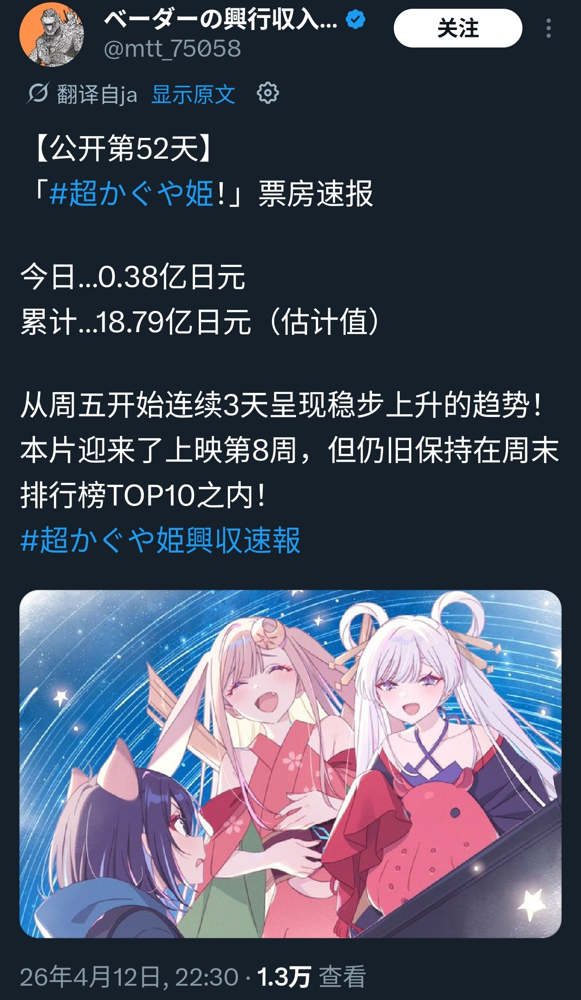

---
### 346楼 · 龍HCL
Lv.14 · 2026-04-13 07:37

博主又给多算了0.02！等明天的精报吧！

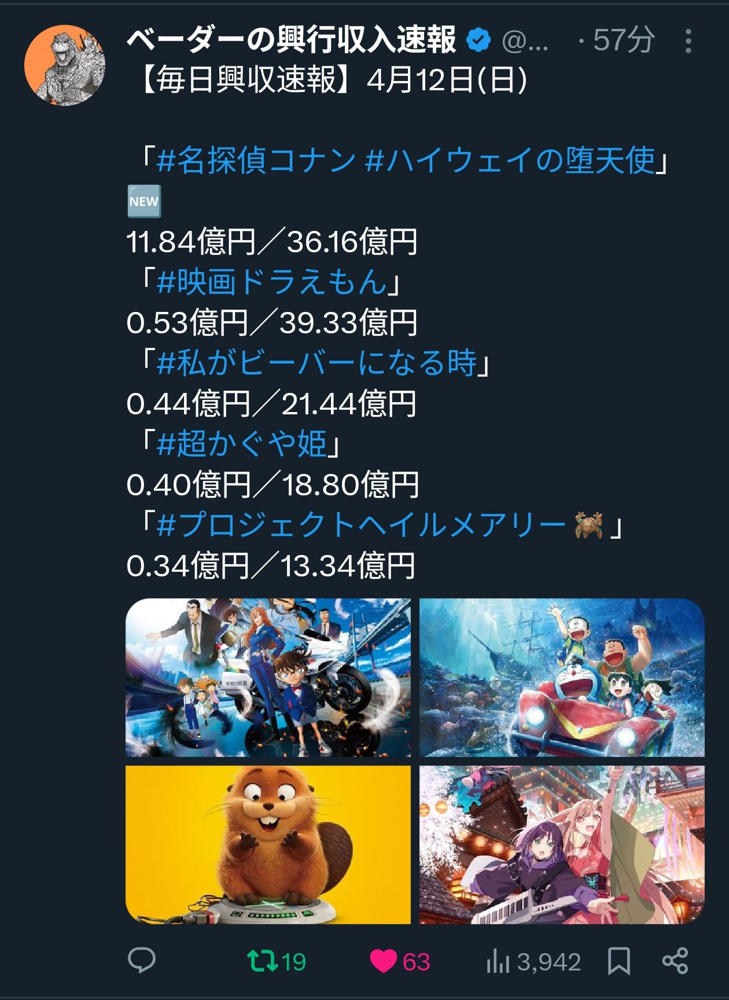

---
### 347楼 · 用户007🌀
Lv.9 · 2026-04-13 08:37 · 赞 1

这周二三四名争夺有点激烈啊，菜鸡互啄高端局\[阴险\]难道说

> **龍HCL** 2026-04-13 08:55:47：不关我们事，死守第五名\[阴险\]
>
> **用户007🌀** 2026-04-13 09:07:05：再算算这三天票房金额呢\[阴险\]别忘了辉夜的票价是比其他都高的
>
> **龍HCL** 2026-04-13 09:18:59：那个排名不是按人数排的吗？通信社！
>
> **用户007🌀** 2026-04-13 12:46:43：对的\[阴险\]
>

---
### 348楼 · 龍HCL
Lv.14 · 2026-04-13 13:58 · 赞 2

第五！

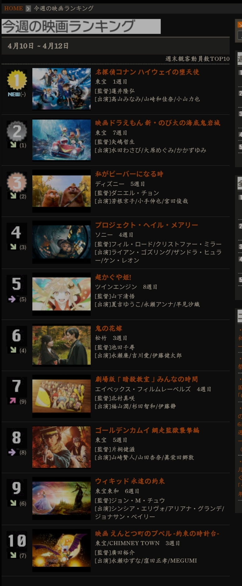

---
### 350楼 · 用户007🌀
Lv.9 · 2026-04-13 15:45

5位は、公開8週目を迎えた『超かぐや姫！』（ツインエンジン）がその順位をキープした。 
没充值就是不把你当人\[阴险\]

> **龍HCL** 2026-04-13 21:27:07：估计东宝也要的多，没谈拢！
>

---
### 351楼 · 龍HCL
Lv.14 · 2026-04-13 21:24

今天挺好！排片都在下午吧？上午没看到数据= =

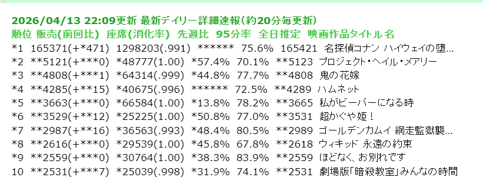

> **用户007🌀** 2026-04-13 22:18:30：上午上座率很低
>

---
### 352楼 · 168bpm
Lv.5 · 2026-04-14 01:03

有人开始对星期二公布的第四弹特典担忧了，这要真是四个随机也太那啥了，不是说后面有两个大的吗？整点新东西当特典吧\[阴险\]

---
### 353楼 · 龍HCL
Lv.14 · 2026-04-14 06:49

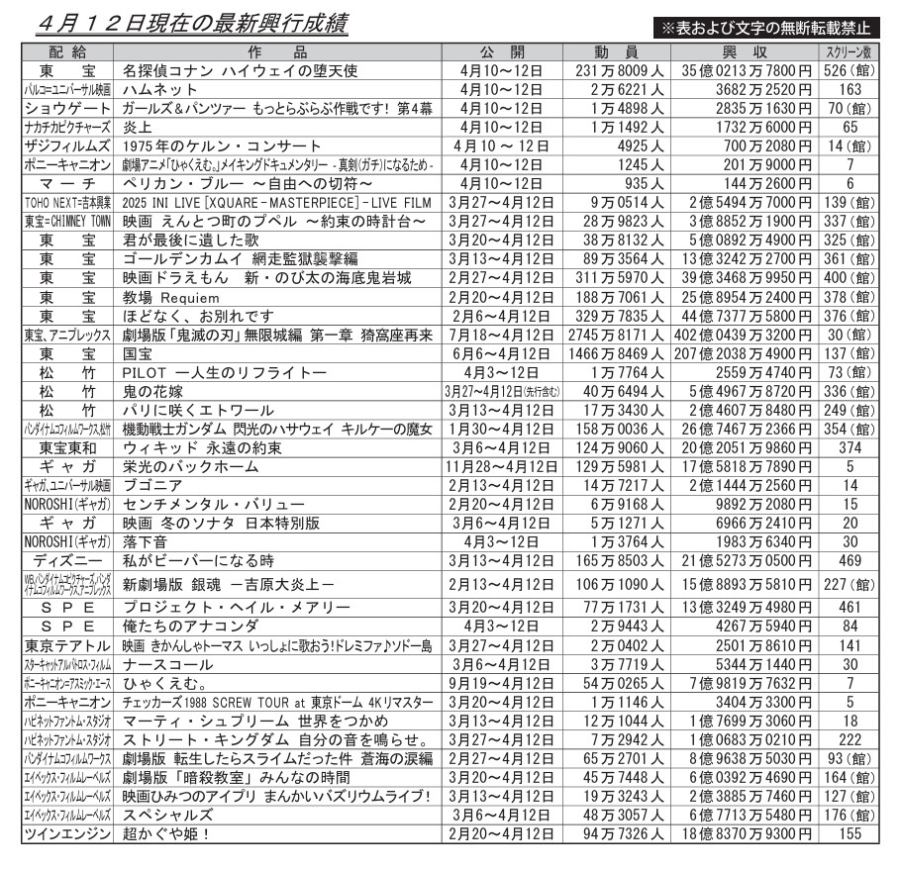

---
### 354楼 · 龍HCL
Lv.14 · 2026-04-14 06:49

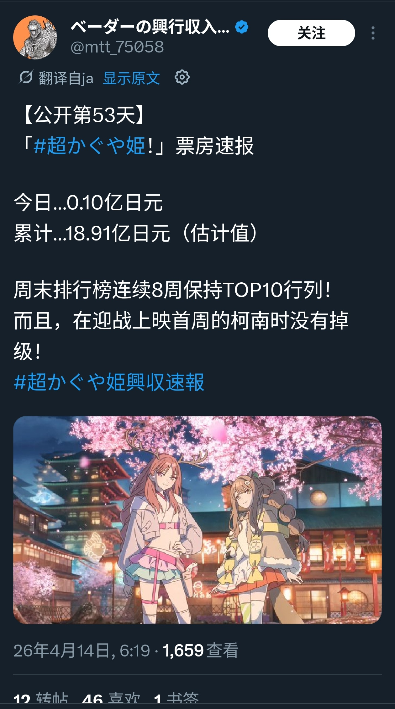

---
### 355楼 · 龍HCL
Lv.14 · 2026-04-14 08:28

混个第三！

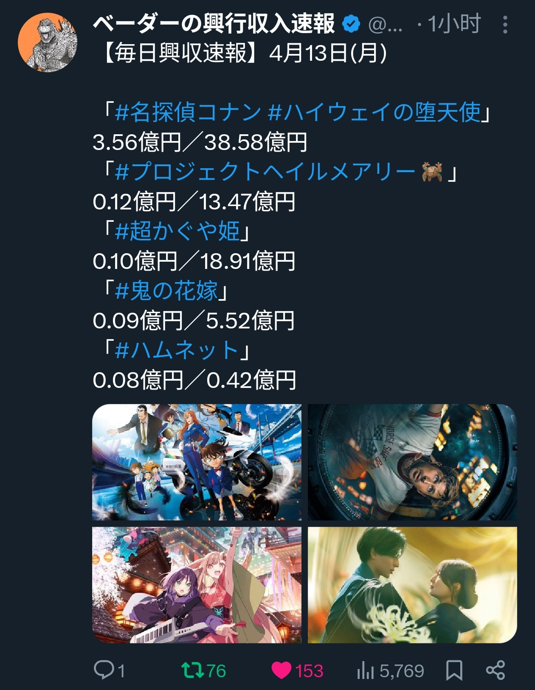

---
### 357楼 · 龍HCL
Lv.14 · 2026-04-14 08:43

已经不知道上限在哪了？官方预料到了吗？

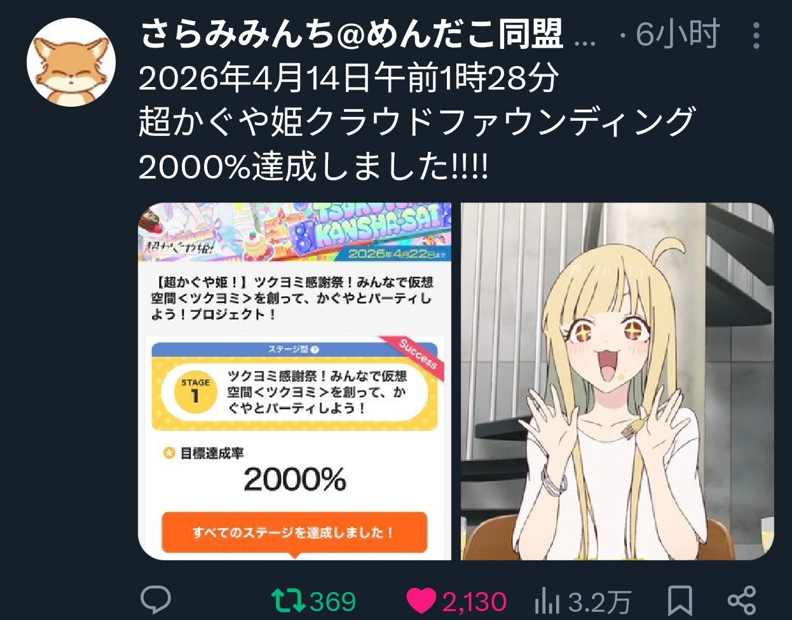

---
### 359楼 · 龍HCL
Lv.14 · 2026-04-14 17:09

这次不骗大家多刷了！票房还能行吗\[泪\]

---
### 360楼 · 龍HCL
Lv.14 · 2026-04-14 21:19

今天又混个第六！50％先周比！感觉前十的上座率都在10%左右！

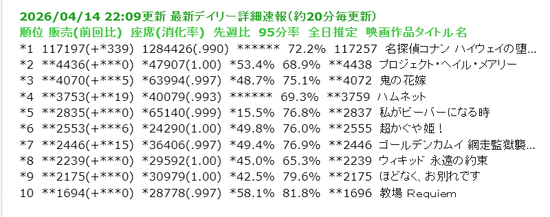

---
### 361楼 · 用户007🌀
Lv.9 · 2026-04-14 21:30

这波闪卡似乎热度不是很高，需要搞点新活了

> **用户007🌀** 2026-04-14 21:33:28：众筹 2000 2030 官方都没啥反应，不知道 2040 有没有东西，下一个节点不会是 2943 吧\[滑稽\]
>
> **龍HCL** 2026-04-14 22:32:35：我感觉好像比上一弹更受欢迎！转推 喜欢 查看量好像都高的多！
>
> **龍HCL** 2026-04-14 22:33:27：问就是没活了！广播剧已经是最后的波纹了！
>
> **煞觉** 2026-04-15 00:03:52：众筹只剩几天了，会不会等结束后再来波大的？
>

---
### 362楼 · 用户007🌀
Lv.9 · 2026-04-14 22:13 · 赞 2

主场倒了…（哭腔） 
官方也没预想到能顶得住死小这波吧\[阴险\]

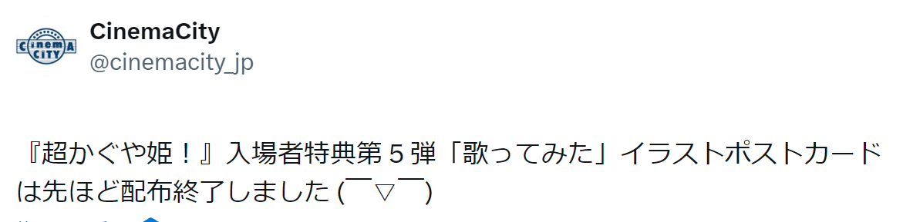

> **龍HCL** 2026-04-14 22:34:36：坐席该多点了！主办方说的惊喜呢？
>

---
### 363楼 · 龍HCL
Lv.14 · 2026-04-14 22:54 · 赞 1

过19！周末给力的话，能到20！

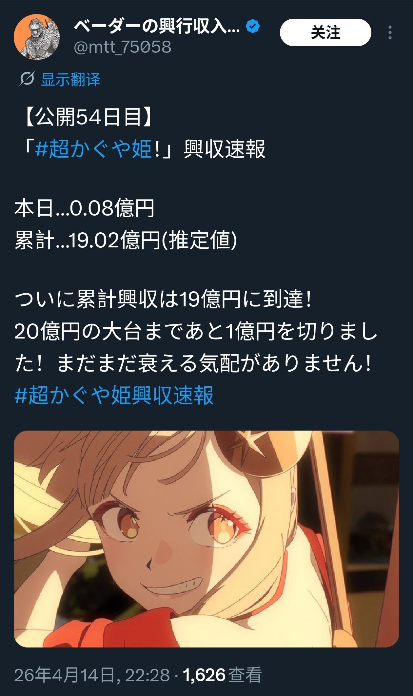

---
### 364楼 · 井Chisha
Lv.1 · 2026-04-14 23:21

看推上对川崎Cinecitta的特殊厅赞不绝口，真想实际体验一次啊。(当然还有圣地立川的极音、池袋Grand cinema sunshine)

---
### 365楼 · 用户007🌀
Lv.9 · 2026-04-14 23:24 · 赞 5

\[阴险\]影院版的片尾滚动字幕比流媒体版多加了两个表记： 
\- 
配給営業 
渡辺大輔 
\- 
配給 
Studio Colorido 
证实了辉夜这次登陆院线，45个地方接近150家影院都是同一个人谈下来的，堪称彩叶人间体了。 
在动画Staff Wiki上查了下，这位渡辺似乎以前就开始从事电影上映的协调工作，2012年上映的《神奇树屋》就有他的名字，他也负责了2021年的《银魂 THE FINAL》的配给营业。但受限于 Staff Wiki 较少收录动画电影除制作组、声优以外的内容，查不到他更多信息了。

> **用户007🌀** 2026-04-14 23:35:28：就是不知道他为啥会跳槽到Colorido，这公司已经很久没有正儿八经搞过规模上映了，上一次还是企鹅高速公路……
>
> **龍HCL** 2026-04-15 17:35:51：除了东宝，还有能争取的影院吗？
>
> **用户007🌀** 2026-04-15 18:25:27：松竹旗下的MOVIX、皮卡迪利，东映旗下的T-JOY，还有永旺院线都谈下来了，只不过不是全馆上映。就是被东宝卡脖子了\[阴险\]。针对只有东宝影院的地方，能想到去找市民文化厅的人绝对是老资历。
>

---
### 366楼 · 龍HCL
Lv.14 · 2026-04-15 17:41 · 赞 1

今天比昨天高啊！因为单特典不用省钱到周五了？

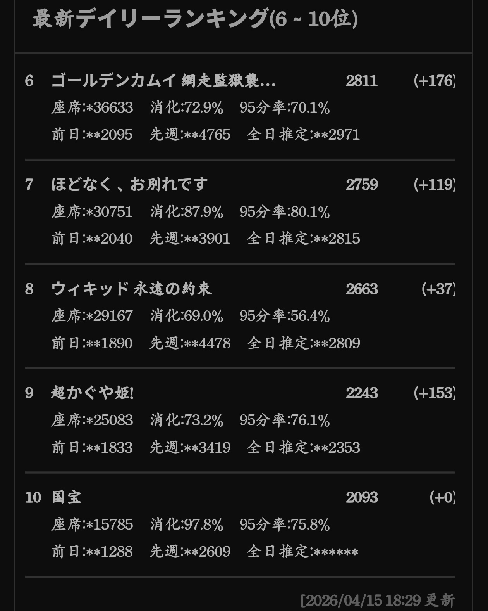

> **羊狼总动员0301** 2026-04-15 18:29:56：周三是优惠日
>
> **用户007🌀** 2026-04-15 21:17:35：辉夜是特别料金，除了情侣票不适用任何优惠
>
> **羊狼总动员0301** 2026-04-16 11:15:42：但是周三的影院客流量本身会大一些
>

---
### 367楼 · shdhvisjsb
Lv.1 · 2026-04-15 20:02

太夸张了，还在发力啊\[喷\]

---
### 368楼 · 用户007🌀
Lv.9 · 2026-04-15 23:46 · 赞 5

虽然票房因为排片减少多少有点挣扎，但众筹这边像是坐了火箭一样。昨天凌晨才到了2000%，不到两天时间又增加了100%+。看了一圈评论真的有不少新入坑观众不知道有这个活动，或者以为这玩意是同人的\[阴险\]

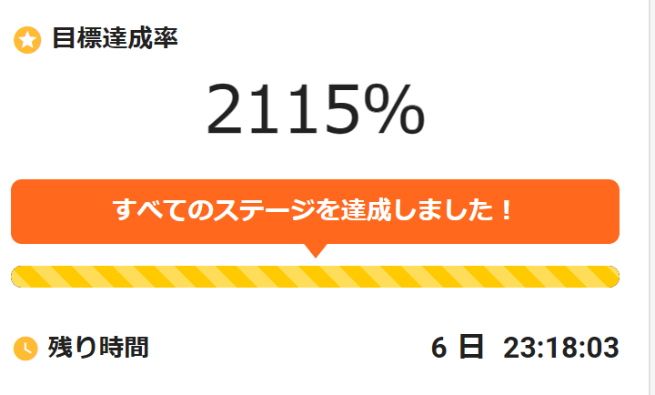

> **龍HCL** 2026-04-16 06:58:07：新活安排下吧！
>

---
### 369楼 · 龍HCL
Lv.14 · 2026-04-16 06:34

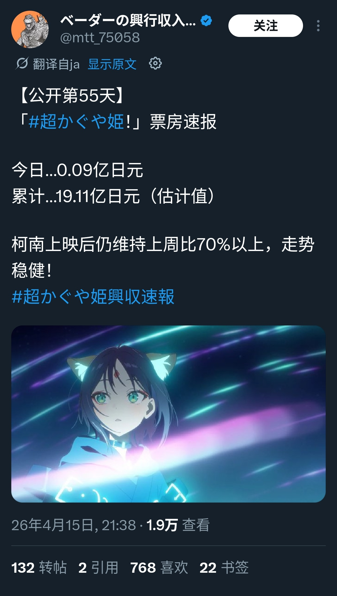

---
### 370楼 · 龍HCL
Lv.14 · 2026-04-16 06:49

明天坐席3.5w！还是不敢去电影院网站看坐席预约情况了！越看越感觉要凉\[泪\]

---
### 371楼 · 用户007🌀
Lv.9 · 2026-04-16 07:25 · 赞 3

明天有东宝发行绫濑遥主演的新片上映，开了 300 多馆，还有一个日摇 live 大电影，柯南的排片都被挤了，哆啦席位只比辉夜多 1w 不到，放一个月以前哪敢想啊\[阴险\]

---
### 372楼 · 龍HCL
Lv.14 · 2026-04-16 08:56

水下！下周还能和大佬们并排吗？

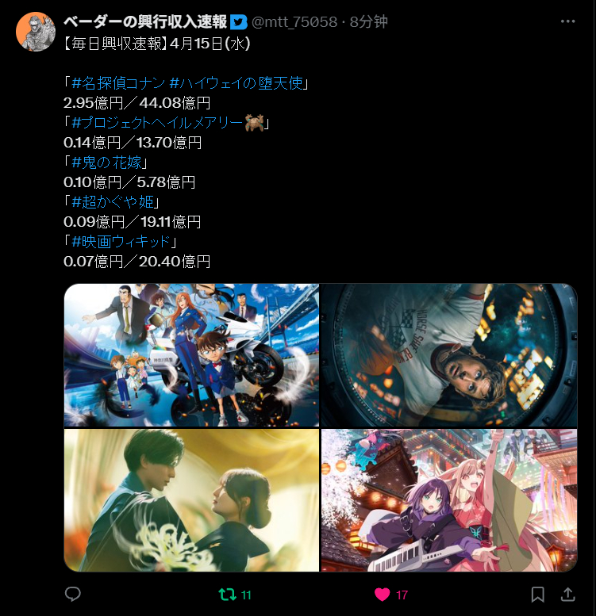

---
### 373楼 · 羊狼总动员0301
Lv.15 · 2026-04-16 11:15 · 赞 6

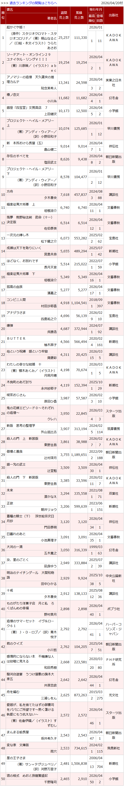

> **龍HCL** 2026-04-16 12:39:50：好像是最高单周？
>
> **用户007🌀** 2026-04-16 13:07:58：这周差不多是 3 月总销量的一半
>

---
### 374楼 · 龍HCL
Lv.14 · 2026-04-16 22:51

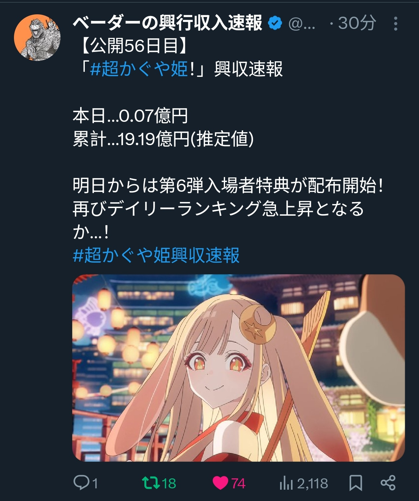

---
### 375楼 · 龍HCL
Lv.14 · 2026-04-17 08:22 · 赞 3

又是改网址搞出来的？

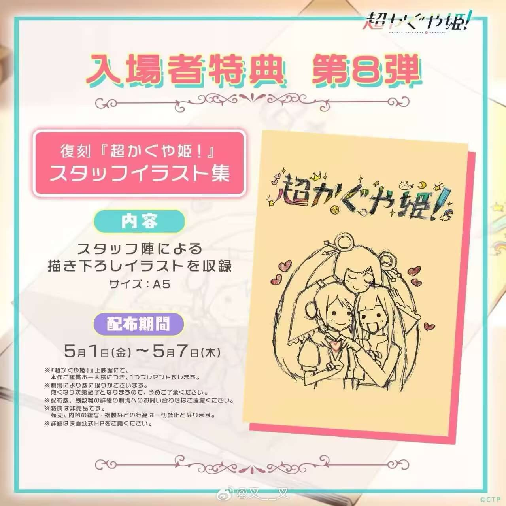

---
### 376楼 · 用户007🌀
Lv.9 · 2026-04-17 08:50 · 赞 2

双引擎是真的草台，一点教训都没吸取\[阴险\] 
下周五开始是世界第一的公主殿下的卡纸，下下周五一黄金周是第一弹特典复刻，倒勾好似喵\[吐舌\]

> **用户007🌀** 2026-04-17 08:52:41：第一弹特典复刻可能就是馆长说的第一波大的，黄金周可能有另一个大的接班开幕音声，过完黄金周就应该结束了，改序号查不到后续特典
>
> **龍HCL** 2026-04-17 10:23:38：下一弹有没有图？
>
> **龍HCL** 2026-04-17 12:16:14：怎么改的？我怎么试不出来？还是说把漏洞补了？
>
> **用户007🌀** 2026-04-17 13:02:05：找到第六周特典的图片链接，把文件名第一个数字 6 改成 7 和 8 就有了
>

---
### 377楼 · 龍HCL
Lv.14 · 2026-04-17 12:33 · 赞 5

要管不住手了！

> **一如既往的路过** 2026-04-17 13:20:47：话说出这种周边是走分成还是一次买断
>
> **龍HCL** 2026-04-17 13:22:01：希望走分成吧！看有没有大佬懂吧！
>
> **ftghyw** 2026-04-18 09:30:45：一般是走分成
>

---
### 378楼 · 用户007🌀
Lv.9 · 2026-04-17 13:12 · 赞 8

这周五柯南的势头被两部新片钳制了，不说先周比，连前日比都没维持住，从东宝的排片操作、观众反响和实际票房表现来看，似乎是准备打窝等明年憋个大的了，这也给了其他片喘息之机，今天辉夜已经超过上周五同时段。

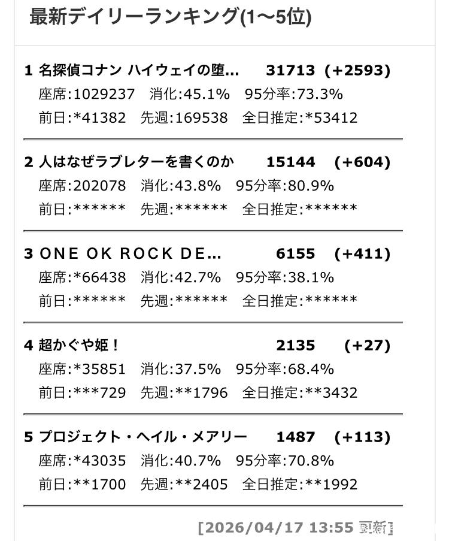

---
### 379楼 · 用户007🌀
Lv.9 · 2026-04-17 17:02 · 赞 9

这周的开幕音声有刀… 
时间线是十年前 
辉夜问八千代直播有没有能爆火的方法，八千代回答说多记住一些开心或者值得纪念的事情，这样就能找到最珍贵的事物了。辉夜说自己因为觉得太麻烦，所以什么都记不住。 
\[酷\]

---
### 380楼 · 某不科学的FF君
Lv.1 · 2026-04-17 17:18 · 赞 9

cut这期山下访谈跟之前2.3月早期出的杂志访谈有点不一样，之前说是希望赶紧去做下一部原创，这次虽然也提到了原创，但是说还要做超辉夜相关的项目，『超かぐや姫！』関連のことをまだまだやる予定もありますし、それ以外のオリジナルの企画もやっていきたいなと思っているんですけど……。卧槽这不会是要扩充了吧

> **龍HCL** 2026-04-17 17:31:35：扩充吧！喜欢！
>
> **一如既往的路过** 2026-04-17 20:00:03：yysy，希望他是真心想做，而不是赶鸭子上架。。。
>
> **用户007🌀** 2026-04-17 20:51:36：夏吉的专访也在暗示有后续作品
>

---
### 381楼 · 用户007🌀
Lv.9 · 2026-04-17 22:16 · 赞 1

今天收盘是上周五的1.3倍，大盘压力是否缓解看明天了。

---
### 382楼 · 龍HCL
Lv.14 · 2026-04-18 08:20 · 赞 2

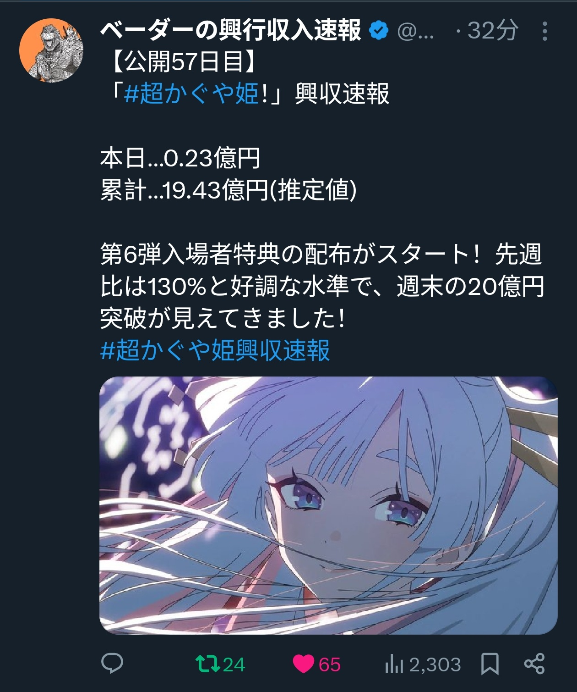

---
### 383楼 · 龍HCL
Lv.14 · 2026-04-18 10:41 · 赞 1

这两波来看！大盘应该好起来了！

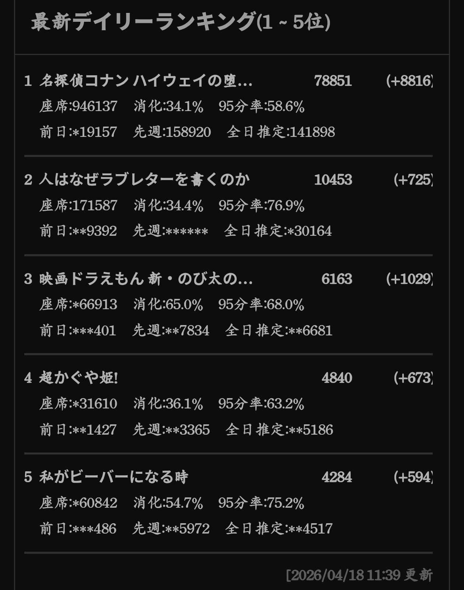

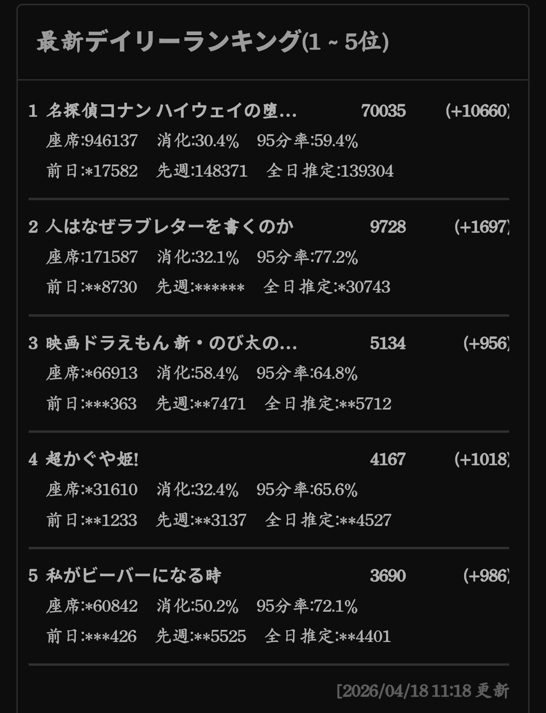

---
### 384楼 · 用户007🌀
Lv.9 · 2026-04-18 10:50 · 赞 3

1\.4倍先周比，强劲复苏

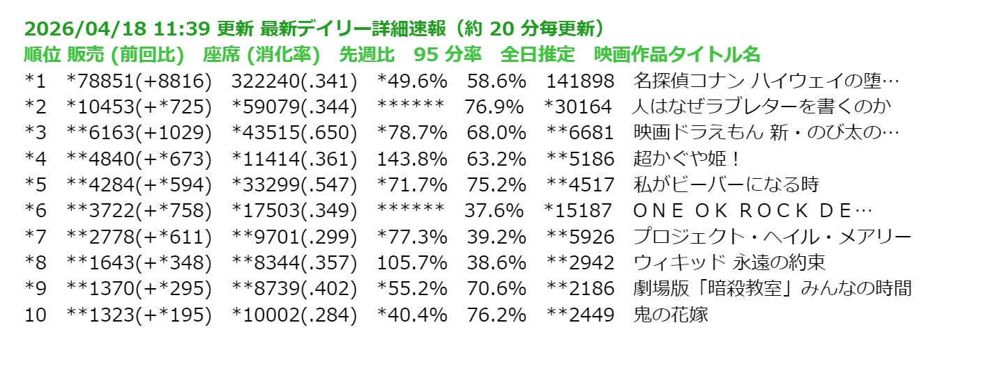

> **龍HCL** 2026-04-18 12:15:38：说不定今天就能20亿！
>
> **用户007🌀** 2026-04-18 12:24:27：乐观估计下周能超小圆了，配合后续黄金周活动能摸到更高一些
>
> **龍HCL** 2026-04-18 18:45:40：1\.4可能是假的\[泪\]
>
> **用户007🌀** 2026-04-18 19:52:50：1\.2 也可以了
>

---
### 385楼 · 龍HCL
Lv.14 · 2026-04-18 22:51 · 赞 3

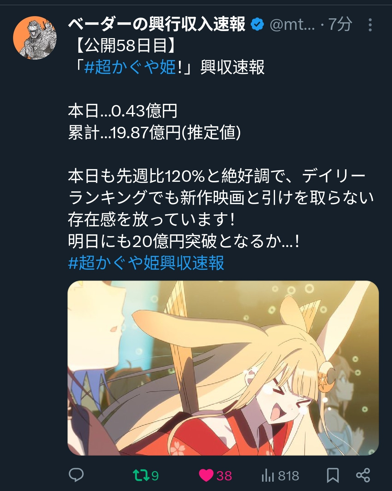

---
### 386楼 · 龍HCL
Lv.14 · 2026-04-19 07:53 · 赞 6

刷推比我自己去查，心情好多了！

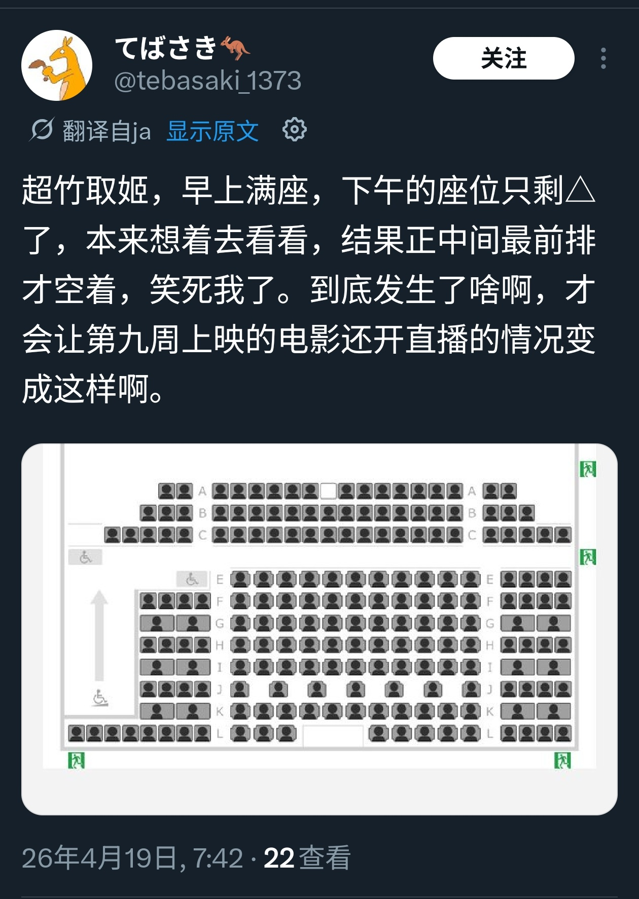

---
### 387楼 · 龍HCL
Lv.14 · 2026-04-19 10:26

记录一下！也许是最今天高先周比！

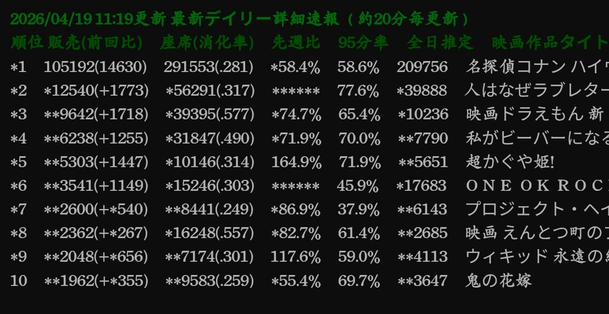

---
### 388楼 · 用户007🌀
Lv.9 · 2026-04-19 10:44 · 赞 2

1\.7倍先周比，95分率还挺高，除了那些特殊场次是预定满了，其他影院顺便来看的比例也挺高的

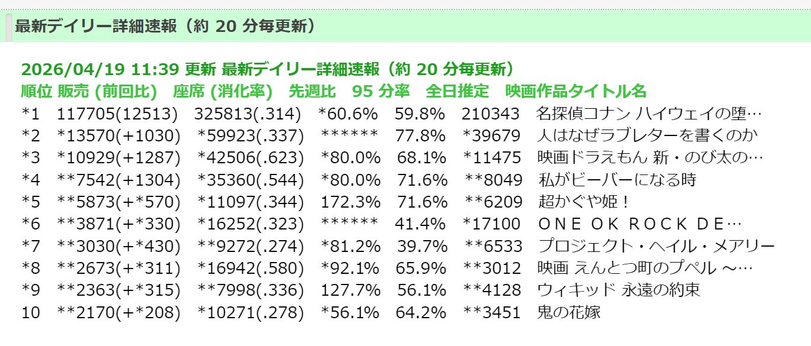

> **龍HCL** 2026-04-19 10:47:01：刚想发下！看看今天最高能到多少吧！
>
> **用户007🌀** 2026-04-19 10:50:59：差不多中午预测博主就该开20e香槟了，山下成为继宫崎骏、高畑勋、细田守、新海诚后，第五个进入20亿票房俱乐部的原创动画电影导演
>
> **龍HCL** 2026-04-19 10:58:42：期待！这名头挺好的！
>

---
### 389楼 · 龍HCL
Lv.14 · 2026-04-19 11:02 · 赞 2

还在继续冲，记录到最高吧！

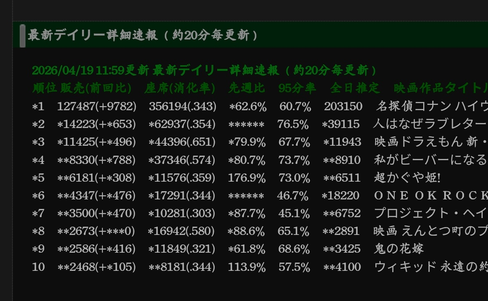

> **龍HCL** 2026-04-19 11:24:18：ok了！这就是最高了！
>

---
### 390楼 · 龍HCL
Lv.14 · 2026-04-19 11:16 · 赞 13

没想到官方先发！

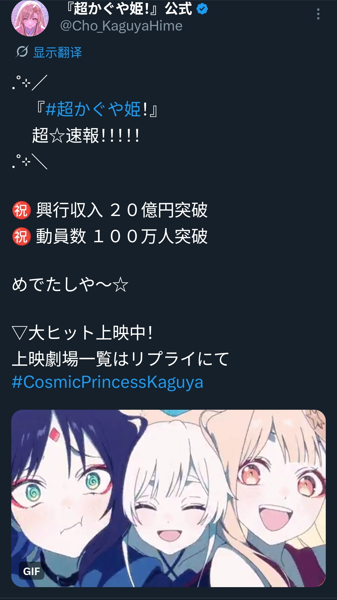

> **一如既往的路过** 2026-04-19 11:49:36：整挺好
>

---
### 391楼 · 沙漠天使
Lv.5 · 2026-04-19 11:37

有没有大佬关注过网飞现在累计播放量多少了\[小乖\]

---
### 392楼 · 用户007🌀
Lv.9 · 2026-04-19 12:02 · 赞 2

双引擎老板发了句 夢ならば覚めないで 
这句话来自于经典名曲《小さな恋のうた (小小恋歌)》的歌词 
不会要做这首歌的翻唱和mv吧，歌词还挺贴的\[阴险\]

> **用户007🌀** 2026-04-19 12:07:29：ほら/あなたにとって/大事な人ほど/すぐそばにいるの（看吧/对你而言/最重要的人/已经在你身边了）　｜　二人は歩く 暗い道でも 日日照らす月（两个人同行即使是昏暗的道路也有照亮我们的月光）
>
> **龍HCL** 2026-04-19 12:11:24：也许联想过头了2333
>
> **用户007🌀** 2026-04-19 12:13:33：\[阴险\]总得有点新活吧。这是山本转发20e速报的感言，我觉得或许是一个暗示
>

---
### 393楼 · 某不科学的FF君
Lv.1 · 2026-04-19 14:58 · 赞 3

所以会是啥呢。不会扩成一个季度的动画吧

> **龍HCL** 2026-04-19 16:13:35：来个大的吧！
>
> **迷人大白菜** 2026-04-19 22:52:06：有这样的先例吗？
>
> **煞觉** 2026-04-19 23:37:00：鬼灭吧
>

---
### 394楼 · 龍HCL
Lv.14 · 2026-04-19 21:24 · 赞 1

最后和昨天基本没区别！

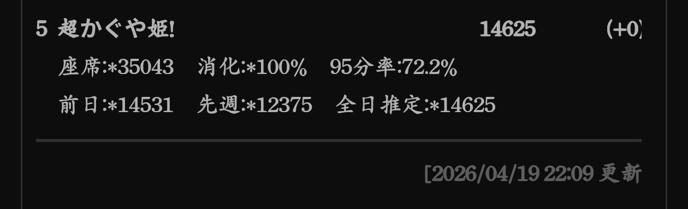

---
### 395楼 · 龍HCL
Lv.14 · 2026-04-19 23:04 · 赞 5

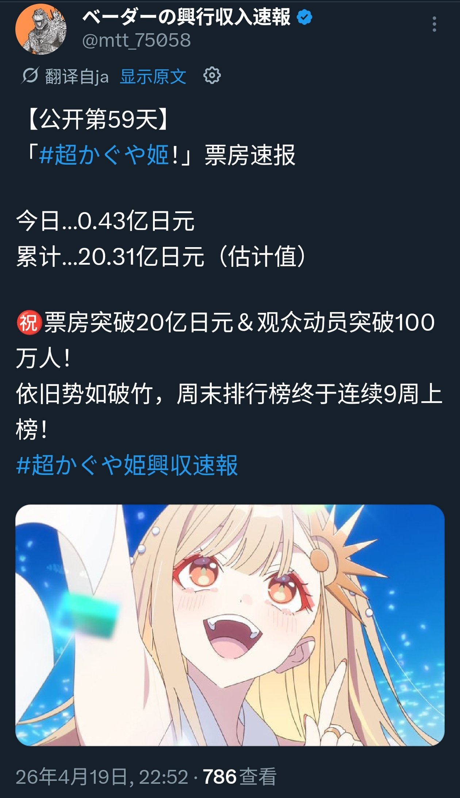

---
### 396楼 · 一如既往的路过
Lv.6 · 2026-04-20 00:11 · 赞 5

临近结束，众筹速度要起飞了，截个图的功夫就涨了1%

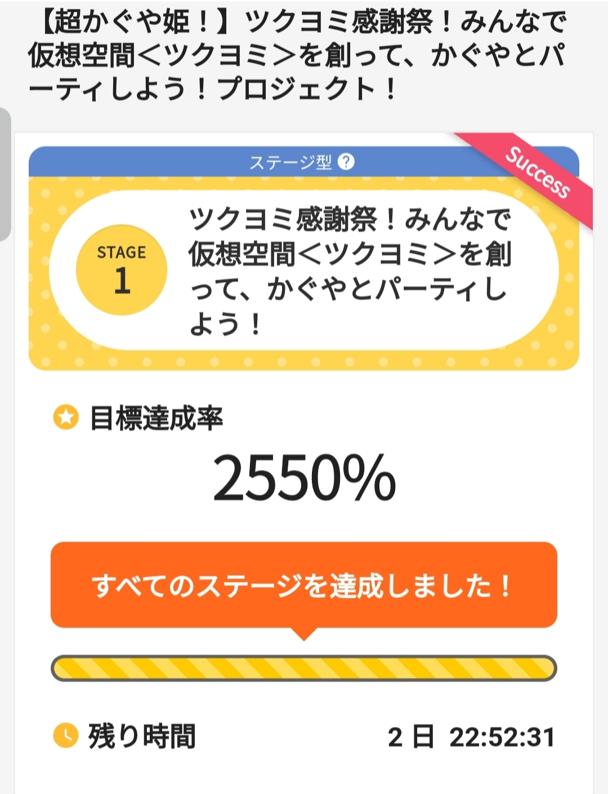

> **一如既往的路过** 2026-04-20 00:11:39：发完贴又涨了1%
>

---
### 397楼 · 龍HCL
Lv.14 · 2026-04-20 08:13 · 赞 1

水下！

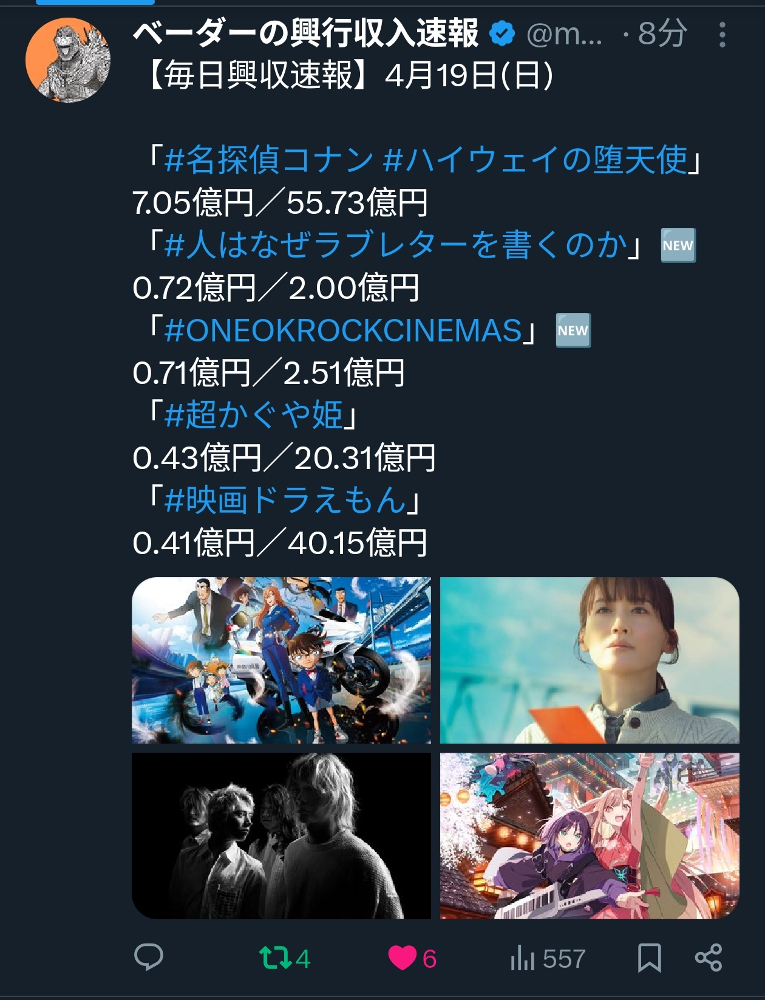

---
### 398楼 · 用户007🌀
Lv.9 · 2026-04-20 11:34 · 赞 8

万年老五的含金量，肘赢了皮克斯和拯救计划\[阴险\]，已经不能单纯用特典效应来解释了。另外今天不当水鬼了，直接爬进前十。

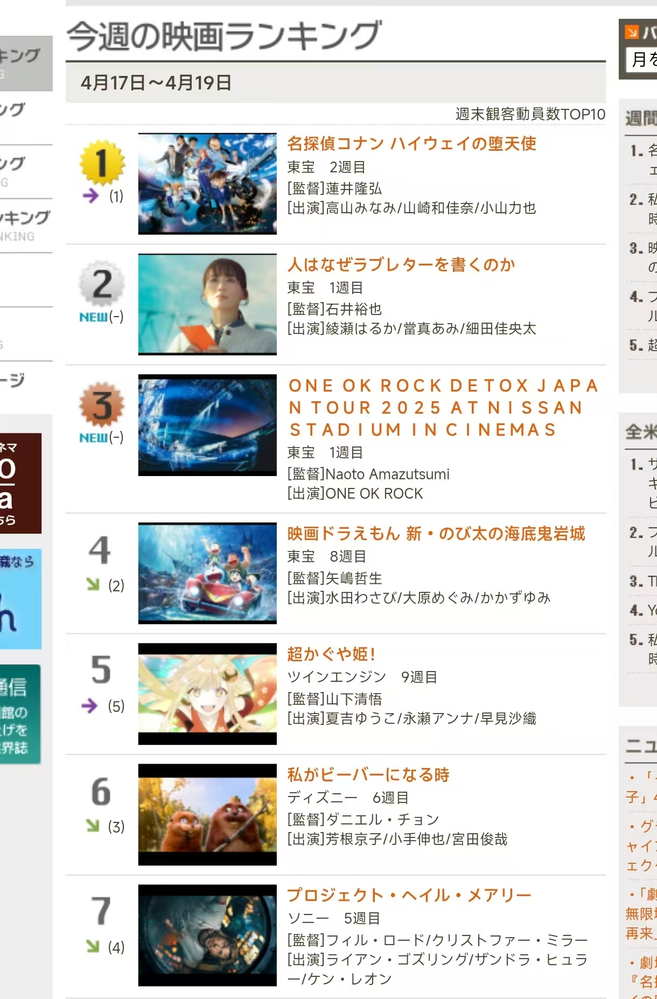

> **龍HCL** 2026-04-20 13:19:04：今天比上周上座啊！感觉还行！
>

---
### 399楼 · 用户007🌀
Lv.9 · 2026-04-20 14:52 · 赞 1

另外这周排片也明显回暖了，有人反映附近影院的排片从一天一场增加到了一天三场，在票房跟踪站点上每天坐席比上周多了1.2W，坐席数排名从14升到第8。院线总算舍得把一些赔钱货砍了。

---
### 400楼 · 用户007🌀
Lv.9 · 2026-04-20 15:10 · 赞 2

3週連続で5位をキープしている『超かぐや姫！』（ツインエンジン）は、累計で動員102万人、興収20億円を突破し、Netflixで先行配信されているなかでの異例のヒットとなっている。 
终于给画面了，还多加了一句“成为在网飞先行播出情况下的异例热门作品。”

页码：[1–100 楼](thread.md) · [101–200 楼](thread_2.md) · [201–300 楼](thread_3.md) · **301–400 楼** · [401–500 楼](thread_5.md) · [501–600 楼](thread_6.md) · [601–700 楼](thread_7.md) · [701–800 楼](thread_8.md)

---

[⬆ 本页顶部](#top)　·　[⏬ 最新的楼层](thread_8.md#bottom)
