

# 【动画讨论&amp;追踪】超时空辉夜姬

- 贴吧: 名作之壁吧　楼主: inting1　发帖: 2026-02-21 19:38:46
- 原帖: https://tieba.baidu.com/p/10504053776　抓取时间: 2026-09-28 06:12:51　楼层数: 642　（时间均为北京时间）

[⬇ 本页底部](#bottom)　·　[⏬ 最新的楼层](thread_8.md#bottom)

页码：[1–100 楼](thread.md) · [101–200 楼](thread_2.md) · [201–300 楼](thread_3.md) · [301–400 楼](thread_4.md) · **401–500 楼** · [501–600 楼](thread_6.md) · [601–700 楼](thread_7.md) · [701–800 楼](thread_8.md)

---
### 401楼 · 龍HCL
Lv.14 · 2026-04-20 17:25

日期有啥说法？

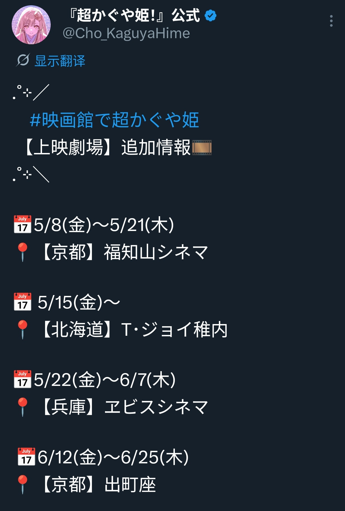

> **创幻之剑** 2026-04-21 13:10:55：没说法，日本座位是一周一调整，除了受祝日影响，新片基本都是周五上映，所以老片的增减座位和增减馆同样也是从周五开始。唯一可能就说明一点吧，这片到六月底为止都会保持一定的上映规模
>

---
### 402楼 · 用户007🌀
Lv.9 · 2026-04-20 20:06 · 赞 6

真的。有人。很认真地。在冲。2943%。

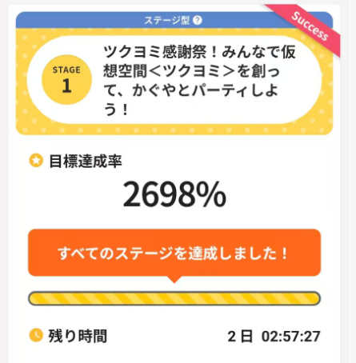

> **一如既往的路过** 2026-04-20 20:27:22：昨天就看x上有人讨论要冲数字，甚至有人发了土豪发言(机翻没错的话)
>
> **某不科学的FF君** 2026-04-20 21:55:59：真到的话，就接近3亿了。我自己估觉得100%是1000万日元
>
> **龍HCL** 2026-04-20 22:47:19：我去！这么豪的吗？
>
> **煞觉** 2026-04-20 23:32:56：2943这数字有什么意义吗
>
> **一如既往的路过** 2026-04-20 23:43:50：之前官方玩梗：2——ツ，9——ク，4——ヨ，3——ミ；连起来就是“月读”(ツクヨミ)
>
> **用户007🌀** 2026-04-20 23:46:11：2=two=ツ（tsu），9=ク（ku），4=ヨ（yo），3=ミ（mi），月读的谐音
>

---
### 403楼 · 用户007🌀
Lv.9 · 2026-04-21 00:38 · 赞 4

还剩120%了。当地时间晚上7点便利店支付就提前停止了，虽然对刷卡支付的影响不大

> **用户007🌀** 2026-04-21 11:22:21：还差40%了，估计能抢在便利店支付截止前达成
>

---
### 404楼 · 龍HCL
Lv.14 · 2026-04-21 06:10 · 赞 2

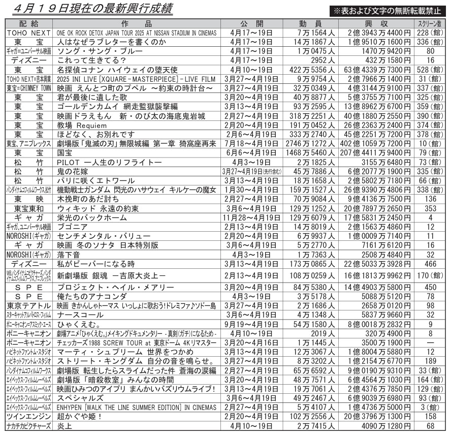

---
### 405楼 · 龍HCL
Lv.14 · 2026-04-21 10:13

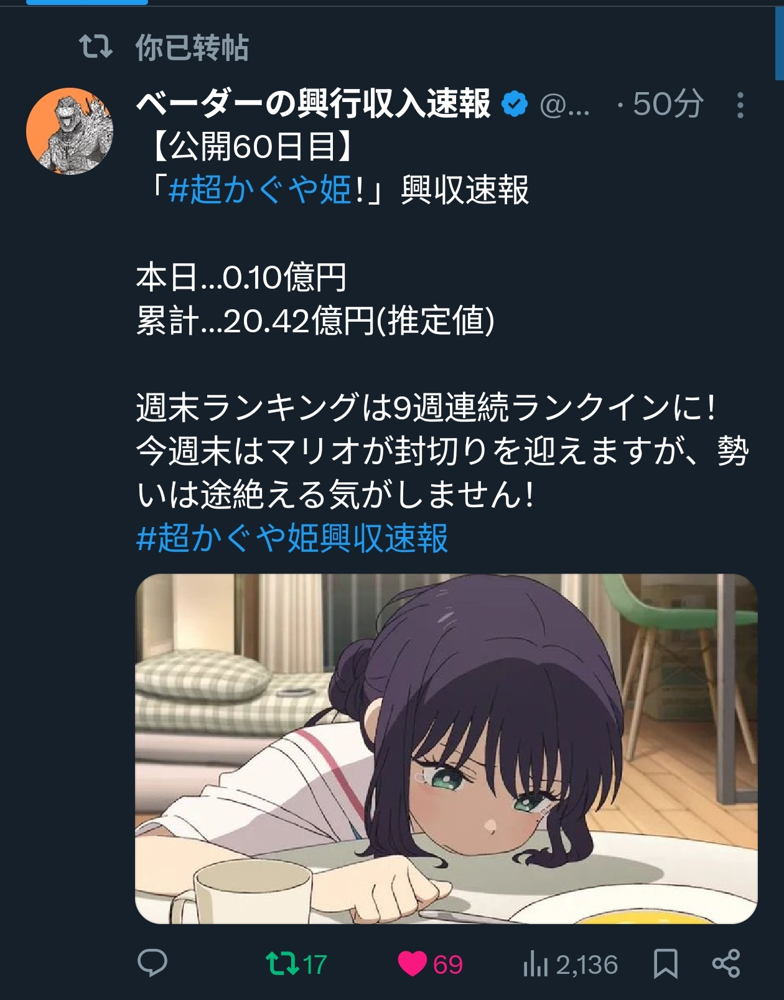

---
### 406楼 · 用户007🌀
Lv.9 · 2026-04-21 10:50 · 赞 3

\[阴险\]周五水管工师傅就要和死神小学生上演诸神之战了，不知道打出世界第一公主殿下和三人音声牌的辉夜能否顶住

> **龍HCL** 2026-04-21 14:53:15：吓死宝宝了！
>
> **用户007🌀** 2026-04-21 17:25:29：20亿已经达成所有预期了，就等着破一个20.8亿完美替代小圆空出来的档期了\[阴险\]
>

---
### 408楼 · 用户007🌀
Lv.9 · 2026-04-21 13:41 · 赞 1

2943 了，\[呵呵\]官方还能说话么

---
### 409楼 · 煞觉
Lv.6 · 2026-04-21 14:00 · 赞 1

会有线下表演？

---
### 410楼 · 煞觉
Lv.6 · 2026-04-21 16:54 · 赞 3

众筹达到3000%，官方当初有想到这个结果吗？

> **一如既往的路过** 2026-04-21 17:21:05：别逗你140%上限笑了(
>

---
### 411楼 · 用户007🌀
Lv.9 · 2026-04-21 17:22 · 赞 2

黄金周搞了和三连休一样的同步视听评论活动，抽选赠品是第4-5弾翻唱曲绘卡片5张一组，实在是没活了\[呵呵\]还以为有大的

---
### 412楼 · 煞觉
Lv.6 · 2026-04-21 17:28 · 赞 1

为什么有人说这公告是2040年的时间线

> **用户007🌀** 2026-04-21 18:26:08：B站已经有人转载了，开头彩叶报幕情绪很稳定，而且声线确实很像10年后的。辉夜抢话说要办一场最了解彩叶的人是谁的竞赛，不出意外就是10年后的辉八争风吃醋小情调了
>

---
### 413楼 · 一如既往的路过
Lv.6 · 2026-04-21 20:56 · 赞 1

众筹一到晚上就加快，我甚至产生了一种会冲到4000%的幻觉\[阴险\]

> **浅水只** 2026-04-22 22:26:15：不是幻觉，已经冲到3983％了\[阴险\]
>
> **一如既往的路过** 2026-04-22 22:38:16：看到了，已经过了
>

---
### 414楼 · 龍HCL
Lv.14 · 2026-04-21 22:15 · 赞 1

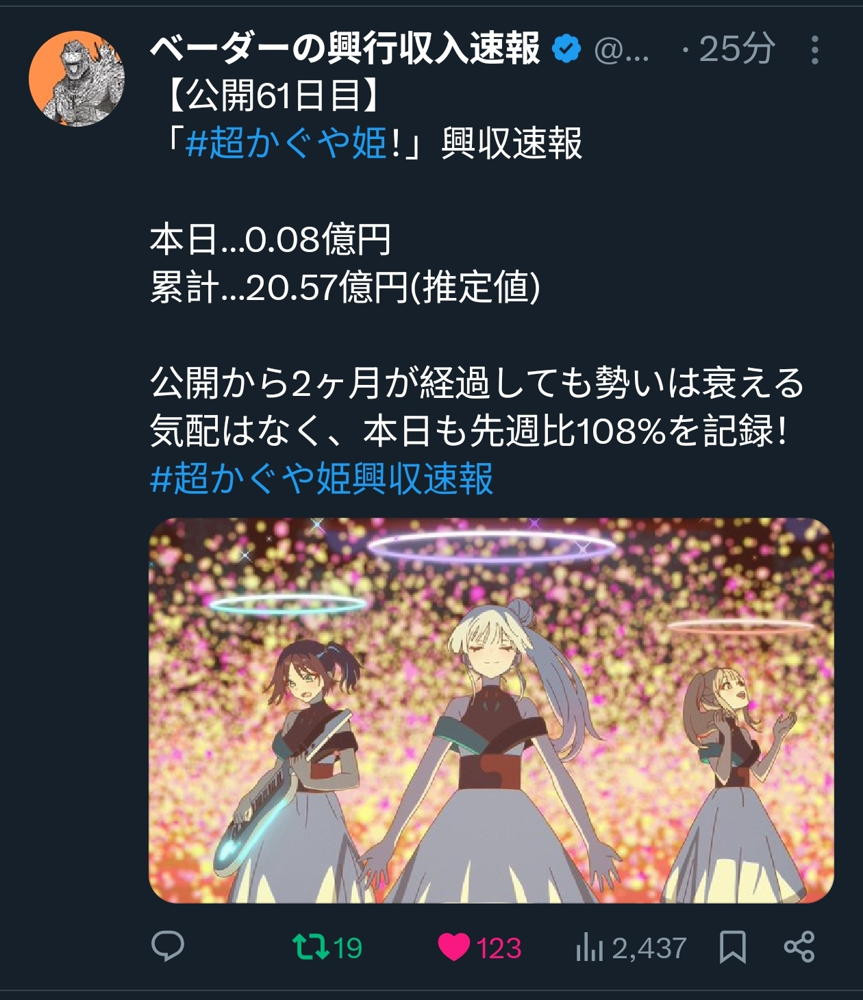

---
### 418楼 · 龍HCL
Lv.14 · 2026-04-22 18:51 · 赞 2

记录下！话说这个众筹比例是不是动画众筹最高的山了？希望结束官方能给个金额！

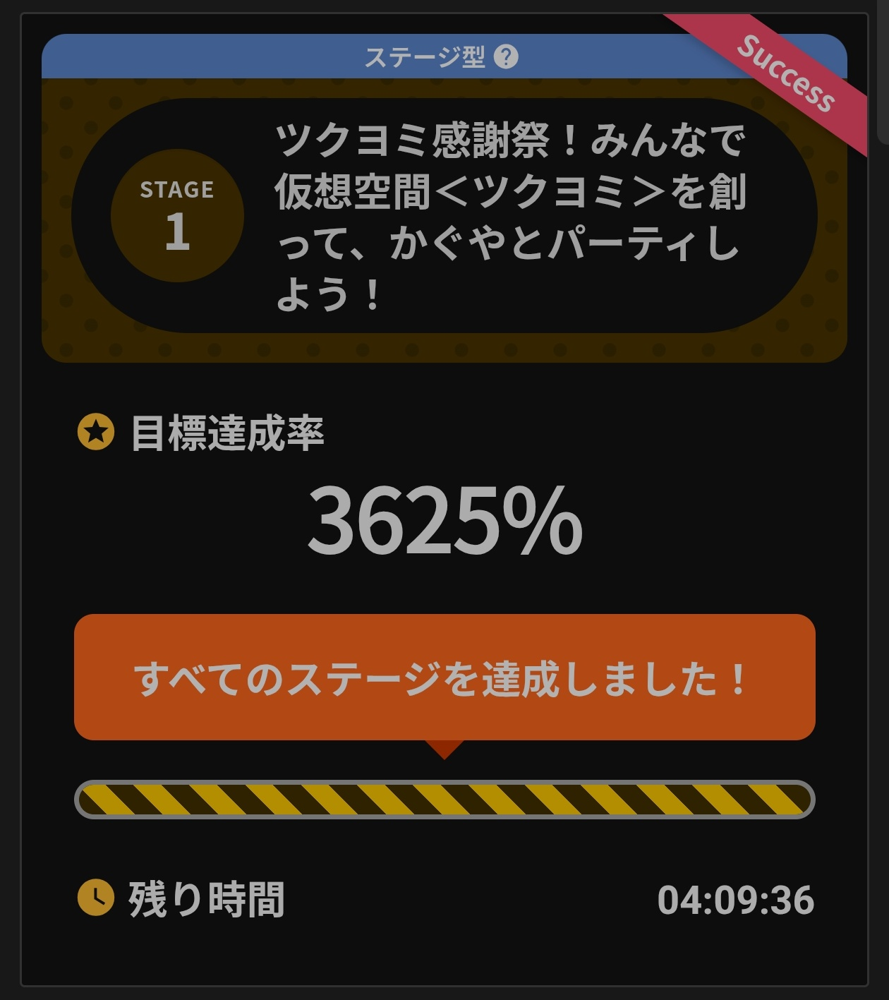

---
### 419楼 · 用户007🌀
Lv.9 · 2026-04-22 19:41 · 赞 1

今天下午到现在的变化曲线。石油佬们在冲3776%，估计北京时间九点多就到了。

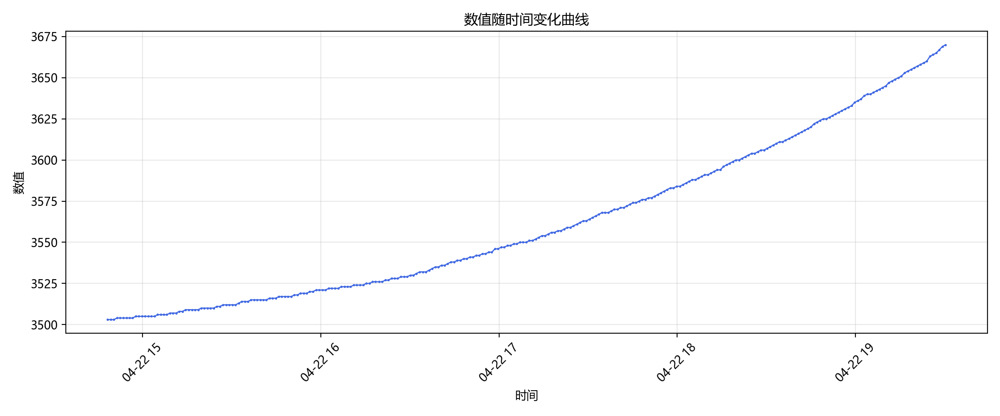

---
### 420楼 · 龍HCL
Lv.14 · 2026-04-22 22:34 · 赞 2

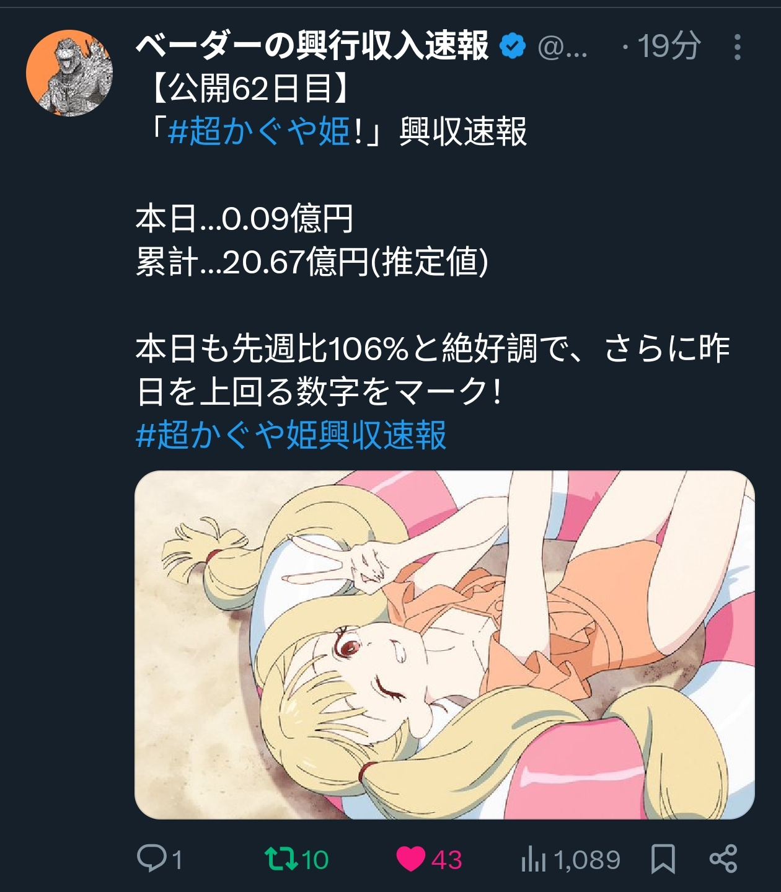

---
### 421楼 · 龍HCL
Lv.14 · 2026-04-22 23:00 · 赞 1

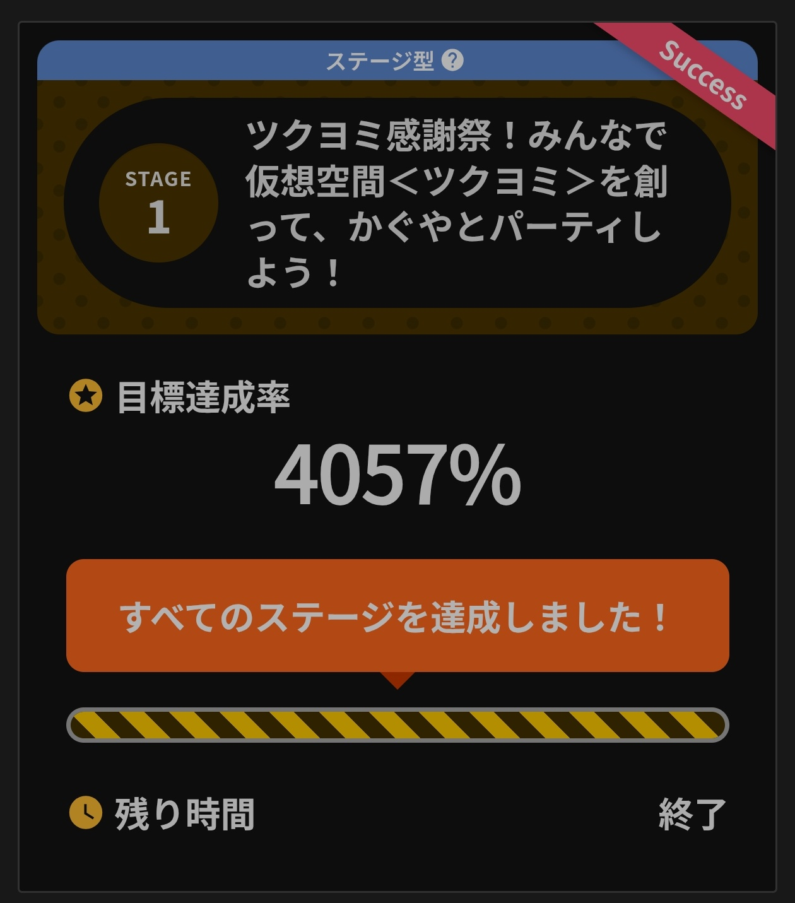

> **某不科学的FF君** 2026-04-22 23:06:16：估计4亿多日元
>
> **AdamXL07** 2026-04-23 00:03:53：应该快比电影本体的制作成本都高了…
>

---
### 422楼 · 用户007🌀
Lv.9 · 2026-04-22 23:15 · 赞 4

最后2小时soreosu（Animate众筹网站）支付系统卡爆了。到点的时候一度根本打不开，现在绝赞炎上中\[阴险\]

> **用户007🌀** 2026-04-22 23:23:53：从站点被卡爆且大量不重名用户吐槽最后几小时买不到就能看出，这个100%金额绝对不低
>
> **用户007🌀** 2026-04-22 23:29:12：这次大量用户搞得像今天才发工资一样挤在最后一刻下单，然后animate草台班子没做好服务器扩容和排队系统，一个众筹能看到日本人民族性笑话和日企IT水平笑话，值了\[吐舌\]
>
> **龍HCL** 2026-04-22 23:35:32：都挤在最后一刻买也挺那啥的！不过说明粉丝确实热情很高啊！
>

---
### 423楼 · 龍HCL
Lv.14 · 2026-04-23 06:51

惨烈！坐席只有2.4w了！

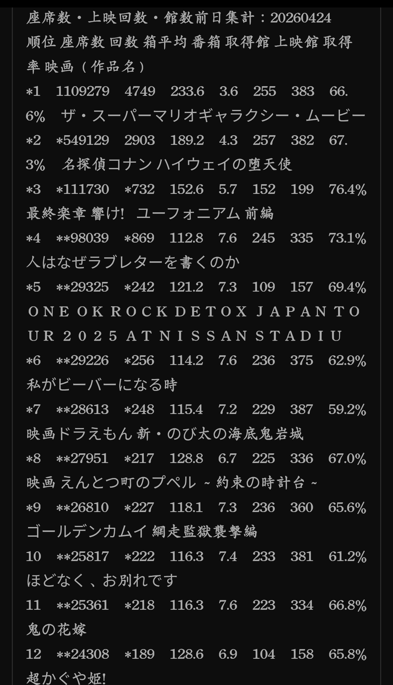

---
### 424楼 · 用户007🌀
Lv.9 · 2026-04-23 07:10 · 赞 1

\[阴险\]其实就是柯南上映当天的水平，甚至更好一点。柯南坐席直接腰斩了也是恐怖。倒是有一两部赔钱货还想垂死挣扎，是嫌自己年报赤字还不够难看吗

---
### 425楼 · 龍HCL
Lv.14 · 2026-04-23 11:13 · 赞 3

不到9k，要卖不动了吗？

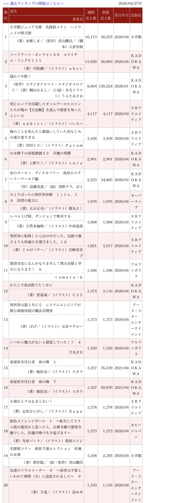

> **aptx星璇** 2026-04-23 13:01:44：发售3个月了还能一周出9k的数字都算卖不动的话其他轻小说都可以倒闭了\[阴险\]
>
> **白衣毛哥** 2026-04-23 15:07:04：该买的都买了,我的是不是也该发货了\[怒\]
>
> **龍HCL** 2026-04-23 15:12:49：我会员购买的还没补货呢\[阴险\]
>

---
### 426楼 · 龍HCL
Lv.14 · 2026-04-23 20:07 · 赞 2

后三天的先周比危！

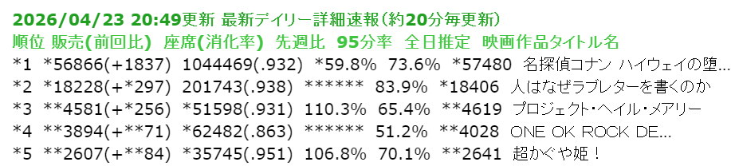

---
### 427楼 · 龍HCL
Lv.14 · 2026-04-23 23:03 · 赞 1

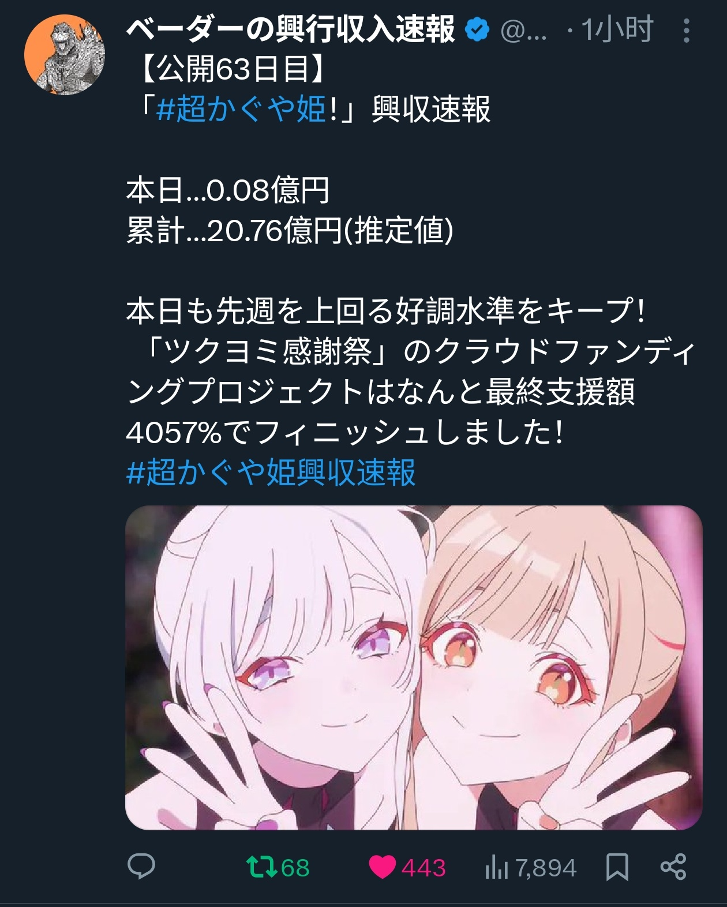

---
### 428楼 · 龍HCL
Lv.14 · 2026-04-24 11:20 · 赞 1

惨烈！明天坐席更少！

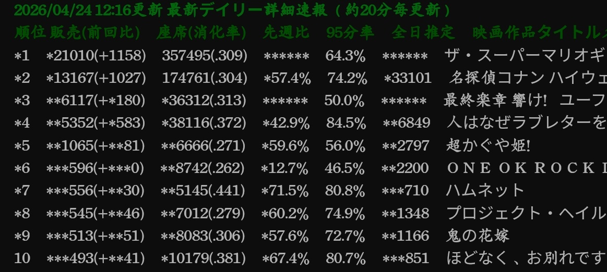

---
### 429楼 · 用户007🌀
Lv.9 · 2026-04-24 15:18 · 赞 6

这次开幕音声爆了个大的，把二创全部实锤了\[阴险\] 
彩叶初次登录月读的时候，八千代本人在场 
（以下内容支付 500 福币后解锁）

> **龍HCL** 2026-04-24 15:27:23：已支付500\[钱币\]！
>
> **用户007🌀** 2026-04-24 15:53:55：彩叶表面很冷静但实际激动得腿都在抖
>
> **惠春** 2026-04-24 16:06:39：再支付500福币\[吐舌\]
>
> **龍HCL** 2026-04-24 16:33:28：是十年后吗？
>
> **煞觉** 2026-04-24 16:38:27：500福币已支付
>
> **浅水只** 2026-04-24 18:17:08：\[吐舌\]
>

---
### 430楼 · 用户007🌀
Lv.9 · 2026-04-24 16:06 · 赞 9

彩叶（红温）：你这是侵犯我的用户隐私 
可怜的小菜叶哟，你好好想想，八千代想侵犯的真的只有你的个人隐私吗\[阴险\]（个人想法）

---
### 431楼 · 用户007🌀
Lv.9 · 2026-04-24 17:09 · 赞 5

背景是辉夜打断彩叶的话，要举办一个比拼谁最了解彩叶锦标赛，参赛选手当然只有辉八二人 
辉夜：彩叶被夸奖的时候会扭扭捏捏的，但真生气的时候会一言不发

> **用户007🌀** 2026-04-24 17:20:17：:然后八千代就爆了彩叶初登录的情形，给彩叶整红温了
>

---
### 432楼 · 用户007🌀
Lv.9 · 2026-04-24 17:21 · 赞 4

第二回合，辉夜：彩叶出门前会花很长时间整理刘海

> **煞觉** 2026-04-24 17:26:30：动画里还真有这幕
>
> **用户007🌀** 2026-04-24 17:27:38：福币不足
>
> **迷人大白菜** 2026-04-24 19:18:04：充值500，快马加编
>

---
### 433楼 · 用户007🌀
Lv.9 · 2026-04-24 21:14 · 赞 5

\[阴险\]辉夜还补了一句：这可是在虚拟世界见不到的哦

> **用户007🌀** 2026-04-24 21:17:16：\[阴险\]如果这是2030年时间线，是会对八千代打出真伤的
>
> **aptx星璇** 2026-04-24 22:23:02：回旋镖罢了\[阴险\]伤到了吗，自己当年打的怪不了别人.jpg
>

---
### 434楼 · 用户007🌀
Lv.9 · 2026-04-25 00:34 · 赞 4

\[阴险\]明天上座率很恐怖啊，随便点开一家偏远地区的都有50%以上坐席预约了，更别提立川主场的发声场次已经全满了。下周该把一些赔钱货出清了吧，特别是某位过气网红拍的玩意。

---
### 435楼 · 龍HCL
Lv.14 · 2026-04-25 06:28 · 赞 4

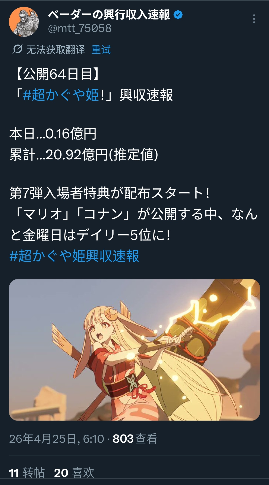

---
### 436楼 · 某不科学的FF君
Lv.1 · 2026-04-25 14:43 · 赞 2

感觉要当万年老五了

> **龍HCL** 2026-04-25 16:33:10：守住五位就满足了！
>
> **沙漠天使** 2026-04-25 17:55:42：真能一直守住5位，到6月底妥妥破30亿了
>

---
### 437楼 · 用户007🌀
Lv.9 · 2026-04-25 18:57 · 赞 3

\[阴险\]卧薪尝胆，周末单日终于超过蓝胖子了（虽然并没有什么意义）

---
### 438楼 · 龍HCL
Lv.14 · 2026-04-25 22:51 · 赞 6

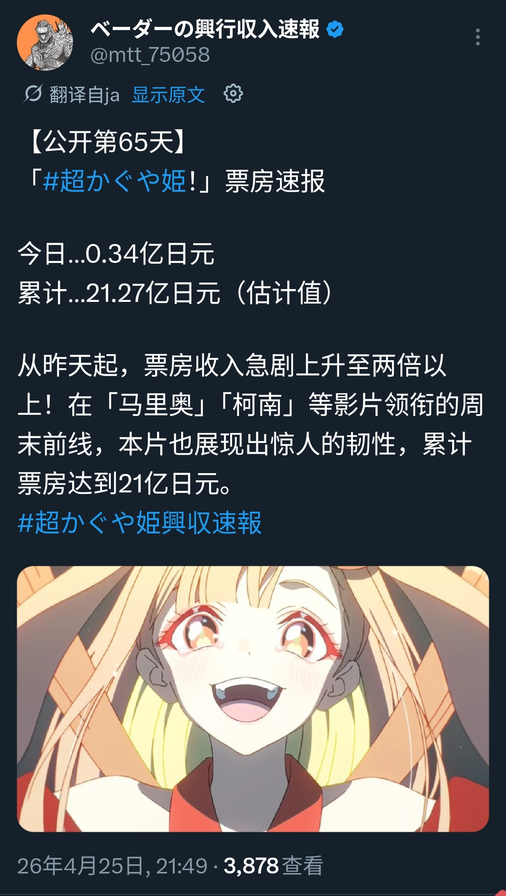

---
### 439楼 · 168bpm
Lv.5 · 2026-04-26 00:03 · 赞 3

馆长又在强调两个大的要来了,而且后面还会有更大的。目前只知道会复刻第一弹特典，不知道还会有啥大的\[呵呵\]

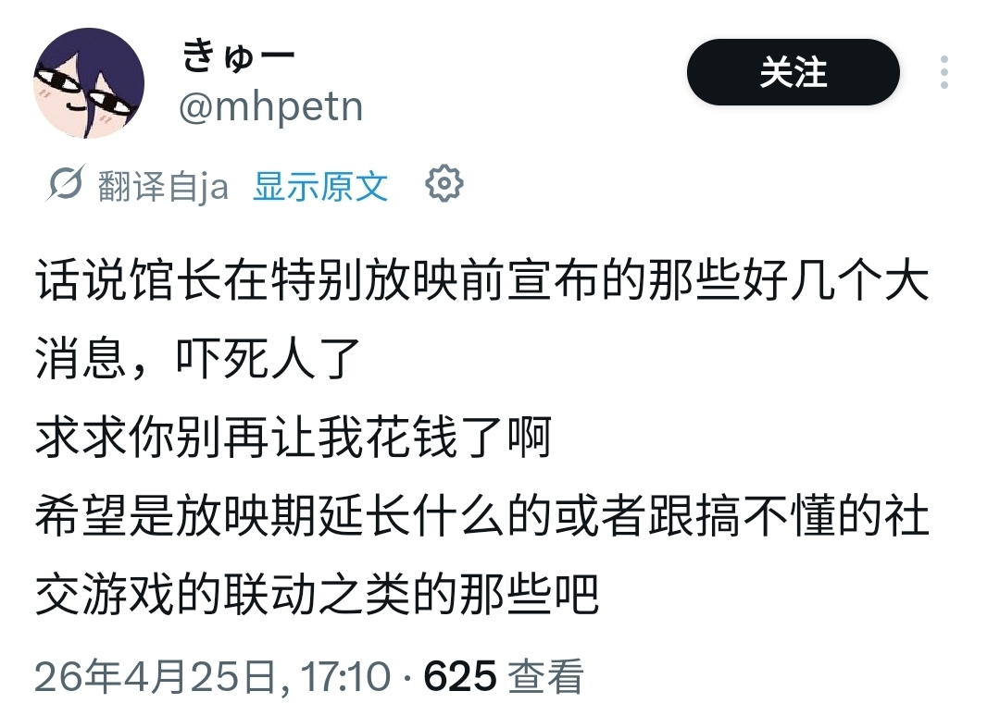

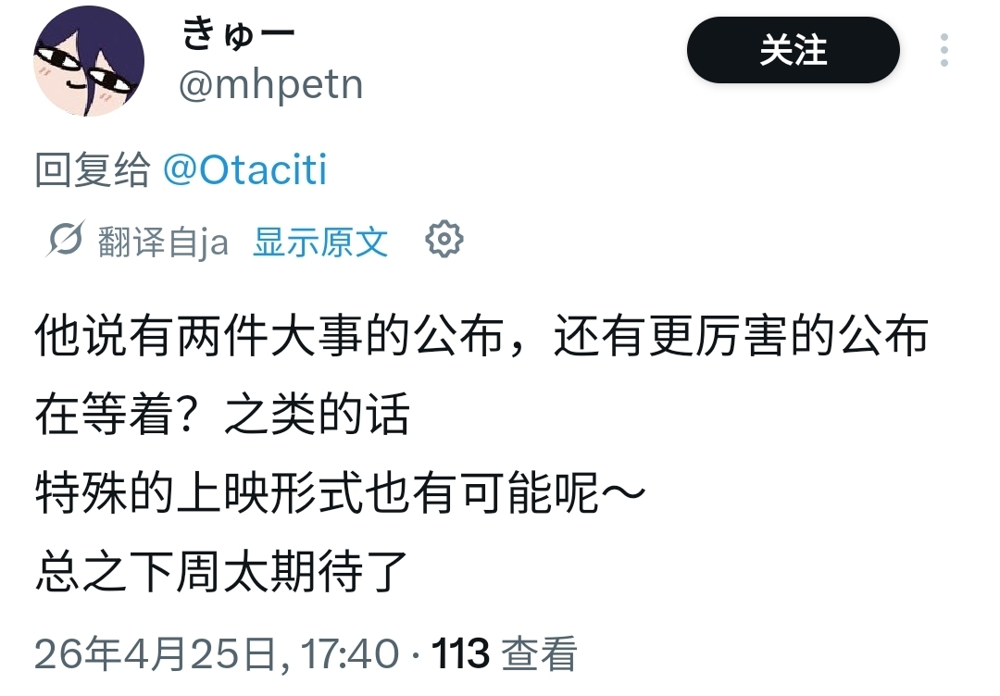

> **龍HCL** 2026-04-26 07:44:48：我已急哭！
>
> **一如既往的路过** 2026-04-26 12:23:50：众筹的最后1000%没公布新东西，这不得筹备个新活动
>

---
### 440楼 · 龍HCL
Lv.14 · 2026-04-26 07:45 · 赞 3

制作周期的消息浏览量好高啊！

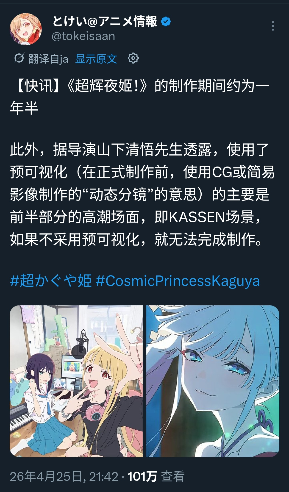

> **煞觉** 2026-04-26 10:20:35：一年半的制作时间，制作速度是有点快
>

---
### 441楼 · 龍HCL
Lv.14 · 2026-04-26 10:11 · 赞 1

今天比昨天上座率还强？

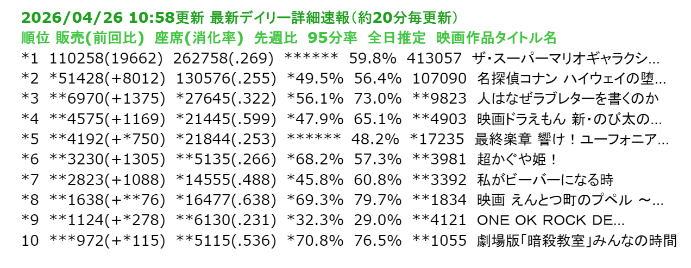

> **用户007🌀** 2026-04-26 10:16:53：坐席也比昨天少，等第8那个拿粉丝投资拍史的玩意爆坐席吧\[阴险\]
>

---
### 442楼 · 龍HCL
Lv.14 · 2026-04-26 18:37 · 赞 1

坐席怎么感觉黄金周也不行啊！感觉现在和东宝合作还来得及emmm...

---
### 443楼 · 用户007🌀
Lv.9 · 2026-04-26 20:11 · 赞 1

\[阴险\]黄金周的主角还是那两部，假期正是大人带小孩子出行的高峰，要打到大道磨灭为止了

---
### 444楼 · aptx星璇
Lv.8 · 2026-04-26 20:15 · 赞 1

黄金周还有360多馆的东宝新片坂本日常真人版要上，再加上柯南和马里奥，剩不了多少座席能分给其他片的，慢慢磨就是了

---
### 445楼 · 用户007🌀
Lv.9 · 2026-04-26 21:46 · 赞 2

\[阴险\]排片被砍麻了，记录都没过万。双引擎急需找到新的赢点

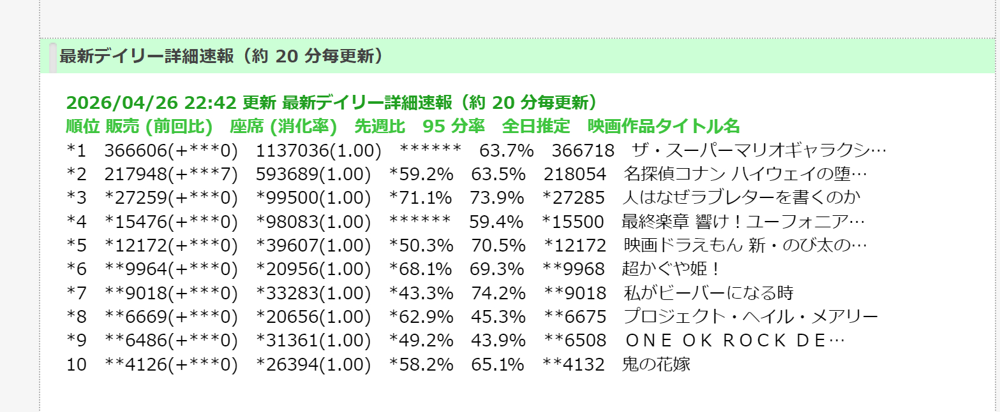

> **龍HCL** 2026-04-27 00:27:35：傍晚上座率太低了，白天看着都稳过万的\[泪\]
>

---
### 446楼 · 龍HCL
Lv.14 · 2026-04-27 00:28 · 赞 1

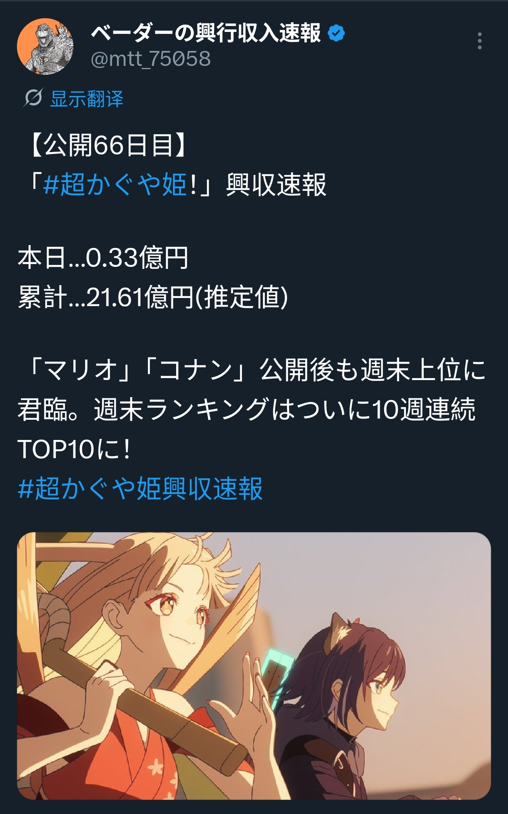

---
### 447楼 · 龍HCL
Lv.14 · 2026-04-27 12:38 · 赞 2

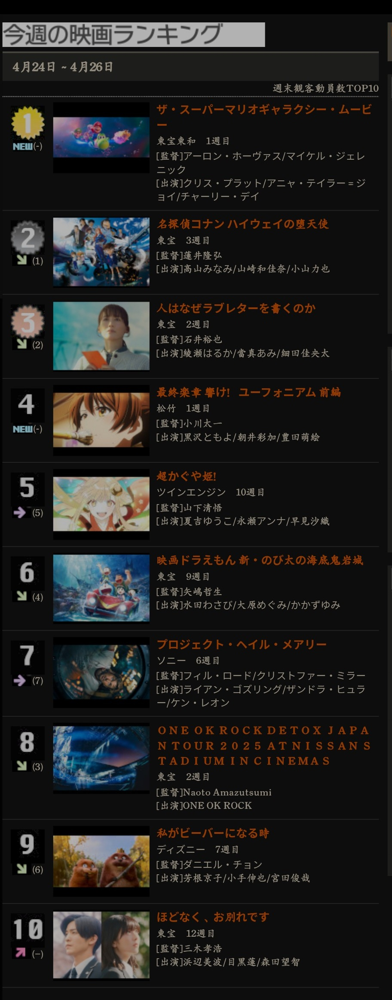

> **龍HCL** 2026-04-27 12:54:59：已知下周特典复刻小册子，问下周还能前十吗？
>

---
### 448楼 · 龍HCL
Lv.14 · 2026-04-27 17:46 · 赞 2

和扒出来的不一样！看来真的没了！

> **龍HCL** 2026-04-27 17:54:43：看来目标是25亿了！
>

---
### 449楼 · 用户007🌀
Lv.9 · 2026-04-27 17:47 · 赞 6

官方提前一天发布了第 8 弹特典 
和之前改序号泄露的图片的不同，这次明确了总量只有 15 万份（折合票房约 3 亿），并且删去了截止时间。没有意外的话，这就是最终特典。 
官方提前一天发这个，可能是为了给明天或者后天另一个大的公布，最大化热度。\[阴险\]

> **龍HCL** 2026-04-27 18:26:28：希望真的有大的！
>
> **某不科学的FF君** 2026-04-27 18:37:32：其实我感觉隔断时间可能还会发特典
>
> **某不科学的FF君** 2026-04-27 18:38:33：可能不是最终特典
>
> **龍HCL** 2026-04-27 19:11:01：不是最终，感觉也是倒数第二个了！没活了\[泪\]
>

---
### 450楼 · 龍HCL
Lv.14 · 2026-04-27 19:52 · 赞 2

推特评论里还有人觉得量少的！现在这两万坐席，坐满七天都发不完……所以说会给加坐席吧？！

---
### 451楼 · 用户007🌀
Lv.9 · 2026-04-27 19:53 · 赞 4

另外，官方提到这次的复刻和第一弹纸质上有区别，应该是为了大量印刷用了低一档的纸。这样做既打击了黄牛，又不至于把他们逼到狗急跳墙；同时不管是抢破头皮拿了第一弹特典的，还是没拿到的观众都能满意，确实是端水大师了\[阴险\]

---
### 452楼 · 龍HCL
Lv.14 · 2026-04-27 23:41

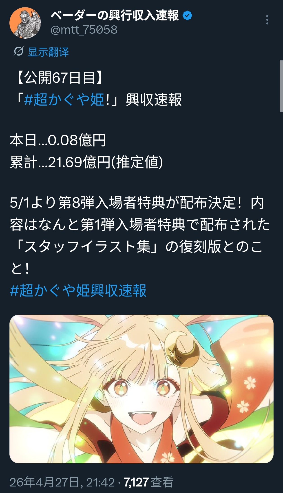

---
### 453楼 · 龍HCL
Lv.14 · 2026-04-28 06:24 · 赞 1

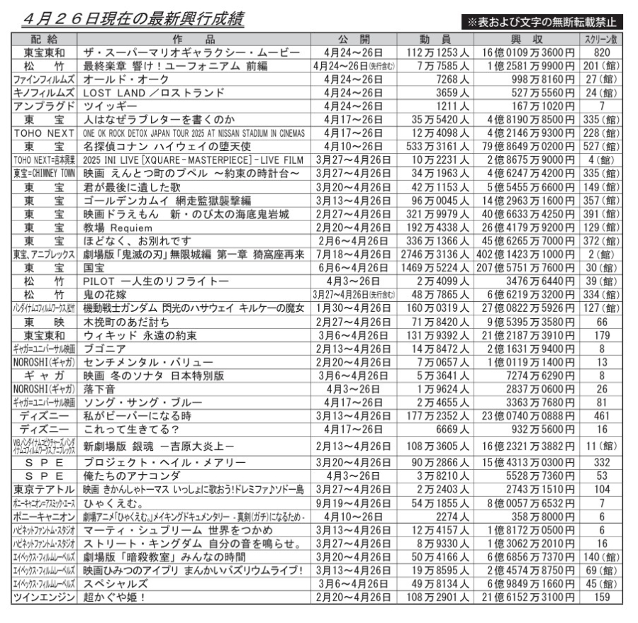

---
### 454楼 · 龍HCL
Lv.14 · 2026-04-28 06:26 · 赞 1

看了下明天的坐席，只剩1.4w了！这黄金周太难了……

---
### 456楼 · 用户007🌀
Lv.9 · 2026-04-28 07:09 · 赞 2

除了坂本日常上映，个别放映辉夜的独立影院 29 30 号休息也是原因之一

---
### 457楼 · 用户007🌀
Lv.9 · 2026-04-28 09:39 · 赞 6

另外，日本的黄金周虽然是从4月29开始，但放假时间不是完全连续的，4.29放1天（所谓的招核天蝗诞生日），4.30-5.1上班2天，5.2周六开始到周三连放5天（也就是所谓的五连休）。 
所以刚刚看5厕，有个很有意思的发现：一些院线为了最大化五连休期间的利益，自然会把这段时间的热门影片排片拉满。但有个问题：一些赔钱货电影和院线签了协议，约定了最低放映回数（或者坐席数），但片子一上映即暴死，院线只能以每天以很低的排片消耗这些放映回数，到黄金周还有一些没消耗完。于是一些影院决定在4.29-5.1这几天集中堆排片，把放映回数一次性烧掉，赶在在五连休前直接下映，给热门片腾出位置。这段时间辉夜的排片被挤压，或许就有这样的原因，具体看黄金周给多少排片吧，不过我估计腾出来排片的会优先给坂本和普拉达了

> **龍HCL** 2026-04-28 10:49:14：虽然新特典推特阅读数都快200w了，但坐席还是有待观察啊！另外，希望今天真的还有大的！
>

---
### 458楼 · 白衣毛哥
Lv.9 · 2026-04-28 13:25

蹲一波大的(

---
### 459楼 · 煞觉
Lv.6 · 2026-04-28 16:10

会有吗（

> **煞觉** 2026-04-28 17:16:18：应该无了
>

---
### 460楼 · 龍HCL
Lv.14 · 2026-04-28 17:30

没活了！真有大的，应该是会有预告的……

---
### 461楼 · 用户007🌀
Lv.9 · 2026-04-28 17:39

不可发送单张图片

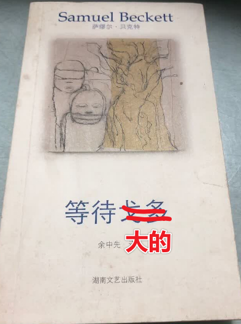

---
### 462楼 · 某不科学的FF君
Lv.1 · 2026-04-28 19:34 · 赞 4

10万部了

> **某不科学的FF君** 2026-04-28 19:36:14：包含电子书籍
>

---
### 463楼 · 用户007🌀
Lv.9 · 2026-04-28 20:14 · 赞 1

5\.2在高知县1天3场上映，送了特典大满贯（随机特典只有一份），MV是ray和reply一起放，开幕音声是这周彩辉八三人的版本，说明下周没有开幕音声了……\[阴险\]大的不在这

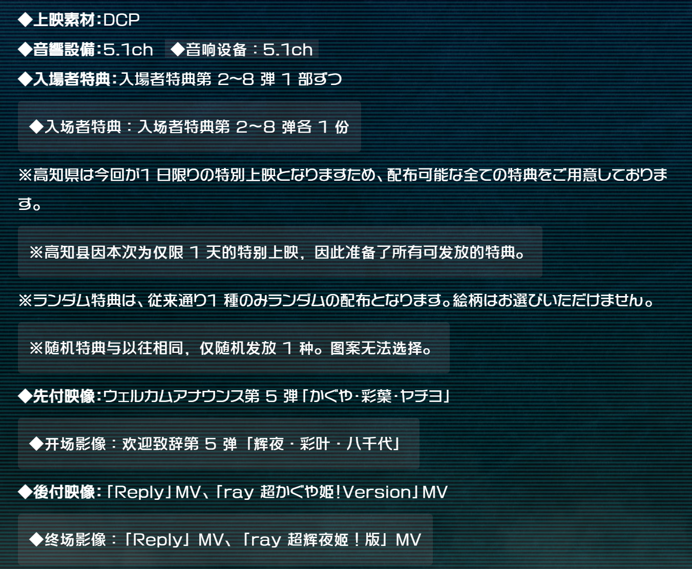

> **龍HCL** 2026-04-28 20:53:13：算票房吧？
>
> **用户007🌀** 2026-04-28 21:38:32：算，是东映协力放映的。但博客肯定是算不进去了，这地方是500人场，对系数计算影响挺大，不知道博主怎么处理，估计会单独去数这一批上座人数。
>

---
### 464楼 · 龍HCL
Lv.14 · 2026-04-28 21:27 · 赞 2

熬走了一堆熟面孔！

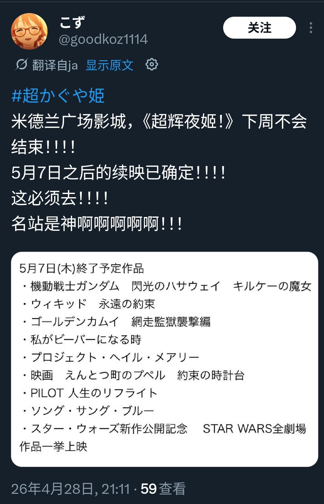

---
### 465楼 · 龍HCL
Lv.14 · 2026-04-28 21:52 · 赞 1

老熟人了！ 
看来确实会集中排片！

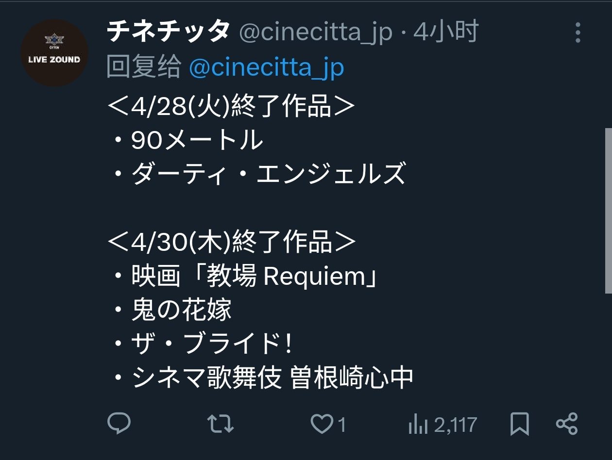

---
### 466楼 · 龍HCL
Lv.14 · 2026-04-28 22:12 · 赞 1

再接再厉！

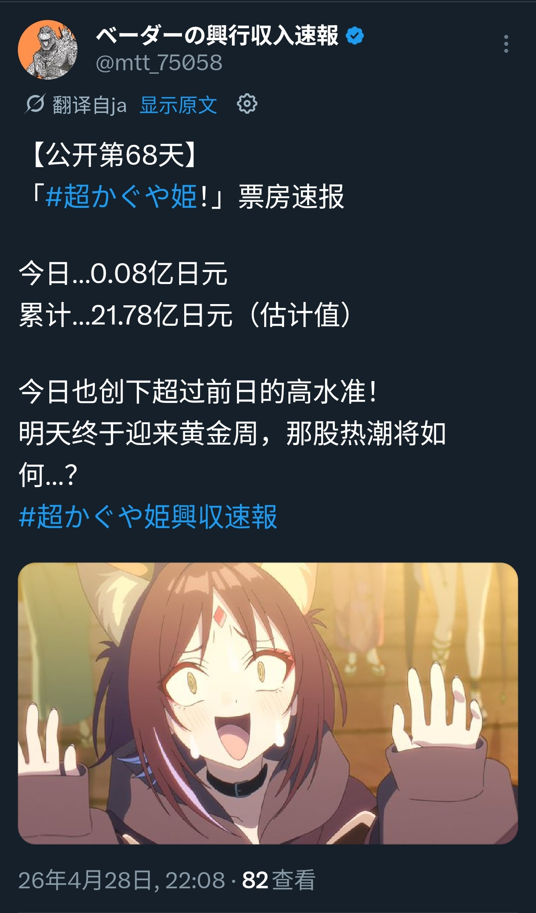

---
### 467楼 · 龍HCL
Lv.14 · 2026-04-29 08:35

今天太难了！没坐席没场次！不过应该比上周三强吧！

---
### 468楼 · 龍HCL
Lv.14 · 2026-04-29 13:31 · 赞 1

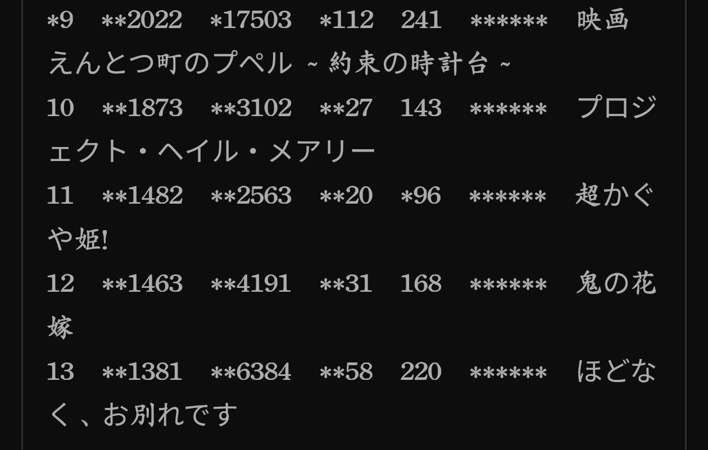

---
### 469楼 · 用户007🌀
Lv.9 · 2026-04-29 14:49 · 赞 3

高强度抗压局\[阴险\]成功打赢一些赶着下映烧排片的赔钱货挤上来了

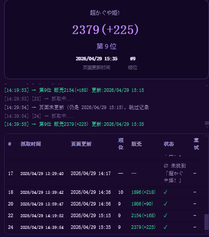

> **龍HCL** 2026-04-29 15:01:48：截图早了！下一波加了369!不过今天九位不一定稳啊！十位虎视眈眈！
>

---
### 470楼 · 龍HCL
Lv.14 · 2026-04-29 23:07 · 赞 2

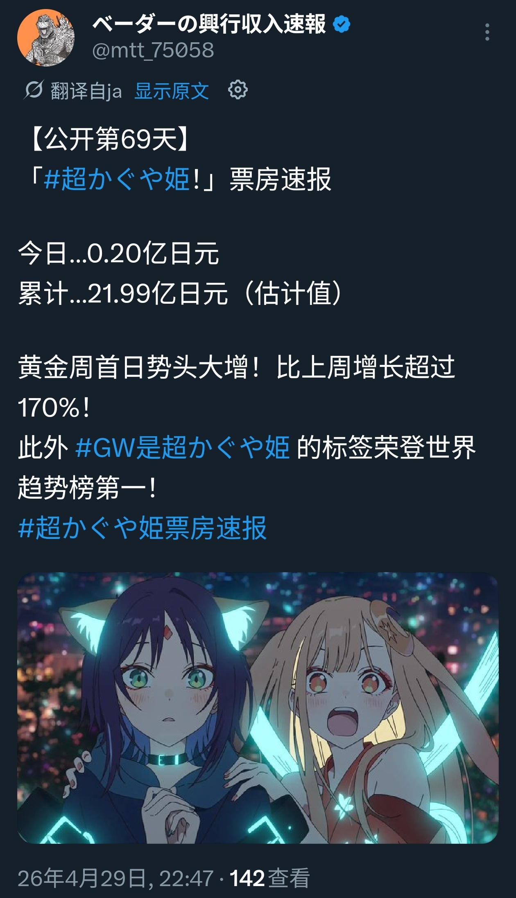

---
### 471楼 · 龍HCL
Lv.14 · 2026-04-30 07:32

这周强度太高了！最好估计能第八，也可能混个末尾第十！

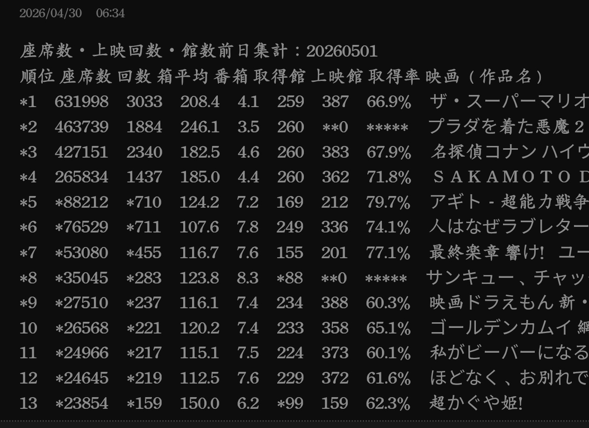

> **shdhvisjsb** 2026-04-30 13:05:37：还在发力吗\[what\]
>

---
### 472楼 · 用户007🌀
Lv.9 · 2026-04-30 09:00 · 赞 7

\[阴险\]一些电影的排片快烧完了，今明两天就会陆续下映给大伙爆金币，明天辉夜的排片也多了1W。还有一些大热但放映时间很长的电影估计黄金周结束就下映了，黄金周后能当个乌龟接着苟就算胜利。

---
### 473楼 · aptx星璇
Lv.8 · 2026-04-30 10:53 · 赞 8

小说保持这个速度的话过多两周就15万了，还能继续苟就是胜利

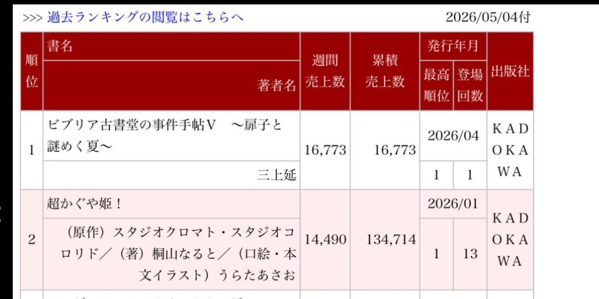

---
### 474楼 · 用户007🌀
Lv.9 · 2026-04-30 14:54 · 赞 5

可能是第二个大的：辉夜要参加过阵子在德岛举办的マチ★アソビ（城镇游乐） vol.30活动（飞碟社策划协办），5月17日会举办一场脱口秀，制作人桃原、监督山下和两位人设会参加，官方导览书作者主持。\[阴险\]估计会宣布一些活动，暂时不期待有什么大的。

---
### 475楼 · 龍HCL
Lv.14 · 2026-04-30 17:58 · 赞 1

今天也很顽强，以为见不到了！

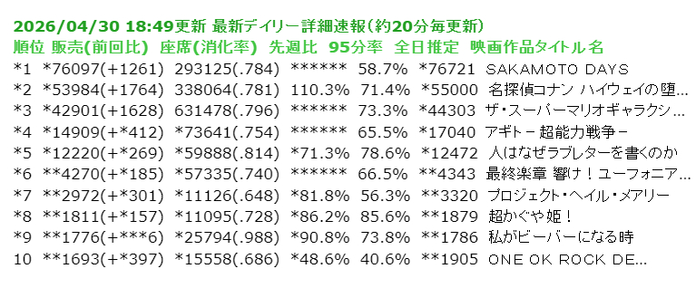

---
### 476楼 · 用户007🌀
Lv.9 · 2026-04-30 20:14 · 赞 3

第二个大的：登陆 THE FIRST TAKE！

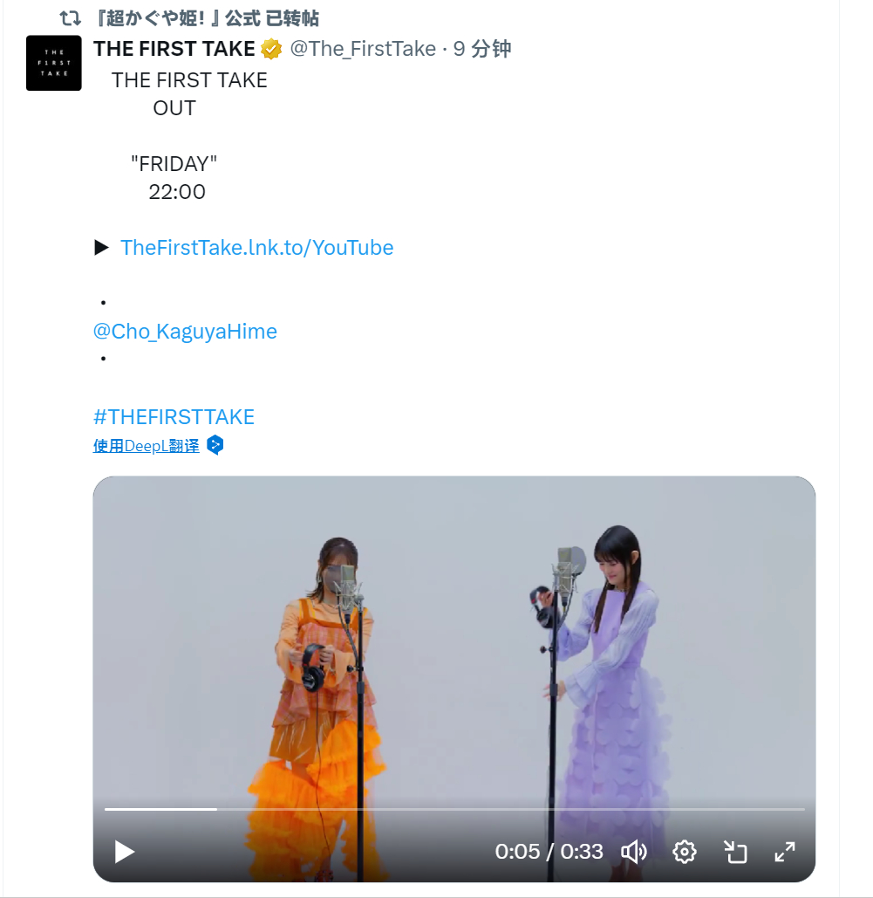

> **龍HCL** 2026-04-30 20:24:15：不明觉厉！
>
> **煞觉** 2026-04-30 20:59:50：索尼那边有人吗
>
> **用户007🌀** 2026-05-01 08:16:10：TF转发了，应该是他们牵线搭桥了。不过最近TFT的含金量确实不如以往了\[阴险\]
>

---
### 477楼 · aptx星璇
Lv.8 · 2026-04-30 22:58

the first take一般都能录两首歌，赌一下之后还能有一首ex-otogibanashi\[阴险\]

---
### 478楼 · 用户007🌀
Lv.9 · 2026-04-30 23:19

\[阴险\]图发不出来，目前高知县三场的预约数一共是1141人，明天再来看看

> **用户007🌀** 2026-04-30 23:25:39：虽然号称总坐席500个，但实际怎么数包括残疾人在内都只有498个，一部分坐席标注灰色，每场不一样，应该是预留给现场出票的席位。目前上座率是76%。
>

---
### 479楼 · 龍HCL
Lv.14 · 2026-05-01 06:05

明天坐席还减少了\[泪\] 
15w特典至少撑5天吧\[阴险\]

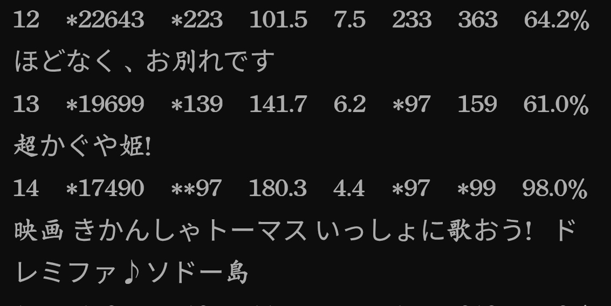

---
### 480楼 · 龍HCL
Lv.14 · 2026-05-01 08:06

第一波，接近100%上座率了！奈何坐席少的可怜\[泪\]

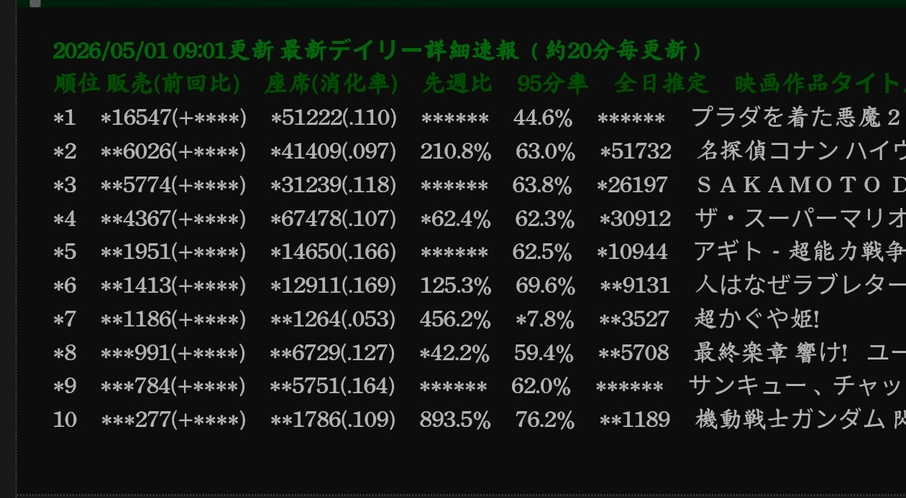

---
### 481楼 · 用户007🌀
Lv.9 · 2026-05-01 08:47 · 赞 1

据说复刻特典的纸质是盲测都感觉不到和原版差别的程度了\[阴险\] 
戏耍倒勾这一块

---
### 482楼 · 龍HCL
Lv.14 · 2026-05-01 08:47

好像变化不大！

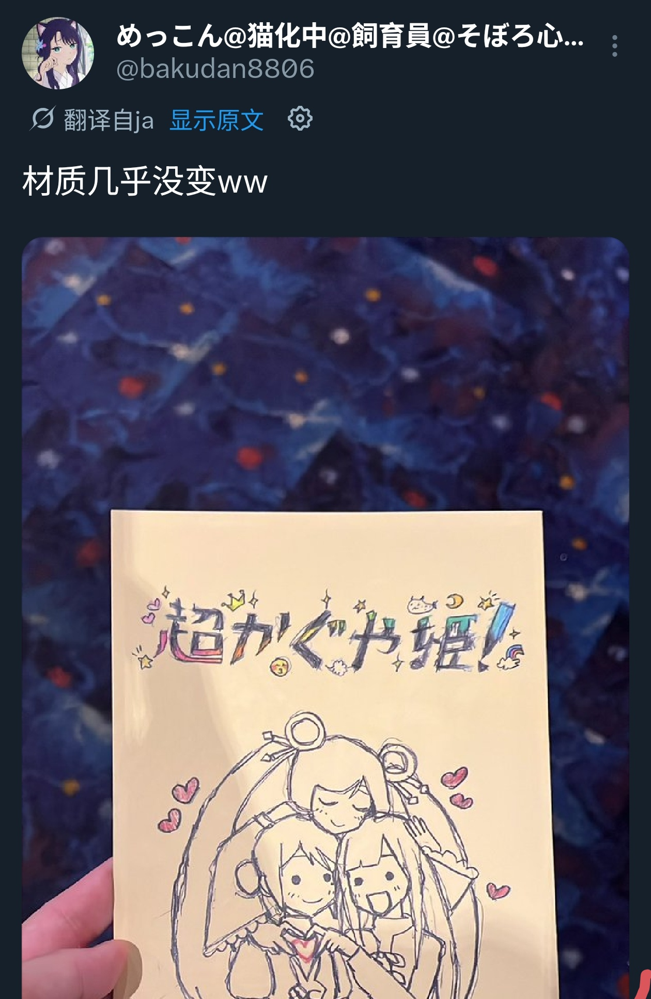

---
### 483楼 · 龍HCL
Lv.14 · 2026-05-01 10:27 · 赞 1

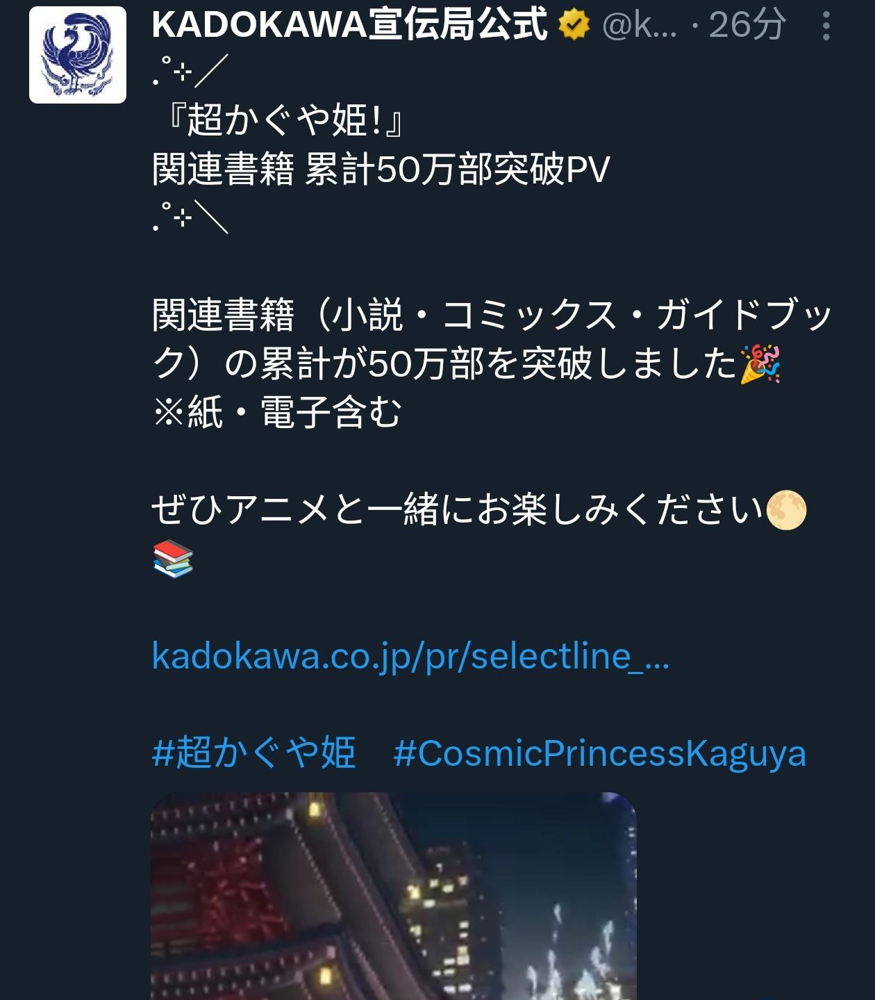

---
### 484楼 · 龍HCL
Lv.14 · 2026-05-01 11:56 · 赞 2

补图

> **inting1** 2026-05-01 12:04:58：公式书10万，小说约25万，漫画约15万 我个人觉得院线上映后整体热度已经超过石蒜了\[阴险\]
>

---
### 485楼 · 用户007🌀
Lv.9 · 2026-05-01 12:04 · 赞 1

截止今天12:00（日本时间13:00），明天高知特别上映的11点场已经全部约满（除了线下保留票和特殊轮椅座位） 
当地时间14:30和18:00场的余票分别还剩47张和153张，总上座率78.84%。

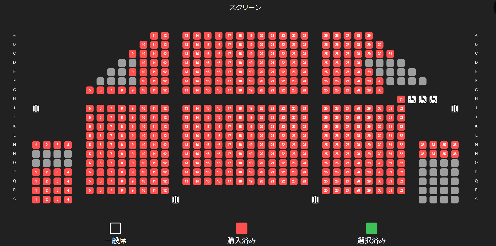

> **用户007🌀** 2026-05-01 12:08:50：\*线上余票
>
> **龍HCL** 2026-05-01 13:16:49：明天坐席能比今天多吗？虽说不准，但感觉也难啊\[泪\]
>

---
### 486楼 · 龍HCL
Lv.14 · 2026-05-01 12:38

真的换了吗？会不会是给第一弹持有者的心理安慰？

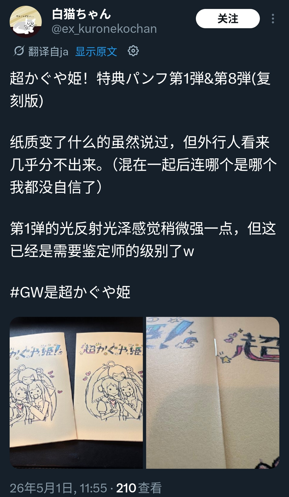

---
### 487楼 · 用户007🌀
Lv.9 · 2026-05-01 17:58

待机链接显示应该只有 ray 一首\[阴险\]充值不是很到位

---
### 488楼 · 用户007🌀
Lv.9 · 2026-05-01 22:27

截止今天 22:10（日本时间 23:10），当地时间 14:30 和 18:00 场的线上余票分别还剩 23 张和 131 张，总上座率 81.39%。 
THE FIRST TAKE 版本的 Ray 发布后约一个半小时播放量达18.6万次。

> **龍HCL** 2026-05-01 22:43:21：希望能百万播放！
>

---
### 489楼 · 龍HCL
Lv.14 · 2026-05-01 22:45

多一倍坐席的话……

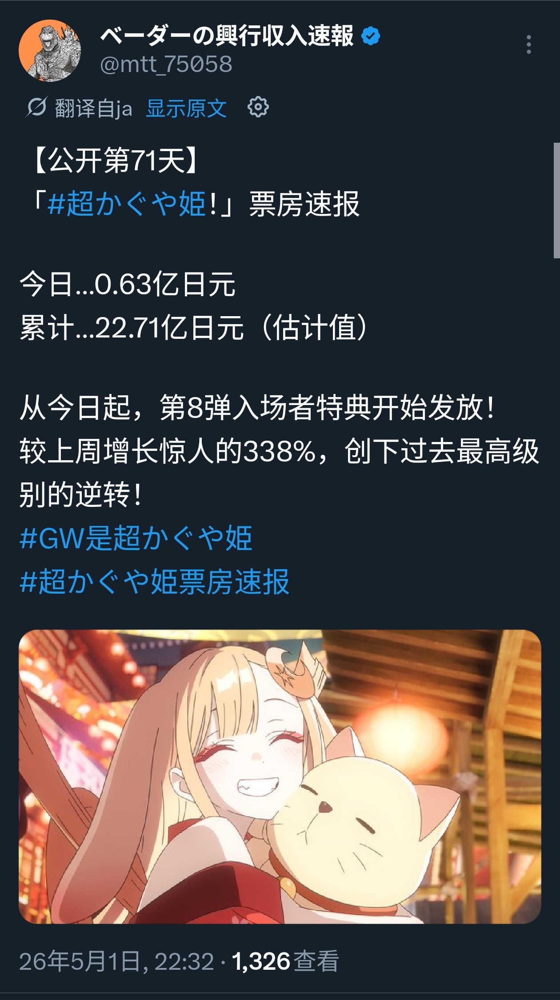

> **用户007🌀** 2026-05-01 22:51:58：目前排名前四是不可能放坐席的，放了就意味着这些坐席拱手送给竞争对手，不会匀给其他片子的\[阴险\]其实松竹那边有的动画片给的坐席过剩了，只不过制作商和松竹关系好，十几年的合作关系了，松竹选择保一手吧。
>
> **龍HCL** 2026-05-01 22:55:25：只能慢慢苟了！希望官方多出点东西维持热度吧！
>

---
### 490楼 · 用户007🌀
Lv.9 · 2026-05-01 23:02 · 赞 4

另外今天是所谓的 FIrst Day优惠日（每月第一天），各院线电影票价普遍大幅降到1300-1400日元，但辉夜是特别料金不适用任何折扣，依然是雷打不动的单人2200、双人3000标准，在这种极端逆风局打出单日第6的成绩，75.5%的上座率实在是非常恐怖了，上映11周的作品比发随机特典的上映了2-3周的作品观影人数还多……

> **龍HCL** 2026-05-01 23:20:18：粉丝忠诚度高！这么高的票价，真该搞些更有价值的特典！
>
> **小王者二韦** 2026-05-02 14:46:00：但是电影之日 12月1日 是1000日元
>
> **用户007🌀** 2026-05-02 14:50:20：是啊，但观众想看柯南、马里奥，总不可能等到 12 月再看吧\[阴险\]
>

---
### 491楼 · 用户007🌀
Lv.9 · 2026-05-02 10:30 · 赞 3

100万次播放了

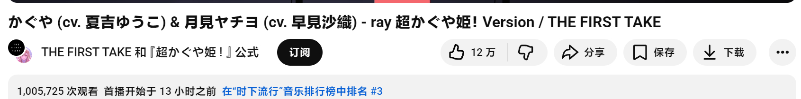

> **龍HCL** 2026-05-02 10:47:30：我在等个官方祝贺！然而……
>
> **用户007🌀** 2026-05-02 10:51:45：\[阴险\]官方还没起床估计，或者在紧急P辉夜小人的图
>

---
### 492楼 · 用户007🌀
Lv.9 · 2026-05-02 11:13

截止今天 11:00（日本时间 12:00），当地时间 14:30 和 18:00 场的线上余票分别还剩 14 张和 107 张，总上座率 83.6%。

> **用户007🌀** 2026-05-02 11:14:14：\*高知特别上映
>

---
### 493楼 · 用户007🌀
Lv.9 · 2026-05-02 14:10 · 赞 5

那帮赶ddl下单的投诉起效果了，月读感谢祭众筹重启！ 
5\.7早10点开始，延期一周。

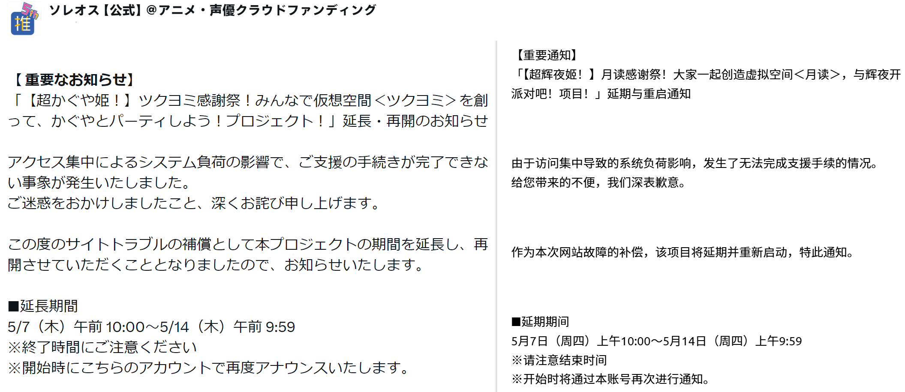

> **龍HCL** 2026-05-02 14:15:58：5000冲刺！8000不敢想！
>

---
### 494楼 · 用户007🌀
Lv.9 · 2026-05-02 21:53

高知县特别上映最终上座率=1326/1494=88.76% 
博客记录的观影人次是13900，合计就是13900+1326=15226。

> **龍HCL** 2026-05-02 22:26:14：还是没昨天多！坐席数比昨天少，上座率也不如昨天emmm...休息日比不过工作日！
>
> **用户007🌀** 2026-05-02 22:56:34：傍晚上座率一直是昨天水平，但晚间上座率不行，可能也受了点地震影响
>

---
### 495楼 · 用户007🌀
Lv.9 · 2026-05-02 23:50

这两天都抓了博客全天的贩售数推移，正好拿出来比较一下（感谢AI）： 
主要差距拉大还是18:30后的场次，地震是18:28发生的，至于有没有影响请自行论证。 
另一个更合理的因素是昨天是工作日，晚场偏强劲也是正常的。

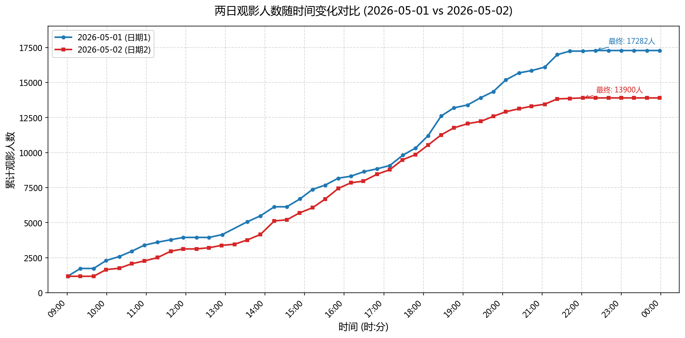

---
### 496楼 · 用户007🌀
Lv.9 · 2026-05-03 00:04 · 赞 1

这是加了高知特别上映的数据（三场分别+482、447、397）后的曲线，更能看出晚间场次的差距。

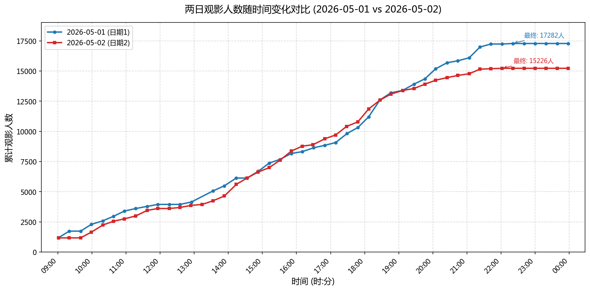

> **龍HCL** 2026-05-03 06:52:04：毕竟很多打工的都是晚上看的！
>

---
### 497楼 · 龍HCL
Lv.14 · 2026-05-03 15:06

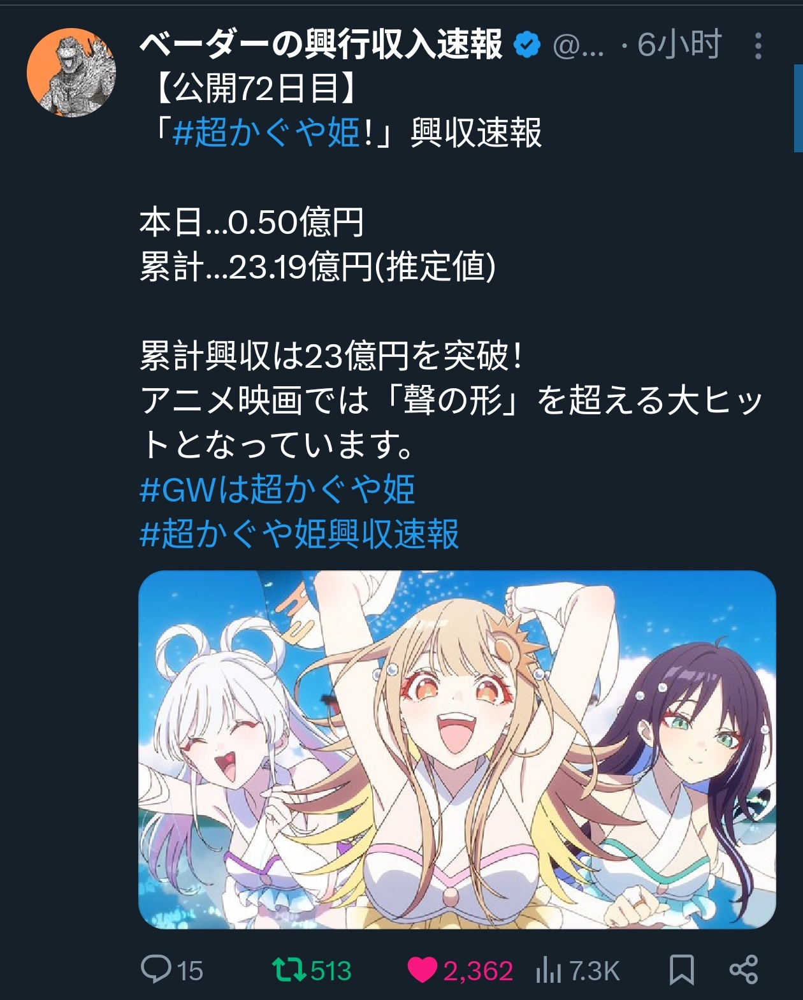

---
### 498楼 · 龍HCL
Lv.14 · 2026-05-03 16:45

今天50%上座率，算是回归正常了？感觉明天还得接着掉\[泪\]

---
### 499楼 · 煞觉
Lv.6 · 2026-05-03 20:27

要公布黑鬼的模型了吗？

> **龍HCL** 2026-05-03 20:58:11：感觉可能是完整mv？
>

---
### 500楼 · 用户007🌀
Lv.9 · 2026-05-03 23:28 · 赞 1

\[阴险\]怎么一些影院特典发完了，这到底怎么分配的，按系数算也就发了6.7w份左右啊

页码：[1–100 楼](thread.md) · [101–200 楼](thread_2.md) · [201–300 楼](thread_3.md) · [301–400 楼](thread_4.md) · **401–500 楼** · [501–600 楼](thread_6.md) · [601–700 楼](thread_7.md) · [701–800 楼](thread_8.md)

---

[⬆ 本页顶部](#top)　·　[⏬ 最新的楼层](thread_8.md#bottom)
