

# 【动画讨论&amp;追踪】超时空辉夜姬

- 贴吧: 名作之壁吧　楼主: inting1　发帖: 2026-02-21 19:38:46
- 原帖: https://tieba.baidu.com/p/10504053776　抓取时间: 2026-09-28 06:12:51　楼层数: 642　（时间均为北京时间）

[⬇ 本页底部](#bottom)　·　[⏬ 最新的楼层](thread_8.md#bottom)

页码：[1–100 楼](thread.md) · [101–200 楼](thread_2.md) · [201–300 楼](thread_3.md) · [301–400 楼](thread_4.md) · [401–500 楼](thread_5.md) · **501–600 楼** · [601–700 楼](thread_7.md) · [701–800 楼](thread_8.md)

---
### 501楼 · 龍HCL
Lv.14 · 2026-05-04 05:35 · 赞 1

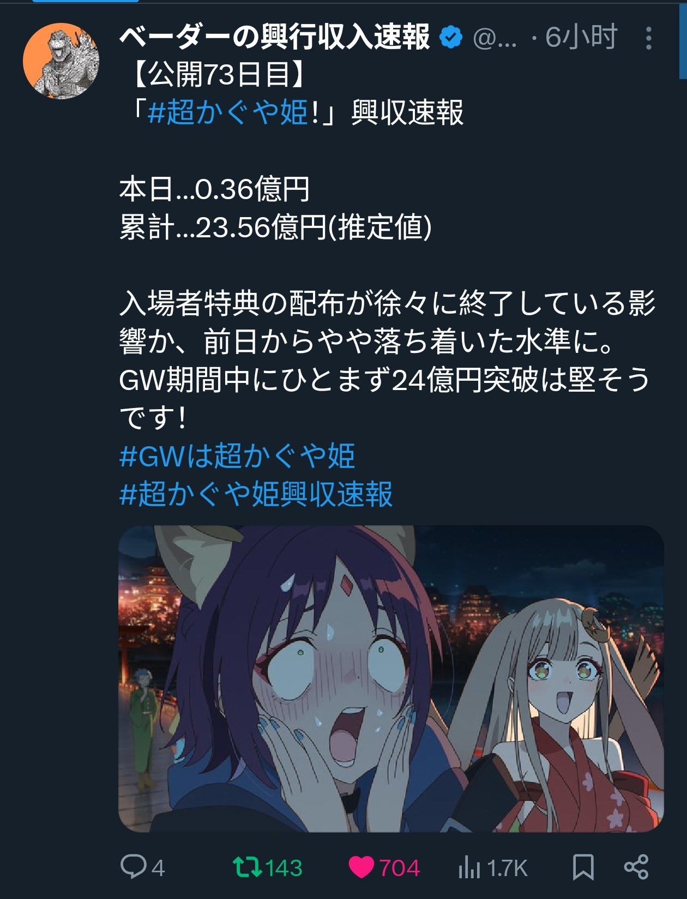

---
### 502楼 · 龍HCL
Lv.14 · 2026-05-04 08:11 · 赞 4

圣地太强了！

---
### 503楼 · 龍HCL
Lv.14 · 2026-05-04 13:37 · 赞 2

水一下！好像还能有50％上座率！

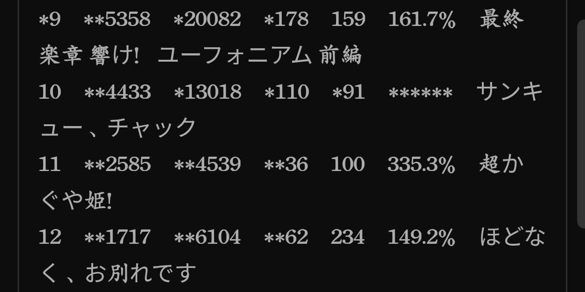

---
### 504楼 · shdhvisjsb
Lv.1 · 2026-05-04 16:23 · 赞 1

有望25吗？

> **龍HCL** 2026-05-04 18:18:17：稳的吧？我都希望官方目标30！
>

---
### 505楼 · 龍HCL
Lv.14 · 2026-05-04 18:19

再来五次特典能差不多30亿\[阴险\]

---
### 506楼 · GG9487
Lv.8 · 2026-05-04 22:26 · 赞 1

但凡再生一弹特典都能稳26e，希望官方还会追加吧

---
### 507楼 · 用户007🌀
Lv.9 · 2026-05-04 23:36 · 赞 1

5\.1-5.4四天博客记录观影人数推移（5.2加上了手动计算的高知特别上映数字）

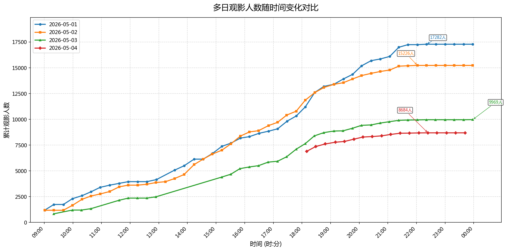

> **用户007🌀** 2026-05-04 23:37:43：数据点缺失代表该时段排名掉出前十。
>

---
### 508楼 · 龍HCL
Lv.14 · 2026-05-05 11:54 · 赞 1

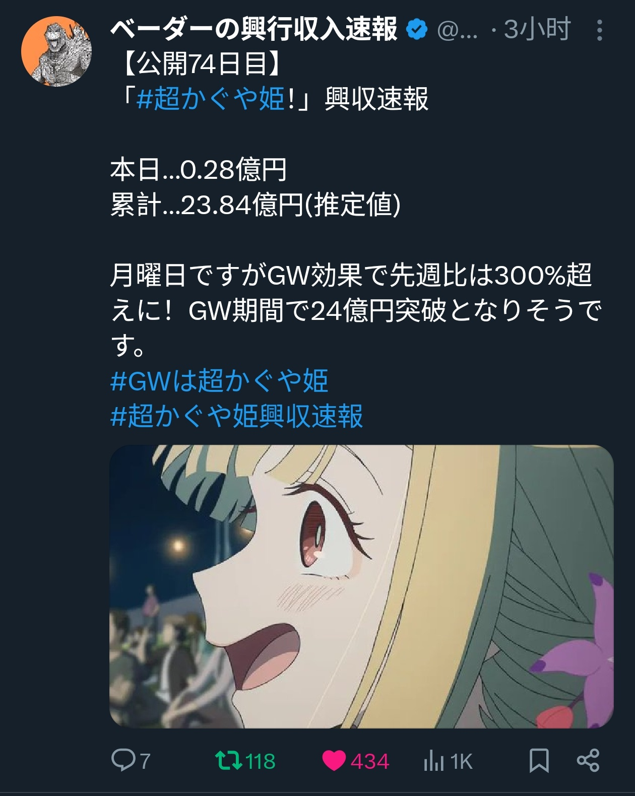

---
### 509楼 · 龍HCL
Lv.14 · 2026-05-05 18:51

还以为见不到了！

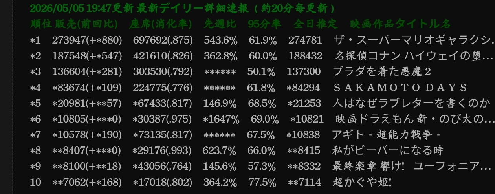

---
### 511楼 · 兄弟干的不错
Lv.6 · 2026-05-05 23:53 · 赞 2

好像再有一个亿，票房就超过另一版辉夜姬了

---
### 512楼 · 龍HCL
Lv.14 · 2026-05-06 11:45 · 赞 2

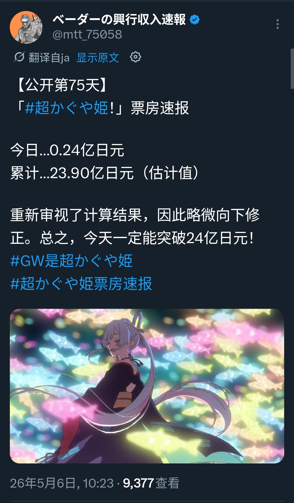

---
### 513楼 · 用户007🌀
Lv.9 · 2026-05-07 11:58 · 赞 4

苟王之王\[阴险\]

> **龍HCL** 2026-05-07 13:21:35：从博客看，我还以为是七位！
>

---
### 514楼 · 龍HCL
Lv.14 · 2026-05-07 13:21 · 赞 3

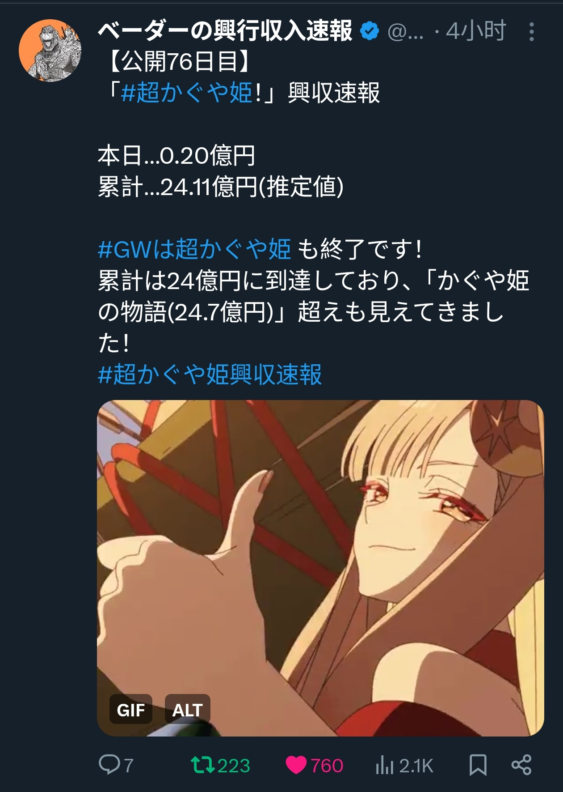

> **GG9487** 2026-05-07 13:41:19：應該穩25吧
>

---
### 515楼 · 龍HCL
Lv.14 · 2026-05-08 00:04 · 赞 3

小说继续磨！

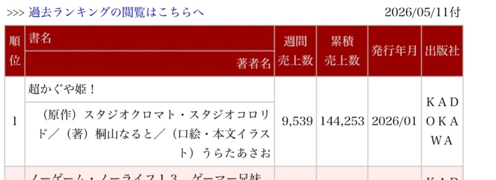

---
### 516楼 · 煞觉
Lv.6 · 2026-05-08 08:56 · 赞 1

特典一没就真的是在蠕动了

---
### 517楼 · 用户007🌀
Lv.9 · 2026-05-08 09:05 · 赞 4

\[阴险\]事实证明，均价没有大变动的情况下，票房预估不能随便下调（何况这博主还没算上特殊上映和一些犄角旮旯的独立系）。

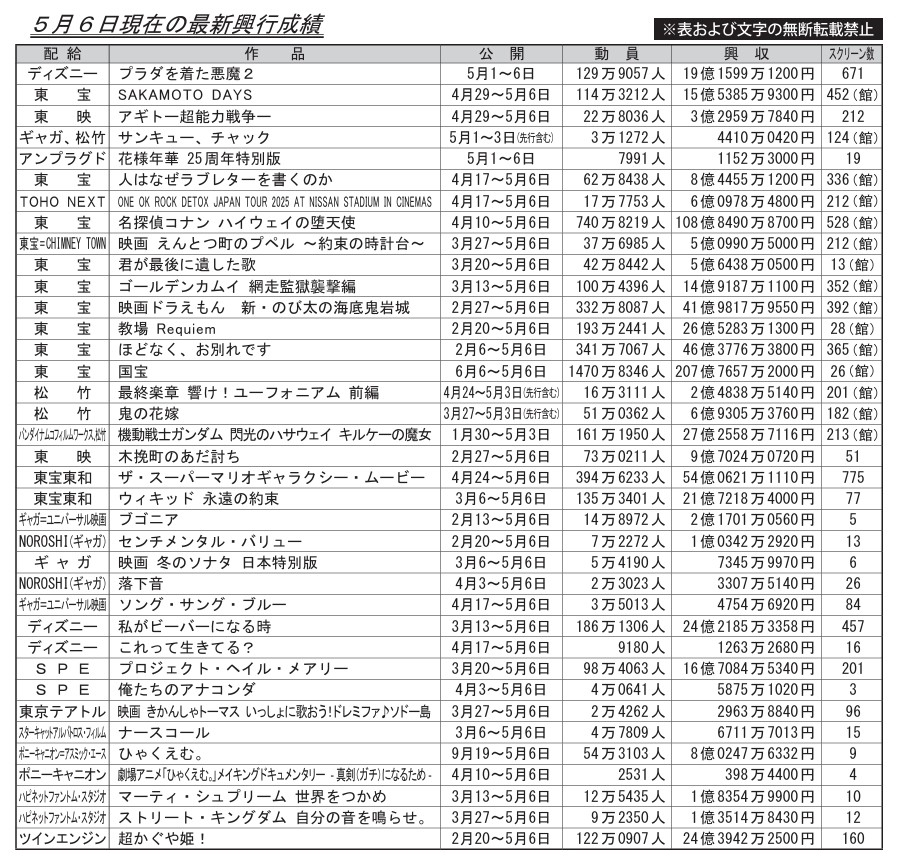

按系数估算，第8弹特典已经发了约11.5万份。越来越多的影院宣布发完，恐怕最后的3.5万份都在立川CinemaCity了

> **用户007🌀** 2026-05-08 09:10:14：这3.5w还有一些在御成座这种独立影院和其他地方的特殊上映会
>
> **某不科学的FF君** 2026-05-08 13:17:49：25亿稳的。就看后面还发什么特典了，特典在人就在
>

---
### 518楼 · 煞觉
Lv.6 · 2026-05-08 12:31 · 赞 4

宣布上asl了，但是只有辉夜一个人……

> **用户007🌀** 2026-05-08 15:36:08：还有嘉宾没公布，早见太忙不来也正常
>
> **煞觉** 2026-05-08 17:51:09：私心是想看三人复刻live场面的\[笑尿\]
>
> **龍HCL** 2026-05-08 18:04:34：没办法，只有底边夏吉闲……
>
> **用户007🌀** 2026-05-08 19:18:19：很快就不是底边了，只能趁现在多给她安排辉夜的工作
>

---
### 519楼 · 龍HCL
Lv.14 · 2026-05-08 17:28 · 赞 1

下周该新特典了吧！都加馆了，应该没有下映的预兆！

---
### 520楼 · 龍HCL
Lv.14 · 2026-05-09 06:24 · 赞 1

别怕，是技术性调整！！！

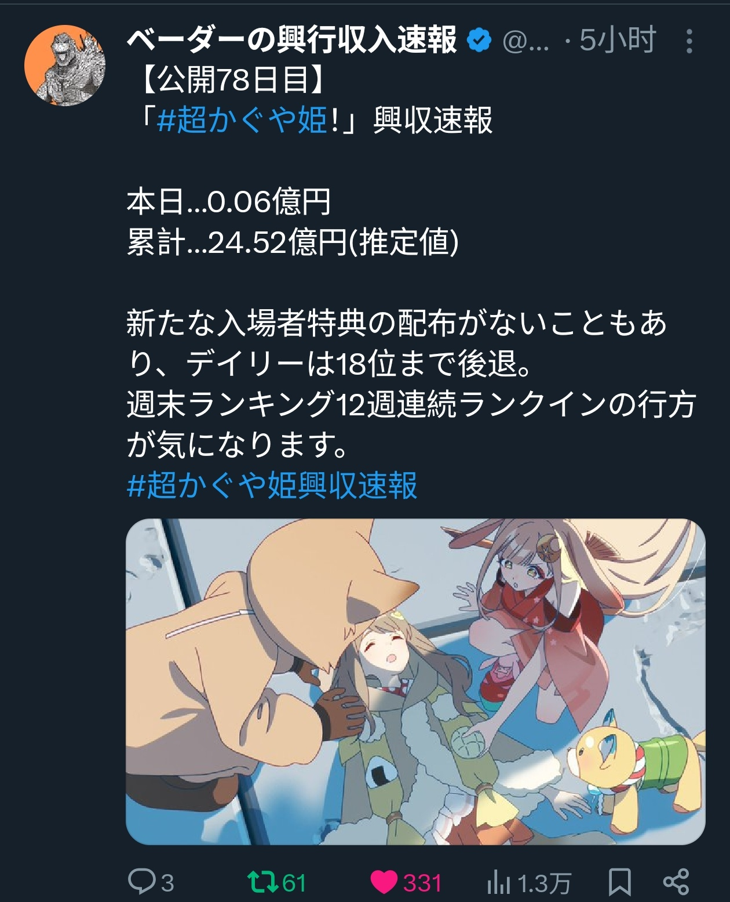

> **煞觉** 2026-05-09 08:42:19：就看官方急不急了
>

---
### 522楼 · 龍HCL
Lv.14 · 2026-05-09 23:38 · 赞 7

570w查看！感觉最近推文轻松过百万！官方啥时候放大招啊\[阴险\]

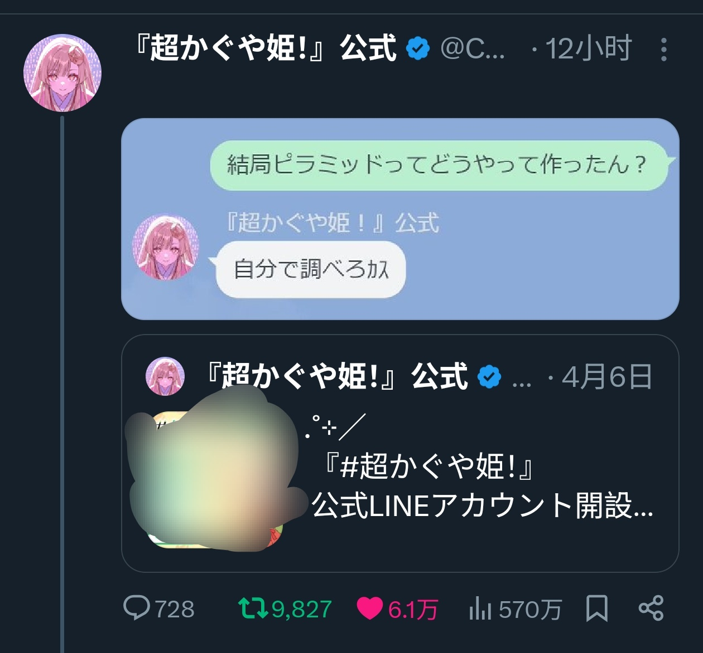

---
### 523楼 · 用户007🌀
Lv.9 · 2026-05-10 00:29 · 赞 5

明天（今天）就能超过旧时空辉夜姬和新世纪福音战士旧剧场版了\[阴险\]

---
### 524楼 · 龍HCL
Lv.14 · 2026-05-10 07:46 · 赞 1

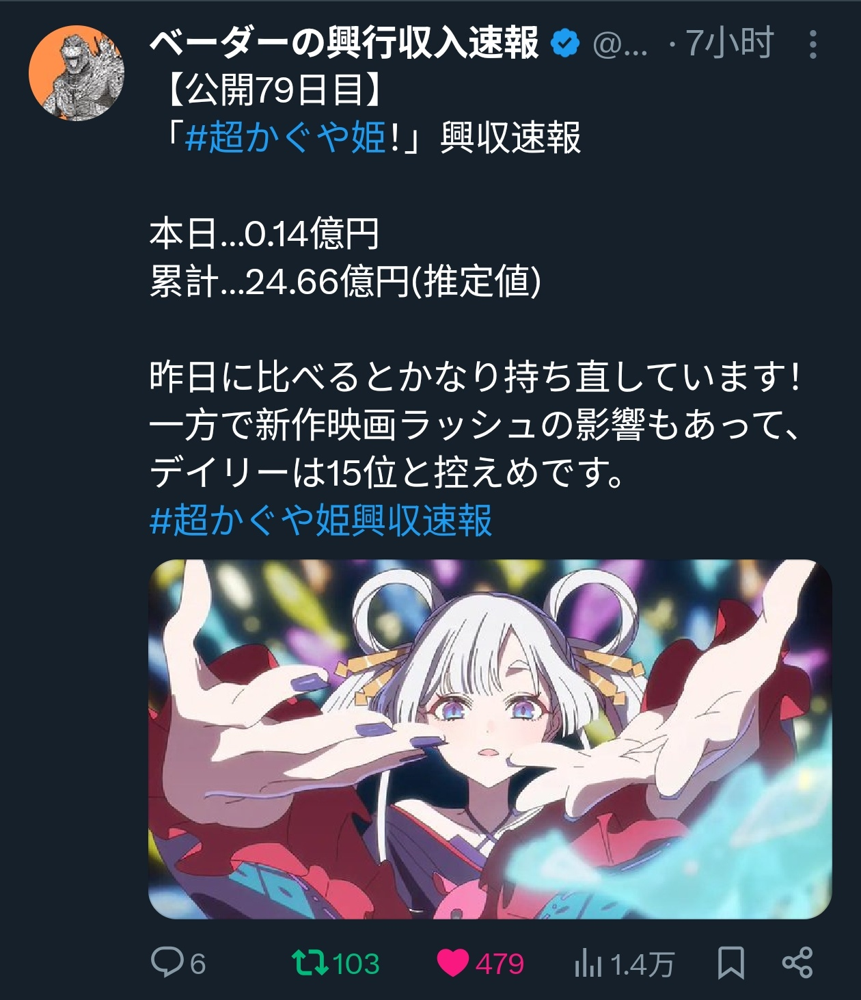

---
### 525楼 · 龍HCL
Lv.14 · 2026-05-10 11:55 · 赞 3

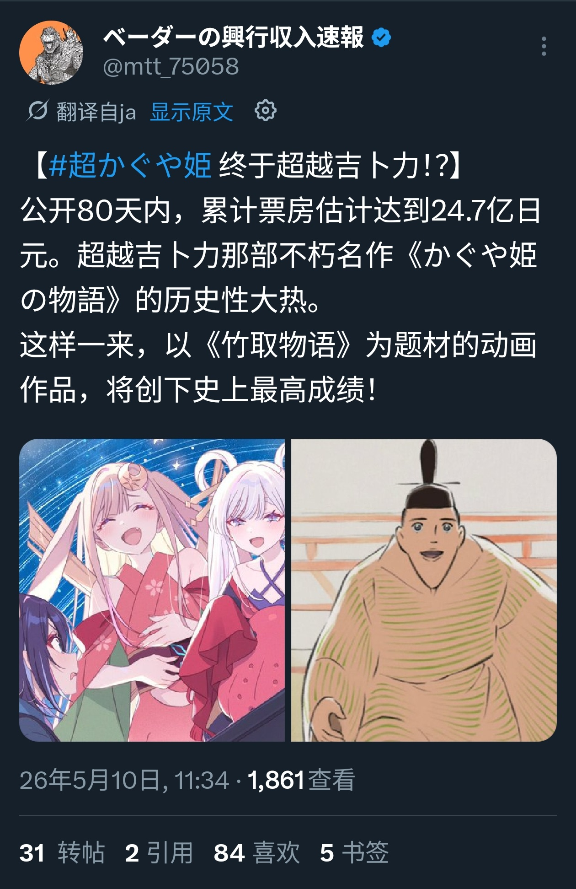

> **白衣毛哥** 2026-05-10 16:06:20：蒸
>

---
### 526楼 · 龍HCL
Lv.14 · 2026-05-10 20:36 · 赞 2

立川下周五都这个鸟样了，不会真的要结束了吧？

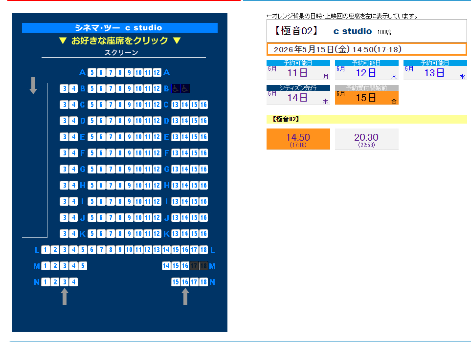

> **龍HCL** 2026-05-10 20:37:01：坐席和场次都砍了！
>
> **煞觉** 2026-05-10 23:30:41：都还没等到说的大消息了
>

---
### 527楼 · 用户007🌀
Lv.9 · 2026-05-10 23:09 · 赞 7

爆了个隐藏： 
明天，也就是当地时间今天（5.11）是彩叶的生日。 
官方放出了彩叶小时候一家人给她庆生的新绘图（图1），不过只有彩叶父亲、哥哥和彩叶在画面内，母亲此时的表情则要到正片去找（图2）。

---
### 528楼 · 用户007🌀
Lv.9 · 2026-05-10 23:28 · 赞 8

顺带一提，彩叶穿的衣服也被光速特定，是 MIKI HOUSE 的童装，售价折合人民币2000出头……\[惊哭\]被酒寄家的黑暗吓哭了

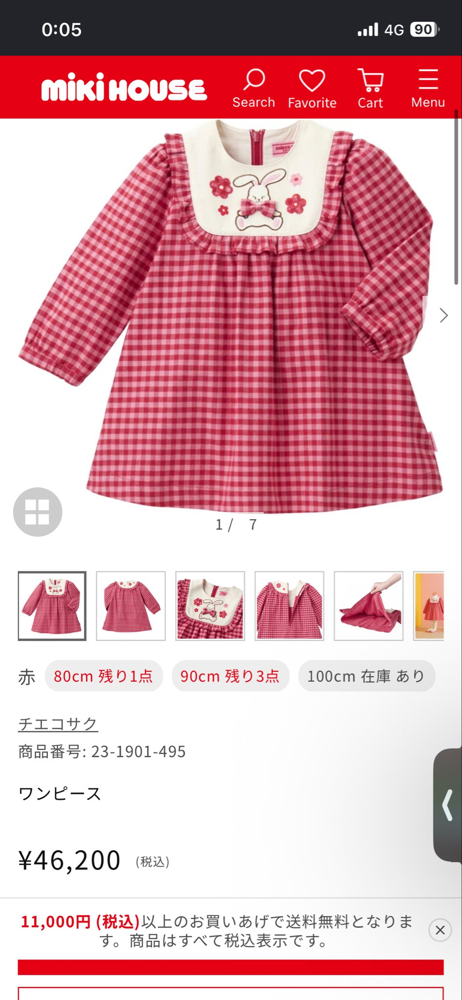

> **煞觉** 2026-05-10 23:29:34：这衣服是金子做的吗
>
> **用户007🌀** 2026-05-11 00:58:04：这是MIKI HOUSE“Chieri作”兔子系列的产品之一，看了下这个系列最便宜的塑料杯子都要近50块钱……\[阴险\]从好的方面说童年时期的彩叶可能是这个兔子系列的粉丝
>
> **用户007🌀** 2026-05-11 13:14:52：打错了，是 chieko 作
>

---
### 529楼 · 龍HCL
Lv.14 · 2026-05-11 06:44 · 赞 3

睡早了！错过了官方庆生\[泪\]

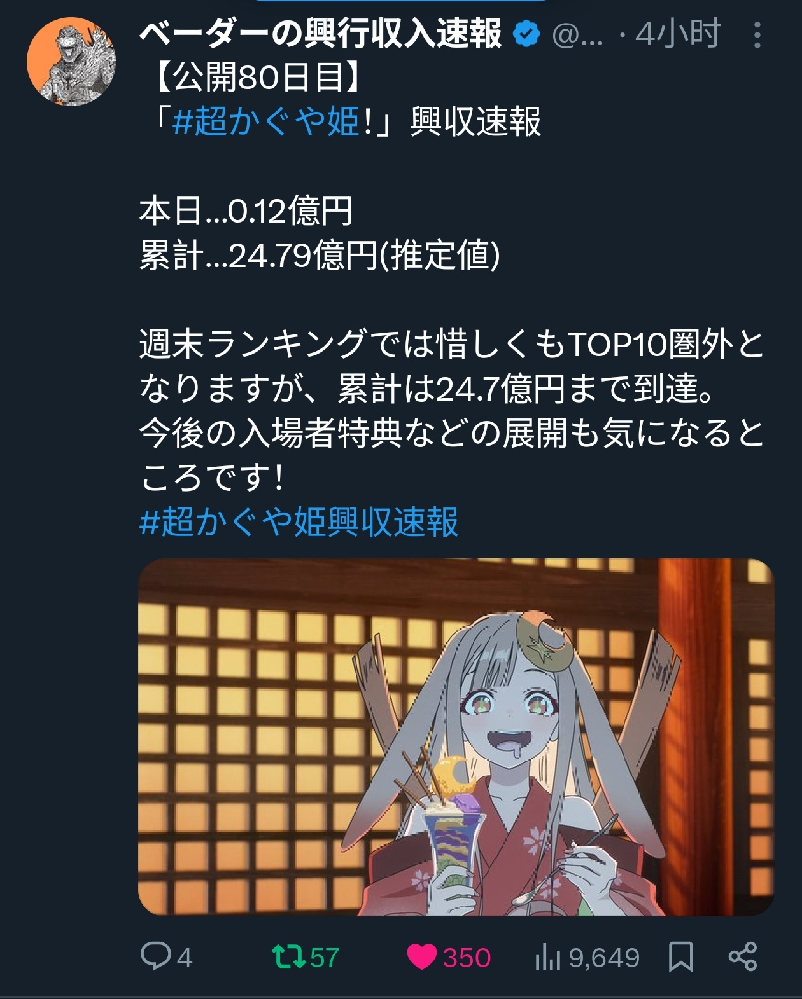

---
### 530楼 · 龍HCL
Lv.14 · 2026-05-11 17:54 · 赞 2

这边反而给增加了，谜！

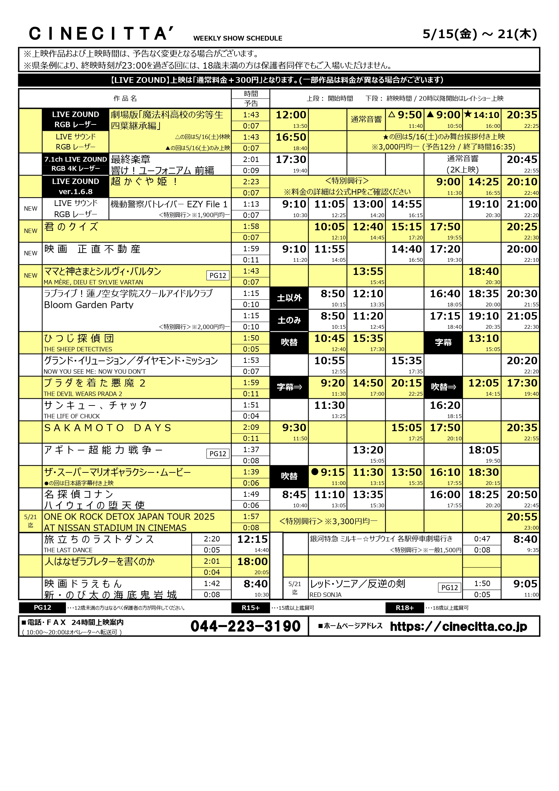

---
### 531楼 · 龍HCL
Lv.14 · 2026-05-11 18:12

太难了！

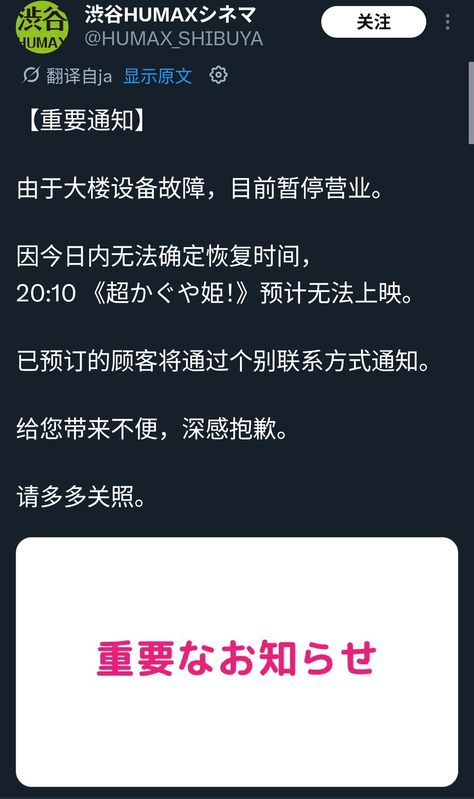

---
### 532楼 · 龍HCL
Lv.14 · 2026-05-12 06:07 · 赞 2

不知道今天能不能25亿！

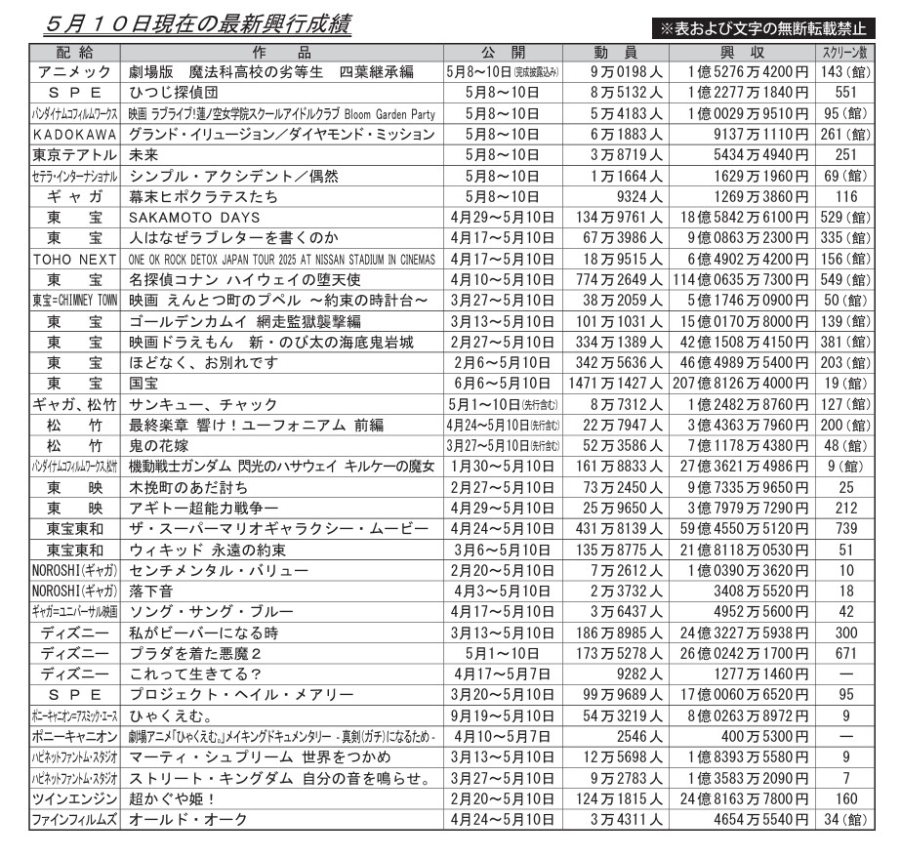

---
### 533楼 · 龍HCL
Lv.14 · 2026-05-12 10:06

需要新特典！！！

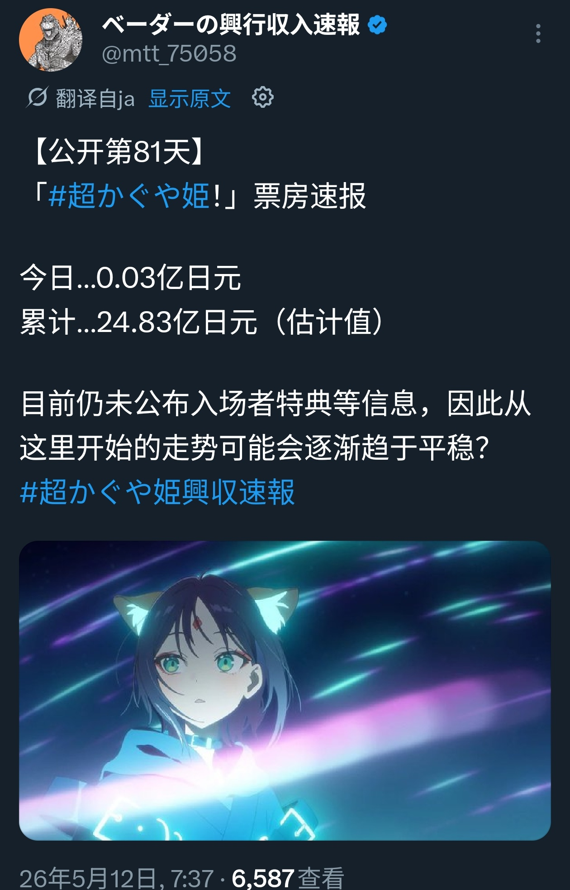

> **煞觉** 2026-05-12 10:42:34：25亿都要蠕动一阵了
>
> **回忆の梦** 2026-05-12 10:58:19：这是最低的一天了吧
>
> **沙漠天使** 2026-05-12 14:08:34：不是很理解官方，4个月了，版权绘出不了几张，特典数量也拉胯，几张小纸片有那么难么\[黑线\]
>
> **迷人大白菜** 2026-05-12 18:38:48：最近上了好几本杂志，新图都用杂志上了，希望能扩大影响力
>

---
### 534楼 · 龍HCL
Lv.14 · 2026-05-12 16:20 · 赞 2

看来官方摆烂了！平常都这个点公布新特典！

> **用户007🌀** 2026-05-12 16:37:19：其实之前是17:00公布的……
>
> **煞觉** 2026-05-12 17:21:45：是真没活了
>

---
### 535楼 · 煞觉
Lv.6 · 2026-05-12 20:06

还有first take

---
### 536楼 · 用户007🌀
Lv.9 · 2026-05-12 20:06 · 赞 2

剧场这边差不多告一段落了

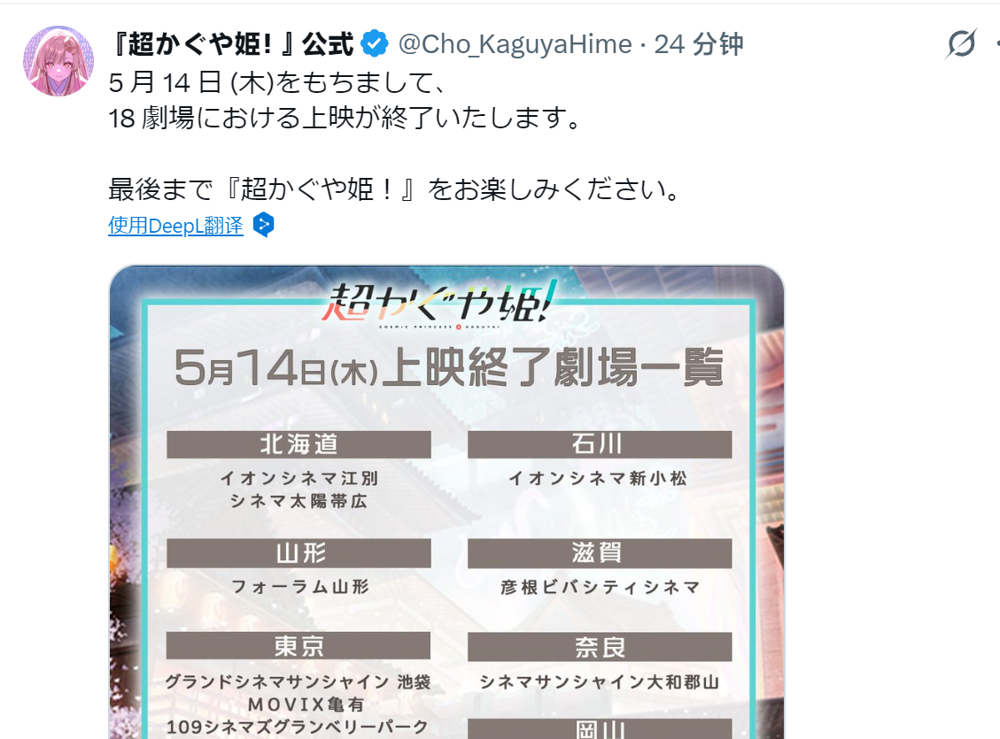

> **龍HCL** 2026-05-12 20:11:26：25亿收官了……
>

---
### 537楼 · 兄弟干的不错
Lv.6 · 2026-05-12 20:23

tft二番来了，不知道这次是哪首，世一公吗

---
### 538楼 · 龍HCL
Lv.14 · 2026-05-12 20:33

虽然这些馆没了，但是下周应该也可以有新特典吧？不会真的一直摆烂到结束吧？

---
### 539楼 · 用户007🌀
Lv.9 · 2026-05-12 21:03

基本明示了是WIM

---
### 540楼 · aptx星璇
Lv.8 · 2026-05-12 21:18

如果唱WIM的话就是两首都唱翻唱曲了，好歹也算以音乐为卖点(之一)的作品连一首原创曲都不唱吗\[阴险\]

> **用户007🌀** 2026-05-13 11:39:42：WIM CPK Ver 不算翻唱曲，算是 ryo 自己重编曲的版本，网上用这个版本伴奏翻唱的标注的本家都是 CPK 版
>
> **aptx星璇** 2026-05-13 14:08:37：虽然是重新编曲的新版本，但始终不是原创曲，还是希望难得上tft能唱属于自己的歌，能唱个ex也好
>

---
### 541楼 · 龍HCL
Lv.14 · 2026-05-13 00:38

这个磨法，得周六过25了！

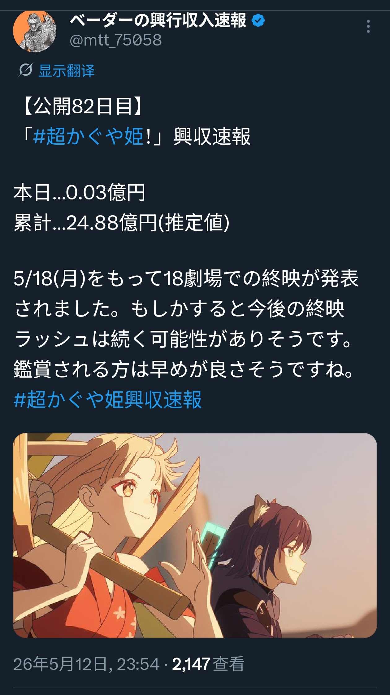

---
### 542楼 · 用户007🌀
Lv.9 · 2026-05-13 08:58 · 赞 1

\[阴险\]大概率重心放在这周末的德岛签售会和访谈活动了，看看有什么发表吧

---
### 543楼 · 龍HCL
Lv.14 · 2026-05-13 16:46

14时的记录里前25都看到不到CPK了！官方真不急吗？

> **某不科学的FF君** 2026-05-13 17:32:54：感觉他们没啥好急的
>
> **用户007🌀** 2026-05-13 19:38:36：应该已经放弃票房了，超过吉卜力后没什么目标了
>
> **仙翳** 2026-05-14 17:39:04：bd消息出了，估计不准备管了
>
> **龍HCL** 2026-05-14 18:01:49：已经下单好了！
>

---
### 545楼 · 用户007🌀
Lv.9 · 2026-05-13 22:07 · 赞 1

WIM上线，同步视听有记录的在线峰值约3.1万人。 
德岛活动确定没有直播。

---
### 546楼 · aptx星璇
Lv.8 · 2026-05-13 22:14 · 赞 1

最高同接数比ray还掉了一些，ray的最高同接有4.5万

---
### 547楼 · 龍HCL
Lv.14 · 2026-05-14 01:10

第一次，大家都很好奇，肯定去的人多，TFT真的该一次性放出来吧……

---
### 548楼 · 龍HCL
Lv.14 · 2026-05-14 08:21

蠕动爬行中！！！

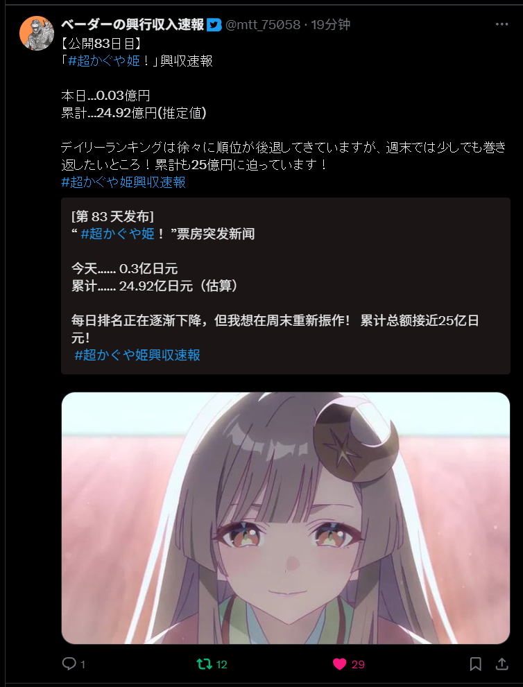

---
### 549楼 · 龍HCL
Lv.14 · 2026-05-14 09:28

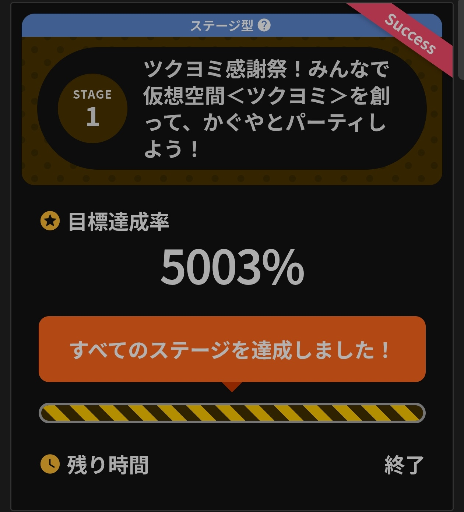

---
### 550楼 · 龍HCL
Lv.14 · 2026-05-14 10:45 · 赞 1

没监督可能要卡9吗？

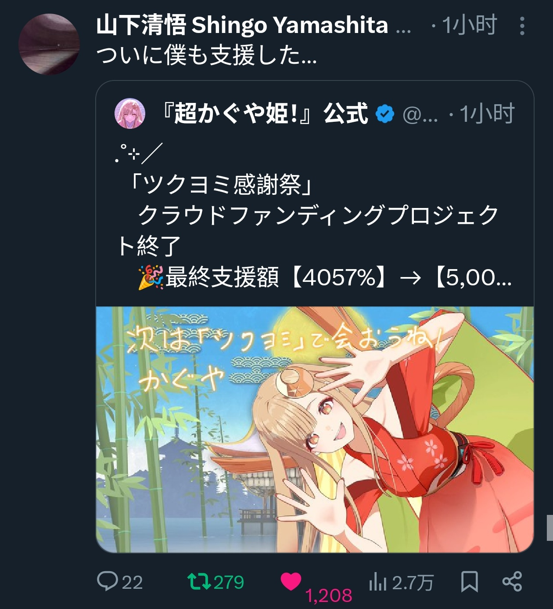

---
### 551楼 · 用户007🌀
Lv.9 · 2026-05-14 13:01 · 赞 7

辉夜的异常热度惊动了德岛当地的叔叔，现场签售会直接改成预约制限购了\[阴险\]达成成就：平等地吓哭每一个低估自己人气的主办方和承办方

> **白衣毛哥** 2026-05-14 14:50:34：蒸
>

---
### 552楼 · 煞觉
Lv.6 · 2026-05-14 17:02 · 赞 1

要开始卖bd了？

---
### 553楼 · 龍HCL
Lv.14 · 2026-05-14 18:41 · 赞 1

BD买好了！周末是不是该TV动画化决定了？

---
### 554楼 · aptx星璇
Lv.8 · 2026-05-14 18:45 · 赞 1

卖bd都没有上王之力没捆线下活动抽选券，看来是真没预定好什么线下live了\[阴险\]

> **仙翳** 2026-05-15 00:25:33：这草台班子都几个月了连bd出货量都预计不到，你还指望这些吗
>

---
### 555楼 · 煞觉
Lv.6 · 2026-05-14 22:12

才一个小时，官方的特装版就卖完了

> **煞觉** 2026-05-14 22:17:02：代购也没订到\[不高兴\]
>

---
### 556楼 · 用户007🌀
Lv.9 · 2026-05-14 22:18

官店一起手就要排7分钟的队，恐怕只备了1-2k的货\[阴险\]

> **煞觉** 2026-05-14 22:27:49：官方这么没自信吗
>
> **灬赫小萝灬** 2026-05-14 22:37:56：官方就卖完了
>
> **龍HCL** 2026-05-14 22:43:28：怎么又犯电影刚上映时的错误，我真的是服了.……
>
> **一如既往的路过** 2026-05-14 23:24:29：看起来5000%还是没敲醒官方
>

---
### 557楼 · 灬赫小萝灬
Lv.2 · 2026-05-14 22:38

可怕

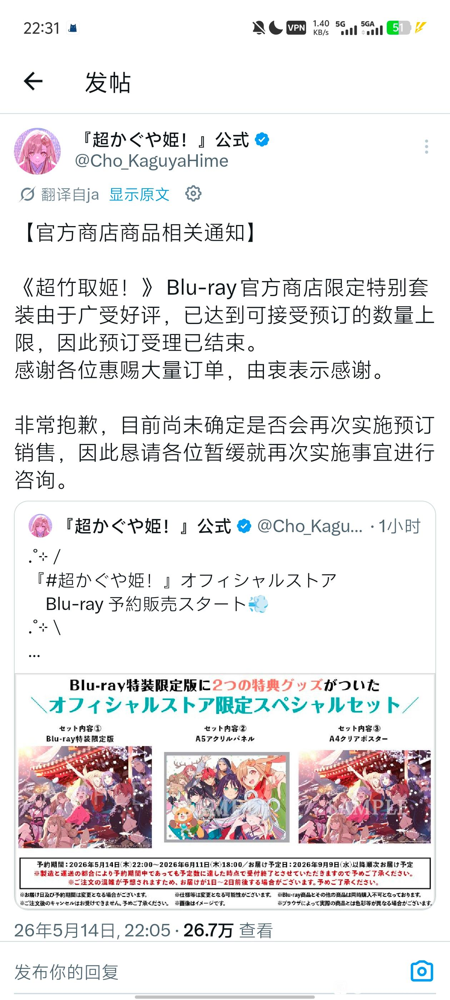

---
### 559楼 · 宝多茜
Lv.13 · 2026-05-14 22:48

双引擎没有B数，这都第几次低估超辉夜热度了

---
### 560楼 · 灬赫小萝灬
Lv.2 · 2026-05-14 22:51

买A店的了

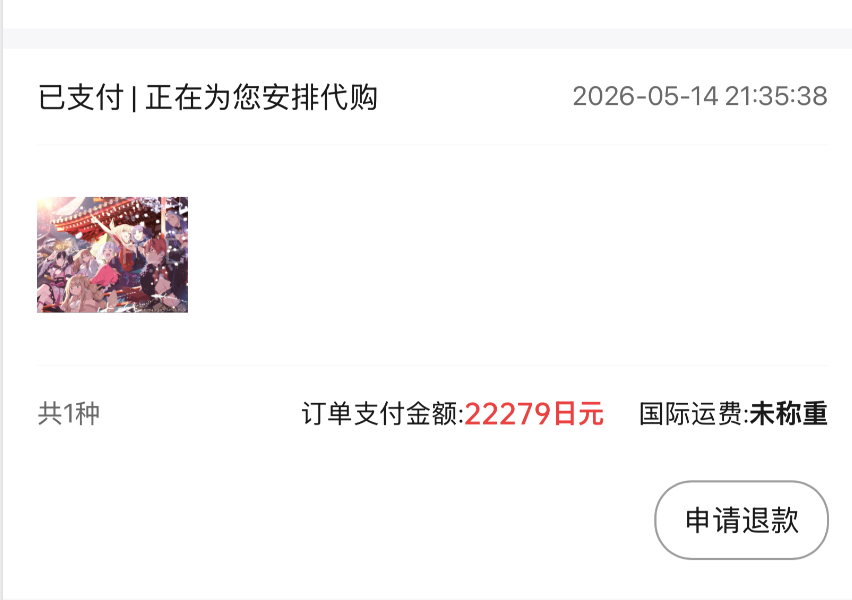

> **龍HCL** 2026-05-14 23:35:11：推荐个靠谱的代购，被淘宝那家坑死了\[泪\]
>
> **灬赫小萝灬** 2026-05-14 23:52:47：微信小程序里面 日淘集市看看
>

---
### 561楼 · 煞觉
Lv.6 · 2026-05-14 22:59

a店也没了

---
### 562楼 · 宝多茜
Lv.13 · 2026-05-14 23:03

乐天也没了

> **宝多茜** 2026-05-14 23:07:49：目前官店、乐天、A店、amiami、赤熊、Joshin都卖完了
>
> **宝多茜** 2026-05-15 07:26:36：蜜瓜我这边打不开，其他除了HMV以外全没货了。
>

---
### 563楼 · aptx星璇
Lv.8 · 2026-05-14 23:10 · 赞 5

这么快就没货太好笑了，分明就是没准备好就着急忙慌端出来卖，宁愿他多准备几个月然后把各店铺特典搞好一点

> **灬赫小萝灬** 2026-05-14 23:35:14：只能说太夸张了 应该还会补货
>

---
### 564楼 · 仙翳
Lv.12 · 2026-05-15 00:23

霓虹草台班子见太多了，但是超辉这属于草台中的草台了，也是奇葩

---
### 565楼 · aptx星璇
Lv.8 · 2026-05-15 06:52 · 赞 2

推上太君都在感叹辉夜姬实在太火了没一个人觉得是官方太草台的，圆盘预定能在预定第一天就断货不觉得闻所未闻吗，其他更大热的片都没见过这样的\[汗\]

> **用户007🌀** 2026-05-15 10:32:51：因为线下店还能预约\[阴险\]只是官店切了。因为官店版本不计入 o 榜，估计是故意准备了很少的量
>

---
### 566楼 · Inclis
Lv.1 · 2026-05-15 08:03

九月才发货的东西想来不太可能现在就准备好现货，从第一个特典那会我就在怀疑，双引擎是不是没有愿意给它插单排产的合作印刷厂，以至于各类物料总是少的离谱

---
### 567楼 · hego喵
Lv.8 · 2026-05-15 08:05 · 赞 2

时隔多年打开壁吧居然是因为超辉夜姬\[阴险\] 
精选集不单独卖真是让人头疼

---
### 568楼 · aptx星璇
Lv.8 · 2026-05-15 08:29

应该是生产不过来，双引擎没渠道和资源能在短时间里确保这么多生产量，这就是没有制作委员会没把业界出版发行大厂拉进来的弊端吗

---
### 569楼 · 用户007🌀
Lv.9 · 2026-05-15 09:14 · 赞 5

\[阴险\]马后炮一下，这BD开放预约前我就已经和朋友预言“这玩意200%会拉胯”了，结果不出所料。为什么会这么认为？这玩意的发行商是刻在我DNA里的烂。 
众所周知辉夜没有制委，好处是各种利润双引擎通吃，坏处是双引擎想上院线得派彩叶人间体去一家家谈，想卖BD得爆金币去找外包压盘、发行和流通。 
这次负责发行和流通的公司除了双引擎自己，还有 INCS toenter 和 Sony Music Solutions，这俩名字直接触发我的PTSD。 
INCS toenter 不多说，应该是负责reply彩叶合唱版的制作发行。 
Sony Music Solutions 虽然名字看起来很厉害，但和索尼旗下的音乐厂牌和艺人管理其实不是同一家公司，而是一家专门承接音乐和影像制作发行一条龙外包服务的公司。这公司干大事和服务大客户的本领很强（比如是Anime Japan的主办方），但对一些没资源的小艺人就不那么友好了。 
前几年买了一位无厂牌艺人的专辑（初回限定版），正好是这两家公司负责发行和流通，前期的混乱先不提，等最后到手时一拆开包膜，两张碟片直接掉了出来，差点没把我当场送走。原来这限定版的包装没做磁吸或者卡扣设计，光盘的座子又做的很松，最后自己动手做了个封套才把这小祖宗供起来。 
所以，现在的耍猴可能只是前菜，拿到手的成品也可以“期待”一下\[阴险\]

> **宝多茜** 2026-05-15 09:22:12：我记得超辉夜的其中一个制作人不是SIE的人吗？ SIE的人也用不了SME的资源吗？SIE和SME关系很差吗？
>
> **用户007🌀** 2026-05-15 09:57:23：除了企划山本外，制作Producer三个人两个双引擎一个SlowCurve的，没看到SIE的影子啊
>
> **GG9487** 2026-05-15 11:09:48：但限動版賣完的情況不少見吧，普通版現在還沒賣完
>
> **用户007🌀** 2026-05-15 11:22:47：但是三小时线上告罄的情况确实不多见\[阴险\]
>

---
### 570楼 · 羊狼总动员0301
Lv.15 · 2026-05-15 11:07

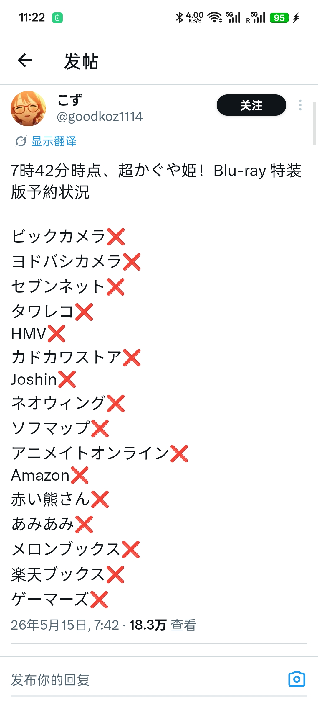

---
### 571楼 · 羊狼总动员0301
Lv.15 · 2026-05-15 11:09 · 赞 3

g店的设定预约量量也够综合月榜第一了，也不是太少

---
### 572楼 · 羊狼总动员0301
Lv.15 · 2026-05-15 11:14 · 赞 1

乐天算上cd 日榜第二

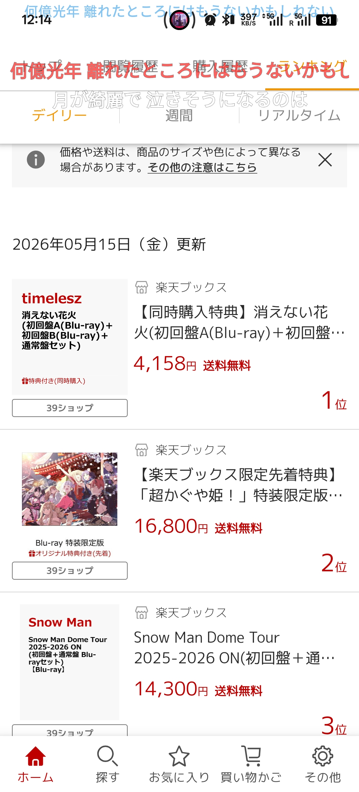

---
### 573楼 · 羊狼总动员0301
Lv.15 · 2026-05-15 11:24

第一波预约本来也该有一万附近吧，只看日榜也看不出啥来，等日亚空降和周榜才行了。

> **白衣毛哥** 2026-05-15 11:52:14：第一天就没货了,第二天的日榜还能出数据吗\[惊哭\]
>

---
### 574楼 · 羊狼总动员0301
Lv.15 · 2026-05-15 11:26 · 赞 1

按目前的人气和厨力，保守预计在10万附近？

---
### 575楼 · Inclis
Lv.1 · 2026-05-15 11:46

参考第一弹特典的情况，如果双引擎有补货计划，可能差不多六月就会重新开放特装版预约了吧

---
### 576楼 · 沙漠天使
Lv.5 · 2026-05-15 11:52

只能希望再补货一波了，这次晚上开卖，找代购下单都措手不及的😓

---
### 577楼 · 憶研
Lv.12 · 2026-05-15 13:32 · 赞 3

太幽默了\[笑眼\]看到公告前我都没想过BD居然能切的，本来要买官+A的，现在只订到了A，官还得等byd日本人补货\[笑眼\]

---
### 578楼 · 宝多茜
Lv.13 · 2026-05-15 17:04 · 赞 7

补货了！

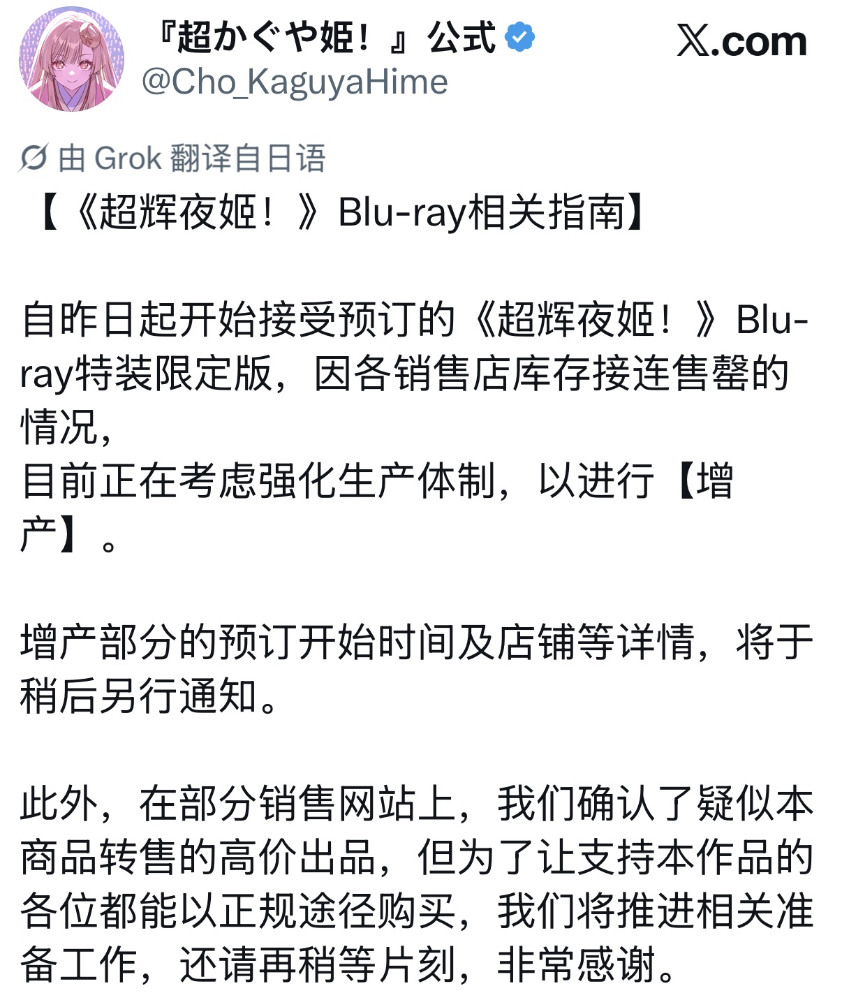

> **白衣毛哥** 2026-05-15 18:43:45：好,还知道扇倒狗一巴掌
>

---
### 579楼 · 龍HCL
Lv.14 · 2026-05-15 19:19 · 赞 1

今天的七点电影售卖排行，前二十五都看不到辉夜姬了\[泪\]既然还有追加的电影院，感觉官方应该不至于一直摆烂到结束！新特典快来吧！还能给bd做宣传广告！

---
### 580楼 · 龍HCL
Lv.14 · 2026-05-16 10:11 · 赞 2

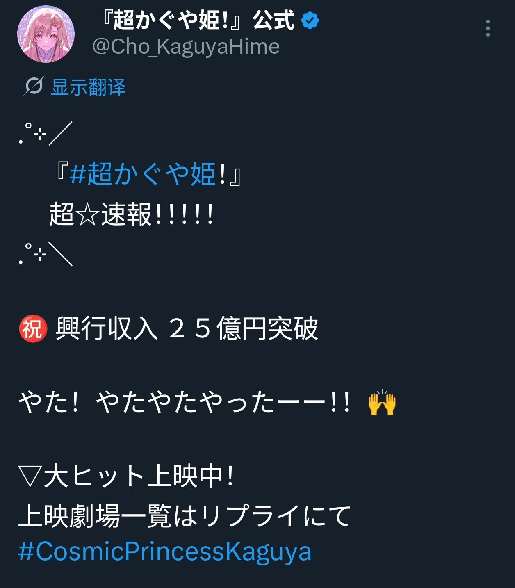

---
### 581楼 · 龍HCL
Lv.14 · 2026-05-17 05:40 · 赞 1

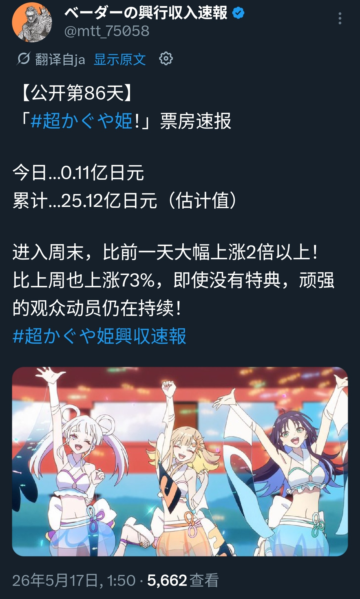

---
### 582楼 · 羊狼总动员0301
Lv.15 · 2026-05-17 11:28 · 赞 4

a店综合周榜1 2 5

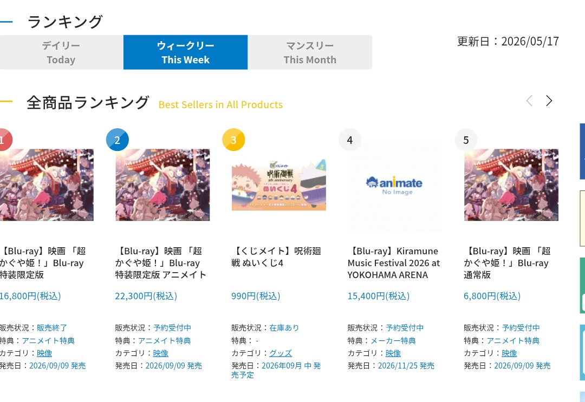

> **煞觉** 2026-05-17 12:41:18：现在有货了吗
>
> **羊狼总动员0301** 2026-05-17 13:18:39：没
>

---
### 583楼 · 用户007🌀
Lv.9 · 2026-05-18 00:42 · 赞 7

德岛舞台5.17对谈Bonus Track： 
1\.山下和永江（现实人设）安排失误，5月16日签售会当天凌晨4点才起床赶往德岛\[阴险\] 
2\.VR电台节目，脚本是官方监修过的 
3\.无论是导演还是其他主创都非常忙，除了山下不止一个场合说了“还在策划更多事情”，这次へちま也说了自己现在的作画强度和上映前一样，基本明示了有影像方面的衍生（不过へちま你不应该在隔壁片场干活吗，松竹存亡兴废可是在此一举了\[阴险\]）

> **龍HCL** 2026-05-18 05:40:28：赶紧画几个新电影特典啊！！！
>
> **aptx星璇** 2026-05-18 12:35:27：一直在忙但是一直没有产出，新物料的产量极低都在忙什么了\[阴险\]
>
> **用户007🌀** 2026-05-18 12:42:16：做动画没有那么快的，就算是泡面番从脚本分镜到V编纳品也得是几个月往上了，更别提10年后的设定背景都没怎么做，得重新准备。既然是监督和作监一起忙，那就是脚本分镜和作画同步进行，全速推进了。
>
> **aptx星璇** 2026-05-18 12:56:23：我当然知道动画没那么快，我是在说无论是电影特典还是商品展开都基本没有新图新东西，永远是那一套立绘和动画截图拿出来反复卖，有时商品有点新图也是原来的衣服换个动作姿势就是一个新立牌了，BD店铺特典也没有不同的专属图，我不信他们一上来就全力在专注做动画
>
> **用户007🌀** 2026-05-18 13:03:20：电影特典不要想了，印刷速度拉胯到不行，监督坚持画新图做特典，结果首映才赶出了几千份被观众骂惨。商品现在慢慢开始有新绘柄了。
>
> **用户007🌀** 2026-05-18 13:03:58：你辉就是个不受同行待见的插队生，我说白了。
>
> **用户007🌀** 2026-05-18 13:07:44：你要是松竹或者TMS Ent，发现自家过几个月就要上映的大作的人设+总作监因为他前一部作品爆冷大热，被拽回去继续干活，你会怎么想。
>
> **某不科学的FF君** 2026-05-19 20:35:13：主要辉夜姬目前出的新的商品绘柄都非常一言难尽\[笑尿\]去看看隔壁银河特急的，质量高的挺多的
>
> **用户007🌀** 2026-05-19 20:51:43：银河特急背后是朝日系，从哆啦A梦就开始搞周边的老资历，别太看得起你双引擎\[阴险\]
>

---
### 584楼 · 龍HCL
Lv.14 · 2026-05-18 07:30 · 赞 1

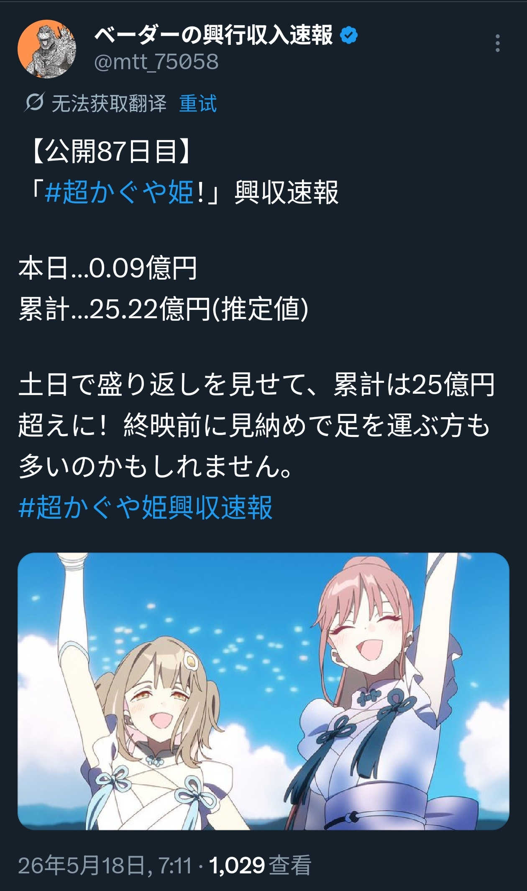

---
### 585楼 · 龍HCL
Lv.14 · 2026-05-18 12:57

唉，真的是到头了啊...

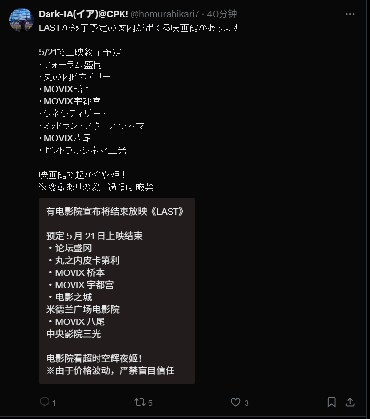

> **现场骑士那个骑士Lv** 2026-05-19 16:00:10：这是周四就要下映了吗，那过26亿有点难啊
>

---
### 586楼 · 龍HCL
Lv.14 · 2026-05-19 07:00 · 赞 2

到头了吗！！！

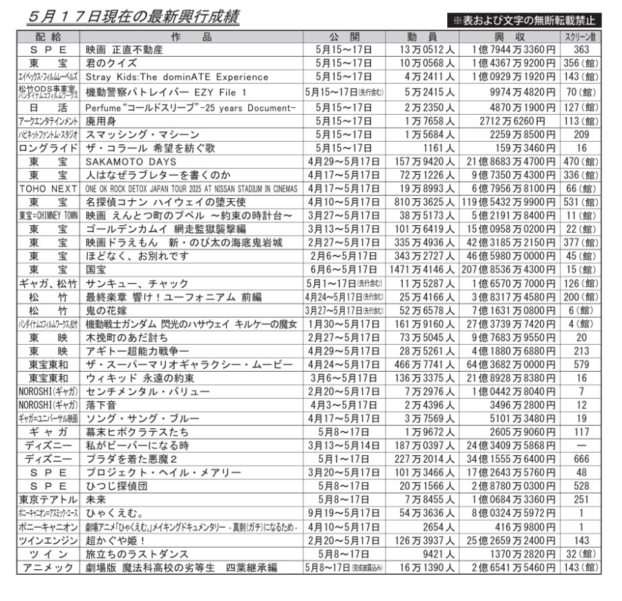

---
### 587楼 · 龍HCL
Lv.14 · 2026-05-19 20:04 · 赞 1

终究是要结束了！

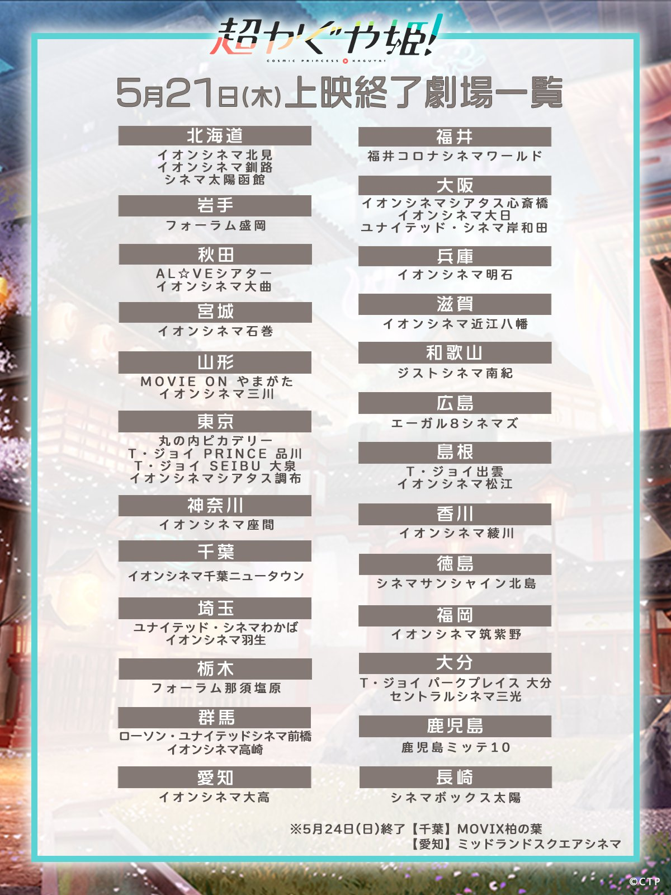

---
### 588楼 · 龍HCL
Lv.14 · 2026-05-19 20:08 · 赞 2

不知不觉46w关注了！当初想都不敢想！

---
### 589楼 · 对账伙计
Lv.12 · 2026-05-19 21:35

可惜，还以为能超过不孝子2

---
### 590楼 · 用户007🌀
Lv.9 · 2026-05-19 22:59 · 赞 2

\[阴险\]只能阴间（划掉）BD再见了

> **夜星划空** 2026-05-20 09:24:46：BD市场跟阴间也没啥区别了
>

---
### 591楼 · 煞觉
Lv.6 · 2026-05-20 12:20

有几家影院24号之后又能放了，还能蠕动一下

> **龍HCL** 2026-05-20 14:18:05：最后能在东宝放一个月就好了\[阴险\]
>

---
### 593楼 · 龍HCL
Lv.14 · 2026-05-20 17:53 · 赞 2

一边下映一边上映？何意味？

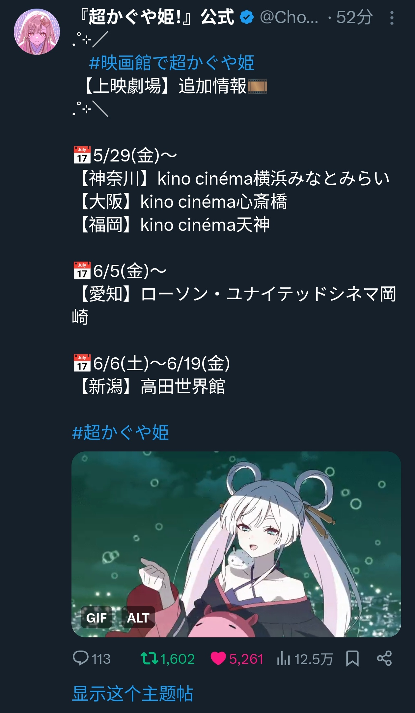

> **白衣毛哥** 2026-05-20 18:18:34：巡回演出,下乡慰问(
>

---
### 594楼 · 用户007🌀
Lv.9 · 2026-05-20 18:44 · 赞 4

大馆换小馆，大箱换小箱，这个负责协调上映人的太老练了

---
### 595楼 · 龍HCL
Lv.14 · 2026-05-22 07:50 · 赞 1

捞一下！

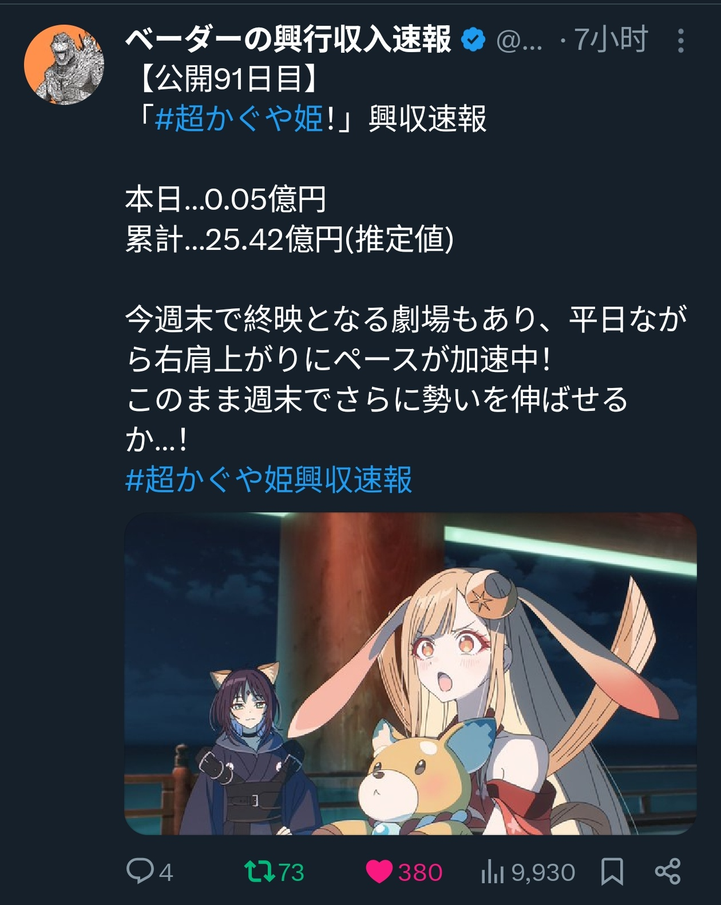

---
### 596楼 · 某不科学的FF君
Lv.1 · 2026-05-22 19:16

话说上个月就在说5月会公开月读感谢祭的一些内容，这都要到月底了，会有吗\[呵呵\]

---
### 597楼 · 龍HCL
Lv.14 · 2026-05-23 15:20 · 赞 3

都圈外了还在发！！！

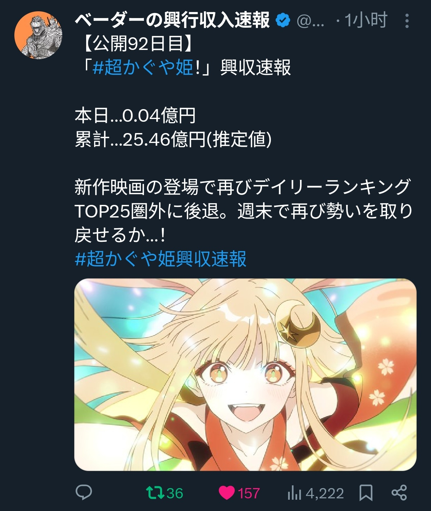

---
### 598楼 · 龍HCL
Lv.14 · 2026-05-24 17:22

垂死挣扎，该六月了，是不是该来点大的了？

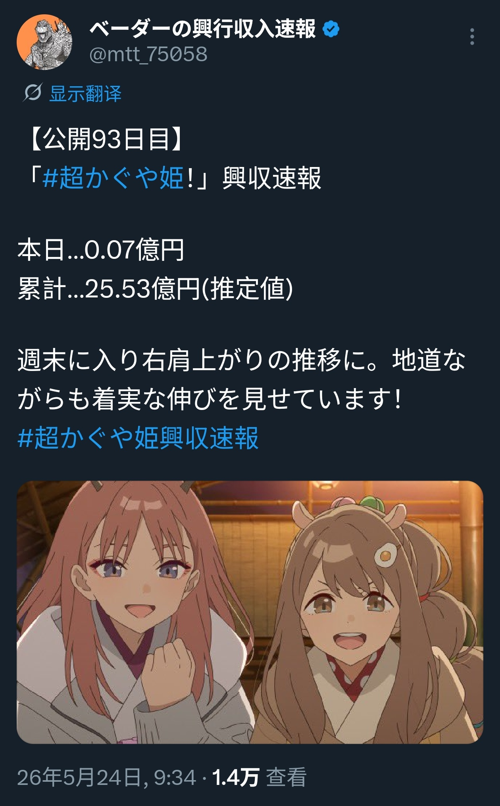

---
### 599楼 · 龍HCL
Lv.14 · 2026-05-25 08:04 · 赞 1

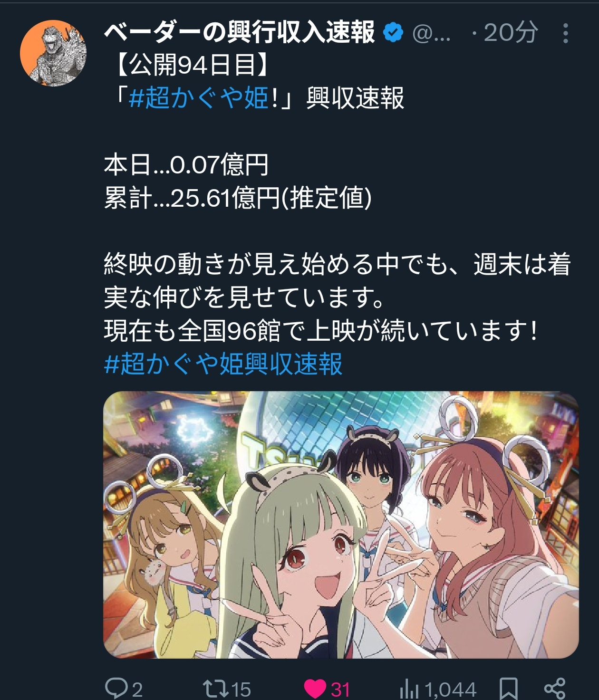

页码：[1–100 楼](thread.md) · [101–200 楼](thread_2.md) · [201–300 楼](thread_3.md) · [301–400 楼](thread_4.md) · [401–500 楼](thread_5.md) · **501–600 楼** · [601–700 楼](thread_7.md) · [701–800 楼](thread_8.md)

---

[⬆ 本页顶部](#top)　·　[⏬ 最新的楼层](thread_8.md#bottom)
