

# 【动画讨论&amp;追踪】超时空辉夜姬

- 贴吧: 名作之壁吧　楼主: inting1　发帖: 2026-02-21 19:38:46
- 原帖: https://tieba.baidu.com/p/10504053776　抓取时间: 2026-09-26 14:14:30　楼层数: 641　（时间均为北京时间）

[⬇ 本页底部](#bottom)　·　[⏬ 最新的楼层](thread_8.md#bottom)

页码：[1–100 楼](thread.md) · [101–200 楼](thread_2.md) · [201–300 楼](thread_3.md) · [301–400 楼](thread_4.md) · [401–500 楼](thread_5.md) · [501–600 楼](thread_6.md) · **601–700 楼** · [701–800 楼](thread_8.md)

---
### 601楼 · 龍HCL
Lv.14 · 2026-05-26 07:43 · 赞 7

25\.66 官方真的要一直放养下去了啊！

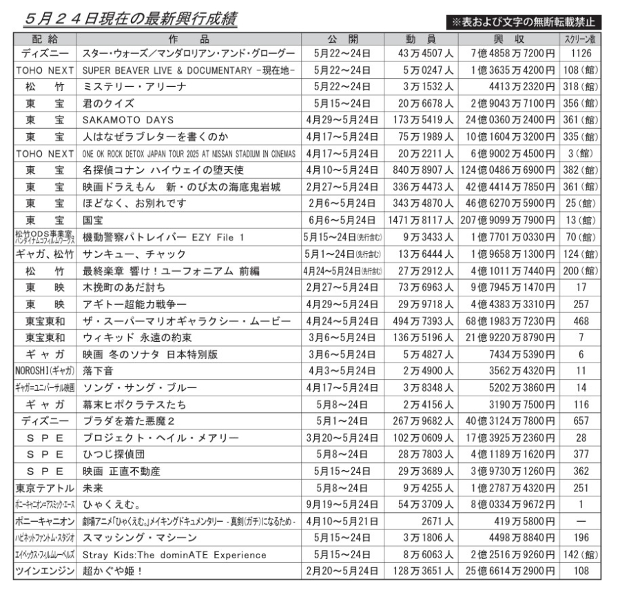

---
### 602楼 · 煞觉
Lv.6 · 2026-05-27 09:50 · 赞 2

又有一批影院停止放映了，爬得更加艰难了

> **shdhvisjsb** 2026-05-28 13:51:00：除非上映国内和其他国家，那基本就是25了，成绩非常不错了
>

---
### 603楼 · aptx星璇
Lv.8 · 2026-05-27 20:46 · 赞 3

BD的追加预约详情公布了只在官店卖，目前一共上限是20万份(如果在期限前超了还会追加)不过官店卖的o榜是不是不统计，那这就统计不到大头了

---
### 604楼 · 用户007🌀
Lv.9 · 2026-05-27 21:11 · 赞 2

除非官方自己公布数据，否则你楼只能阴间再见了\[阴险\]

---
### 605楼 · 龍HCL
Lv.14 · 2026-05-27 21:33 · 赞 2

20w应该不够吧！不公布数据，就加个20 w吧！

> **瓦上片霜** 2026-05-28 17:21:20：你真的了解过碟片市场吗
>

---
### 606楼 · 煞觉
Lv.6 · 2026-05-28 12:23 · 赞 1

这是什么排名？

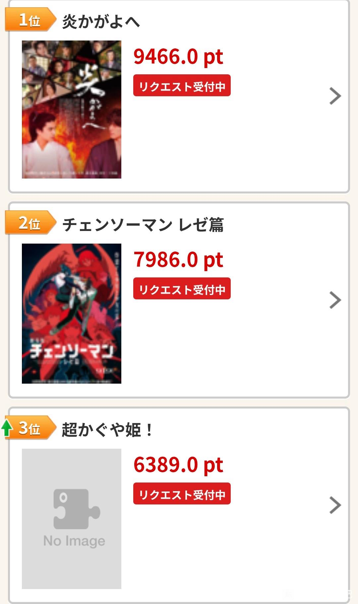

> **龍HCL** 2026-05-28 22:59:52：好像是个电影院的投票排名，前三给加场次！
>

---
### 607楼 · 用户007🌀
Lv.9 · 2026-05-28 13:19 · 赞 11

追加 20w 这个数说出来明显只是用来杀黄牛的\[汗\]不要太较真，剧场动员人数才不到 130 万，其中大部分还是周替特典刷出来的，便宜的小说卖到现在也才 16w，双引擎真想冲量就该分货到店让核心粉冲特典全收集，或者塞点抽选之类的期货

> **仙翳** 2026-05-28 17:35:18：听说a店也补了
>
> **用户007🌀** 2026-05-28 18:39:08：可能是退货释放库存
>
> **兄弟干的不错** 2026-05-28 18:40:45：有一说一，动员人数和小说销量参考价值没那么大，流媒体先上线一个半月，肯定会对动员人数有冲击，至于小说，16w已经是o榜半年榜第一了
>
> **用户007🌀** 2026-05-28 19:21:36：动员人数就是一种购买力测试，在前期BD发售时间未定的情况下，能最大程度区分近乎白嫖的纯流媒观众和愿意花2200的顶价买票甚至多刷拿纸皮特典的粉丝，但BD特装版定16800这个价格就是在这些粉丝基础上再筛一批消费意愿更强的粉丝。在没有抽选、没有分店特典持续供应的前提下，20万就是个吓唬黄牛的数字。马娘2把特典塞爆了也没达到这个量级。
>
> **GG9487** 2026-05-28 20:43:19：主要是怎麼可能真的賣20w，沒有塞王之力的情況下能賣20w是鬼滅這種等級的
>
> **兄弟干的不错** 2026-05-28 22:41:32：赛马娘是累平销量20w，不是总销量20w，而且相较于tv动画，那边确实更喜欢买电影bd
>
> **shdhvisjsb** 2026-05-29 12:14:02：赛马娘销量也太恐怖了，总销量有统计吗？
>

---
### 608楼 · aptx星璇
Lv.8 · 2026-05-28 18:18 · 赞 6

a店和g店都补货了(其他通贩网站没看不知道是不是也补了)这下o榜数字应该能好看一点了(虽然大头应该还在官店)最后买了A店的

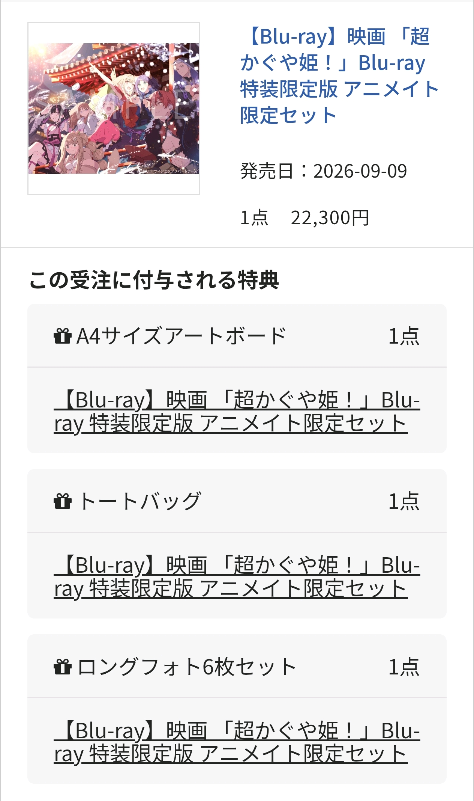

---
### 609楼 · 用户007🌀
Lv.9 · 2026-05-28 23:37 · 赞 9

多说无益，先把第一个 10w 填满罢\[阴险\]

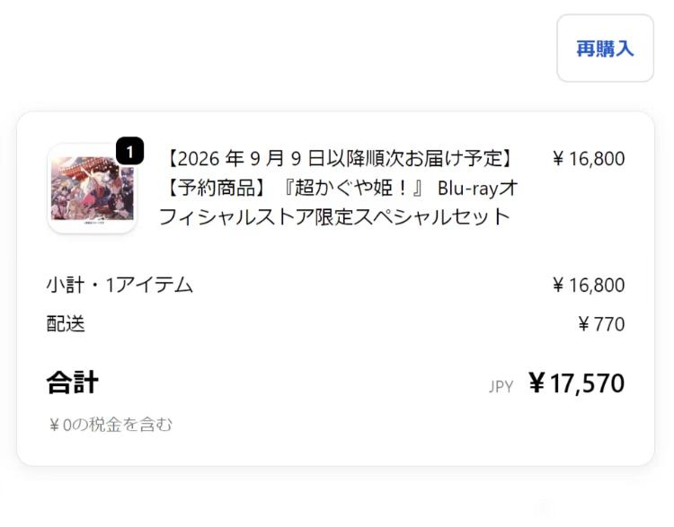

---
### 610楼 · 某不科学的FF君
Lv.1 · 2026-05-29 13:48 · 赞 2

上次说到谷子，我看银河特急那边好像常用一个画师给他们画杂志，谷子商品图，都挺好看的，辉夜姬这边就不能找一个审美不错的劳模来持续画商品图吗\[乖\]

---
### 611楼 · 龍HCL
Lv.14 · 2026-05-29 23:24 · 赞 2

到现在了，第一个十万都没填满，20万估计真的就是吓唬黄牛了吧……

> **沙漠天使** 2026-05-30 00:26:14：不塞王之力看来也就这样了\[阴险\]
>

---
### 612楼 · 井Chisha
Lv.1 · 2026-05-30 00:37 · 赞 2

话说colorido跟网飞的合约还真是宽鬆啊，院线转长期上映也没说啥，甚至流媒公开不到半年大张旗鼓卖碟\[阴险\]

---
### 613楼 · KF♀
Lv.1 · 2026-05-30 02:28 · 赞 6

能卖个五万其实就已经是个很优秀的成绩了\[笑眼\]，二十万放出来就是让倒🪝死绝

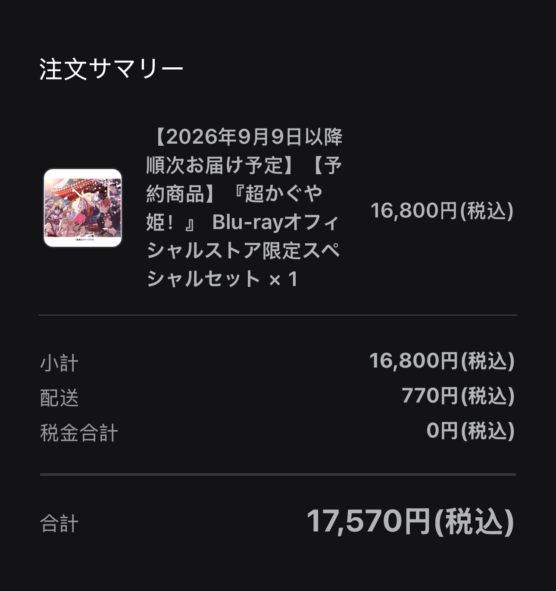

---
### 614楼 · 龍HCL
Lv.14 · 2026-05-30 07:48 · 赞 1

前三了，有没有希望在东宝上映？

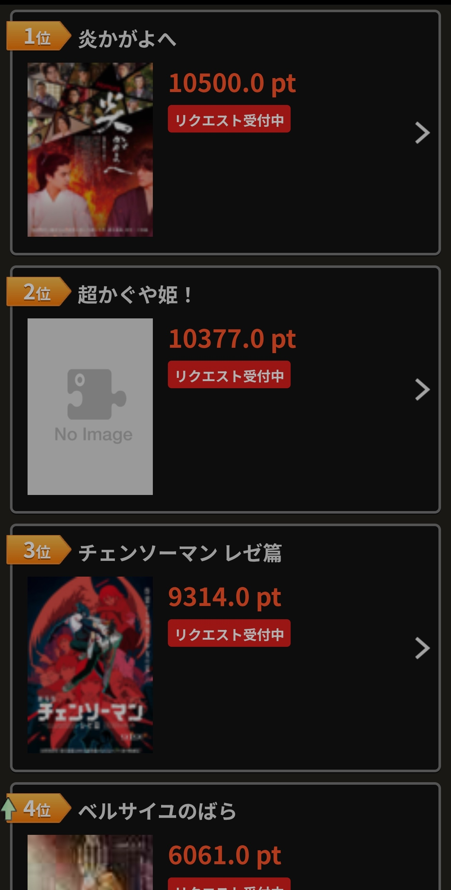

---
### 615楼 · 龍HCL
Lv.14 · 2026-05-30 07:51 · 赞 4

闲鱼买了！第一个十万最后都没达成就笑了…… 
官方应该给个进度条刺激粉丝！

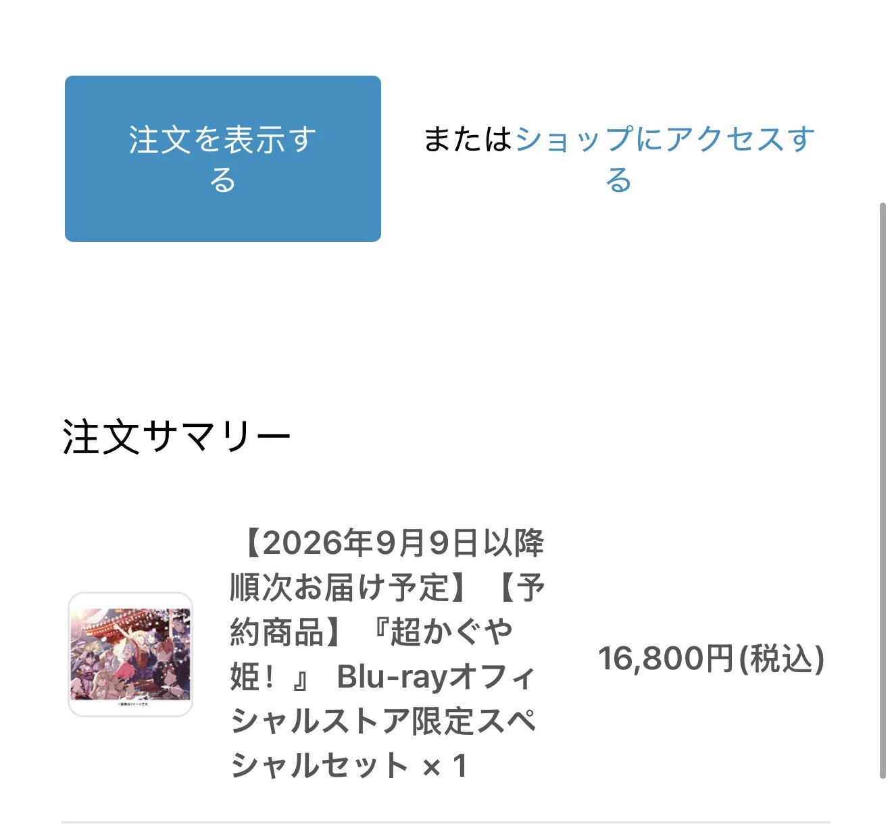

---
### 616楼 · 用户007🌀
Lv.9 · 2026-05-30 08:23 · 赞 1

\[阴险\]当年 BD 销量还算能看的时候，记得君名半年卖了 15w 左右，票房 23e 的声之形是 3w 多（算上未集计的京阿尼 shop 应该 5w 左右），这俩都是朴实无华的无王之力配置，考虑到声之形核心粉比较少，辉夜能到 10w 上下就不错了\[阴险\]

---
### 617楼 · AdamXL07
Lv.10 · 2026-05-30 09:41 · 赞 2

官店注册下单很简单挺好的，感觉它在核心群体的热度过10w不是难事……

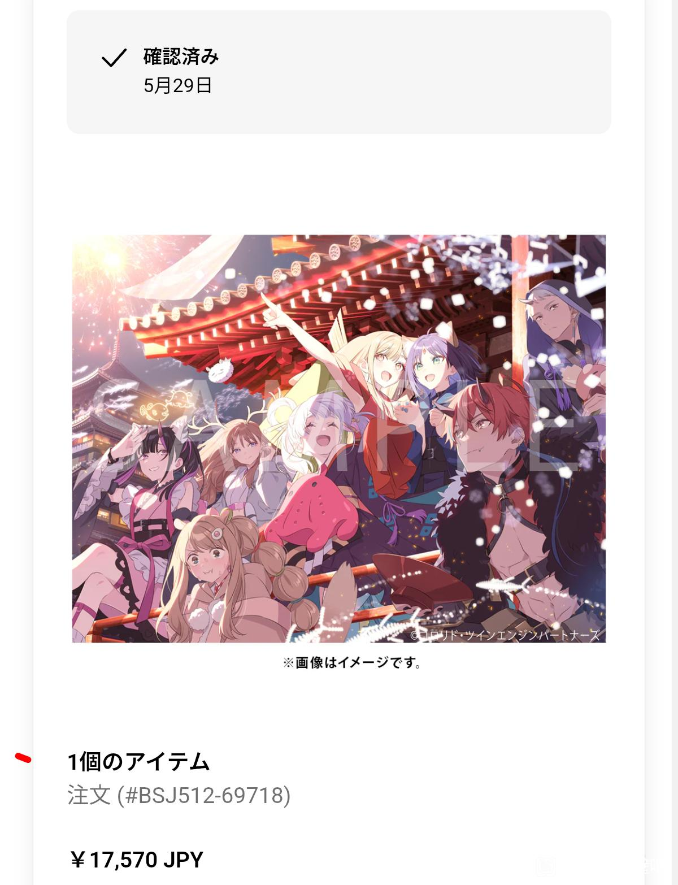

> **煞觉** 2026-05-30 09:53:08：能直接运到国内？
>
> **AdamXL07** 2026-05-30 09:59:47：我有那边的代收……\[阴险\]
>
> **用户007🌀** 2026-05-30 10:09:44：这个系统（shopify）的问题是即时决计，等于这bd是完全受注生产的，6.11截止，对一些攒钱买的不友好。
>
> **AdamXL07** 2026-05-30 10:28:05：\[阴险\]在日本挺常见的啊
>
> **用户007🌀** 2026-05-30 11:14:38：日亚这类不是，发货当天才扣，所以日亚即便特典经常拉胯但预定量总是可观且稳定\[阴险\]
>
> **用户007🌀** 2026-05-30 11:28:25：用转运服务就可以了。官店用shopify搭建的优点是注册特别方便，和国内微店注册基本一致，下单也干脆利落，没有IT日企搞的平台那样别扭（众筹用的A店平台简直是日本IT笑话大赏）。
>

---
### 618楼 · 白衣毛哥
Lv.9 · 2026-05-30 14:01 · 赞 1

淘宝非官店的好像都砍单了，这下只能买官店的了，订了一套，就等到货了\[怒\]

> **白衣毛哥** 2026-05-30 14:02:46：本来想官店买一套，a店买一套的，这下被迫省钱了\[喝酒\]
>

---
### 619楼 · 用户007🌀
Lv.9 · 2026-05-31 19:01 · 赞 9

BD限定版的特典（角色评论音声）试听段有翻译了：BV1GeVn6mEeL。 
整段音声应该是录完了，之前编剧已经澄清了这不是副音轨，而是官方切片某一段，然后角色就这一段发表评论，时间线是10年后。 
光凭这试听47秒的内容，这16800就没白花\[吐舌\] 
1\.彩叶的键盘对她来说已经是“战友”一样的存在了，还会抱着键盘哭 
2\.八千代彩gachi和嬷彩本性根本不演了 
3\.一开始锤墙的邻居后面为什么没动静了，音声里也解释了\[阴险\]只能说不愧是辉夜

---
### 620楼 · 某不科学的FF君
Lv.1 · 2026-06-01 09:17 · 赞 2

アニメイト5月月榜超辉第1.2名

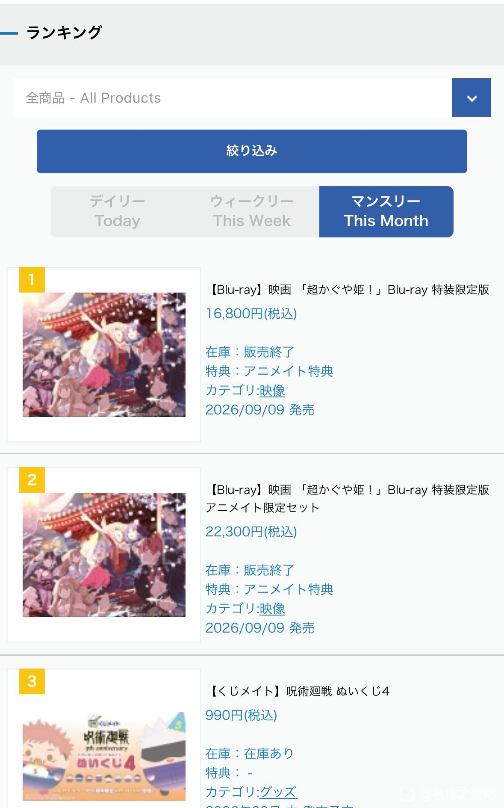

---
### 621楼 · 龍HCL
Lv.14 · 2026-06-01 17:03 · 赞 1

最后！

---
### 622楼 · 煞觉
Lv.6 · 2026-06-01 17:06 · 赞 2

放映到19日就结束了（部分除外），能磨到26亿吗？

> **煞觉** 2026-06-01 17:18:39：18日有舞台问候的直播，但是永濑不来
>
> **清风自蓝天起** 2026-06-04 16:02:12：可惜了\[乖\]
>

---
### 623楼 · 用户007🌀
Lv.9 · 2026-06-01 21:12 · 赞 7

领衔原画之一山田（全名应该是山田奈月）宣布从 Studio Colorido 离职（如图一） 
是从《企鹅公路》就开始负责 Colorido 作品的老资历。 
她在辉夜姬的高光作画如图二。

> **用户007🌀** 2026-06-01 21:16:02：以及 Ray MV 中“彩P跳舞了”的三人画面
>
> **龍HCL** 2026-06-01 23:44:23：不是赚到钱了？
>
> **用户007🌀** 2026-06-02 00:00:08：公司赚钱跟她没什么关系，正式员工拿底薪+计件提成的
>
> **龍HCL** 2026-06-02 06:37:19：可别过两天传出个双引擎压榨员工的新闻2333
>
> **迷人大白菜** 2026-06-02 12:33:27：会不会是作品火了被挖角跳槽？
>
> **用户007🌀** 2026-06-02 12:53:30：应该是当自由原去了，她后面发了几条推文说接到了很多邀请。以她的实绩做自由原收入可能比当固定员工更高些
>
> **ayliarw** 2026-06-02 15:27:31：回复 用户007🌀 :话说石田祐康离开colorido干啥去了，还能拉到投资吗。
>
> **用户007🌀** 2026-06-03 21:14:49：想了想，说不准和最近怪化猫的声优替换事件是否有关
>
> **迷人大白菜** 2026-06-05 20:36:51：声优事件怎么会牵连到原画师？
>

---
### 624楼 · 龍HCL
Lv.14 · 2026-06-02 07:03 · 赞 3

绝赞卡九！

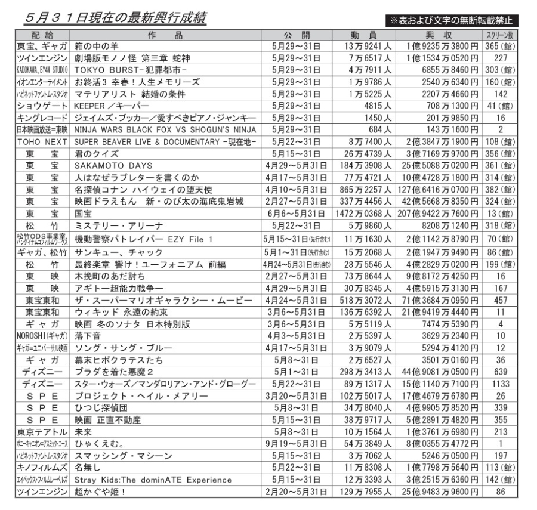

---
### 625楼 · 龍HCL
Lv.14 · 2026-06-02 23:25 · 赞 4

小说第十次！

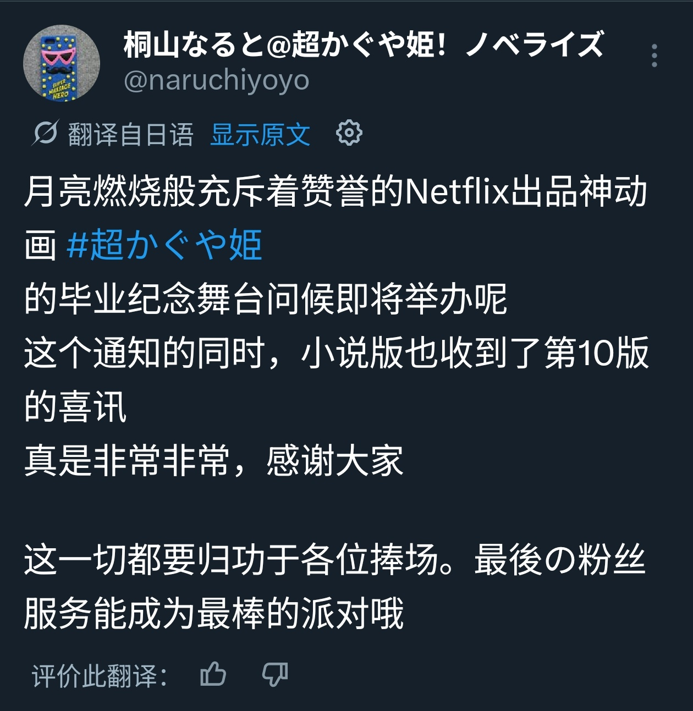

---
### 626楼 · 回忆の梦
Lv.7 · 2026-06-04 12:48 · 赞 8

矢吹健太朗画了，官推不转下吗\[滑稽\]

---
### 630楼 · 用户007🌀
Lv.9 · 2026-06-10 10:09 · 赞 11

总算恢复了\[狂汗\] 
辉夜突破26e，一周还能有个3kw的样子，比一些纯靠周替特典磨票房的还要好，官方弃影保碟的做法不知道值不值呢。 
另外抽风的这周有两件大事：一是双引擎老板山本幸治因为怪化猫电影第三部的争议宣布退出制片人行业，这个影响不大，只是换了个背锅侠当制作人，自己躲在幕后而已。二是 Reply 和 Remember 的作词人真崎Erica所属的公司（厂牌 Arte Refact）因老板丑闻，全体创作者宣布离职，部分人员正在筹备成立新公司，虽然说会努力把对合作方的影响降到最低，但对辉夜续作的影响是几乎不可避免了

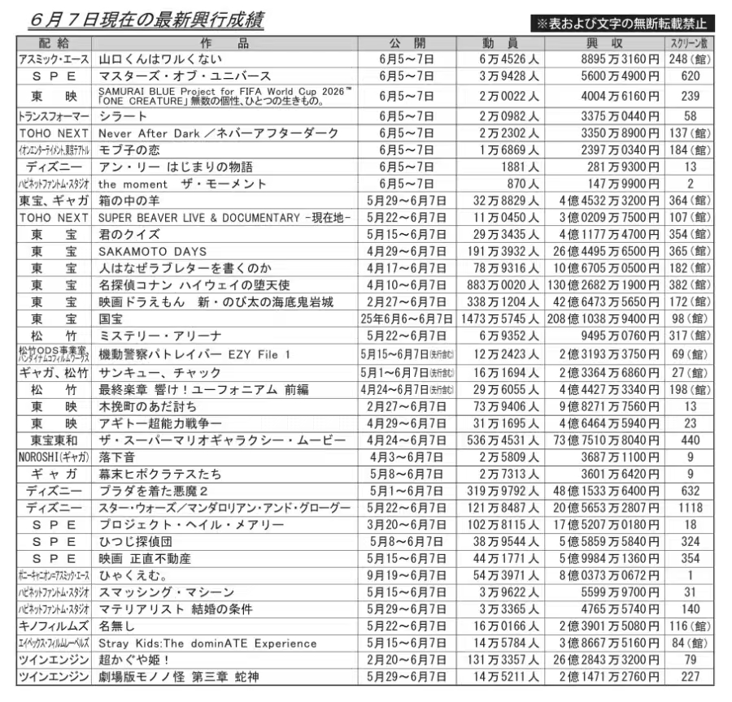

> **龍HCL** 2026-06-10 12:24:57：没关注到后面的事……
>
> **用户007🌀** 2026-06-10 13:21:42：Arte Refact 这次事件堪称行业大地震，比起辉夜这种一锤子买卖，爱马仕、邦多利、各类 vtuber 都和这个社团有长期合作关系\[阴险\]更要命的是这老板还担任了偶像梦幻祭的音乐制作人。
>
> **豬sir** 2026-06-10 20:34:49：比想像嚴重啊，二偶音遊全面波及
>

---
### 631楼 · shdhvisjsb
Lv.1 · 2026-06-11 10:13 · 赞 2

bd预订好像要结束了，销量多少可以预测吗？

> **wzy12356** 2026-06-11 10:43:11：没法预测 只能等周榜
>

---
### 633楼 · 井Chisha
Lv.1 · 2026-06-11 21:44 · 赞 2

官店二次受注至少1w份以上，不过在往上就没有更高数量的等级了所以实际多少不得而知

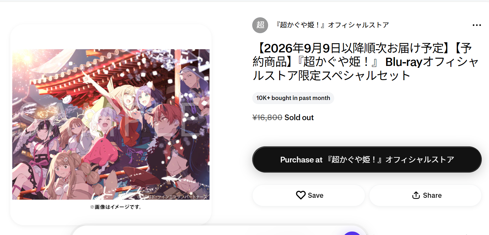

> **煞觉** 2026-06-11 21:59:24：那就没到10w啊
>
> **井Chisha** 2026-06-11 22:50:11：没有，真的截止前切了的话推上肯定有人大吹特吹\[阴险\]
>
> **GG9487** 2026-06-11 23:00:03：官店二次受注怎麼可能賣十萬，前面其他店鋪跟官店就先賣過一批了，最後O榜也不會統計官店實際賣多少官方不公布也沒人知道了
>

---
### 634楼 · wzy12356
Lv.13 · 2026-06-14 09:00 · 赞 6

日亚第一个月的销量出了 日亚5000左右

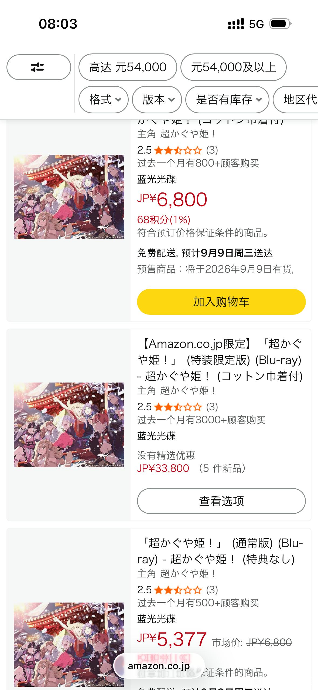

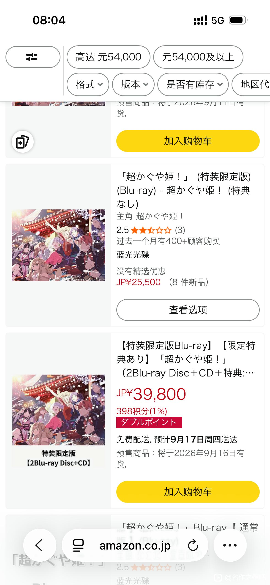

> **shdhvisjsb** 2026-06-14 19:45:00：什么水平？
>
> **aptx星璇** 2026-06-15 14:18:10：这么看日亚的特典特装版只备货了3000也太少了喷了，那其他几个通贩网站估计也差不多，可能A店G店会多点
>

---
### 635楼 · 龍HCL
Lv.14 · 2026-06-16 07:41 · 赞 6

上周差不多0.4，还能磨到27吧！

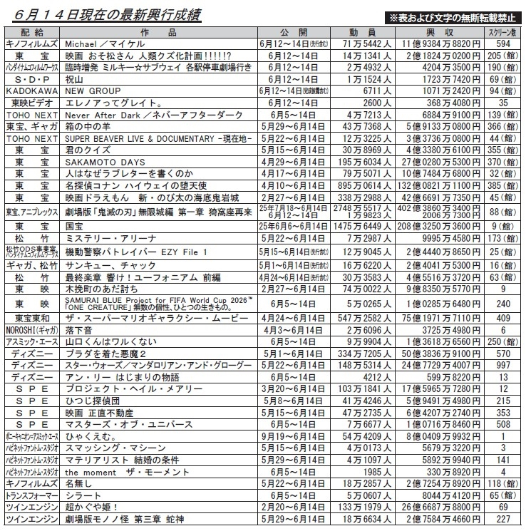

---
### 636楼 · 某不科学的FF君
Lv.1 · 2026-06-19 20:47 · 赞 2

该复活了，MX4D®、4DX、SCREENX、ULTRA 4DX、Dolby Atmos9月就来了。感觉能破30万吧

---
### 637楼 · 用户007🌀
Lv.9 · 2026-06-19 20:49 · 赞 3

我说辉夜假死是本年度智斗巅峰有没有懂的\[阴险\] 
你以为我要下映了，但我 9 月以 4dx（体感）和杜比全景声制式归来你又将如何应对

> **用户007🌀** 2026-06-19 20:52:39：虽然为了凑周五上映选的日期有点难绷就是了\[阴险\]
>

---
### 638楼 · aptx星璇
Lv.8 · 2026-06-19 20:52 · 赞 1

能不能再磨十亿\[吐舌\]

> **龍HCL** 2026-06-19 21:04:56：看影院数量吧！再上映是不是也是在宣传BD？
>
> **aptx星璇** 2026-06-19 21:15:16：这次舞台挨拶都基本没提BD的事，倒是宣传了几次网飞（说即使下映了在网飞还能继续看）
>

---
### 639楼 · Inclis
Lv.1 · 2026-06-19 20:56 · 赞 7

听山下的口风，续作应该是已经确定了

> **龍HCL** 2026-06-19 21:02:40：扩充吧！来点日常就行！不需要啥超展开！
>
> **GG9487** 2026-06-19 21:24:54：雙引擎也沒有能賺錢穩定飯票，繼續做輝夜姬機率挺大的
>

---
### 640楼 · 灬赫小萝灬
Lv.2 · 2026-06-19 21:49 · 赞 1

\[泪\]还可以再上映

---
### 641楼 · 煞觉
Lv.6 · 2026-06-20 19:48 · 赞 1

九月在上映是为了避开暑期档大战吗

> **用户007🌀** 2026-06-20 22:08:22：暑期档有好几个大前辈，自家也有缎带英雄要上，4dx 和杜比也没那么快修得出来
>

---
### 642楼 · 我看了十分感动
Lv.1 · 2026-06-22 17:35 · 赞 2

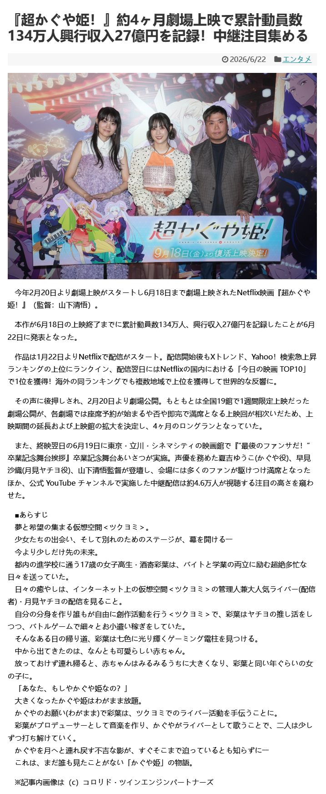

134万人次 27亿日元

---
### 643楼 · GG9487
Lv.8 · 2026-06-23 11:08

特殊場是算票房的嗎？

> **用户007🌀** 2026-06-23 22:18:06：只要是在正规影院上映都算的，所以柯南这些冲票房的电影都爱玩特殊上映，花样还多，除了4dx、应援场还有副音轨、荧光棒等等，既能吸引多刷观众又能靠提高票价刷票房。
>

---
### 644楼 · 龍HCL
Lv.14 · 2026-07-05 15:57 · 赞 9

捞一下！ 
目前的阶段性成绩！ 
再上映时，特典啥的应该都准备充分了！ 
不知道能有个几亿的票房啊！30应该稳的，小目标35，终极目标 40？增量正好是当前票房的一半！不知道会不会是幻想！！！

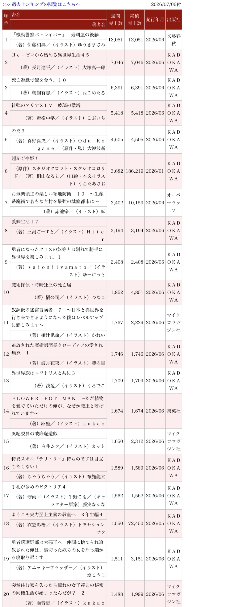

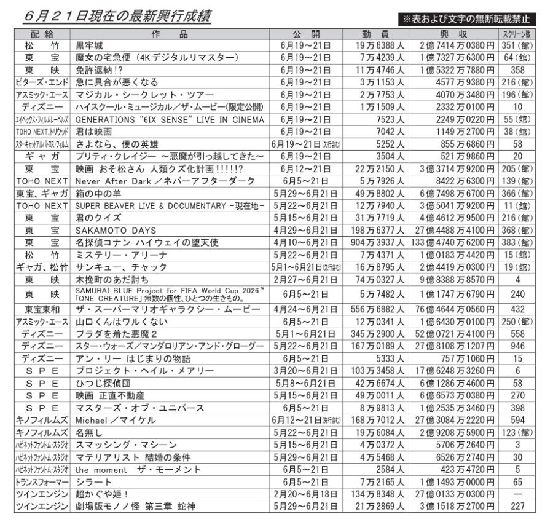

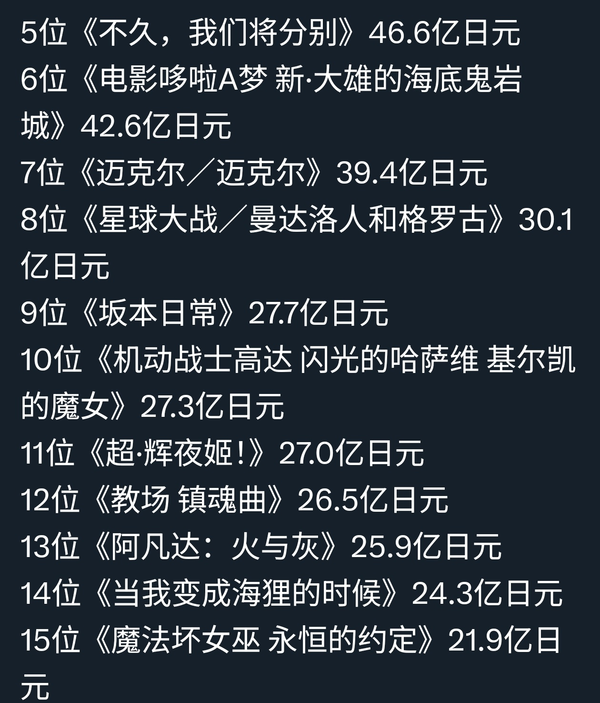

> **shdhvisjsb** 2026-07-09 23:15:01：希望吧\[真棒\]
>

---
### 645楼 · 井Chisha
Lv.1 · 2026-07-15 21:15 · 赞 2

再上映拉到近250馆，给力啊

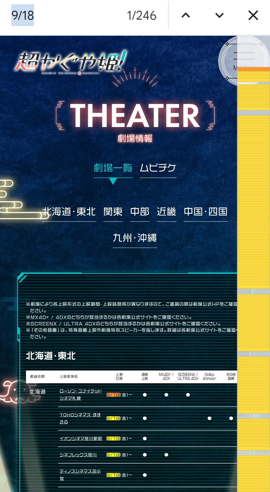

> **莫谈戚焉** 2026-07-16 11:10:15：之前东宝影院不上现在也有了
>

---
### 646楼 · 纽卡希勒
Lv.13 · 2026-07-15 23:07 · 赞 1

比小圆新剧场版票房高的可能性又增加了\[阴险\]

---
### 647楼 · 龍HCL
Lv.14 · 2026-07-16 00:11

目标五十？

> **纽卡希勒** 2026-07-16 17:46:28：感觉很难吧
>
> **井Chisha** 2026-07-16 21:20:36：取消了特殊票价，票房上限有可能拉得很高也有机会直接暴死最终30亿出头，看宣发力度跟后续商法质量了
>

---
### 648楼 · 龍HCL
Lv.14 · 2026-07-16 00:28 · 赞 2

再上映前能到五十万吗？

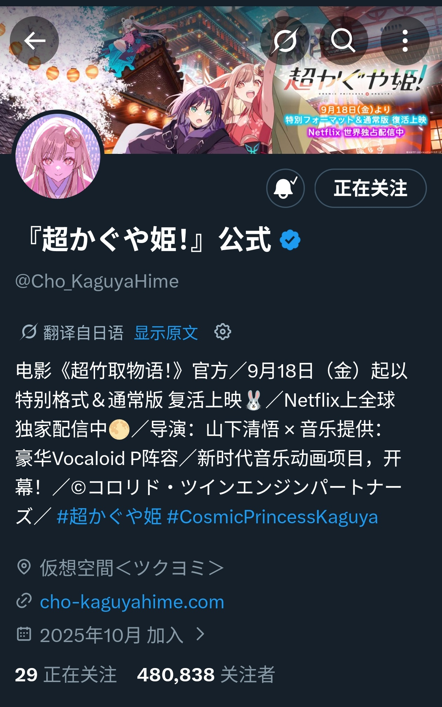

---
### 649楼 · 我看了十分感动
Lv.1 · 2026-07-16 01:58 · 赞 2

一直都有点纠结918这个上映日期，结果一查周五之后连着2天周末+3天祝日(不上班)就差不多明白了

---
### 650楼 · 龍HCL
Lv.14 · 2026-07-30 11:26 · 赞 6

20w挺难的！

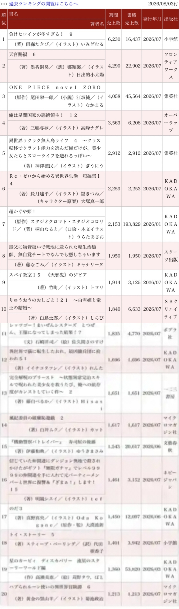

---
### 651楼 · 煞觉
Lv.6 · 2026-08-05 10:52

双引擎和万代达成合作关系了……有大佬知道以后会有什么变化吗？

> **用户007🌀** 2026-08-05 13:12:32：这个合作主要是提供原作漫画到动画企划到衍生商品一条龙服务，能更好地锁定原作者，降低中间商成本。对本来就是原创的辉夜应该影响不大，可能比之前更容易出周边了。
>

---
### 652楼 · 用户007🌀
Lv.9 · 2026-08-05 13:09 · 赞 3

说起来，辉夜的4dx版预告和观前提示已经在各大4dx影院播出了，目前还没有逐字repo，但根据已有的信息判断，全长大概2分钟出头，画面是正片，bgm是Reply，座椅会随着音乐节奏振动。主角是彩辉两人（以头像形式出镜），彩叶认真念稿，辉夜插话，有种妇唱妻随打情骂俏的感觉。最后辉夜的台词可能挺爆的，网上现地民原话是“脑子都要烧起来了”，可能和电台的那句“全部”差不多吧。 
另外稍微提了下芦花，但不知道内容，应该只是随口提了嘴。\[阴险\]

---
### 653楼 · 用户007🌀
Lv.9 · 2026-08-05 23:11 · 赞 4

这个不知道从哪冒出来的《BBB漫画》据网友查证，是双引擎漫画部出品，依据是杂志的社媒id是从双引擎漫画部的官号改名而来，这看起来就是和万代合作的第一步了。 
发售日虽然是8.7，但目前已经提前在部分店铺偷跑。

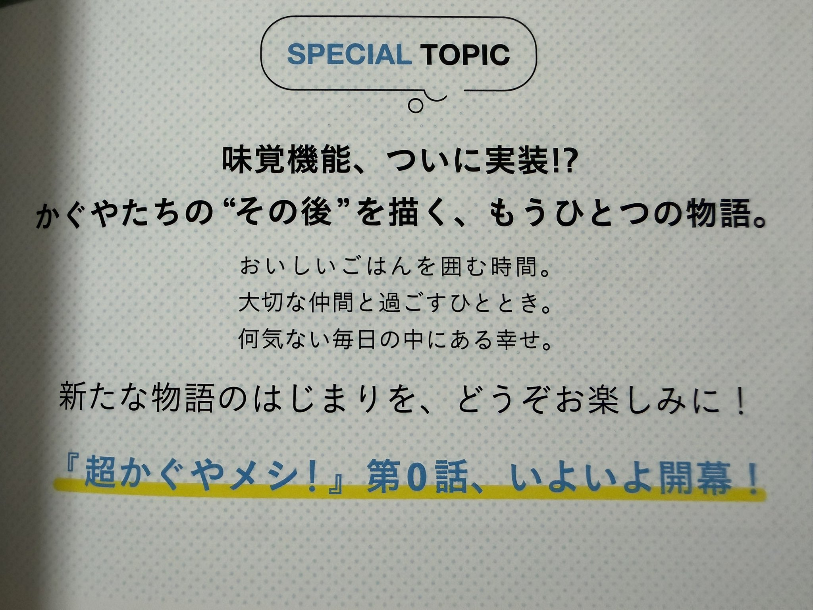

> **用户007🌀** 2026-08-06 00:16:18：确认：杂志企划双引擎、企划协力万代
>
> **龍HCL** 2026-08-07 00:35:22：吃饭！
>
> **煞觉** 2026-08-07 09:07:56：完全没宣传突然就发售了
>
> **煞觉** 2026-08-07 09:10:00：看了官推的预告原来今晚才开始宣传这个
>

---
### 654楼 · 龍HCL
Lv.14 · 2026-08-08 10:30 · 赞 1

这票不拿去看的话，不算票房吧？

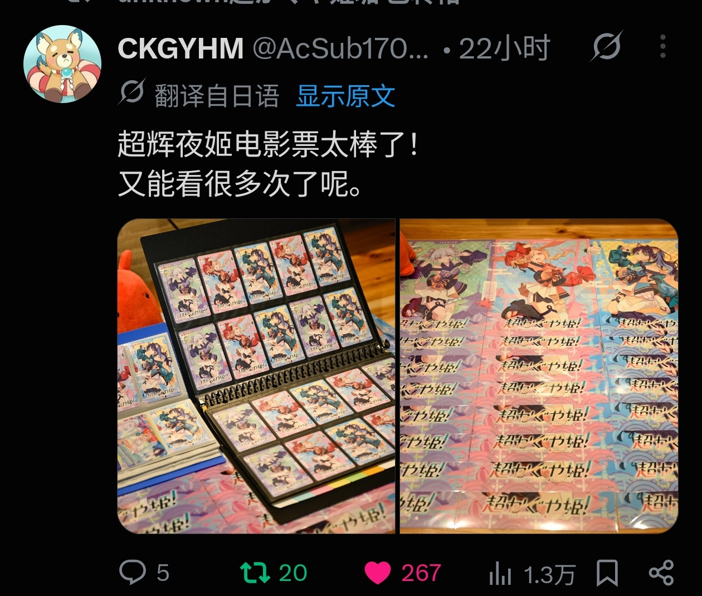

---
### 655楼 · 夜星划空
Lv.13 · 2026-08-25 11:43 · 赞 2

666

---
### 656楼 · 白衣毛哥
Lv.9 · 2026-09-15 15:51

这周五开始这贴又要复活了吧

---
### 657楼 · wzy12356
Lv.13 · 2026-09-15 16:13 · 赞 3

初动3万6

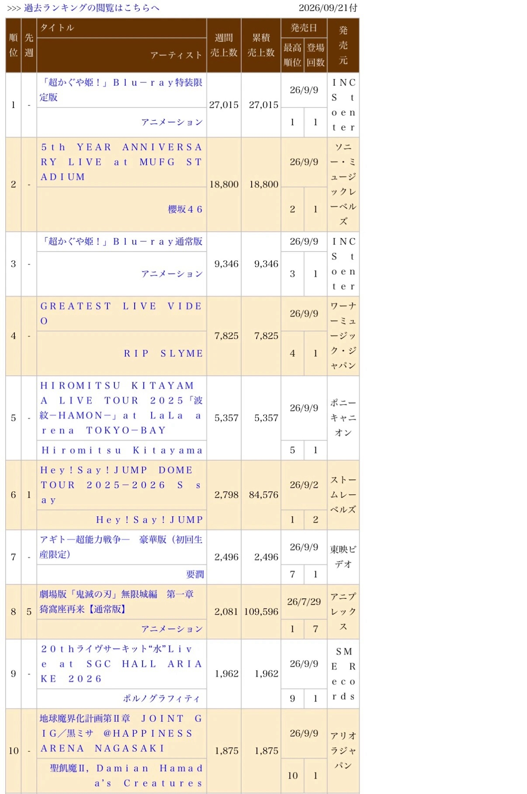

> **龍HCL** 2026-09-15 16:37:29：官店不会没算吧？
>
> **用户007🌀** 2026-09-15 16:58:43：没算。o 榜是合作集计制，只有在官方合作店里销售的才纳入统计
>
> **wzy12356** 2026-09-15 17:07:47：不算的可能性很大
>
> **wzy12356** 2026-09-15 17:08:26：那也不一定 少数情况下没在合作店列表里的店也会算销量
>
> **用户007🌀** 2026-09-15 17:20:31：100% 不会计入，辉夜的网店是临时搭的草台
>
> **Kizumi-** 2026-09-15 18:51:37：不懂就问，这是个什么水平？
>
> **宝多茜** 2026-09-15 22:09:30：感觉官店应该占了一半的，而且目前的销量是断货的第一批。第二批是十月出货的
>

---
### 658楼 · 王者之韦
Lv.12 · 2026-09-15 17:02

没想到居然这么快就重映了

---
### 659楼 · 用户007🌀
Lv.9 · 2026-09-15 21:39

\[阴险\]一些不是很愉快的回忆涌上心头.jpg

---
### 660楼 · 用户007🌀
Lv.9 · 2026-09-16 00:13 · 赞 4

说起来双引擎 8 月上线的缎带骑士这个月初也搞了两周 52 馆限时上映，刚刚看了下首周观影人次 ＜2115 人，票房恐怕连 300 万日元都没达成，特典倒是诚意很足但吸引力还是有限。看来近期双引擎在动画这块只能继续薅辉夜的羊毛来讲故事了\[汗\]

> **用户007🌀** 2026-09-16 20:19:11：真的，辉夜什么时候能送张CD特典票房绝对爆炸\[阴险\]
>
> **龍HCL** 2026-09-16 21:47:41：希望这次大方点吧……
>
> **八大天王石宝** 2026-09-16 22:10:47：是缎带英雄吧，这片跟缎带骑士的关系还没辉夜姬物语和超辉夜姬的关系大呢
>
> **用户007🌀** 2026-09-16 22:13:30：\[阴险\]打错了
>
> **仙翳** 2026-09-18 01:45:36：这次复活上映的特典目前来看也很一般啊
>
> **用户007🌀** 2026-09-18 08:04:00：主要还是引导观众去看高价值场次\[阴险\]
>

---
### 661楼 · KOMAYUMI
Lv.3 · 2026-09-17 08:32

看了楼里几个老哥的讨论，什么叫官店的销量不计入统计\[阴险\]，那么草台的吗，那具体数据莫非只能等官方自己发

---
### 662楼 · DFB\_Trumpet
Lv.9 · 2026-09-17 10:11

官店不计入统计关草台什么事

> **用户007🌀** 2026-09-17 10:15:11：官店是用 Shopify 搭的，本质就是个体面点的淘宝，本质就是草台
>
> **DFB\_Trumpet** 2026-09-17 10:36:29：所以跟官店不计入统计有什么关系？
>
> **用户007🌀** 2026-09-17 10:55:25：oricon 是合作集计制，会找一家淘宝店统计销量吗
>
> **西塘的烟雨** 2026-09-17 11:50:53：o榜本来就是第三方统计，你以为是什么权威榜单。仅供参考。
>
> **DFB\_Trumpet** 2026-09-17 11:52:46：别跟我说跟楼上说啊
>
> **DFB\_Trumpet** 2026-09-17 11:53:15：所以官店不计入统计=草台？ oricon是那么高贵的玩意吗？
>
> **用户007🌀** 2026-09-17 12:09:29：跟你不在一个频道上，没法聊
>
> **DFB\_Trumpet** 2026-09-17 13:40:25：所以别家的bd不走这些渠道的也是草台班子是吗
>
> **西塘的烟雨** 2026-09-17 16:41:31：这是官方销量吗？笨不死你
>
> **西塘的烟雨** 2026-09-17 16:42:00：官方没公布那不叫官方数据，o榜是什么你自己去搜下这么难？
>
> **DFB\_Trumpet** 2026-09-17 16:44:28：所以官店销量不计入统计=草台班子是吗？
>

---
### 664楼 · 用户007🌀
Lv.9 · 2026-09-17 10:34 · 赞 4

\*7　\*93011　\*564　164.9　4.9　173　\*62　279.0%　超かぐや姫！ 
上映馆用的上次下映的数据，取得率应该是 69.8% 
中规中矩吧，明天毕竟三个大物共舞\[阴险\]作为粉丝向重映这个坐席还行

> **浅水只** 2026-09-17 10:58:21：大佬，想问一下bd初动3w6是个什么水平\[小乖\]
>
> **用户007🌀** 2026-09-17 14:57:58：深不见底的水平，这个 3.6w 基本确定不包含官店销量
>
> **浅水只** 2026-09-17 16:35:01：\[真棒\]
>

---
### 665楼 · edanee🐶
Lv.1 · 2026-09-17 15:21 · 赞 3

这个成绩汇总不知道准确不准确，准确的话漫画卖不过圆盘的来了（加上官店怎么都超了吧），哈耶克的大手怎么这么坏

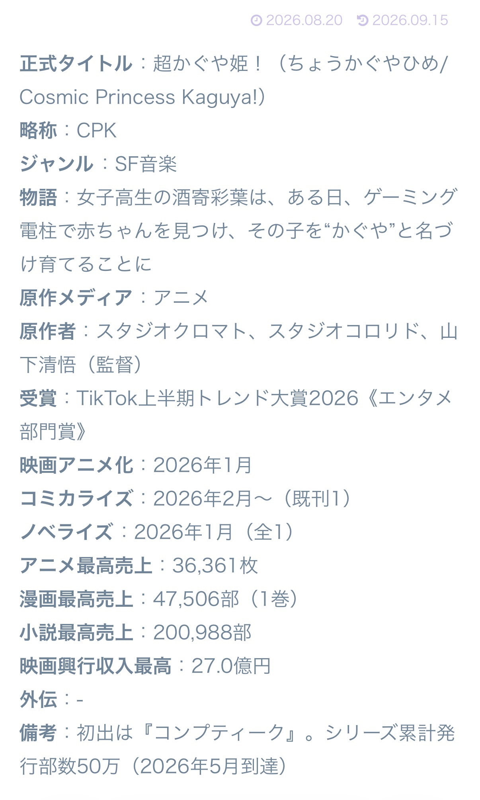

> **KOMAYUMI** 2026-09-18 08:40:29：佬，这个网站哪里看的
>
> **edanee🐶** 2026-09-18 08:44:30：https://www.lanovelibrary\[吐舌\].com/cho-kaguy\[吐舌\]ahime/
>
> **KOMAYUMI** 2026-09-18 08:47:27：谢谢\[吐舌\]
>
> **積雪之下º** 2026-09-18 09:47:03：很难想象CPK这么一个现象级作品的漫画居然处于这种查无此人的境地，还好有超辉饭填补空缺
>
> **edanee🐶** 2026-09-18 09:57:26：被圆盘倍杀也太丢人了，好在辉夜饭弥补了这一点
>
> **酐簖** 2026-09-18 11:19:49：毕竟作者作妖连自己服务受众都搞不明白，自己把自己推上历史了喽
>
> **KOMAYUMI** 2026-09-18 12:35:03：其实漫画还是属于勉强可以洗的范畴，苦一苦老哥。但是没事找事本身已经挺过分了，粉丝和官方也很自觉的不怎么提这茬，所以以后也别提了
>
> **酐簖** 2026-09-18 15:49:14：单纯的漫画情节还不至于闹严重，但是后面越挖越有就已经不只是漫画情节的问题了。只能说这个局面纯作者作出来了。现在就等辉夜饭出单本后销量会不会爆杀漫画吧
>
> **KOMAYUMI** 2026-09-18 15:56:44：我是觉得其实是有点过激了，尤其是国内的社区战争引来的一堆不明生物。但是当时是最爆火的时候宁可错杀不可放过的心态我也理解。而且就我刷了大半年推下来看，老哥的梦女群体还没有梦男homo群体多，剩下零星点的就是喜欢bl的，只能说早期企划确实有不成熟的地方，辉夜饭属于后期打算认真对待做长线企划之后找的画师就非常顶级，画辉夜饭之前粉丝就有十几万
>
> **KOMAYUMI** 2026-09-18 15:59:27：辉夜饭爆杀之前那本是板上钉钉的事了。这可是正统续作，第一话出来把官方搭的草台漫画网站都给挤爆了。说实在的无论是抢电影票抢BD抢谷子，现在连看漫画都要当卡逼我真的对日本的IT无语😅，也或许是辉夜姬太牛逼了吧
>
> **酐簖** 2026-09-18 16:24:02：企划方一直都挺清楚受众的，所以无论是电影后续不停发糖还有小说彩叶内心独白都在不停的强调两人的感情。就漫画出了岔子。而且这也不能全怪国内，国内还没那个能力能左右一部爆款作品漫画的销量。那时候我也在狂刷推，反对那个作者的不止有国人
>
> **edanee🐶** 2026-09-18 16:25:54：只能说抛开节奏不谈漫画化本身也是可惜了，找到的漫画家画工不怎么样还不能提供粉丝想要的东西，自然卖不动，卖不动还占了一个坑。当然运气是守恒的，小说化碰到了敬业的好老师，而且作为本系列最高浓度的一个，大卖本身就是告诉官方该走的方向是什么了，所以后续的衍生内容很多都在给小说设定敲实锤，毕竟谁跟fuju过不去呢
>

---
### 666楼 · MoriMMM
Lv.3 · 2026-09-18 07:31 · 赞 15

出货累计10.8万

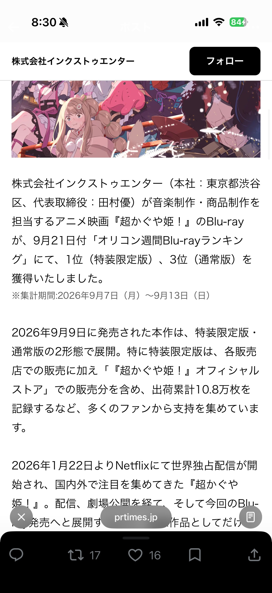

> **Kizumi-** 2026-09-18 09:57:31：吓哭了
>

---
### 667楼 · 用户007🌀
Lv.9 · 2026-09-18 07:46 · 赞 8

果然官店没计入，楼里的杠精可以消停点了吧\[阴险\]

---
### 668楼 · 用户007🌀
Lv.9 · 2026-09-18 08:02 · 赞 8

另外这个出荷 10.8 万是只计算了特装限定版的，加上通常版（官店不卖）的 9346 销量，加起来总销量超过 11.7 万张了\[阴险\]

> **KOMAYUMI** 2026-09-18 09:02:57：我是山下哥哥我绝对吓哭了
>
> **浅水只** 2026-09-18 09:13:43：怪不得官方预售链接说有20w备货，原来不是夸大\[what\]
>

---
### 669楼 · KOMAYUMI
Lv.3 · 2026-09-18 08:42 · 赞 2

被官店接近8万的销量吓哭了

---
### 670楼 · 用户007🌀
Lv.9 · 2026-09-18 08:56 · 赞 6

第一波 
\*3　\*\*2625(+\*584)　\*\*9480(.102)　\*\*\*\*\*\*　49.4%　\*\*\*\*\*\*　超かぐや姫！ 
第二波 
\*4　\*\*3031(+\*406)　\*10990(.118)　\*\*\*\*\*\*　44.5%　\*\*\*\*\*\*　超かぐや姫！

> **用户007🌀** 2026-09-18 08:57:25：因为没有抢特典的压力，没有出现明显的最速上映扎堆
>
> **edanee🐶** 2026-09-18 09:46:16：平日的深夜
>
> **沙漠天使** 2026-09-18 11:27:20：周末能破30亿吗
>

---
### 671楼 · 用户007🌀
Lv.9 · 2026-09-18 14:59 · 赞 4

\*3　\*13336(+\*553)　\*45869(.493)　\*\*\*\*\*\*　46.4%　\*\*\*\*\*\*　超かぐや姫！

---
### 672楼 · record摸头
Lv.6 · 2026-09-18 16:00 · 赞 1

有大佬贴一下深夜动画剧场版bd销量排名吗？不算鬼灭这种。十年前我记得是ll少战魔圆轻音fate\[阴险\]

> **贴吧用户\_JaZt3P2354** 2026-09-18 16:40:05：满满的求生欲，不算鬼灭这种😂
>
> **record摸头** 2026-09-18 16:46:59：鬼灭在日本确实不算深夜动画了，比民工漫国民度还要高
>
> **贴吧用户\_JaZt3P2354** 2026-09-18 16:56:03：鬼灭还真是深夜动画，只是用了2年就成了国民动画，奇迹之子，一般算深夜动画成绩，它都论外
>
> **雪山极光下** 2026-09-18 17:13:15：我记得ll魔圆少战剧场版bd销量都是20w+？
>
> **record摸头** 2026-09-18 17:41:31：魔圆没20w，ll和少战是20w+
>

---
### 673楼 · 用户007🌀
Lv.9 · 2026-09-18 17:47 · 赞 4

\*3　\*18404(+\*653)　\*62848(.676)　\*\*\*\*\*\*　48.3%　\*\*\*\*\*\*　超かぐや姫！ 
晚场在发力了，大部分是提前买好预售票的

---
### 675楼 · 168bpm
Lv.5 · 2026-09-18 19:15 · 赞 3

官方转推了，BD初动10.8万

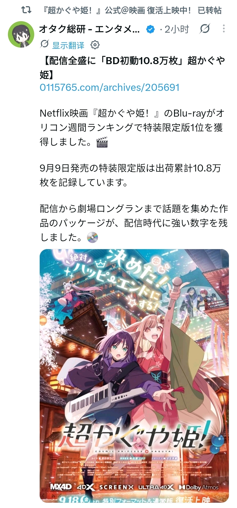

---
### 676楼 · 用户007🌀
Lv.9 · 2026-09-18 20:16 · 赞 1

\*3　\*24436(+1209)　\*84609(.910)　\*\*\*\*\*\*　49.5%　\*\*\*\*\*\*　超かぐや姫！ 
相比之前抢破头，现在悠闲了很多。

> **用户007🌀** 2026-09-18 20:18:23：不知道mubichike预售券的价格是怎么计入票价的，之前看网上也有人好奇这玩意的分成比例。
>

---
### 677楼 · 睿智骑士小屋
Lv.1 · 2026-09-19 00:41

有人能科普一下目前的销量是什么级别吗

---
### 678楼 · 杜滋琪
Lv.11 · 2026-09-19 01:59 · 赞 3

ufo商城，角川商城，小学馆周日商城等等直营店都不计入O榜，官方报的数字可以看看，但搞排名的时候还是要以O榜的统计口径为准。

> **用户007🌀** 2026-09-19 06:47:39：这几家自营店销量占比可没到 80%
>
> **杜滋琪** 2026-09-19 10:05:50：对比肯定要对齐统计口径，5ch销量串的共识也是只认可O榜的数字。
>
> **用户007🌀** 2026-09-19 17:07:57：5ch销量串也不是什么权威组织。
>
> **杜滋琪** 2026-09-19 18:59:11：用全口径和O榜口径比没意思，就像拿自己的全端数据和别人的ios单端数据比一样。也没见鬼灭粉丝因为ufo商城不计入O榜就要打界王拳的
>
> **用户007🌀** 2026-09-19 19:30:17：不影响我继续引用这个数据
>
> **杜滋琪** 2026-09-19 21:30:12：没必要，这样搞只会人均开启三倍界王拳
>
> **用户007🌀** 2026-09-19 22:17:54：不会平均，我觉得你没搞懂辉夜这个超高官店比的来龙去脉。
>
> **井Chisha** 2026-09-19 23:10:35：做排名視頻或榜單是另外一回事了，而且官方報的是出貨量，實際情況就留給觀眾自己判斷就好了。這種情況也不是沒發生過，某萬代動畫甚至是是o榜1千多出貨量報1w的巨大差異
>
> **井Chisha** 2026-09-19 23:24:25：不過我覺得超輝這個特裝碟的出貨量應該接近真實銷量了，畢竟店頭的特裝碟一開始都直接預約滿，後面官方商店也是受注生產
>

---
### 679楼 · 用户007🌀
Lv.9 · 2026-09-19 06:58 · 赞 3

你双引擎草台操作搞出来的这个接近 80% 的官店销量占比应该是前无古人了\[阴险\]搞横向对比肯定离不了官方给的数据的

> **齿轮不圆吗** 2026-09-19 08:48:17：买了一份官店bd，在官店买，只是因为别家特典都是用bd封面图做特典周边商品。，bd封面图辉夜彩叶八千代占比太小了\[阴险\]。
>

---
### 680楼 · 用户007🌀
Lv.9 · 2026-09-19 17:06 · 赞 4

\*7　\*18621(+\*905)　\*48462(.690)　\*\*\*\*\*\*　48.6%　\*22279　超かぐや姫！ 
\*8　\*14534(+\*484)　\*35652(.704)　\*50.6%　46.5%　\*14932　劇場版 魔法少女まどか☆マギ… 
上座率不行，和隔壁坐一桌去了

> **edanee🐶** 2026-09-19 17:59:10：跟q娃比都是难姐难妹了，不过三百共舞也算是奇观了（？）
>
> **迷人大白菜** 2026-09-20 08:31:47：可不可以科普一下数据？除了排名其他看不懂一点
>

---
### 681楼 · 用户007🌀
Lv.9 · 2026-09-20 00:38

官方公告 9.25 后特殊制式场次减少，要被新片创似了\[阴险\]

> **edanee🐶** 2026-09-20 11:50:59：下周马里奥和野兽之心，这没法不让的
>

---
### 682楼 · 西塘的烟雨
Lv.11 · 2026-09-20 09:03

出货量和销量是一回事，石蒜o榜3万，官方说4万销量，报的不是出货量，官店占比高也不能直接把出货量当销量吧。

---
### 683楼 · 西塘的烟雨
Lv.11 · 2026-09-20 09:04

o榜碟片数据没有哪部是高于实际销量的，更不可能真实销量跟出货量是一个数字。

> **仙翳** 2026-09-20 12:26:32：官店是完全受注生产，其他店就没铺多少货，第一天预约就断货了
>
> **西塘的烟雨** 2026-09-20 23:50:11：其实大部分碟片都是受注生产，少量线下铺货，日亚好像可以退
>
> **用户007🌀** 2026-09-20 23:53:41：只是限定版受注的情况比较多，通常版每家店包括日亚这类网店都有一定库存的。
>

---
### 685楼 · 168bpm
Lv.5 · 2026-09-20 10:24 · 赞 2

辉夜姬的BD不是受注生产的吗？这不就基本上“出货量≈销售量”了吗？

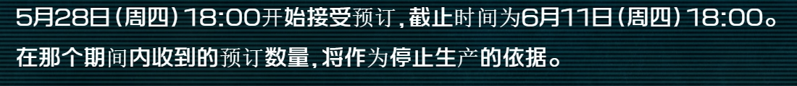

---
### 687楼 · 用户007🌀
Lv.9 · 2026-09-20 12:17 · 赞 11

△楼里来了不少新面孔，可能是从别的楼进来的，不知道超辉夜姬的特殊性，以为这部作品和其他作品是一样的销售模式，但就你双引擎的草台程度自然不会走寻常路。 
△首先，超辉夜姬的蓝光套装分为特装限定版和通常版两种，流通渠道分为第三方渠道（如日亚、Animate、Gamers等）和官方渠道（今年初官方临时用shopify搭的小店铺）两个，Oricon榜单（O榜）不统计官方渠道销量。 
△蓝光预售开启后，先后发生了以下事件： 
○1.开售当天，所有销售渠道的特装限定版几乎光速售罄，仅剩零星退货余量，后续第三方渠道再无大规模补货。O榜所统计的2万多销量的特装限定版，就是这一阶段第三方渠道的量。 
○2.由于特装版光速断货，黄牛倒卖现象严重引发众怒，官方宣布将研究增产事宜，并在一段时间后重新开放特装版预售（设置20万份上限，但最终没达到），但仅限在官方渠道购买，形式是完全受注生产（也就是全款预定，按量生产），官方宣布的10.8万数字减去第三方渠道后，剩余的约8万就是官方渠道的特装版销量。 
△以上事件，导致了三个结果： 
○一是由于前期特装版第三方渠道完全断货、后期官店采取按需生产的形式（预约已截止），几乎不存在店头积压库存的可能性，所以基本可以认为特装版的出货量=销量。 
○二是由于后期官店垄断了特装版的销售权，导致特装版销量中官店销量比例奇高，按上面的计算结果，官店销售比例占总量高达近80%，这是任何一部采取正常销售模式的同类作品都无法达到的数字。 
○三是由于第二点，导致O榜统计数据严重失真，统计的3万多总销量（特装+通常）全部为第三方渠道售卖，这同样是任何一部采取正常销售模式的同类作品都无法出现的巨大偏差。△这就是超辉夜姬的特殊性，如果在讨论销量的时候只用5ch销量串那种一刀切只采信O榜的标准，讨论基础本身就站不住脚。

---
### 688楼 · edanee🐶
Lv.1 · 2026-09-20 23:32 · 赞 4

这两天虽然稳坐老7，不过tl又热闹起来了，刷到大量初见的粉丝感想，官推也逐步涨粉离50w就差2000不到了

---
### 689楼 · aptx星璇
Lv.8 · 2026-09-22 15:37 · 赞 5

30亿了

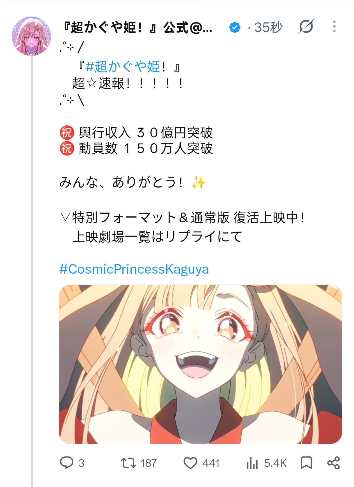

> **edanee🐶** 2026-09-22 16:16:46：看来高净值的特别格式还是赚啊，比个人预测的都高一截
>
> **龍HCL** 2026-09-22 17:11:07：50应该没希望吧\[阴险\]
>
> **清风自蓝天起** 2026-09-22 17:20:05：50太高了，很难啦
>
> **aptx星璇** 2026-09-22 18:47:34：这次的主力特殊格式已经砍了很多排片了，池袋u4d场场爆满都已经砍到一天只剩一场，后续估计很难磨了
>
> **对账伙计** 2026-09-22 19:32:57：还真超了30e，厉害\[喷\]👍
>

---
### 690楼 · 龍HCL
Lv.14 · 2026-09-22 17:14 · 赞 1

没有新图吗？这特典咋样啊？

---
### 692楼 · 168bpm
Lv.5 · 2026-09-22 17:21 · 赞 1

怎么都复活上映了还在出这种摆烂特典？还让人期待特典反面的设计，这是要第一批拿到新特典的人自发帮你宣传是吧？\[阴险\]

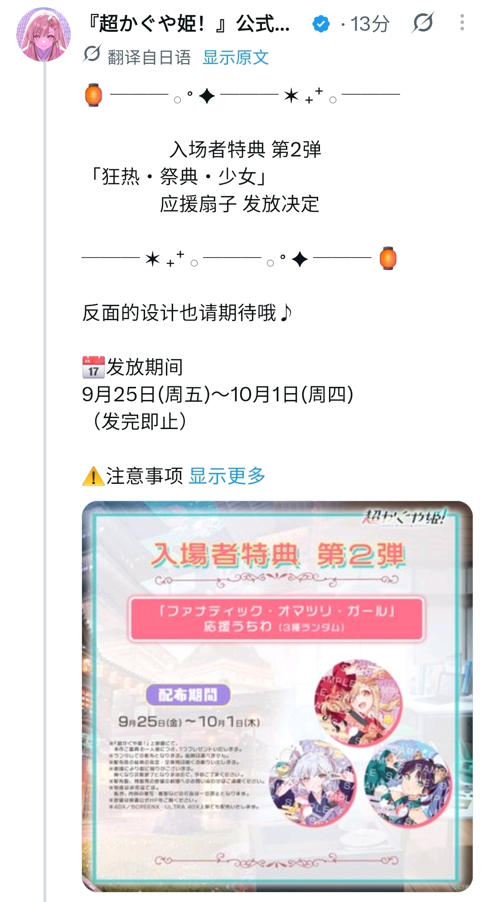

> **天空白銀🌌** 2026-09-22 20:01:25：我觉得还行吧，现在进场的人都是之前就有买预售票的，等那些票都换的差不多了，再提供更吸引人的特典，挺聪明的不是吗？
>

---
### 694楼 · 用户007🌀
Lv.9 · 2026-09-22 17:47 · 赞 1

扇子还好，起码比隔壁发了一个月的纸片要好\[阴险\]就是最后一周能不能来个大的

---
### 695楼 · 用户007🌀
Lv.9 · 2026-09-22 19:53 · 赞 1

BD次周 
特装1126 通常575 
总计≥108000+9921+1126=11.9w张

---
### 696楼 · 井Chisha
Lv.1 · 2026-09-22 23:18 · 赞 3

下周現地觀影，所以提前查了場次 
嗯，如果不考慮特典的話預估最終32-33億左右

---
### 697楼 · 龍HCL
Lv.14 · 2026-09-23 07:14 · 赞 7

太难涨了！推粉终于50w！

---
### 698楼 · 用户007🌀
Lv.9 · 2026-09-24 09:13 · 赞 1

12　\*41785　\*267　156.5　5.1　163　242　67.4%　超かぐや姫 
坐席砍半

---
### 699楼 · edanee🐶
Lv.1 · 2026-09-24 16:28 · 赞 2

6天3.65亿　假期在一众新作中动员人数第六

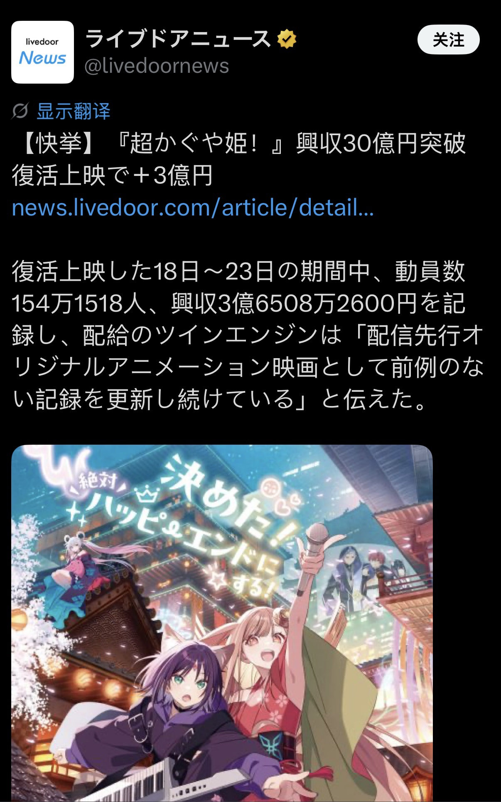

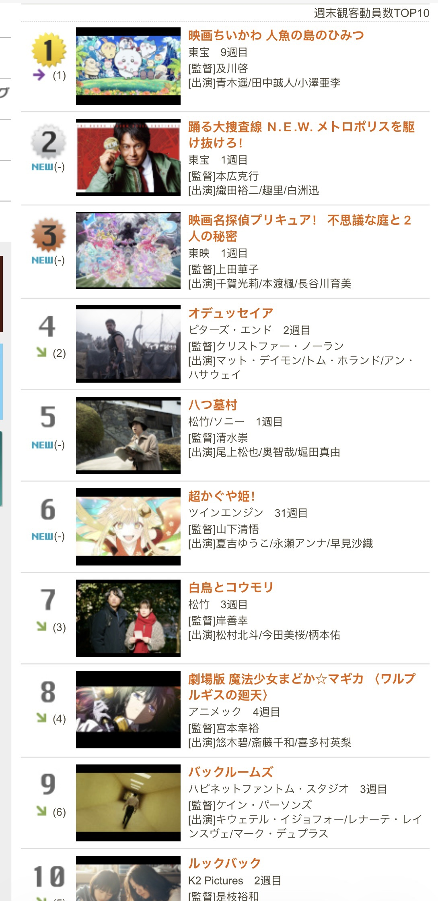

---
### 700楼 · 水上叶
Lv.13 · 2026-09-24 23:39 · 赞 1

问下有没有4k的资源，下载39g的1080p感觉还没b站4k清晰\[汗\]

页码：[1–100 楼](thread.md) · [101–200 楼](thread_2.md) · [201–300 楼](thread_3.md) · [301–400 楼](thread_4.md) · [401–500 楼](thread_5.md) · [501–600 楼](thread_6.md) · **601–700 楼** · [701–800 楼](thread_8.md)

---

[⬆ 本页顶部](#top)　·　[⏬ 最新的楼层](thread_8.md#bottom)
